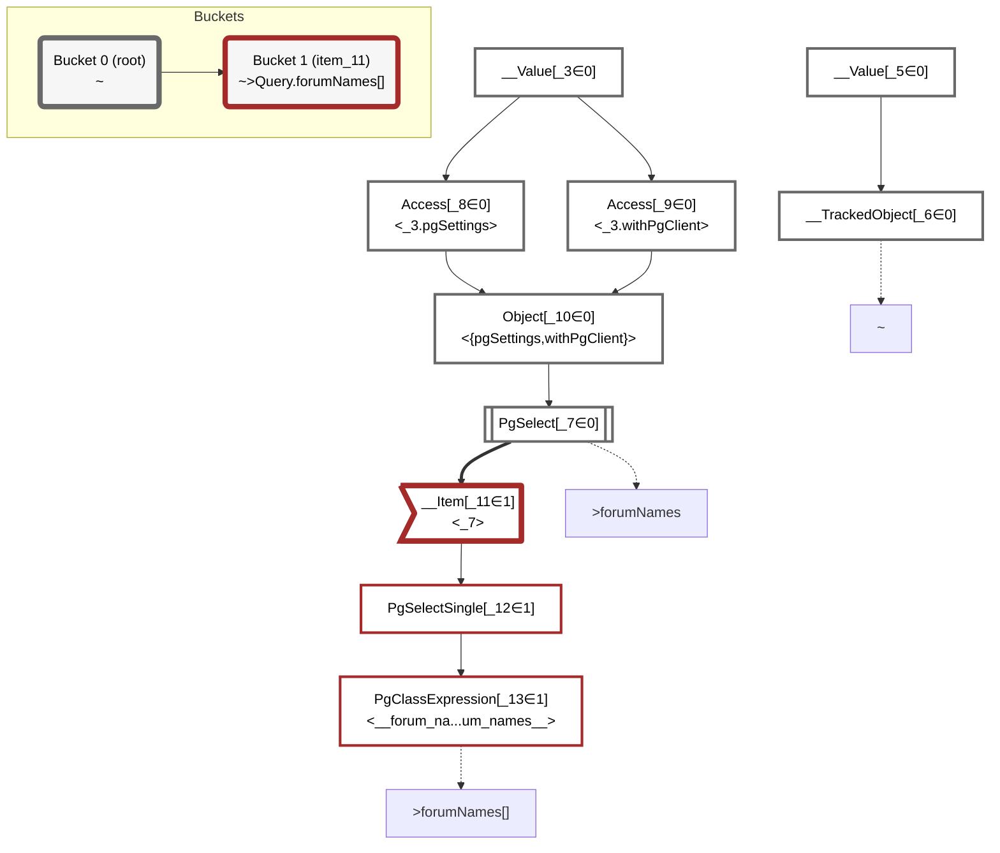

```mermaid
graph TD
    classDef path fill:#eee,stroke:#000,color:#000
    classDef plan fill:#fff,stroke-width:3px,color:#000
    classDef itemplan fill:#fff,stroke-width:6px,color:#000
    classDef sideeffectplan fill:#f00,stroke-width:6px,color:#000
    classDef bucket fill:#f6f6f6,color:#000,stroke-width:6px


    %% define plans
    __Value_3["__Value[_3∈0]<br /><context>"]:::plan
    __Value_5["__Value[_5∈0]<br /><rootValue>"]:::plan
    __TrackedObject_6["__TrackedObject[_6∈0]"]:::plan
    PgSelect_7[["PgSelect[_7∈0]<br /><forum_names>"]]:::plan
    Access_8["Access[_8∈0]<br /><_3.pgSettings>"]:::plan
    Access_9["Access[_9∈0]<br /><_3.withPgClient>"]:::plan
    Object_10["Object[_10∈0]<br /><{pgSettings,withPgClient}>"]:::plan
    __Item_11>"__Item[_11∈1]<br /><_7>"]:::itemplan
    PgSelectSingle_12["PgSelectSingle[_12∈1]<br /><text>"]:::plan
    PgClassExpression_13["PgClassExpression[_13∈1]<br /><__forum_na...um_names__>"]:::plan

    %% plan dependencies
    __Value_5 --> __TrackedObject_6
    Object_10 --> PgSelect_7
    __Value_3 --> Access_8
    __Value_3 --> Access_9
    Access_8 --> Object_10
    Access_9 --> Object_10
    PgSelect_7 ==> __Item_11
    __Item_11 --> PgSelectSingle_12
    PgSelectSingle_12 --> PgClassExpression_13

    %% plan-to-path relationships
    P1["~"]
    __TrackedObject_6 -.-> P1
    P2[">forumNames"]
    PgSelect_7 -.-> P2
    P3[">forumNames[]"]
    PgClassExpression_13 -.-> P3

    %% allocate buckets
    classDef bucket0 stroke:#696969
    class __Value_3,__Value_5,__TrackedObject_6,PgSelect_7,Access_8,Access_9,Object_10 bucket0
    classDef bucket1 stroke:#a52a2a
    class __Item_11,PgSelectSingle_12,PgClassExpression_13 bucket1

    subgraph Buckets
    Bucket0("Bucket 0 (root)<br />~"):::bucket
    style Bucket0 stroke:#696969
    Bucket1("Bucket 1 (item_11)<br />~>Query.forumNames[]"):::bucket
    style Bucket1 stroke:#a52a2a
    Bucket0 --> Bucket1
    end
```
