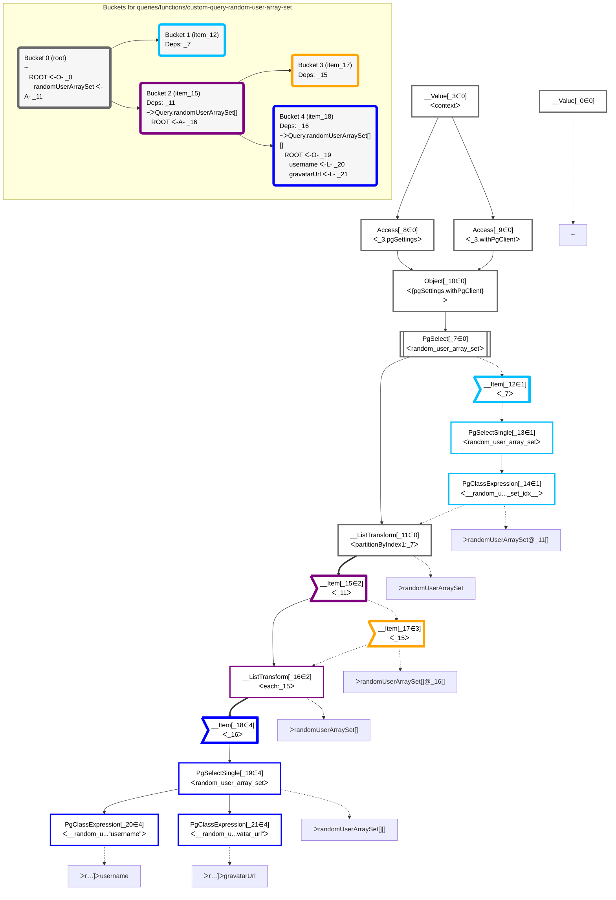

```mermaid
graph TD
    classDef path fill:#eee,stroke:#000,color:#000
    classDef plan fill:#fff,stroke-width:3px,color:#000
    classDef itemplan fill:#fff,stroke-width:6px,color:#000
    classDef sideeffectplan fill:#f00,stroke-width:6px,color:#000
    classDef bucket fill:#f6f6f6,color:#000,stroke-width:6px,text-align:left


    %% define plans
    __Value_0["__Value[_0∈0]"]:::plan
    __Value_3["__Value[_3∈0]<br />ᐸcontextᐳ"]:::plan
    PgSelect_7[["PgSelect[_7∈0]<br />ᐸrandom_user_array_setᐳ"]]:::plan
    Access_8["Access[_8∈0]<br />ᐸ_3.pgSettingsᐳ"]:::plan
    Access_9["Access[_9∈0]<br />ᐸ_3.withPgClientᐳ"]:::plan
    Object_10["Object[_10∈0]<br />ᐸ{pgSettings,withPgClient}ᐳ"]:::plan
    __ListTransform_11["__ListTransform[_11∈0]<br />ᐸpartitionByIndex1:_7ᐳ"]:::plan
    __Item_12>"__Item[_12∈1]<br />ᐸ_7ᐳ"]:::itemplan
    PgSelectSingle_13["PgSelectSingle[_13∈1]<br />ᐸrandom_user_array_setᐳ"]:::plan
    PgClassExpression_14["PgClassExpression[_14∈1]<br />ᐸ__random_u..._set_idx__ᐳ"]:::plan
    __Item_15>"__Item[_15∈2]<br />ᐸ_11ᐳ"]:::itemplan
    __ListTransform_16["__ListTransform[_16∈2]<br />ᐸeach:_15ᐳ"]:::plan
    __Item_17>"__Item[_17∈3]<br />ᐸ_15ᐳ"]:::itemplan
    __Item_18>"__Item[_18∈4]<br />ᐸ_16ᐳ"]:::itemplan
    PgSelectSingle_19["PgSelectSingle[_19∈4]<br />ᐸrandom_user_array_setᐳ"]:::plan
    PgClassExpression_20["PgClassExpression[_20∈4]<br />ᐸ__random_u...”username”ᐳ"]:::plan
    PgClassExpression_21["PgClassExpression[_21∈4]<br />ᐸ__random_u...vatar_url”ᐳ"]:::plan

    %% plan dependencies
    Object_10 --> PgSelect_7
    __Value_3 --> Access_8
    __Value_3 --> Access_9
    Access_8 --> Object_10
    Access_9 --> Object_10
    PgSelect_7 --> __ListTransform_11
    PgClassExpression_14 -.-> __ListTransform_11
    PgSelect_7 -.-> __Item_12
    __Item_12 --> PgSelectSingle_13
    PgSelectSingle_13 --> PgClassExpression_14
    __ListTransform_11 ==> __Item_15
    __Item_15 --> __ListTransform_16
    __Item_17 -.-> __ListTransform_16
    __Item_15 -.-> __Item_17
    __ListTransform_16 ==> __Item_18
    __Item_18 --> PgSelectSingle_19
    PgSelectSingle_19 --> PgClassExpression_20
    PgSelectSingle_19 --> PgClassExpression_21

    %% plan-to-path relationships
    P_0["~"]
    __Value_0 -.-> P_0
    P_11["ᐳrandomUserArraySet"]
    __ListTransform_11 -.-> P_11
    P_14["ᐳrandomUserArraySet@_11[]"]
    PgClassExpression_14 -.-> P_14
    P_16["ᐳrandomUserArraySet[]"]
    __ListTransform_16 -.-> P_16
    P_17["ᐳrandomUserArraySet[]@_16[]"]
    __Item_17 -.-> P_17
    P_19["ᐳrandomUserArraySet[][]"]
    PgSelectSingle_19 -.-> P_19
    P_20["ᐳr…]ᐳusername"]
    PgClassExpression_20 -.-> P_20
    P_21["ᐳr…]ᐳgravatarUrl"]
    PgClassExpression_21 -.-> P_21

    %% allocate buckets
    classDef bucket0 stroke:#696969
    class __Value_0,__Value_3,PgSelect_7,Access_8,Access_9,Object_10,__ListTransform_11 bucket0
    classDef bucket1 stroke:#00bfff
    class __Item_12,PgSelectSingle_13,PgClassExpression_14 bucket1
    classDef bucket2 stroke:#7f007f
    class __Item_15,__ListTransform_16 bucket2
    classDef bucket3 stroke:#ffa500
    class __Item_17 bucket3
    classDef bucket4 stroke:#0000ff
    class __Item_18,PgSelectSingle_19,PgClassExpression_20,PgClassExpression_21 bucket4

    subgraph "Buckets for queries/functions/custom-query-random-user-array-set"
    Bucket0("Bucket 0 (root)<br />~<br />⠀ROOT ᐸ-O- _0<br />⠀⠀randomUserArraySet ᐸ-A- _11"):::bucket
    style Bucket0 stroke:#696969
    Bucket1("Bucket 1 (item_12)<br />Deps: _7"):::bucket
    style Bucket1 stroke:#00bfff
    Bucket0 --> Bucket1
    Bucket2("Bucket 2 (item_15)<br />Deps: _11<br />~ᐳQuery.randomUserArraySet[]<br />⠀ROOT ᐸ-A- _16"):::bucket
    style Bucket2 stroke:#7f007f
    Bucket0 --> Bucket2
    Bucket3("Bucket 3 (item_17)<br />Deps: _15"):::bucket
    style Bucket3 stroke:#ffa500
    Bucket2 --> Bucket3
    Bucket4("Bucket 4 (item_18)<br />Deps: _16<br />~ᐳQuery.randomUserArraySet[][]<br />⠀ROOT ᐸ-O- _19<br />⠀⠀username ᐸ-L- _20<br />⠀⠀gravatarUrl ᐸ-L- _21"):::bucket
    style Bucket4 stroke:#0000ff
    Bucket2 --> Bucket4
    end
```
