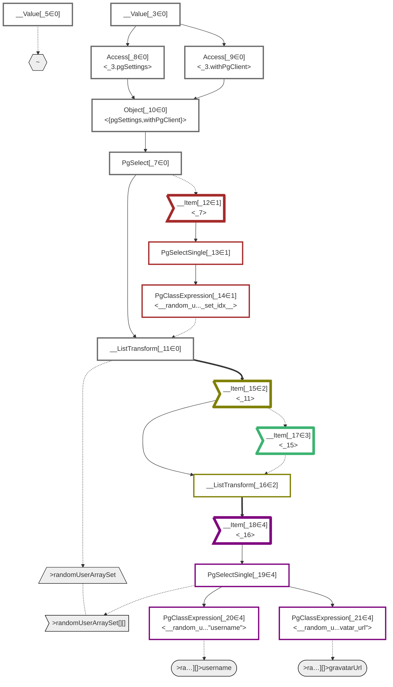

```mermaid
graph TD
    classDef path fill:#eee,stroke:#000
    classDef plan fill:#fff,stroke-width:3px
    classDef itemplan fill:#fff,stroke-width:6px
    classDef sideeffectplan fill:#f00,stroke-width:6px

    %% subgraph fields
    P1{{"~"}}:::path
    P2[/">randomUserArraySet"\]:::path
    P3>">randomUserArraySet[][]"]:::path
    P2 -.- P3
    P4([">ra…][]>username"]):::path
    %% P3 -.-> P4
    P5([">ra…][]>gravatarUrl"]):::path
    %% P3 -.-> P5
    %% P1 -.-> P2
    %% end

    %% define plans
    __Value_3["__Value[_3∈0]<br /><context>"]:::plan
    __Value_5["__Value[_5∈0]<br /><rootValue>"]:::plan
    PgSelect_7["PgSelect[_7∈0]<br /><random_user_array_set>"]:::plan
    Access_8["Access[_8∈0]<br /><_3.pgSettings>"]:::plan
    Access_9["Access[_9∈0]<br /><_3.withPgClient>"]:::plan
    Object_10["Object[_10∈0]<br /><{pgSettings,withPgClient}>"]:::plan
    __ListTransform_11["__ListTransform[_11∈0]<br /><partitionByIndex1:_7>"]:::plan
    __Item_12>"__Item[_12∈1]<br /><_7>"]:::itemplan
    PgSelectSingle_13["PgSelectSingle[_13∈1]<br /><random_user_array_set>"]:::plan
    PgClassExpression_14["PgClassExpression[_14∈1]<br /><__random_u..._set_idx__>"]:::plan
    __Item_15>"__Item[_15∈2]<br /><_11>"]:::itemplan
    __ListTransform_16["__ListTransform[_16∈2]<br /><each:_15>"]:::plan
    __Item_17>"__Item[_17∈3]<br /><_15>"]:::itemplan
    __Item_18>"__Item[_18∈4]<br /><_16>"]:::itemplan
    PgSelectSingle_19["PgSelectSingle[_19∈4]<br /><random_user_array_set>"]:::plan
    PgClassExpression_20["PgClassExpression[_20∈4]<br /><__random_u...#quot;username#quot;>"]:::plan
    PgClassExpression_21["PgClassExpression[_21∈4]<br /><__random_u...vatar_url#quot;>"]:::plan

    %% plan dependencies
    Object_10 --> PgSelect_7
    __Value_3 --> Access_8
    __Value_3 --> Access_9
    Access_8 --> Object_10
    Access_9 --> Object_10
    PgSelect_7 --> __ListTransform_11
    PgClassExpression_14 -.-> __ListTransform_11
    PgSelect_7 -.-> __Item_12
    __Item_12 --> PgSelectSingle_13
    PgSelectSingle_13 --> PgClassExpression_14
    __ListTransform_11 ==> __Item_15
    __Item_15 --> __ListTransform_16
    __Item_17 -.-> __ListTransform_16
    __Item_15 -.-> __Item_17
    __ListTransform_16 ==> __Item_18
    __Item_18 --> PgSelectSingle_19
    PgSelectSingle_19 --> PgClassExpression_20
    PgSelectSingle_19 --> PgClassExpression_21

    %% plan-to-path relationships
    __Value_5 -.-> P1
    __ListTransform_11 -.-> P2
    PgSelectSingle_19 -.-> P3
    PgClassExpression_20 -.-> P4
    PgClassExpression_21 -.-> P5

    %% allocate buckets
    classDef bucket0 stroke:#696969
    class __Value_3,__Value_5,PgSelect_7,Access_8,Access_9,Object_10,__ListTransform_11 bucket0
    classDef bucket1 stroke:#a52a2a
    class __Item_12,PgSelectSingle_13,PgClassExpression_14 bucket1
    classDef bucket2 stroke:#808000
    class __Item_15,__ListTransform_16 bucket2
    classDef bucket3 stroke:#3cb371
    class __Item_17 bucket3
    classDef bucket4 stroke:#7f007f
    class __Item_18,PgSelectSingle_19,PgClassExpression_20,PgClassExpression_21 bucket4
```
