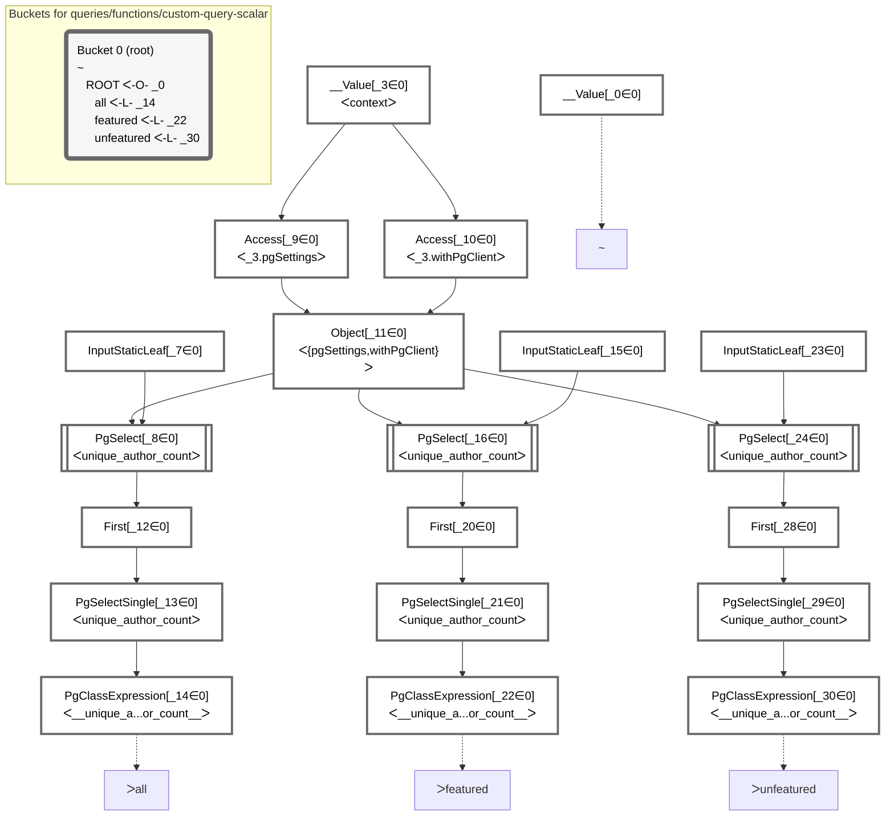

```mermaid
graph TD
    classDef path fill:#eee,stroke:#000,color:#000
    classDef plan fill:#fff,stroke-width:3px,color:#000
    classDef itemplan fill:#fff,stroke-width:6px,color:#000
    classDef sideeffectplan fill:#f00,stroke-width:6px,color:#000
    classDef bucket fill:#f6f6f6,color:#000,stroke-width:6px,text-align:left


    %% define plans
    __Value_0["__Value[_0∈0]"]:::plan
    PgClassExpression_14["PgClassExpression[_14∈0]<br />ᐸ__unique_a...or_count__ᐳ"]:::plan
    PgSelectSingle_13["PgSelectSingle[_13∈0]<br />ᐸunique_author_countᐳ"]:::plan
    First_12["First[_12∈0]"]:::plan
    PgSelect_8[["PgSelect[_8∈0]<br />ᐸunique_author_countᐳ"]]:::plan
    PgClassExpression_22["PgClassExpression[_22∈0]<br />ᐸ__unique_a...or_count__ᐳ"]:::plan
    PgSelectSingle_21["PgSelectSingle[_21∈0]<br />ᐸunique_author_countᐳ"]:::plan
    First_20["First[_20∈0]"]:::plan
    PgSelect_16[["PgSelect[_16∈0]<br />ᐸunique_author_countᐳ"]]:::plan
    PgClassExpression_30["PgClassExpression[_30∈0]<br />ᐸ__unique_a...or_count__ᐳ"]:::plan
    PgSelectSingle_29["PgSelectSingle[_29∈0]<br />ᐸunique_author_countᐳ"]:::plan
    First_28["First[_28∈0]"]:::plan
    PgSelect_24[["PgSelect[_24∈0]<br />ᐸunique_author_countᐳ"]]:::plan
    Object_11["Object[_11∈0]<br />ᐸ{pgSettings,withPgClient}ᐳ"]:::plan
    Access_9["Access[_9∈0]<br />ᐸ_3.pgSettingsᐳ"]:::plan
    Access_10["Access[_10∈0]<br />ᐸ_3.withPgClientᐳ"]:::plan
    __Value_3["__Value[_3∈0]<br />ᐸcontextᐳ"]:::plan
    InputStaticLeaf_7["InputStaticLeaf[_7∈0]"]:::plan
    InputStaticLeaf_15["InputStaticLeaf[_15∈0]"]:::plan
    InputStaticLeaf_23["InputStaticLeaf[_23∈0]"]:::plan

    %% plan dependencies
    PgSelectSingle_13 --> PgClassExpression_14
    First_12 --> PgSelectSingle_13
    PgSelect_8 --> First_12
    Object_11 & InputStaticLeaf_7 --> PgSelect_8
    PgSelectSingle_21 --> PgClassExpression_22
    First_20 --> PgSelectSingle_21
    PgSelect_16 --> First_20
    Object_11 & InputStaticLeaf_15 --> PgSelect_16
    PgSelectSingle_29 --> PgClassExpression_30
    First_28 --> PgSelectSingle_29
    PgSelect_24 --> First_28
    Object_11 & InputStaticLeaf_23 --> PgSelect_24
    Access_9 & Access_10 --> Object_11
    __Value_3 --> Access_9
    __Value_3 --> Access_10

    %% plan-to-path relationships
    P_0["~"]
    __Value_0 -.-> P_0
    P_14["ᐳall"]
    PgClassExpression_14 -.-> P_14
    P_22["ᐳfeatured"]
    PgClassExpression_22 -.-> P_22
    P_30["ᐳunfeatured"]
    PgClassExpression_30 -.-> P_30

    subgraph "Buckets for queries/functions/custom-query-scalar"
    Bucket0("Bucket 0 (root)<br />~<br />⠀ROOT ᐸ-O- _0<br />⠀⠀all ᐸ-L- _14<br />⠀⠀featured ᐸ-L- _22<br />⠀⠀unfeatured ᐸ-L- _30"):::bucket
    classDef bucket0 stroke:#696969
    class Bucket0,__Value_0,__Value_3,InputStaticLeaf_7,PgSelect_8,Access_9,Access_10,Object_11,First_12,PgSelectSingle_13,PgClassExpression_14,InputStaticLeaf_15,PgSelect_16,First_20,PgSelectSingle_21,PgClassExpression_22,InputStaticLeaf_23,PgSelect_24,First_28,PgSelectSingle_29,PgClassExpression_30 bucket0
    end
```
