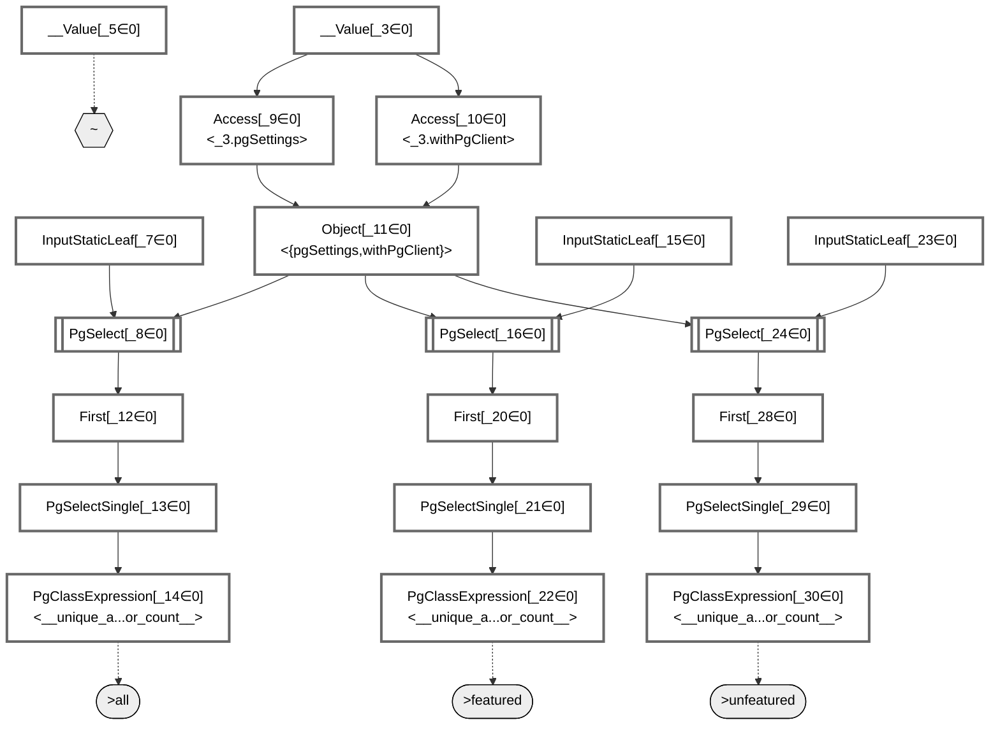

```mermaid
graph TD
    classDef path fill:#eee,stroke:#000,color:#000
    classDef plan fill:#fff,stroke-width:3px,color:#000
    classDef itemplan fill:#fff,stroke-width:6px,color:#000
    classDef sideeffectplan fill:#f00,stroke-width:6px,color:#000

    %% subgraph fields
    P1{{"~"}}:::path
    P2([">all"]):::path
    %% P1 -.-> P2
    P3([">featured"]):::path
    %% P1 -.-> P3
    P4([">unfeatured"]):::path
    %% P1 -.-> P4
    %% end

    %% define plans
    __Value_3["__Value[_3∈0]<br /><context>"]:::plan
    __Value_5["__Value[_5∈0]<br /><rootValue>"]:::plan
    InputStaticLeaf_7["InputStaticLeaf[_7∈0]"]:::plan
    PgSelect_8[["PgSelect[_8∈0]<br /><unique_author_count>"]]:::plan
    Access_9["Access[_9∈0]<br /><_3.pgSettings>"]:::plan
    Access_10["Access[_10∈0]<br /><_3.withPgClient>"]:::plan
    Object_11["Object[_11∈0]<br /><{pgSettings,withPgClient}>"]:::plan
    First_12["First[_12∈0]"]:::plan
    PgSelectSingle_13["PgSelectSingle[_13∈0]<br /><unique_author_count>"]:::plan
    PgClassExpression_14["PgClassExpression[_14∈0]<br /><__unique_a...or_count__>"]:::plan
    InputStaticLeaf_15["InputStaticLeaf[_15∈0]"]:::plan
    PgSelect_16[["PgSelect[_16∈0]<br /><unique_author_count>"]]:::plan
    First_20["First[_20∈0]"]:::plan
    PgSelectSingle_21["PgSelectSingle[_21∈0]<br /><unique_author_count>"]:::plan
    PgClassExpression_22["PgClassExpression[_22∈0]<br /><__unique_a...or_count__>"]:::plan
    InputStaticLeaf_23["InputStaticLeaf[_23∈0]"]:::plan
    PgSelect_24[["PgSelect[_24∈0]<br /><unique_author_count>"]]:::plan
    First_28["First[_28∈0]"]:::plan
    PgSelectSingle_29["PgSelectSingle[_29∈0]<br /><unique_author_count>"]:::plan
    PgClassExpression_30["PgClassExpression[_30∈0]<br /><__unique_a...or_count__>"]:::plan

    %% plan dependencies
    Object_11 --> PgSelect_8
    InputStaticLeaf_7 --> PgSelect_8
    __Value_3 --> Access_9
    __Value_3 --> Access_10
    Access_9 --> Object_11
    Access_10 --> Object_11
    PgSelect_8 --> First_12
    First_12 --> PgSelectSingle_13
    PgSelectSingle_13 --> PgClassExpression_14
    Object_11 --> PgSelect_16
    InputStaticLeaf_15 --> PgSelect_16
    PgSelect_16 --> First_20
    First_20 --> PgSelectSingle_21
    PgSelectSingle_21 --> PgClassExpression_22
    Object_11 --> PgSelect_24
    InputStaticLeaf_23 --> PgSelect_24
    PgSelect_24 --> First_28
    First_28 --> PgSelectSingle_29
    PgSelectSingle_29 --> PgClassExpression_30

    %% plan-to-path relationships
    __Value_5 -.-> P1
    PgClassExpression_14 -.-> P2
    PgClassExpression_22 -.-> P3
    PgClassExpression_30 -.-> P4

    %% allocate buckets
    classDef bucket0 stroke:#696969
    class __Value_3,__Value_5,InputStaticLeaf_7,PgSelect_8,Access_9,Access_10,Object_11,First_12,PgSelectSingle_13,PgClassExpression_14,InputStaticLeaf_15,PgSelect_16,First_20,PgSelectSingle_21,PgClassExpression_22,InputStaticLeaf_23,PgSelect_24,First_28,PgSelectSingle_29,PgClassExpression_30 bucket0
```
