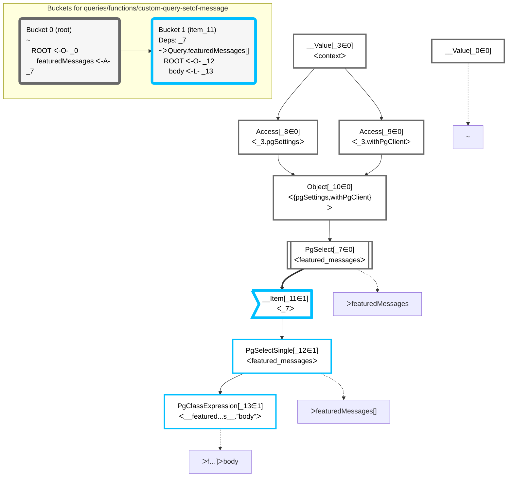

```mermaid
graph TD
    classDef path fill:#eee,stroke:#000,color:#000
    classDef plan fill:#fff,stroke-width:3px,color:#000
    classDef itemplan fill:#fff,stroke-width:6px,color:#000
    classDef sideeffectplan fill:#f00,stroke-width:6px,color:#000
    classDef bucket fill:#f6f6f6,color:#000,stroke-width:6px,text-align:left


    %% define plans
    __Value_0["__Value[_0∈0]"]:::plan
    __Value_3["__Value[_3∈0]<br />ᐸcontextᐳ"]:::plan
    PgSelect_7[["PgSelect[_7∈0]<br />ᐸfeatured_messagesᐳ"]]:::plan
    Access_8["Access[_8∈0]<br />ᐸ_3.pgSettingsᐳ"]:::plan
    Access_9["Access[_9∈0]<br />ᐸ_3.withPgClientᐳ"]:::plan
    Object_10["Object[_10∈0]<br />ᐸ{pgSettings,withPgClient}ᐳ"]:::plan
    __Item_11>"__Item[_11∈1]<br />ᐸ_7ᐳ"]:::itemplan
    PgSelectSingle_12["PgSelectSingle[_12∈1]<br />ᐸfeatured_messagesᐳ"]:::plan
    PgClassExpression_13["PgClassExpression[_13∈1]<br />ᐸ__featured...s__.”body”ᐳ"]:::plan

    %% plan dependencies
    Object_10 --> PgSelect_7
    __Value_3 --> Access_8
    __Value_3 --> Access_9
    Access_8 --> Object_10
    Access_9 --> Object_10
    PgSelect_7 ==> __Item_11
    __Item_11 --> PgSelectSingle_12
    PgSelectSingle_12 --> PgClassExpression_13

    %% plan-to-path relationships
    P_0["~"]
    __Value_0 -.-> P_0
    P_7["ᐳfeaturedMessages"]
    PgSelect_7 -.-> P_7
    P_12["ᐳfeaturedMessages[]"]
    PgSelectSingle_12 -.-> P_12
    P_13["ᐳf…]ᐳbody"]
    PgClassExpression_13 -.-> P_13

    %% allocate buckets
    classDef bucket0 stroke:#696969
    class __Value_0,__Value_3,PgSelect_7,Access_8,Access_9,Object_10 bucket0
    classDef bucket1 stroke:#00bfff
    class __Item_11,PgSelectSingle_12,PgClassExpression_13 bucket1

    subgraph "Buckets for queries/functions/custom-query-setof-message"
    Bucket0("Bucket 0 (root)<br />~<br />⠀ROOT ᐸ-O- _0<br />⠀⠀featuredMessages ᐸ-A- _7"):::bucket
    style Bucket0 stroke:#696969
    Bucket1("Bucket 1 (item_11)<br />Deps: _7<br />~ᐳQuery.featuredMessages[]<br />⠀ROOT ᐸ-O- _12<br />⠀⠀body ᐸ-L- _13"):::bucket
    style Bucket1 stroke:#00bfff
    Bucket0 --> Bucket1
    end
```
