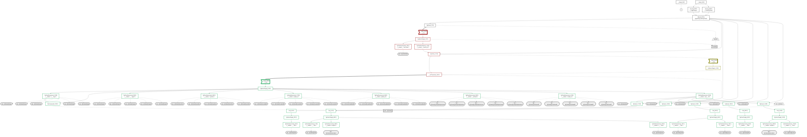

```mermaid
graph TD
    classDef path fill:#eee,stroke:#000,color:#000
    classDef plan fill:#fff,stroke-width:3px,color:#000
    classDef itemplan fill:#fff,stroke-width:6px,color:#000
    classDef sideeffectplan fill:#f00,stroke-width:6px,color:#000

    %% subgraph fields
    P1{{"~"}}:::path
    P2[/">people"\]:::path
    P3>">people[]"]:::path
    P2 -.- P3
    P4([">pe…e[]>username"]):::path
    %% P3 -.-> P4
    P5[/">pe…e[]>items"\]:::path
    P6>">pe…e[]>items[]"]:::path
    P5 -.- P6
    P7([">pe…e[]>items[]>id"]):::path
    %% P6 -.-> P7
    P8([">pe…e[]>items[]>type"]):::path
    %% P6 -.-> P8
    P9([">pe…e[]>items[]>type2"]):::path
    %% P6 -.-> P9
    P10([">pe…e[]>items[]>position"]):::path
    %% P6 -.-> P10
    P11([">pe…e[]>items[]>createdAt"]):::path
    %% P6 -.-> P11
    P12([">pe…e[]>items[]>updatedAt"]):::path
    %% P6 -.-> P12
    P13([">pe…e[]>items[]>isExplicitlyArchived"]):::path
    %% P6 -.-> P13
    P14([">pe…e[]>items[]>archivedAt"]):::path
    %% P6 -.-> P14
    P15([">pe…e[]>items[]>title"]):::path
    %% P6 -.-> P15
    P16([">pe…e[]>items[]>id"]):::path
    %% P6 -.-> P16
    P17([">pe…e[]>items[]>type"]):::path
    %% P6 -.-> P17
    P18([">pe…e[]>items[]>type2"]):::path
    %% P6 -.-> P18
    P19([">pe…e[]>items[]>position"]):::path
    %% P6 -.-> P19
    P20([">pe…e[]>items[]>createdAt"]):::path
    %% P6 -.-> P20
    P21([">pe…e[]>items[]>updatedAt"]):::path
    %% P6 -.-> P21
    P22([">pe…e[]>items[]>isExplicitlyArchived"]):::path
    %% P6 -.-> P22
    P23([">pe…e[]>items[]>archivedAt"]):::path
    %% P6 -.-> P23
    P24([">pe…e[]>items[]>title"]):::path
    %% P6 -.-> P24
    P25([">pe…e[]>items[]>description"]):::path
    %% P6 -.-> P25
    P26([">pe…e[]>items[]>note"]):::path
    %% P6 -.-> P26
    P27([">pe…e[]>items[]>id"]):::path
    %% P6 -.-> P27
    P28([">pe…e[]>items[]>type"]):::path
    %% P6 -.-> P28
    P29([">pe…e[]>items[]>type2"]):::path
    %% P6 -.-> P29
    P30([">pe…e[]>items[]>position"]):::path
    %% P6 -.-> P30
    P31([">pe…e[]>items[]>createdAt"]):::path
    %% P6 -.-> P31
    P32([">pe…e[]>items[]>updatedAt"]):::path
    %% P6 -.-> P32
    P33([">pe…e[]>items[]>isExplicitlyArchived"]):::path
    %% P6 -.-> P33
    P34([">pe…e[]>items[]>archivedAt"]):::path
    %% P6 -.-> P34
    P35([">pe…e[]>items[]>title"]):::path
    %% P6 -.-> P35
    P36([">pe…e[]>items[]>color"]):::path
    %% P6 -.-> P36
    P37([">pe…e[]>items[]>id"]):::path
    %% P6 -.-> P37
    P38([">pe…e[]>items[]>type"]):::path
    %% P6 -.-> P38
    P39([">pe…e[]>items[]>type2"]):::path
    %% P6 -.-> P39
    P40([">pe…e[]>items[]>position"]):::path
    %% P6 -.-> P40
    P41([">pe…e[]>items[]>createdAt"]):::path
    %% P6 -.-> P41
    P42([">pe…e[]>items[]>updatedAt"]):::path
    %% P6 -.-> P42
    P43([">pe…e[]>items[]>isExplicitlyArchived"]):::path
    %% P6 -.-> P43
    P44([">pe…e[]>items[]>archivedAt"]):::path
    %% P6 -.-> P44
    P45([">pe…e[]>items[]>title"]):::path
    %% P6 -.-> P45
    P46([">pe…e[]>items[]>id"]):::path
    %% P6 -.-> P46
    P47([">pe…e[]>items[]>type"]):::path
    %% P6 -.-> P47
    P48([">pe…e[]>items[]>type2"]):::path
    %% P6 -.-> P48
    P49([">pe…e[]>items[]>position"]):::path
    %% P6 -.-> P49
    P50([">pe…e[]>items[]>createdAt"]):::path
    %% P6 -.-> P50
    P51([">pe…e[]>items[]>updatedAt"]):::path
    %% P6 -.-> P51
    P52([">pe…e[]>items[]>isExplicitlyArchived"]):::path
    %% P6 -.-> P52
    P53([">pe…e[]>items[]>archivedAt"]):::path
    %% P6 -.-> P53
    P54([">pe…e[]>items[]>description"]):::path
    %% P6 -.-> P54
    P55([">pe…e[]>items[]>note"]):::path
    %% P6 -.-> P55
    %% P3 -.-> P5
    %% P1 -.-> P2
    %% end

    %% define plans
    __Value_3["__Value[_3∈0]<br /><context>"]:::plan
    __Value_5["__Value[_5∈0]<br /><rootValue>"]:::plan
    PgSelect_7["PgSelect[_7∈0]<br /><people>"]:::plan
    __Item_11>"__Item[_11∈1]<br /><_7>"]:::itemplan
    PgSelectSingle_12["PgSelectSingle[_12∈1]<br /><people>"]:::plan
    PgClassExpression_13["PgClassExpression[_13∈1]<br /><__people__.#quot;username#quot;>"]:::plan
    PgClassExpression_14["PgClassExpression[_14∈1]<br /><__people__.#quot;person_id#quot;>"]:::plan
    PgSelect_15["PgSelect[_15∈1]<br /><relational_items>"]:::plan
    __ListTransform_19["__ListTransform[_19∈1]<br /><each:_15>"]:::plan
    __Item_20>"__Item[_20∈2]<br /><_15>"]:::itemplan
    PgSelectSingle_21["PgSelectSingle[_21∈2]<br /><relational_items>"]:::plan
    __Item_22>"__Item[_22∈3]<br /><_19>"]:::itemplan
    PgSelectSingle_23["PgSelectSingle[_23∈3]<br /><relational_items>"]:::plan
    PgClassExpression_24["PgClassExpression[_24∈3]<br /><__relation...s__.#quot;type#quot;>"]:::plan
    PgPolymorphic_25["PgPolymorphic[_25∈3]"]:::plan
    PgSelect_27["PgSelect[_27∈3]<br /><relational_topics>"]:::plan
    First_31["First[_31∈3]"]:::plan
    PgSelectSingle_32["PgSelectSingle[_32∈3]<br /><relational_topics>"]:::plan
    PgClassExpression_35["PgClassExpression[_35∈3]<br /><__relation...__.#quot;type2#quot;>"]:::plan
    PgClassExpression_36["PgClassExpression[_36∈3]<br /><__relation...#quot;position#quot;>"]:::plan
    PgClassExpression_37["PgClassExpression[_37∈3]<br /><__relation...reated_at#quot;>"]:::plan
    PgClassExpression_38["PgClassExpression[_38∈3]<br /><__relation...pdated_at#quot;>"]:::plan
    PgClassExpression_39["PgClassExpression[_39∈3]<br /><__relation..._archived#quot;>"]:::plan
    PgClassExpression_40["PgClassExpression[_40∈3]<br /><__relation...chived_at#quot;>"]:::plan
    PgClassExpression_41["PgClassExpression[_41∈3]<br /><__relation...__.#quot;title#quot;>"]:::plan
    PgSelect_43["PgSelect[_43∈3]<br /><relational_posts>"]:::plan
    First_47["First[_47∈3]"]:::plan
    PgSelectSingle_48["PgSelectSingle[_48∈3]<br /><relational_posts>"]:::plan
    PgClassExpression_57["PgClassExpression[_57∈3]<br /><__relation...__.#quot;title#quot;>"]:::plan
    PgClassExpression_58["PgClassExpression[_58∈3]<br /><__relation...scription#quot;>"]:::plan
    PgClassExpression_59["PgClassExpression[_59∈3]<br /><__relation...s__.#quot;note#quot;>"]:::plan
    PgSelect_61["PgSelect[_61∈3]<br /><relational_dividers>"]:::plan
    First_65["First[_65∈3]"]:::plan
    PgSelectSingle_66["PgSelectSingle[_66∈3]<br /><relational_dividers>"]:::plan
    PgClassExpression_75["PgClassExpression[_75∈3]<br /><__relation...__.#quot;title#quot;>"]:::plan
    PgClassExpression_76["PgClassExpression[_76∈3]<br /><__relation...__.#quot;color#quot;>"]:::plan
    PgSelect_78["PgSelect[_78∈3]<br /><relational_checklists>"]:::plan
    First_82["First[_82∈3]"]:::plan
    PgSelectSingle_83["PgSelectSingle[_83∈3]<br /><relational_checklists>"]:::plan
    PgClassExpression_92["PgClassExpression[_92∈3]<br /><__relation...__.#quot;title#quot;>"]:::plan
    PgClassExpression_93["PgClassExpression[_93∈3]<br /><__relation...ems__.#quot;id#quot;>"]:::plan
    PgSelect_94["PgSelect[_94∈3]<br /><relational_checklist_items>"]:::plan
    Access_95["Access[_95∈0]<br /><_3.pgSettings>"]:::plan
    Access_96["Access[_96∈0]<br /><_3.withPgClient>"]:::plan
    Object_97["Object[_97∈0]<br /><{pgSettings,withPgClient}>"]:::plan
    First_98["First[_98∈3]"]:::plan
    PgSelectSingle_99["PgSelectSingle[_99∈3]<br /><relational_checklist_items>"]:::plan
    PgClassExpression_108["PgClassExpression[_108∈3]<br /><__relation...scription#quot;>"]:::plan
    PgClassExpression_109["PgClassExpression[_109∈3]<br /><__relation...s__.#quot;note#quot;>"]:::plan

    %% plan dependencies
    Object_97 --> PgSelect_7
    PgSelect_7 ==> __Item_11
    __Item_11 --> PgSelectSingle_12
    PgSelectSingle_12 --> PgClassExpression_13
    PgSelectSingle_12 --> PgClassExpression_14
    Object_97 --> PgSelect_15
    PgClassExpression_14 --> PgSelect_15
    PgSelect_15 --> __ListTransform_19
    PgSelectSingle_21 -.-> __ListTransform_19
    PgSelect_15 -.-> __Item_20
    __Item_20 --> PgSelectSingle_21
    __ListTransform_19 ==> __Item_22
    __Item_22 --> PgSelectSingle_23
    PgSelectSingle_23 --> PgClassExpression_24
    PgSelectSingle_23 --> PgPolymorphic_25
    PgClassExpression_24 --> PgPolymorphic_25
    Object_97 --> PgSelect_27
    PgClassExpression_93 --> PgSelect_27
    PgSelect_27 --> First_31
    First_31 --> PgSelectSingle_32
    PgSelectSingle_23 --> PgClassExpression_35
    PgSelectSingle_23 --> PgClassExpression_36
    PgSelectSingle_23 --> PgClassExpression_37
    PgSelectSingle_23 --> PgClassExpression_38
    PgSelectSingle_23 --> PgClassExpression_39
    PgSelectSingle_23 --> PgClassExpression_40
    PgSelectSingle_32 --> PgClassExpression_41
    Object_97 --> PgSelect_43
    PgClassExpression_93 --> PgSelect_43
    PgSelect_43 --> First_47
    First_47 --> PgSelectSingle_48
    PgSelectSingle_48 --> PgClassExpression_57
    PgSelectSingle_48 --> PgClassExpression_58
    PgSelectSingle_48 --> PgClassExpression_59
    Object_97 --> PgSelect_61
    PgClassExpression_93 --> PgSelect_61
    PgSelect_61 --> First_65
    First_65 --> PgSelectSingle_66
    PgSelectSingle_66 --> PgClassExpression_75
    PgSelectSingle_66 --> PgClassExpression_76
    Object_97 --> PgSelect_78
    PgClassExpression_93 --> PgSelect_78
    PgSelect_78 --> First_82
    First_82 --> PgSelectSingle_83
    PgSelectSingle_83 --> PgClassExpression_92
    PgSelectSingle_23 --> PgClassExpression_93
    Object_97 --> PgSelect_94
    PgClassExpression_93 --> PgSelect_94
    __Value_3 --> Access_95
    __Value_3 --> Access_96
    Access_95 --> Object_97
    Access_96 --> Object_97
    PgSelect_94 --> First_98
    First_98 --> PgSelectSingle_99
    PgSelectSingle_99 --> PgClassExpression_108
    PgSelectSingle_99 --> PgClassExpression_109

    %% plan-to-path relationships
    __Value_5 -.-> P1
    PgSelect_7 -.-> P2
    PgSelectSingle_12 -.-> P3
    PgClassExpression_13 -.-> P4
    __ListTransform_19 -.-> P5
    PgPolymorphic_25 -.-> P6
    PgClassExpression_93 -.-> P7
    PgClassExpression_24 -.-> P8
    PgClassExpression_35 -.-> P9
    PgClassExpression_36 -.-> P10
    PgClassExpression_37 -.-> P11
    PgClassExpression_38 -.-> P12
    PgClassExpression_39 -.-> P13
    PgClassExpression_40 -.-> P14
    PgClassExpression_41 -.-> P15
    PgClassExpression_93 -.-> P16
    PgClassExpression_24 -.-> P17
    PgClassExpression_35 -.-> P18
    PgClassExpression_36 -.-> P19
    PgClassExpression_37 -.-> P20
    PgClassExpression_38 -.-> P21
    PgClassExpression_39 -.-> P22
    PgClassExpression_40 -.-> P23
    PgClassExpression_57 -.-> P24
    PgClassExpression_58 -.-> P25
    PgClassExpression_59 -.-> P26
    PgClassExpression_93 -.-> P27
    PgClassExpression_24 -.-> P28
    PgClassExpression_35 -.-> P29
    PgClassExpression_36 -.-> P30
    PgClassExpression_37 -.-> P31
    PgClassExpression_38 -.-> P32
    PgClassExpression_39 -.-> P33
    PgClassExpression_40 -.-> P34
    PgClassExpression_75 -.-> P35
    PgClassExpression_76 -.-> P36
    PgClassExpression_93 -.-> P37
    PgClassExpression_24 -.-> P38
    PgClassExpression_35 -.-> P39
    PgClassExpression_36 -.-> P40
    PgClassExpression_37 -.-> P41
    PgClassExpression_38 -.-> P42
    PgClassExpression_39 -.-> P43
    PgClassExpression_40 -.-> P44
    PgClassExpression_92 -.-> P45
    PgClassExpression_93 -.-> P46
    PgClassExpression_24 -.-> P47
    PgClassExpression_35 -.-> P48
    PgClassExpression_36 -.-> P49
    PgClassExpression_37 -.-> P50
    PgClassExpression_38 -.-> P51
    PgClassExpression_39 -.-> P52
    PgClassExpression_40 -.-> P53
    PgClassExpression_108 -.-> P54
    PgClassExpression_109 -.-> P55

    %% allocate buckets
    classDef bucket0 stroke:#696969
    class __Value_3,__Value_5,PgSelect_7,Access_95,Access_96,Object_97 bucket0
    classDef bucket1 stroke:#a52a2a
    class __Item_11,PgSelectSingle_12,PgClassExpression_13,PgClassExpression_14,PgSelect_15,__ListTransform_19 bucket1
    classDef bucket2 stroke:#808000
    class __Item_20,PgSelectSingle_21 bucket2
    classDef bucket3 stroke:#3cb371
    class __Item_22,PgSelectSingle_23,PgClassExpression_24,PgPolymorphic_25,PgSelect_27,First_31,PgSelectSingle_32,PgClassExpression_35,PgClassExpression_36,PgClassExpression_37,PgClassExpression_38,PgClassExpression_39,PgClassExpression_40,PgClassExpression_41,PgSelect_43,First_47,PgSelectSingle_48,PgClassExpression_57,PgClassExpression_58,PgClassExpression_59,PgSelect_61,First_65,PgSelectSingle_66,PgClassExpression_75,PgClassExpression_76,PgSelect_78,First_82,PgSelectSingle_83,PgClassExpression_92,PgClassExpression_93,PgSelect_94,First_98,PgSelectSingle_99,PgClassExpression_108,PgClassExpression_109 bucket3
```
