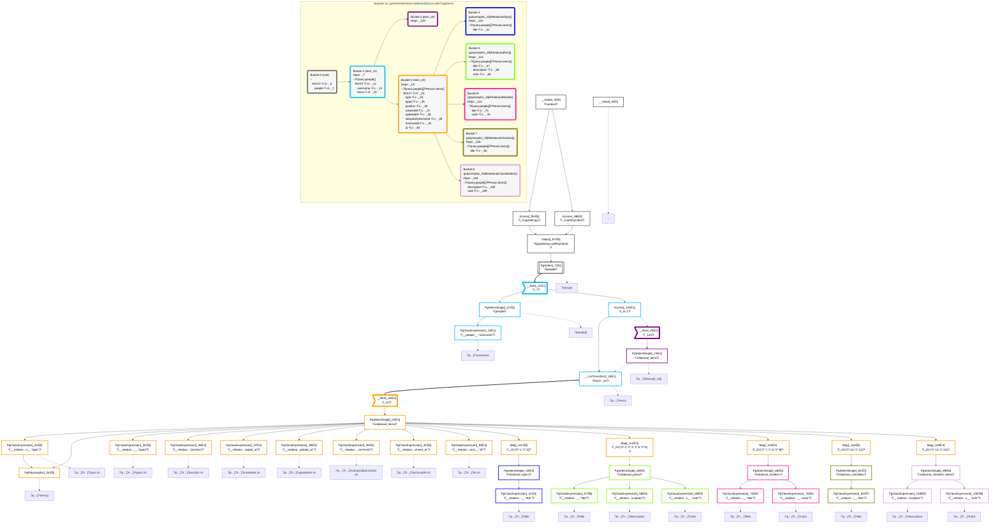

```mermaid
graph TD
    classDef path fill:#eee,stroke:#000,color:#000
    classDef plan fill:#fff,stroke-width:3px,color:#000
    classDef itemplan fill:#fff,stroke-width:6px,color:#000
    classDef sideeffectplan fill:#f00,stroke-width:6px,color:#000
    classDef bucket fill:#f6f6f6,color:#000,stroke-width:6px,text-align:left


    %% define plans
    __Value_0["__Value[_0∈0]"]:::plan
    __Value_3["__Value[_3∈0]<br />ᐸcontextᐳ"]:::plan
    PgSelect_7[["PgSelect[_7∈0]<br />ᐸpeopleᐳ"]]:::plan
    __Item_11>"__Item[_11∈1]<br />ᐸ_7ᐳ"]:::itemplan
    PgSelectSingle_12["PgSelectSingle[_12∈1]<br />ᐸpeopleᐳ"]:::plan
    PgClassExpression_13["PgClassExpression[_13∈1]<br />ᐸ__people__.”username”ᐳ"]:::plan
    __ListTransform_19["__ListTransform[_19∈1]<br />ᐸeach:_15ᐳ"]:::plan
    __Item_20>"__Item[_20∈2]<br />ᐸ_120ᐳ"]:::itemplan
    PgSelectSingle_21["PgSelectSingle[_21∈2]<br />ᐸrelational_itemsᐳ"]:::plan
    __Item_22>"__Item[_22∈3]<br />ᐸ_19ᐳ"]:::itemplan
    PgSelectSingle_23["PgSelectSingle[_23∈3]<br />ᐸrelational_itemsᐳ"]:::plan
    PgClassExpression_24["PgClassExpression[_24∈3]<br />ᐸ__relation...s__.”type”ᐳ"]:::plan
    PgPolymorphic_25["PgPolymorphic[_25∈3]"]:::plan
    PgSelectSingle_32["PgSelectSingle[_32∈4]<br />ᐸrelational_topicsᐳ"]:::plan
    PgClassExpression_35["PgClassExpression[_35∈3]<br />ᐸ__relation...__.”type2”ᐳ"]:::plan
    PgClassExpression_36["PgClassExpression[_36∈3]<br />ᐸ__relation...”position”ᐳ"]:::plan
    PgClassExpression_37["PgClassExpression[_37∈3]<br />ᐸ__relation...reated_at”ᐳ"]:::plan
    PgClassExpression_38["PgClassExpression[_38∈3]<br />ᐸ__relation...pdated_at”ᐳ"]:::plan
    PgClassExpression_39["PgClassExpression[_39∈3]<br />ᐸ__relation..._archived”ᐳ"]:::plan
    PgClassExpression_40["PgClassExpression[_40∈3]<br />ᐸ__relation...chived_at”ᐳ"]:::plan
    PgClassExpression_41["PgClassExpression[_41∈4]<br />ᐸ__relation...__.”title”ᐳ"]:::plan
    PgSelectSingle_48["PgSelectSingle[_48∈5]<br />ᐸrelational_postsᐳ"]:::plan
    PgClassExpression_57["PgClassExpression[_57∈5]<br />ᐸ__relation...__.”title”ᐳ"]:::plan
    PgClassExpression_58["PgClassExpression[_58∈5]<br />ᐸ__relation...scription”ᐳ"]:::plan
    PgClassExpression_59["PgClassExpression[_59∈5]<br />ᐸ__relation...s__.”note”ᐳ"]:::plan
    PgSelectSingle_66["PgSelectSingle[_66∈6]<br />ᐸrelational_dividersᐳ"]:::plan
    PgClassExpression_75["PgClassExpression[_75∈6]<br />ᐸ__relation...__.”title”ᐳ"]:::plan
    PgClassExpression_76["PgClassExpression[_76∈6]<br />ᐸ__relation...__.”color”ᐳ"]:::plan
    PgSelectSingle_83["PgSelectSingle[_83∈7]<br />ᐸrelational_checklistsᐳ"]:::plan
    PgClassExpression_92["PgClassExpression[_92∈7]<br />ᐸ__relation...__.”title”ᐳ"]:::plan
    PgClassExpression_93["PgClassExpression[_93∈3]<br />ᐸ__relation...ems__.”id”ᐳ"]:::plan
    Access_95["Access[_95∈0]<br />ᐸ_3.pgSettingsᐳ"]:::plan
    Access_96["Access[_96∈0]<br />ᐸ_3.withPgClientᐳ"]:::plan
    Object_97["Object[_97∈0]<br />ᐸ{pgSettings,withPgClient}ᐳ"]:::plan
    PgSelectSingle_99["PgSelectSingle[_99∈8]<br />ᐸrelational_checklist_itemsᐳ"]:::plan
    PgClassExpression_108["PgClassExpression[_108∈8]<br />ᐸ__relation...scription”ᐳ"]:::plan
    PgClassExpression_109["PgClassExpression[_109∈8]<br />ᐸ__relation...s__.”note”ᐳ"]:::plan
    Map_110["Map[_110∈3]<br />ᐸ_23:{”0”:1,”1”:2}ᐳ"]:::plan
    Map_112["Map[_112∈3]<br />ᐸ_23:{”0”:3,”1”:4,”2”:5,”3”:6}ᐳ"]:::plan
    Map_114["Map[_114∈3]<br />ᐸ_23:{”0”:7,”1”:8,”2”:9}ᐳ"]:::plan
    Map_116["Map[_116∈3]<br />ᐸ_23:{”0”:10,”1”:11}ᐳ"]:::plan
    Map_118["Map[_118∈3]<br />ᐸ_23:{”0”:12,”1”:13}ᐳ"]:::plan
    Access_120["Access[_120∈1]<br />ᐸ_11.1ᐳ"]:::plan

    %% plan dependencies
    Object_97 --> PgSelect_7
    PgSelect_7 ==> __Item_11
    __Item_11 --> PgSelectSingle_12
    PgSelectSingle_12 --> PgClassExpression_13
    Access_120 --> __ListTransform_19
    PgSelectSingle_21 -.-> __ListTransform_19
    Access_120 -.-> __Item_20
    __Item_20 --> PgSelectSingle_21
    __ListTransform_19 ==> __Item_22
    __Item_22 --> PgSelectSingle_23
    PgSelectSingle_23 --> PgClassExpression_24
    PgSelectSingle_23 & PgClassExpression_24 --> PgPolymorphic_25
    Map_110 --> PgSelectSingle_32
    PgSelectSingle_23 --> PgClassExpression_35
    PgSelectSingle_23 --> PgClassExpression_36
    PgSelectSingle_23 --> PgClassExpression_37
    PgSelectSingle_23 --> PgClassExpression_38
    PgSelectSingle_23 --> PgClassExpression_39
    PgSelectSingle_23 --> PgClassExpression_40
    PgSelectSingle_32 --> PgClassExpression_41
    Map_112 --> PgSelectSingle_48
    PgSelectSingle_48 --> PgClassExpression_57
    PgSelectSingle_48 --> PgClassExpression_58
    PgSelectSingle_48 --> PgClassExpression_59
    Map_114 --> PgSelectSingle_66
    PgSelectSingle_66 --> PgClassExpression_75
    PgSelectSingle_66 --> PgClassExpression_76
    Map_116 --> PgSelectSingle_83
    PgSelectSingle_83 --> PgClassExpression_92
    PgSelectSingle_23 --> PgClassExpression_93
    __Value_3 --> Access_95
    __Value_3 --> Access_96
    Access_95 & Access_96 --> Object_97
    Map_118 --> PgSelectSingle_99
    PgSelectSingle_99 --> PgClassExpression_108
    PgSelectSingle_99 --> PgClassExpression_109
    PgSelectSingle_23 --> Map_110
    PgSelectSingle_23 --> Map_112
    PgSelectSingle_23 --> Map_114
    PgSelectSingle_23 --> Map_116
    PgSelectSingle_23 --> Map_118
    __Item_11 --> Access_120

    %% plan-to-path relationships
    P_0["~"]
    __Value_0 -.-> P_0
    P_7["ᐳpeople"]
    PgSelect_7 -.-> P_7
    P_12["ᐳpeople[]"]
    PgSelectSingle_12 -.-> P_12
    P_13["ᐳp…]ᐳusername"]
    PgClassExpression_13 -.-> P_13
    P_19["ᐳp…]ᐳitems"]
    __ListTransform_19 -.-> P_19
    P_21["ᐳp…]ᐳitems@_19[]"]
    PgSelectSingle_21 -.-> P_21
    P_24["ᐳp…]ᐳi…]ᐳtype x5"]
    PgClassExpression_24 -.-> P_24
    P_25["ᐳp…]ᐳitems[]"]
    PgPolymorphic_25 -.-> P_25
    P_35["ᐳp…]ᐳi…]ᐳtype2 x5"]
    PgClassExpression_35 -.-> P_35
    P_36["ᐳp…]ᐳi…]ᐳposition x5"]
    PgClassExpression_36 -.-> P_36
    P_37["ᐳp…]ᐳi…]ᐳcreatedAt x5"]
    PgClassExpression_37 -.-> P_37
    P_38["ᐳp…]ᐳi…]ᐳupdatedAt x5"]
    PgClassExpression_38 -.-> P_38
    P_39["ᐳp…]ᐳi…]ᐳisExplicitlyArchived x5"]
    PgClassExpression_39 -.-> P_39
    P_40["ᐳp…]ᐳi…]ᐳarchivedAt x5"]
    PgClassExpression_40 -.-> P_40
    P_41["ᐳp…]ᐳi…]ᐳtitle"]
    PgClassExpression_41 -.-> P_41
    P_57["ᐳp…]ᐳi…]ᐳtitle"]
    PgClassExpression_57 -.-> P_57
    P_58["ᐳp…]ᐳi…]ᐳdescription"]
    PgClassExpression_58 -.-> P_58
    P_59["ᐳp…]ᐳi…]ᐳnote"]
    PgClassExpression_59 -.-> P_59
    P_75["ᐳp…]ᐳi…]ᐳtitle"]
    PgClassExpression_75 -.-> P_75
    P_76["ᐳp…]ᐳi…]ᐳcolor"]
    PgClassExpression_76 -.-> P_76
    P_92["ᐳp…]ᐳi…]ᐳtitle"]
    PgClassExpression_92 -.-> P_92
    P_93["ᐳp…]ᐳi…]ᐳid x5"]
    PgClassExpression_93 -.-> P_93
    P_108["ᐳp…]ᐳi…]ᐳdescription"]
    PgClassExpression_108 -.-> P_108
    P_109["ᐳp…]ᐳi…]ᐳnote"]
    PgClassExpression_109 -.-> P_109

    subgraph "Buckets for queries/interfaces-relational/basics-with-fragments"
    Bucket0("Bucket 0 (root)<br />~<br />⠀ROOT ᐸ-O- _0<br />⠀⠀people ᐸ-A- _7"):::bucket
    classDef bucket0 stroke:#696969
    class Bucket0,__Value_0,__Value_3,PgSelect_7,Access_95,Access_96,Object_97 bucket0
    Bucket1("Bucket 1 (item_11)<br />Deps: _7<br />~ᐳQuery.people[]<br />⠀ROOT ᐸ-O- _12<br />⠀⠀username ᐸ-L- _13<br />⠀⠀items ᐸ-A- _19"):::bucket
    classDef bucket1 stroke:#00bfff
    class Bucket1,__Item_11,PgSelectSingle_12,PgClassExpression_13,__ListTransform_19,Access_120 bucket1
    Bucket2("Bucket 2 (item_20)<br />Deps: _120"):::bucket
    classDef bucket2 stroke:#7f007f
    class Bucket2,__Item_20,PgSelectSingle_21 bucket2
    Bucket3("Bucket 3 (item_22)<br />Deps: _19<br />~ᐳQuery.people[]ᐳPerson.items[]<br />⠀ROOT ᐸ-O- _25<br />⠀⠀type ᐸ-L- _24<br />⠀⠀type2 ᐸ-L- _35<br />⠀⠀position ᐸ-L- _36<br />⠀⠀createdAt ᐸ-L- _37<br />⠀⠀updatedAt ᐸ-L- _38<br />⠀⠀isExplicitlyArchived ᐸ-L- _39<br />⠀⠀archivedAt ᐸ-L- _40<br />⠀⠀id ᐸ-L- _93"):::bucket
    classDef bucket3 stroke:#ffa500
    class Bucket3,__Item_22,PgSelectSingle_23,PgClassExpression_24,PgPolymorphic_25,PgClassExpression_35,PgClassExpression_36,PgClassExpression_37,PgClassExpression_38,PgClassExpression_39,PgClassExpression_40,PgClassExpression_93,Map_110,Map_112,Map_114,Map_116,Map_118 bucket3
    Bucket4("Bucket 4 (polymorphic_25[RelationalTopic])<br />Deps: _110<br />~ᐳQuery.people[]ᐳPerson.items[]<br />⠀⠀title ᐸ-L- _41"):::bucket
    classDef bucket4 stroke:#0000ff
    class Bucket4,PgSelectSingle_32,PgClassExpression_41 bucket4
    Bucket5("Bucket 5 (polymorphic_25[RelationalPost])<br />Deps: _112<br />~ᐳQuery.people[]ᐳPerson.items[]<br />⠀⠀title ᐸ-L- _57<br />⠀⠀description ᐸ-L- _58<br />⠀⠀note ᐸ-L- _59"):::bucket
    classDef bucket5 stroke:#7fff00
    class Bucket5,PgSelectSingle_48,PgClassExpression_57,PgClassExpression_58,PgClassExpression_59 bucket5
    Bucket6("Bucket 6 (polymorphic_25[RelationalDivider])<br />Deps: _114<br />~ᐳQuery.people[]ᐳPerson.items[]<br />⠀⠀title ᐸ-L- _75<br />⠀⠀color ᐸ-L- _76"):::bucket
    classDef bucket6 stroke:#ff1493
    class Bucket6,PgSelectSingle_66,PgClassExpression_75,PgClassExpression_76 bucket6
    Bucket7("Bucket 7 (polymorphic_25[RelationalChecklist])<br />Deps: _116<br />~ᐳQuery.people[]ᐳPerson.items[]<br />⠀⠀title ᐸ-L- _92"):::bucket
    classDef bucket7 stroke:#808000
    class Bucket7,PgSelectSingle_83,PgClassExpression_92 bucket7
    Bucket8("Bucket 8 (polymorphic_25[RelationalChecklistItem])<br />Deps: _118<br />~ᐳQuery.people[]ᐳPerson.items[]<br />⠀⠀description ᐸ-L- _108<br />⠀⠀note ᐸ-L- _109"):::bucket
    classDef bucket8 stroke:#dda0dd
    class Bucket8,PgSelectSingle_99,PgClassExpression_108,PgClassExpression_109 bucket8
    Bucket0 --> Bucket1
    Bucket1 --> Bucket2 & Bucket3
    Bucket3 --> Bucket4 & Bucket5 & Bucket6 & Bucket7 & Bucket8
    end
```
