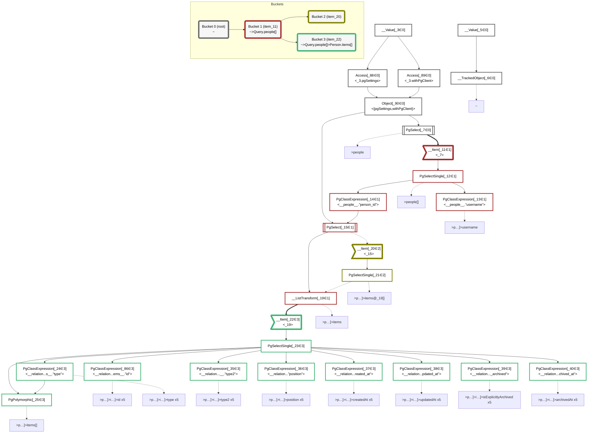

```mermaid
graph TD
    classDef path fill:#eee,stroke:#000,color:#000
    classDef plan fill:#fff,stroke-width:3px,color:#000
    classDef itemplan fill:#fff,stroke-width:6px,color:#000
    classDef sideeffectplan fill:#f00,stroke-width:6px,color:#000
    classDef bucket fill:#f6f6f6,color:#000,stroke-width:6px


    %% define plans
    __Value_3["__Value[_3∈0]<br /><context>"]:::plan
    __Value_5["__Value[_5∈0]<br /><rootValue>"]:::plan
    __TrackedObject_6["__TrackedObject[_6∈0]"]:::plan
    PgSelect_7[["PgSelect[_7∈0]<br /><people>"]]:::plan
    __Item_11>"__Item[_11∈1]<br /><_7>"]:::itemplan
    PgSelectSingle_12["PgSelectSingle[_12∈1]<br /><people>"]:::plan
    PgClassExpression_13["PgClassExpression[_13∈1]<br /><__people__.”username”>"]:::plan
    PgClassExpression_14["PgClassExpression[_14∈1]<br /><__people__.”person_id”>"]:::plan
    PgSelect_15[["PgSelect[_15∈1]<br /><relational_items>"]]:::plan
    __ListTransform_19["__ListTransform[_19∈1]<br /><each:_15>"]:::plan
    __Item_20>"__Item[_20∈2]<br /><_15>"]:::itemplan
    PgSelectSingle_21["PgSelectSingle[_21∈2]<br /><relational_items>"]:::plan
    __Item_22>"__Item[_22∈3]<br /><_19>"]:::itemplan
    PgSelectSingle_23["PgSelectSingle[_23∈3]<br /><relational_items>"]:::plan
    PgClassExpression_24["PgClassExpression[_24∈3]<br /><__relation...s__.”type”>"]:::plan
    PgPolymorphic_25["PgPolymorphic[_25∈3]"]:::plan
    PgClassExpression_35["PgClassExpression[_35∈3]<br /><__relation...__.”type2”>"]:::plan
    PgClassExpression_36["PgClassExpression[_36∈3]<br /><__relation...”position”>"]:::plan
    PgClassExpression_37["PgClassExpression[_37∈3]<br /><__relation...reated_at”>"]:::plan
    PgClassExpression_38["PgClassExpression[_38∈3]<br /><__relation...pdated_at”>"]:::plan
    PgClassExpression_39["PgClassExpression[_39∈3]<br /><__relation..._archived”>"]:::plan
    PgClassExpression_40["PgClassExpression[_40∈3]<br /><__relation...chived_at”>"]:::plan
    PgClassExpression_86["PgClassExpression[_86∈3]<br /><__relation...ems__.”id”>"]:::plan
    Access_88["Access[_88∈0]<br /><_3.pgSettings>"]:::plan
    Access_89["Access[_89∈0]<br /><_3.withPgClient>"]:::plan
    Object_90["Object[_90∈0]<br /><{pgSettings,withPgClient}>"]:::plan

    %% plan dependencies
    __Value_5 --> __TrackedObject_6
    Object_90 --> PgSelect_7
    PgSelect_7 ==> __Item_11
    __Item_11 --> PgSelectSingle_12
    PgSelectSingle_12 --> PgClassExpression_13
    PgSelectSingle_12 --> PgClassExpression_14
    Object_90 --> PgSelect_15
    PgClassExpression_14 --> PgSelect_15
    PgSelect_15 --> __ListTransform_19
    PgSelectSingle_21 -.-> __ListTransform_19
    PgSelect_15 -.-> __Item_20
    __Item_20 --> PgSelectSingle_21
    __ListTransform_19 ==> __Item_22
    __Item_22 --> PgSelectSingle_23
    PgSelectSingle_23 --> PgClassExpression_24
    PgSelectSingle_23 --> PgPolymorphic_25
    PgClassExpression_24 --> PgPolymorphic_25
    PgSelectSingle_23 --> PgClassExpression_35
    PgSelectSingle_23 --> PgClassExpression_36
    PgSelectSingle_23 --> PgClassExpression_37
    PgSelectSingle_23 --> PgClassExpression_38
    PgSelectSingle_23 --> PgClassExpression_39
    PgSelectSingle_23 --> PgClassExpression_40
    PgSelectSingle_23 --> PgClassExpression_86
    __Value_3 --> Access_88
    __Value_3 --> Access_89
    Access_88 --> Object_90
    Access_89 --> Object_90

    %% plan-to-path relationships
    P1["~"]
    __TrackedObject_6 -.-> P1
    P2[">people"]
    PgSelect_7 -.-> P2
    P3[">people[]"]
    PgSelectSingle_12 -.-> P3
    P4[">p…]>username"]
    PgClassExpression_13 -.-> P4
    P5[">p…]>items@_19[]"]
    PgSelectSingle_21 -.-> P5
    P6[">p…]>items"]
    __ListTransform_19 -.-> P6
    P7[">p…]>items[]"]
    PgPolymorphic_25 -.-> P7
    P8[">p…]>i…]>id x5"]
    PgClassExpression_86 -.-> P8
    P9[">p…]>i…]>type x5"]
    PgClassExpression_24 -.-> P9
    P10[">p…]>i…]>type2 x5"]
    PgClassExpression_35 -.-> P10
    P11[">p…]>i…]>position x5"]
    PgClassExpression_36 -.-> P11
    P12[">p…]>i…]>createdAt x5"]
    PgClassExpression_37 -.-> P12
    P13[">p…]>i…]>updatedAt x5"]
    PgClassExpression_38 -.-> P13
    P14[">p…]>i…]>isExplicitlyArchived x5"]
    PgClassExpression_39 -.-> P14
    P15[">p…]>i…]>archivedAt x5"]
    PgClassExpression_40 -.-> P15

    %% allocate buckets
    classDef bucket0 stroke:#696969
    class __Value_3,__Value_5,__TrackedObject_6,PgSelect_7,Access_88,Access_89,Object_90 bucket0
    classDef bucket1 stroke:#a52a2a
    class __Item_11,PgSelectSingle_12,PgClassExpression_13,PgClassExpression_14,PgSelect_15,__ListTransform_19 bucket1
    classDef bucket2 stroke:#808000
    class __Item_20,PgSelectSingle_21 bucket2
    classDef bucket3 stroke:#3cb371
    class __Item_22,PgSelectSingle_23,PgClassExpression_24,PgPolymorphic_25,PgClassExpression_35,PgClassExpression_36,PgClassExpression_37,PgClassExpression_38,PgClassExpression_39,PgClassExpression_40,PgClassExpression_86 bucket3

    subgraph Buckets
    Bucket0("Bucket 0 (root)<br />~"):::bucket
    style Bucket0 stroke:#696969
    Bucket1("Bucket 1 (item_11)<br />~>Query.people[]"):::bucket
    style Bucket1 stroke:#a52a2a
    Bucket0 --> Bucket1
    Bucket2("Bucket 2 (item_20)"):::bucket
    style Bucket2 stroke:#808000
    Bucket1 --> Bucket2
    Bucket3("Bucket 3 (item_22)<br />~>Query.people[]>Person.items[]"):::bucket
    style Bucket3 stroke:#3cb371
    Bucket1 --> Bucket3
    end
```
