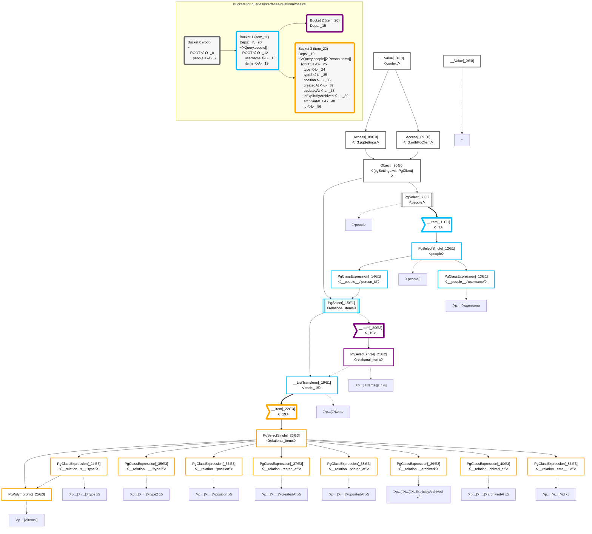

```mermaid
graph TD
    classDef path fill:#eee,stroke:#000,color:#000
    classDef plan fill:#fff,stroke-width:3px,color:#000
    classDef itemplan fill:#fff,stroke-width:6px,color:#000
    classDef sideeffectplan fill:#f00,stroke-width:6px,color:#000
    classDef bucket fill:#f6f6f6,color:#000,stroke-width:6px,text-align:left


    %% define plans
    __Value_0["__Value[_0∈0]"]:::plan
    __Value_3["__Value[_3∈0]<br />ᐸcontextᐳ"]:::plan
    PgSelect_7[["PgSelect[_7∈0]<br />ᐸpeopleᐳ"]]:::plan
    __Item_11>"__Item[_11∈1]<br />ᐸ_7ᐳ"]:::itemplan
    PgSelectSingle_12["PgSelectSingle[_12∈1]<br />ᐸpeopleᐳ"]:::plan
    PgClassExpression_13["PgClassExpression[_13∈1]<br />ᐸ__people__.”username”ᐳ"]:::plan
    PgClassExpression_14["PgClassExpression[_14∈1]<br />ᐸ__people__.”person_id”ᐳ"]:::plan
    PgSelect_15[["PgSelect[_15∈1]<br />ᐸrelational_itemsᐳ"]]:::plan
    __ListTransform_19["__ListTransform[_19∈1]<br />ᐸeach:_15ᐳ"]:::plan
    __Item_20>"__Item[_20∈2]<br />ᐸ_15ᐳ"]:::itemplan
    PgSelectSingle_21["PgSelectSingle[_21∈2]<br />ᐸrelational_itemsᐳ"]:::plan
    __Item_22>"__Item[_22∈3]<br />ᐸ_19ᐳ"]:::itemplan
    PgSelectSingle_23["PgSelectSingle[_23∈3]<br />ᐸrelational_itemsᐳ"]:::plan
    PgClassExpression_24["PgClassExpression[_24∈3]<br />ᐸ__relation...s__.”type”ᐳ"]:::plan
    PgPolymorphic_25["PgPolymorphic[_25∈3]"]:::plan
    PgClassExpression_35["PgClassExpression[_35∈3]<br />ᐸ__relation...__.”type2”ᐳ"]:::plan
    PgClassExpression_36["PgClassExpression[_36∈3]<br />ᐸ__relation...”position”ᐳ"]:::plan
    PgClassExpression_37["PgClassExpression[_37∈3]<br />ᐸ__relation...reated_at”ᐳ"]:::plan
    PgClassExpression_38["PgClassExpression[_38∈3]<br />ᐸ__relation...pdated_at”ᐳ"]:::plan
    PgClassExpression_39["PgClassExpression[_39∈3]<br />ᐸ__relation..._archived”ᐳ"]:::plan
    PgClassExpression_40["PgClassExpression[_40∈3]<br />ᐸ__relation...chived_at”ᐳ"]:::plan
    PgClassExpression_86["PgClassExpression[_86∈3]<br />ᐸ__relation...ems__.”id”ᐳ"]:::plan
    Access_88["Access[_88∈0]<br />ᐸ_3.pgSettingsᐳ"]:::plan
    Access_89["Access[_89∈0]<br />ᐸ_3.withPgClientᐳ"]:::plan
    Object_90["Object[_90∈0]<br />ᐸ{pgSettings,withPgClient}ᐳ"]:::plan

    %% plan dependencies
    Object_90 --> PgSelect_7
    PgSelect_7 ==> __Item_11
    __Item_11 --> PgSelectSingle_12
    PgSelectSingle_12 --> PgClassExpression_13
    PgSelectSingle_12 --> PgClassExpression_14
    Object_90 & PgClassExpression_14 --> PgSelect_15
    PgSelect_15 --> __ListTransform_19
    PgSelectSingle_21 -.-> __ListTransform_19
    PgSelect_15 -.-> __Item_20
    __Item_20 --> PgSelectSingle_21
    __ListTransform_19 ==> __Item_22
    __Item_22 --> PgSelectSingle_23
    PgSelectSingle_23 --> PgClassExpression_24
    PgSelectSingle_23 & PgClassExpression_24 --> PgPolymorphic_25
    PgSelectSingle_23 --> PgClassExpression_35
    PgSelectSingle_23 --> PgClassExpression_36
    PgSelectSingle_23 --> PgClassExpression_37
    PgSelectSingle_23 --> PgClassExpression_38
    PgSelectSingle_23 --> PgClassExpression_39
    PgSelectSingle_23 --> PgClassExpression_40
    PgSelectSingle_23 --> PgClassExpression_86
    __Value_3 --> Access_88
    __Value_3 --> Access_89
    Access_88 & Access_89 --> Object_90

    %% plan-to-path relationships
    P_0["~"]
    __Value_0 -.-> P_0
    P_7["ᐳpeople"]
    PgSelect_7 -.-> P_7
    P_12["ᐳpeople[]"]
    PgSelectSingle_12 -.-> P_12
    P_13["ᐳp…]ᐳusername"]
    PgClassExpression_13 -.-> P_13
    P_19["ᐳp…]ᐳitems"]
    __ListTransform_19 -.-> P_19
    P_21["ᐳp…]ᐳitems@_19[]"]
    PgSelectSingle_21 -.-> P_21
    P_24["ᐳp…]ᐳi…]ᐳtype x5"]
    PgClassExpression_24 -.-> P_24
    P_25["ᐳp…]ᐳitems[]"]
    PgPolymorphic_25 -.-> P_25
    P_35["ᐳp…]ᐳi…]ᐳtype2 x5"]
    PgClassExpression_35 -.-> P_35
    P_36["ᐳp…]ᐳi…]ᐳposition x5"]
    PgClassExpression_36 -.-> P_36
    P_37["ᐳp…]ᐳi…]ᐳcreatedAt x5"]
    PgClassExpression_37 -.-> P_37
    P_38["ᐳp…]ᐳi…]ᐳupdatedAt x5"]
    PgClassExpression_38 -.-> P_38
    P_39["ᐳp…]ᐳi…]ᐳisExplicitlyArchived x5"]
    PgClassExpression_39 -.-> P_39
    P_40["ᐳp…]ᐳi…]ᐳarchivedAt x5"]
    PgClassExpression_40 -.-> P_40
    P_86["ᐳp…]ᐳi…]ᐳid x5"]
    PgClassExpression_86 -.-> P_86

    subgraph "Buckets for queries/interfaces-relational/basics"
    Bucket0("Bucket 0 (root)<br />~<br />⠀ROOT ᐸ-O- _0<br />⠀⠀people ᐸ-A- _7"):::bucket
    classDef bucket0 stroke:#696969
    class Bucket0,__Value_0,__Value_3,PgSelect_7,Access_88,Access_89,Object_90 bucket0
    Bucket1("Bucket 1 (item_11)<br />Deps: _7, _90<br />~ᐳQuery.people[]<br />⠀ROOT ᐸ-O- _12<br />⠀⠀username ᐸ-L- _13<br />⠀⠀items ᐸ-A- _19"):::bucket
    classDef bucket1 stroke:#00bfff
    class Bucket1,__Item_11,PgSelectSingle_12,PgClassExpression_13,PgClassExpression_14,PgSelect_15,__ListTransform_19 bucket1
    Bucket2("Bucket 2 (item_20)<br />Deps: _15"):::bucket
    classDef bucket2 stroke:#7f007f
    class Bucket2,__Item_20,PgSelectSingle_21 bucket2
    Bucket3("Bucket 3 (item_22)<br />Deps: _19<br />~ᐳQuery.people[]ᐳPerson.items[]<br />⠀ROOT ᐸ-O- _25<br />⠀⠀type ᐸ-L- _24<br />⠀⠀type2 ᐸ-L- _35<br />⠀⠀position ᐸ-L- _36<br />⠀⠀createdAt ᐸ-L- _37<br />⠀⠀updatedAt ᐸ-L- _38<br />⠀⠀isExplicitlyArchived ᐸ-L- _39<br />⠀⠀archivedAt ᐸ-L- _40<br />⠀⠀id ᐸ-L- _86"):::bucket
    classDef bucket3 stroke:#ffa500
    class Bucket3,__Item_22,PgSelectSingle_23,PgClassExpression_24,PgPolymorphic_25,PgClassExpression_35,PgClassExpression_36,PgClassExpression_37,PgClassExpression_38,PgClassExpression_39,PgClassExpression_40,PgClassExpression_86 bucket3
    Bucket0 --> Bucket1
    Bucket1 --> Bucket2 & Bucket3
    end
```
