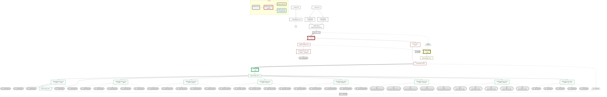

```mermaid
graph TD
    classDef path fill:#eee,stroke:#000,color:#000
    classDef plan fill:#fff,stroke-width:3px,color:#000
    classDef itemplan fill:#fff,stroke-width:6px,color:#000
    classDef sideeffectplan fill:#f00,stroke-width:6px,color:#000
    classDef bucket fill:#f6f6f6,color:#000,stroke-width:6px

    %% subgraph fields
    P1{{"~"}}:::path
    P2[/">people"\]:::path
    P3>">people[]"]:::path
    P2 -.- P3
    P4([">pe…e[]>username"]):::path
    %% P3 -.-> P4
    P5[/">pe…e[]>items"\]:::path
    P6>">pe…e[]>items[]"]:::path
    P5 -.- P6
    P7([">pe…e[]>items[]>id"]):::path
    %% P6 -.-> P7
    P8([">pe…e[]>items[]>type"]):::path
    %% P6 -.-> P8
    P9([">pe…e[]>items[]>type2"]):::path
    %% P6 -.-> P9
    P10([">pe…e[]>items[]>position"]):::path
    %% P6 -.-> P10
    P11([">pe…e[]>items[]>createdAt"]):::path
    %% P6 -.-> P11
    P12([">pe…e[]>items[]>updatedAt"]):::path
    %% P6 -.-> P12
    P13([">pe…e[]>items[]>isExplicitlyArchived"]):::path
    %% P6 -.-> P13
    P14([">pe…e[]>items[]>archivedAt"]):::path
    %% P6 -.-> P14
    P15([">pe…e[]>items[]>id"]):::path
    %% P6 -.-> P15
    P16([">pe…e[]>items[]>type"]):::path
    %% P6 -.-> P16
    P17([">pe…e[]>items[]>type2"]):::path
    %% P6 -.-> P17
    P18([">pe…e[]>items[]>position"]):::path
    %% P6 -.-> P18
    P19([">pe…e[]>items[]>createdAt"]):::path
    %% P6 -.-> P19
    P20([">pe…e[]>items[]>updatedAt"]):::path
    %% P6 -.-> P20
    P21([">pe…e[]>items[]>isExplicitlyArchived"]):::path
    %% P6 -.-> P21
    P22([">pe…e[]>items[]>archivedAt"]):::path
    %% P6 -.-> P22
    P23([">pe…e[]>items[]>id"]):::path
    %% P6 -.-> P23
    P24([">pe…e[]>items[]>type"]):::path
    %% P6 -.-> P24
    P25([">pe…e[]>items[]>type2"]):::path
    %% P6 -.-> P25
    P26([">pe…e[]>items[]>position"]):::path
    %% P6 -.-> P26
    P27([">pe…e[]>items[]>createdAt"]):::path
    %% P6 -.-> P27
    P28([">pe…e[]>items[]>updatedAt"]):::path
    %% P6 -.-> P28
    P29([">pe…e[]>items[]>isExplicitlyArchived"]):::path
    %% P6 -.-> P29
    P30([">pe…e[]>items[]>archivedAt"]):::path
    %% P6 -.-> P30
    P31([">pe…e[]>items[]>id"]):::path
    %% P6 -.-> P31
    P32([">pe…e[]>items[]>type"]):::path
    %% P6 -.-> P32
    P33([">pe…e[]>items[]>type2"]):::path
    %% P6 -.-> P33
    P34([">pe…e[]>items[]>position"]):::path
    %% P6 -.-> P34
    P35([">pe…e[]>items[]>createdAt"]):::path
    %% P6 -.-> P35
    P36([">pe…e[]>items[]>updatedAt"]):::path
    %% P6 -.-> P36
    P37([">pe…e[]>items[]>isExplicitlyArchived"]):::path
    %% P6 -.-> P37
    P38([">pe…e[]>items[]>archivedAt"]):::path
    %% P6 -.-> P38
    P39([">pe…e[]>items[]>id"]):::path
    %% P6 -.-> P39
    P40([">pe…e[]>items[]>type"]):::path
    %% P6 -.-> P40
    P41([">pe…e[]>items[]>type2"]):::path
    %% P6 -.-> P41
    P42([">pe…e[]>items[]>position"]):::path
    %% P6 -.-> P42
    P43([">pe…e[]>items[]>createdAt"]):::path
    %% P6 -.-> P43
    P44([">pe…e[]>items[]>updatedAt"]):::path
    %% P6 -.-> P44
    P45([">pe…e[]>items[]>isExplicitlyArchived"]):::path
    %% P6 -.-> P45
    P46([">pe…e[]>items[]>archivedAt"]):::path
    %% P6 -.-> P46
    %% P3 -.-> P5
    %% P1 -.-> P2
    %% end

    %% define plans
    __Value_3["__Value[_3∈0]<br /><context>"]:::plan
    __Value_5["__Value[_5∈0]<br /><rootValue>"]:::plan
    __TrackedObject_6["__TrackedObject[_6∈0]"]:::plan
    PgSelect_7[["PgSelect[_7∈0]<br /><people>"]]:::plan
    __Item_11>"__Item[_11∈1]<br /><_7>"]:::itemplan
    PgSelectSingle_12["PgSelectSingle[_12∈1]<br /><people>"]:::plan
    PgClassExpression_13["PgClassExpression[_13∈1]<br /><__people__.#quot;username#quot;>"]:::plan
    __ListTransform_19["__ListTransform[_19∈1]<br /><each:_15>"]:::plan
    __Item_20>"__Item[_20∈2]<br /><_101>"]:::itemplan
    PgSelectSingle_21["PgSelectSingle[_21∈2]<br /><relational_items>"]:::plan
    __Item_22>"__Item[_22∈3]<br /><_19>"]:::itemplan
    PgSelectSingle_23["PgSelectSingle[_23∈3]<br /><relational_items>"]:::plan
    PgClassExpression_24["PgClassExpression[_24∈3]<br /><__relation...s__.#quot;type#quot;>"]:::plan
    PgPolymorphic_25["PgPolymorphic[_25∈3]"]:::plan
    PgClassExpression_35["PgClassExpression[_35∈3]<br /><__relation...__.#quot;type2#quot;>"]:::plan
    PgClassExpression_36["PgClassExpression[_36∈3]<br /><__relation...#quot;position#quot;>"]:::plan
    PgClassExpression_37["PgClassExpression[_37∈3]<br /><__relation...reated_at#quot;>"]:::plan
    PgClassExpression_38["PgClassExpression[_38∈3]<br /><__relation...pdated_at#quot;>"]:::plan
    PgClassExpression_39["PgClassExpression[_39∈3]<br /><__relation..._archived#quot;>"]:::plan
    PgClassExpression_40["PgClassExpression[_40∈3]<br /><__relation...chived_at#quot;>"]:::plan
    PgClassExpression_86["PgClassExpression[_86∈3]<br /><__relation...ems__.#quot;id#quot;>"]:::plan
    Access_88["Access[_88∈0]<br /><_3.pgSettings>"]:::plan
    Access_89["Access[_89∈0]<br /><_3.withPgClient>"]:::plan
    Object_90["Object[_90∈0]<br /><{pgSettings,withPgClient}>"]:::plan
    Access_101["Access[_101∈1]<br /><_11.1>"]:::plan

    %% plan dependencies
    __Value_5 --> __TrackedObject_6
    Object_90 --> PgSelect_7
    PgSelect_7 ==> __Item_11
    __Item_11 --> PgSelectSingle_12
    PgSelectSingle_12 --> PgClassExpression_13
    Access_101 --> __ListTransform_19
    PgSelectSingle_21 -.-> __ListTransform_19
    Access_101 -.-> __Item_20
    __Item_20 --> PgSelectSingle_21
    __ListTransform_19 ==> __Item_22
    __Item_22 --> PgSelectSingle_23
    PgSelectSingle_23 --> PgClassExpression_24
    PgSelectSingle_23 --> PgPolymorphic_25
    PgClassExpression_24 --> PgPolymorphic_25
    PgSelectSingle_23 --> PgClassExpression_35
    PgSelectSingle_23 --> PgClassExpression_36
    PgSelectSingle_23 --> PgClassExpression_37
    PgSelectSingle_23 --> PgClassExpression_38
    PgSelectSingle_23 --> PgClassExpression_39
    PgSelectSingle_23 --> PgClassExpression_40
    PgSelectSingle_23 --> PgClassExpression_86
    __Value_3 --> Access_88
    __Value_3 --> Access_89
    Access_88 --> Object_90
    Access_89 --> Object_90
    __Item_11 --> Access_101

    %% plan-to-path relationships
    __TrackedObject_6 -.-> P1
    PgSelect_7 -.-> P2
    PgSelectSingle_12 -.-> P3
    PgClassExpression_13 -.-> P4
    __ListTransform_19 -.-> P5
    PgPolymorphic_25 -.-> P6
    PgClassExpression_86 -.-> P7
    PgClassExpression_24 -.-> P8
    PgClassExpression_35 -.-> P9
    PgClassExpression_36 -.-> P10
    PgClassExpression_37 -.-> P11
    PgClassExpression_38 -.-> P12
    PgClassExpression_39 -.-> P13
    PgClassExpression_40 -.-> P14
    PgClassExpression_86 -.-> P15
    PgClassExpression_24 -.-> P16
    PgClassExpression_35 -.-> P17
    PgClassExpression_36 -.-> P18
    PgClassExpression_37 -.-> P19
    PgClassExpression_38 -.-> P20
    PgClassExpression_39 -.-> P21
    PgClassExpression_40 -.-> P22
    PgClassExpression_86 -.-> P23
    PgClassExpression_24 -.-> P24
    PgClassExpression_35 -.-> P25
    PgClassExpression_36 -.-> P26
    PgClassExpression_37 -.-> P27
    PgClassExpression_38 -.-> P28
    PgClassExpression_39 -.-> P29
    PgClassExpression_40 -.-> P30
    PgClassExpression_86 -.-> P31
    PgClassExpression_24 -.-> P32
    PgClassExpression_35 -.-> P33
    PgClassExpression_36 -.-> P34
    PgClassExpression_37 -.-> P35
    PgClassExpression_38 -.-> P36
    PgClassExpression_39 -.-> P37
    PgClassExpression_40 -.-> P38
    PgClassExpression_86 -.-> P39
    PgClassExpression_24 -.-> P40
    PgClassExpression_35 -.-> P41
    PgClassExpression_36 -.-> P42
    PgClassExpression_37 -.-> P43
    PgClassExpression_38 -.-> P44
    PgClassExpression_39 -.-> P45
    PgClassExpression_40 -.-> P46

    %% allocate buckets
    classDef bucket0 stroke:#696969
    class __Value_3,__Value_5,__TrackedObject_6,PgSelect_7,Access_88,Access_89,Object_90 bucket0
    classDef bucket1 stroke:#a52a2a
    class __Item_11,PgSelectSingle_12,PgClassExpression_13,__ListTransform_19,Access_101 bucket1
    classDef bucket2 stroke:#808000
    class __Item_20,PgSelectSingle_21 bucket2
    classDef bucket3 stroke:#3cb371
    class __Item_22,PgSelectSingle_23,PgClassExpression_24,PgPolymorphic_25,PgClassExpression_35,PgClassExpression_36,PgClassExpression_37,PgClassExpression_38,PgClassExpression_39,PgClassExpression_40,PgClassExpression_86 bucket3

    subgraph Buckets
    Bucket0("Bucket 0 (root)<br />~"):::bucket
    style Bucket0 stroke:#696969
    Bucket1("Bucket 1 (item_11)<br />>people[]"):::bucket
    style Bucket1 stroke:#a52a2a
    Bucket0 --> Bucket1
    Bucket2("Bucket 2 (item_20)"):::bucket
    style Bucket2 stroke:#808000
    Bucket1 --> Bucket2
    Bucket3("Bucket 3 (item_22)<br />>people[]>items[]"):::bucket
    style Bucket3 stroke:#3cb371
    Bucket1 --> Bucket3
    end
```
