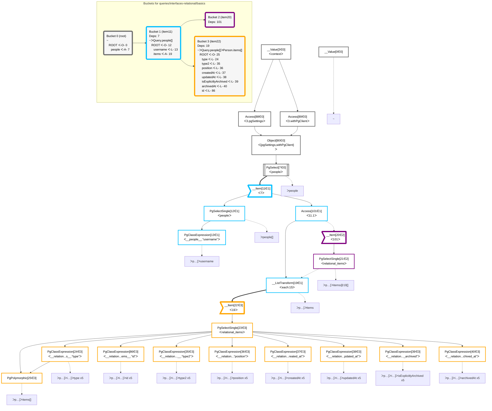

```mermaid
graph TD
    classDef path fill:#eee,stroke:#000,color:#000
    classDef plan fill:#fff,stroke-width:3px,color:#000
    classDef itemplan fill:#fff,stroke-width:6px,color:#000
    classDef sideeffectplan fill:#f00,stroke-width:6px,color:#000
    classDef bucket fill:#f6f6f6,color:#000,stroke-width:6px,text-align:left


    %% define plans
    __Value0["__Value[0∈0]"]:::plan
    PgClassExpression13["PgClassExpression[13∈1]<br />ᐸ__people__.”username”ᐳ"]:::plan
    PgSelectSingle12["PgSelectSingle[12∈1]<br />ᐸpeopleᐳ"]:::plan
    PgPolymorphic25["PgPolymorphic[25∈3]"]:::plan
    PgClassExpression24["PgClassExpression[24∈3]<br />ᐸ__relation...s__.”type”ᐳ"]:::plan
    PgClassExpression86["PgClassExpression[86∈3]<br />ᐸ__relation...ems__.”id”ᐳ"]:::plan
    PgClassExpression35["PgClassExpression[35∈3]<br />ᐸ__relation...__.”type2”ᐳ"]:::plan
    PgClassExpression36["PgClassExpression[36∈3]<br />ᐸ__relation...”position”ᐳ"]:::plan
    PgClassExpression37["PgClassExpression[37∈3]<br />ᐸ__relation...reated_at”ᐳ"]:::plan
    PgClassExpression38["PgClassExpression[38∈3]<br />ᐸ__relation...pdated_at”ᐳ"]:::plan
    PgClassExpression39["PgClassExpression[39∈3]<br />ᐸ__relation..._archived”ᐳ"]:::plan
    PgClassExpression40["PgClassExpression[40∈3]<br />ᐸ__relation...chived_at”ᐳ"]:::plan
    PgSelectSingle23["PgSelectSingle[23∈3]<br />ᐸrelational_itemsᐳ"]:::plan
    __Item22>"__Item[22∈3]<br />ᐸ19ᐳ"]:::itemplan
    __ListTransform19["__ListTransform[19∈1]<br />ᐸeach:15ᐳ"]:::plan
    PgSelectSingle21["PgSelectSingle[21∈2]<br />ᐸrelational_itemsᐳ"]:::plan
    __Item20>"__Item[20∈2]<br />ᐸ101ᐳ"]:::itemplan
    Access101["Access[101∈1]<br />ᐸ11.1ᐳ"]:::plan
    __Item11>"__Item[11∈1]<br />ᐸ7ᐳ"]:::itemplan
    PgSelect7[["PgSelect[7∈0]<br />ᐸpeopleᐳ"]]:::plan
    Object90["Object[90∈0]<br />ᐸ{pgSettings,withPgClient}ᐳ"]:::plan
    Access88["Access[88∈0]<br />ᐸ3.pgSettingsᐳ"]:::plan
    Access89["Access[89∈0]<br />ᐸ3.withPgClientᐳ"]:::plan
    __Value3["__Value[3∈0]<br />ᐸcontextᐳ"]:::plan

    %% plan dependencies
    PgSelectSingle12 --> PgClassExpression13
    __Item11 --> PgSelectSingle12
    PgSelectSingle23 & PgClassExpression24 --> PgPolymorphic25
    PgSelectSingle23 --> PgClassExpression24
    PgSelectSingle23 --> PgClassExpression86
    PgSelectSingle23 --> PgClassExpression35
    PgSelectSingle23 --> PgClassExpression36
    PgSelectSingle23 --> PgClassExpression37
    PgSelectSingle23 --> PgClassExpression38
    PgSelectSingle23 --> PgClassExpression39
    PgSelectSingle23 --> PgClassExpression40
    __Item22 --> PgSelectSingle23
    __ListTransform19 ==> __Item22
    Access101 --> __ListTransform19
    PgSelectSingle21 -.-> __ListTransform19
    __Item20 --> PgSelectSingle21
    Access101 -.-> __Item20
    __Item11 --> Access101
    PgSelect7 ==> __Item11
    Object90 --> PgSelect7
    Access88 & Access89 --> Object90
    __Value3 --> Access88
    __Value3 --> Access89

    %% plan-to-path relationships
    P0["~"]
    __Value0 -.-> P0
    P7["ᐳpeople"]
    PgSelect7 -.-> P7
    P12["ᐳpeople[]"]
    PgSelectSingle12 -.-> P12
    P13["ᐳp…]ᐳusername"]
    PgClassExpression13 -.-> P13
    P19["ᐳp…]ᐳitems"]
    __ListTransform19 -.-> P19
    P21["ᐳp…]ᐳitems@19[]"]
    PgSelectSingle21 -.-> P21
    P24["ᐳp…]ᐳi…]ᐳtype x5"]
    PgClassExpression24 -.-> P24
    P25["ᐳp…]ᐳitems[]"]
    PgPolymorphic25 -.-> P25
    P35["ᐳp…]ᐳi…]ᐳtype2 x5"]
    PgClassExpression35 -.-> P35
    P36["ᐳp…]ᐳi…]ᐳposition x5"]
    PgClassExpression36 -.-> P36
    P37["ᐳp…]ᐳi…]ᐳcreatedAt x5"]
    PgClassExpression37 -.-> P37
    P38["ᐳp…]ᐳi…]ᐳupdatedAt x5"]
    PgClassExpression38 -.-> P38
    P39["ᐳp…]ᐳi…]ᐳisExplicitlyArchived x5"]
    PgClassExpression39 -.-> P39
    P40["ᐳp…]ᐳi…]ᐳarchivedAt x5"]
    PgClassExpression40 -.-> P40
    P86["ᐳp…]ᐳi…]ᐳid x5"]
    PgClassExpression86 -.-> P86

    subgraph "Buckets for queries/interfaces-relational/basics"
    Bucket0("Bucket 0 (root)<br />~<br />⠀ROOT ᐸ-O- 0<br />⠀⠀people ᐸ-A- 7"):::bucket
    classDef bucket0 stroke:#696969
    class Bucket0,__Value0,__Value3,PgSelect7,Access88,Access89,Object90 bucket0
    Bucket1("Bucket 1 (item11)<br />Deps: 7<br />~ᐳQuery.people[]<br />⠀ROOT ᐸ-O- 12<br />⠀⠀username ᐸ-L- 13<br />⠀⠀items ᐸ-A- 19"):::bucket
    classDef bucket1 stroke:#00bfff
    class Bucket1,__Item11,PgSelectSingle12,PgClassExpression13,__ListTransform19,Access101 bucket1
    Bucket2("Bucket 2 (item20)<br />Deps: 101"):::bucket
    classDef bucket2 stroke:#7f007f
    class Bucket2,__Item20,PgSelectSingle21 bucket2
    Bucket3("Bucket 3 (item22)<br />Deps: 19<br />~ᐳQuery.people[]ᐳPerson.items[]<br />⠀ROOT ᐸ-O- 25<br />⠀⠀type ᐸ-L- 24<br />⠀⠀type2 ᐸ-L- 35<br />⠀⠀position ᐸ-L- 36<br />⠀⠀createdAt ᐸ-L- 37<br />⠀⠀updatedAt ᐸ-L- 38<br />⠀⠀isExplicitlyArchived ᐸ-L- 39<br />⠀⠀archivedAt ᐸ-L- 40<br />⠀⠀id ᐸ-L- 86"):::bucket
    classDef bucket3 stroke:#ffa500
    class Bucket3,__Item22,PgSelectSingle23,PgClassExpression24,PgPolymorphic25,PgClassExpression35,PgClassExpression36,PgClassExpression37,PgClassExpression38,PgClassExpression39,PgClassExpression40,PgClassExpression86 bucket3
    Bucket0 --> Bucket1
    Bucket1 --> Bucket2 & Bucket3
    end
```
