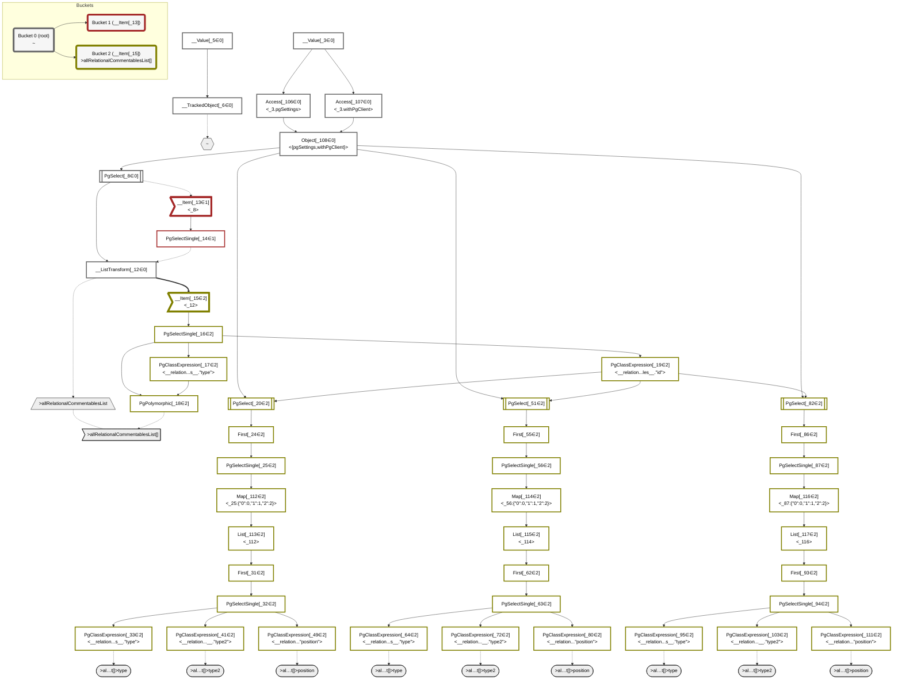

```mermaid
graph TD
    classDef path fill:#eee,stroke:#000,color:#000
    classDef plan fill:#fff,stroke-width:3px,color:#000
    classDef itemplan fill:#fff,stroke-width:6px,color:#000
    classDef sideeffectplan fill:#f00,stroke-width:6px,color:#000
    classDef bucket fill:#f6f6f6,color:#000,stroke-width:6px

    %% subgraph fields
    P1{{"~"}}:::path
    P2[/">allRelationalCommentablesList"\]:::path
    P3>">allRelationalCommentablesList[]"]:::path
    P2 -.- P3
    P4([">al…t[]>type"]):::path
    %% P3 -.-> P4
    P5([">al…t[]>type2"]):::path
    %% P3 -.-> P5
    P6([">al…t[]>position"]):::path
    %% P3 -.-> P6
    P7([">al…t[]>type"]):::path
    %% P3 -.-> P7
    P8([">al…t[]>type2"]):::path
    %% P3 -.-> P8
    P9([">al…t[]>position"]):::path
    %% P3 -.-> P9
    P10([">al…t[]>type"]):::path
    %% P3 -.-> P10
    P11([">al…t[]>type2"]):::path
    %% P3 -.-> P11
    P12([">al…t[]>position"]):::path
    %% P3 -.-> P12
    %% P1 -.-> P2
    %% end

    %% define plans
    __Value_3["__Value[_3∈0]<br /><context>"]:::plan
    __Value_5["__Value[_5∈0]<br /><rootValue>"]:::plan
    __TrackedObject_6["__TrackedObject[_6∈0]"]:::plan
    PgSelect_8[["PgSelect[_8∈0]<br /><relational_commentables>"]]:::plan
    __ListTransform_12["__ListTransform[_12∈0]<br /><each:_8>"]:::plan
    __Item_13>"__Item[_13∈1]<br /><_8>"]:::itemplan
    PgSelectSingle_14["PgSelectSingle[_14∈1]<br /><relational_commentables>"]:::plan
    __Item_15>"__Item[_15∈2]<br /><_12>"]:::itemplan
    PgSelectSingle_16["PgSelectSingle[_16∈2]<br /><relational_commentables>"]:::plan
    PgClassExpression_17["PgClassExpression[_17∈2]<br /><__relation...s__.#quot;type#quot;>"]:::plan
    PgPolymorphic_18["PgPolymorphic[_18∈2]"]:::plan
    PgClassExpression_19["PgClassExpression[_19∈2]<br /><__relation...les__.#quot;id#quot;>"]:::plan
    PgSelect_20[["PgSelect[_20∈2]<br /><relational_posts>"]]:::plan
    First_24["First[_24∈2]"]:::plan
    PgSelectSingle_25["PgSelectSingle[_25∈2]<br /><relational_posts>"]:::plan
    First_31["First[_31∈2]"]:::plan
    PgSelectSingle_32["PgSelectSingle[_32∈2]<br /><relational_items>"]:::plan
    PgClassExpression_33["PgClassExpression[_33∈2]<br /><__relation...s__.#quot;type#quot;>"]:::plan
    PgClassExpression_41["PgClassExpression[_41∈2]<br /><__relation...__.#quot;type2#quot;>"]:::plan
    PgClassExpression_49["PgClassExpression[_49∈2]<br /><__relation...#quot;position#quot;>"]:::plan
    PgSelect_51[["PgSelect[_51∈2]<br /><relational_checklists>"]]:::plan
    First_55["First[_55∈2]"]:::plan
    PgSelectSingle_56["PgSelectSingle[_56∈2]<br /><relational_checklists>"]:::plan
    First_62["First[_62∈2]"]:::plan
    PgSelectSingle_63["PgSelectSingle[_63∈2]<br /><relational_items>"]:::plan
    PgClassExpression_64["PgClassExpression[_64∈2]<br /><__relation...s__.#quot;type#quot;>"]:::plan
    PgClassExpression_72["PgClassExpression[_72∈2]<br /><__relation...__.#quot;type2#quot;>"]:::plan
    PgClassExpression_80["PgClassExpression[_80∈2]<br /><__relation...#quot;position#quot;>"]:::plan
    PgSelect_82[["PgSelect[_82∈2]<br /><relational_checklist_items>"]]:::plan
    First_86["First[_86∈2]"]:::plan
    PgSelectSingle_87["PgSelectSingle[_87∈2]<br /><relational_checklist_items>"]:::plan
    First_93["First[_93∈2]"]:::plan
    PgSelectSingle_94["PgSelectSingle[_94∈2]<br /><relational_items>"]:::plan
    PgClassExpression_95["PgClassExpression[_95∈2]<br /><__relation...s__.#quot;type#quot;>"]:::plan
    PgClassExpression_103["PgClassExpression[_103∈2]<br /><__relation...__.#quot;type2#quot;>"]:::plan
    Access_106["Access[_106∈0]<br /><_3.pgSettings>"]:::plan
    Access_107["Access[_107∈0]<br /><_3.withPgClient>"]:::plan
    Object_108["Object[_108∈0]<br /><{pgSettings,withPgClient}>"]:::plan
    PgClassExpression_111["PgClassExpression[_111∈2]<br /><__relation...#quot;position#quot;>"]:::plan
    Map_112["Map[_112∈2]<br /><_25:{#quot;0#quot;:0,#quot;1#quot;:1,#quot;2#quot;:2}>"]:::plan
    List_113["List[_113∈2]<br /><_112>"]:::plan
    Map_114["Map[_114∈2]<br /><_56:{#quot;0#quot;:0,#quot;1#quot;:1,#quot;2#quot;:2}>"]:::plan
    List_115["List[_115∈2]<br /><_114>"]:::plan
    Map_116["Map[_116∈2]<br /><_87:{#quot;0#quot;:0,#quot;1#quot;:1,#quot;2#quot;:2}>"]:::plan
    List_117["List[_117∈2]<br /><_116>"]:::plan

    %% plan dependencies
    __Value_5 --> __TrackedObject_6
    Object_108 --> PgSelect_8
    PgSelect_8 --> __ListTransform_12
    PgSelectSingle_14 -.-> __ListTransform_12
    PgSelect_8 -.-> __Item_13
    __Item_13 --> PgSelectSingle_14
    __ListTransform_12 ==> __Item_15
    __Item_15 --> PgSelectSingle_16
    PgSelectSingle_16 --> PgClassExpression_17
    PgSelectSingle_16 --> PgPolymorphic_18
    PgClassExpression_17 --> PgPolymorphic_18
    PgSelectSingle_16 --> PgClassExpression_19
    Object_108 --> PgSelect_20
    PgClassExpression_19 --> PgSelect_20
    PgSelect_20 --> First_24
    First_24 --> PgSelectSingle_25
    List_113 --> First_31
    First_31 --> PgSelectSingle_32
    PgSelectSingle_32 --> PgClassExpression_33
    PgSelectSingle_32 --> PgClassExpression_41
    PgSelectSingle_32 --> PgClassExpression_49
    Object_108 --> PgSelect_51
    PgClassExpression_19 --> PgSelect_51
    PgSelect_51 --> First_55
    First_55 --> PgSelectSingle_56
    List_115 --> First_62
    First_62 --> PgSelectSingle_63
    PgSelectSingle_63 --> PgClassExpression_64
    PgSelectSingle_63 --> PgClassExpression_72
    PgSelectSingle_63 --> PgClassExpression_80
    Object_108 --> PgSelect_82
    PgClassExpression_19 --> PgSelect_82
    PgSelect_82 --> First_86
    First_86 --> PgSelectSingle_87
    List_117 --> First_93
    First_93 --> PgSelectSingle_94
    PgSelectSingle_94 --> PgClassExpression_95
    PgSelectSingle_94 --> PgClassExpression_103
    __Value_3 --> Access_106
    __Value_3 --> Access_107
    Access_106 --> Object_108
    Access_107 --> Object_108
    PgSelectSingle_94 --> PgClassExpression_111
    PgSelectSingle_25 --> Map_112
    Map_112 --> List_113
    PgSelectSingle_56 --> Map_114
    Map_114 --> List_115
    PgSelectSingle_87 --> Map_116
    Map_116 --> List_117

    %% plan-to-path relationships
    __TrackedObject_6 -.-> P1
    __ListTransform_12 -.-> P2
    PgPolymorphic_18 -.-> P3
    PgClassExpression_33 -.-> P4
    PgClassExpression_41 -.-> P5
    PgClassExpression_49 -.-> P6
    PgClassExpression_64 -.-> P7
    PgClassExpression_72 -.-> P8
    PgClassExpression_80 -.-> P9
    PgClassExpression_95 -.-> P10
    PgClassExpression_103 -.-> P11
    PgClassExpression_111 -.-> P12

    %% allocate buckets
    classDef bucket0 stroke:#696969
    class __Value_3,__Value_5,__TrackedObject_6,PgSelect_8,__ListTransform_12,Access_106,Access_107,Object_108 bucket0
    classDef bucket1 stroke:#a52a2a
    class __Item_13,PgSelectSingle_14 bucket1
    classDef bucket2 stroke:#808000
    class __Item_15,PgSelectSingle_16,PgClassExpression_17,PgPolymorphic_18,PgClassExpression_19,PgSelect_20,First_24,PgSelectSingle_25,First_31,PgSelectSingle_32,PgClassExpression_33,PgClassExpression_41,PgClassExpression_49,PgSelect_51,First_55,PgSelectSingle_56,First_62,PgSelectSingle_63,PgClassExpression_64,PgClassExpression_72,PgClassExpression_80,PgSelect_82,First_86,PgSelectSingle_87,First_93,PgSelectSingle_94,PgClassExpression_95,PgClassExpression_103,PgClassExpression_111,Map_112,List_113,Map_114,List_115,Map_116,List_117 bucket2

    subgraph Buckets
    Bucket0("Bucket 0 (root)<br />~"):::bucket
    style Bucket0 stroke:#696969
    Bucket1("Bucket 1 (__Item[_13])"):::bucket
    style Bucket1 stroke:#a52a2a
    Bucket0 --> Bucket1
    Bucket2("Bucket 2 (__Item[_15])<br />>allRelationalCommentablesList[]"):::bucket
    style Bucket2 stroke:#808000
    Bucket0 --> Bucket2
    end
```
