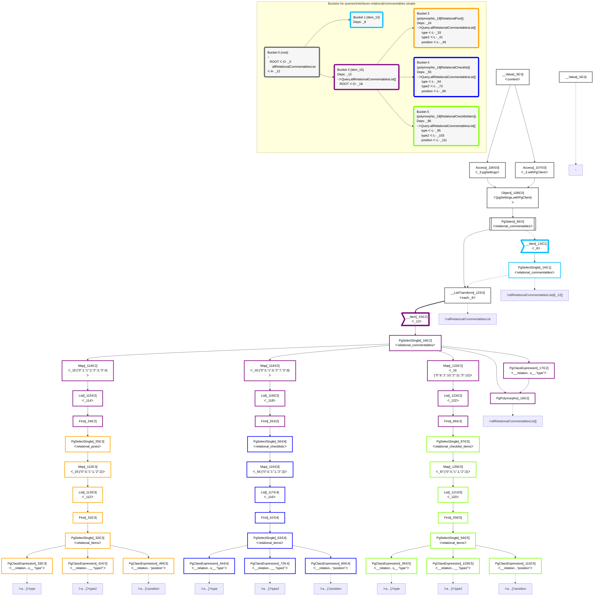

```mermaid
graph TD
    classDef path fill:#eee,stroke:#000,color:#000
    classDef plan fill:#fff,stroke-width:3px,color:#000
    classDef itemplan fill:#fff,stroke-width:6px,color:#000
    classDef sideeffectplan fill:#f00,stroke-width:6px,color:#000
    classDef bucket fill:#f6f6f6,color:#000,stroke-width:6px,text-align:left


    %% define plans
    __Value_0["__Value[_0∈0]"]:::plan
    __Value_3["__Value[_3∈0]<br />ᐸcontextᐳ"]:::plan
    PgSelect_8[["PgSelect[_8∈0]<br />ᐸrelational_commentablesᐳ"]]:::plan
    __ListTransform_12["__ListTransform[_12∈0]<br />ᐸeach:_8ᐳ"]:::plan
    __Item_13>"__Item[_13∈1]<br />ᐸ_8ᐳ"]:::itemplan
    PgSelectSingle_14["PgSelectSingle[_14∈1]<br />ᐸrelational_commentablesᐳ"]:::plan
    __Item_15>"__Item[_15∈2]<br />ᐸ_12ᐳ"]:::itemplan
    PgSelectSingle_16["PgSelectSingle[_16∈2]<br />ᐸrelational_commentablesᐳ"]:::plan
    PgClassExpression_17["PgClassExpression[_17∈2]<br />ᐸ__relation...s__.”type”ᐳ"]:::plan
    PgPolymorphic_18["PgPolymorphic[_18∈2]"]:::plan
    First_24["First[_24∈2]"]:::plan
    PgSelectSingle_25["PgSelectSingle[_25∈3]<br />ᐸrelational_postsᐳ"]:::plan
    First_31["First[_31∈3]"]:::plan
    PgSelectSingle_32["PgSelectSingle[_32∈3]<br />ᐸrelational_itemsᐳ"]:::plan
    PgClassExpression_33["PgClassExpression[_33∈3]<br />ᐸ__relation...s__.”type”ᐳ"]:::plan
    PgClassExpression_41["PgClassExpression[_41∈3]<br />ᐸ__relation...__.”type2”ᐳ"]:::plan
    PgClassExpression_49["PgClassExpression[_49∈3]<br />ᐸ__relation...”position”ᐳ"]:::plan
    First_55["First[_55∈2]"]:::plan
    PgSelectSingle_56["PgSelectSingle[_56∈4]<br />ᐸrelational_checklistsᐳ"]:::plan
    First_62["First[_62∈4]"]:::plan
    PgSelectSingle_63["PgSelectSingle[_63∈4]<br />ᐸrelational_itemsᐳ"]:::plan
    PgClassExpression_64["PgClassExpression[_64∈4]<br />ᐸ__relation...s__.”type”ᐳ"]:::plan
    PgClassExpression_72["PgClassExpression[_72∈4]<br />ᐸ__relation...__.”type2”ᐳ"]:::plan
    PgClassExpression_80["PgClassExpression[_80∈4]<br />ᐸ__relation...”position”ᐳ"]:::plan
    First_86["First[_86∈2]"]:::plan
    PgSelectSingle_87["PgSelectSingle[_87∈5]<br />ᐸrelational_checklist_itemsᐳ"]:::plan
    First_93["First[_93∈5]"]:::plan
    PgSelectSingle_94["PgSelectSingle[_94∈5]<br />ᐸrelational_itemsᐳ"]:::plan
    PgClassExpression_95["PgClassExpression[_95∈5]<br />ᐸ__relation...s__.”type”ᐳ"]:::plan
    PgClassExpression_103["PgClassExpression[_103∈5]<br />ᐸ__relation...__.”type2”ᐳ"]:::plan
    Access_106["Access[_106∈0]<br />ᐸ_3.pgSettingsᐳ"]:::plan
    Access_107["Access[_107∈0]<br />ᐸ_3.withPgClientᐳ"]:::plan
    Object_108["Object[_108∈0]<br />ᐸ{pgSettings,withPgClient}ᐳ"]:::plan
    PgClassExpression_111["PgClassExpression[_111∈5]<br />ᐸ__relation...”position”ᐳ"]:::plan
    Map_112["Map[_112∈3]<br />ᐸ_25:{”0”:0,”1”:1,”2”:2}ᐳ"]:::plan
    List_113["List[_113∈3]<br />ᐸ_112ᐳ"]:::plan
    Map_114["Map[_114∈2]<br />ᐸ_16:{”0”:1,”1”:2,”2”:3,”3”:4}ᐳ"]:::plan
    List_115["List[_115∈2]<br />ᐸ_114ᐳ"]:::plan
    Map_116["Map[_116∈4]<br />ᐸ_56:{”0”:0,”1”:1,”2”:2}ᐳ"]:::plan
    List_117["List[_117∈4]<br />ᐸ_116ᐳ"]:::plan
    Map_118["Map[_118∈2]<br />ᐸ_16:{”0”:5,”1”:6,”2”:7,”3”:8}ᐳ"]:::plan
    List_119["List[_119∈2]<br />ᐸ_118ᐳ"]:::plan
    Map_120["Map[_120∈5]<br />ᐸ_87:{”0”:0,”1”:1,”2”:2}ᐳ"]:::plan
    List_121["List[_121∈5]<br />ᐸ_120ᐳ"]:::plan
    Map_122["Map[_122∈2]<br />ᐸ_16:{”0”:9,”1”:10,”2”:11,”3”:12}ᐳ"]:::plan
    List_123["List[_123∈2]<br />ᐸ_122ᐳ"]:::plan

    %% plan dependencies
    Object_108 --> PgSelect_8
    PgSelect_8 --> __ListTransform_12
    PgSelectSingle_14 -.-> __ListTransform_12
    PgSelect_8 -.-> __Item_13
    __Item_13 --> PgSelectSingle_14
    __ListTransform_12 ==> __Item_15
    __Item_15 --> PgSelectSingle_16
    PgSelectSingle_16 --> PgClassExpression_17
    PgSelectSingle_16 --> PgPolymorphic_18
    PgClassExpression_17 --> PgPolymorphic_18
    List_115 --> First_24
    First_24 --> PgSelectSingle_25
    List_113 --> First_31
    First_31 --> PgSelectSingle_32
    PgSelectSingle_32 --> PgClassExpression_33
    PgSelectSingle_32 --> PgClassExpression_41
    PgSelectSingle_32 --> PgClassExpression_49
    List_119 --> First_55
    First_55 --> PgSelectSingle_56
    List_117 --> First_62
    First_62 --> PgSelectSingle_63
    PgSelectSingle_63 --> PgClassExpression_64
    PgSelectSingle_63 --> PgClassExpression_72
    PgSelectSingle_63 --> PgClassExpression_80
    List_123 --> First_86
    First_86 --> PgSelectSingle_87
    List_121 --> First_93
    First_93 --> PgSelectSingle_94
    PgSelectSingle_94 --> PgClassExpression_95
    PgSelectSingle_94 --> PgClassExpression_103
    __Value_3 --> Access_106
    __Value_3 --> Access_107
    Access_106 --> Object_108
    Access_107 --> Object_108
    PgSelectSingle_94 --> PgClassExpression_111
    PgSelectSingle_25 --> Map_112
    Map_112 --> List_113
    PgSelectSingle_16 --> Map_114
    Map_114 --> List_115
    PgSelectSingle_56 --> Map_116
    Map_116 --> List_117
    PgSelectSingle_16 --> Map_118
    Map_118 --> List_119
    PgSelectSingle_87 --> Map_120
    Map_120 --> List_121
    PgSelectSingle_16 --> Map_122
    Map_122 --> List_123

    %% plan-to-path relationships
    P_0["~"]
    __Value_0 -.-> P_0
    P_12["ᐳallRelationalCommentablesList"]
    __ListTransform_12 -.-> P_12
    P_14["ᐳallRelationalCommentablesList@_12[]"]
    PgSelectSingle_14 -.-> P_14
    P_18["ᐳallRelationalCommentablesList[]"]
    PgPolymorphic_18 -.-> P_18
    P_33["ᐳa…]ᐳtype"]
    PgClassExpression_33 -.-> P_33
    P_41["ᐳa…]ᐳtype2"]
    PgClassExpression_41 -.-> P_41
    P_49["ᐳa…]ᐳposition"]
    PgClassExpression_49 -.-> P_49
    P_64["ᐳa…]ᐳtype"]
    PgClassExpression_64 -.-> P_64
    P_72["ᐳa…]ᐳtype2"]
    PgClassExpression_72 -.-> P_72
    P_80["ᐳa…]ᐳposition"]
    PgClassExpression_80 -.-> P_80
    P_95["ᐳa…]ᐳtype"]
    PgClassExpression_95 -.-> P_95
    P_103["ᐳa…]ᐳtype2"]
    PgClassExpression_103 -.-> P_103
    P_111["ᐳa…]ᐳposition"]
    PgClassExpression_111 -.-> P_111

    %% allocate buckets
    classDef bucket0 stroke:#696969
    class __Value_0,__Value_3,PgSelect_8,__ListTransform_12,Access_106,Access_107,Object_108 bucket0
    classDef bucket1 stroke:#00bfff
    class __Item_13,PgSelectSingle_14 bucket1
    classDef bucket2 stroke:#7f007f
    class __Item_15,PgSelectSingle_16,PgClassExpression_17,PgPolymorphic_18,First_24,First_55,First_86,Map_114,List_115,Map_118,List_119,Map_122,List_123 bucket2
    classDef bucket3 stroke:#ffa500
    class PgSelectSingle_25,First_31,PgSelectSingle_32,PgClassExpression_33,PgClassExpression_41,PgClassExpression_49,Map_112,List_113 bucket3
    classDef bucket4 stroke:#0000ff
    class PgSelectSingle_56,First_62,PgSelectSingle_63,PgClassExpression_64,PgClassExpression_72,PgClassExpression_80,Map_116,List_117 bucket4
    classDef bucket5 stroke:#7fff00
    class PgSelectSingle_87,First_93,PgSelectSingle_94,PgClassExpression_95,PgClassExpression_103,PgClassExpression_111,Map_120,List_121 bucket5

    subgraph "Buckets for queries/interfaces-relational/commentables-simple"
    Bucket0("Bucket 0 (root)<br />~<br />⠀ROOT ᐸ-O- _0<br />⠀⠀allRelationalCommentablesList ᐸ-A- _12"):::bucket
    style Bucket0 stroke:#696969
    Bucket1("Bucket 1 (item_13)<br />Deps: _8"):::bucket
    style Bucket1 stroke:#00bfff
    Bucket0 --> Bucket1
    Bucket2("Bucket 2 (item_15)<br />Deps: _12<br />~ᐳQuery.allRelationalCommentablesList[]<br />⠀ROOT ᐸ-O- _18"):::bucket
    style Bucket2 stroke:#7f007f
    Bucket0 --> Bucket2
    Bucket3("Bucket 3 (polymorphic_18[RelationalPost])<br />Deps: _24<br />~ᐳQuery.allRelationalCommentablesList[]<br />⠀⠀type ᐸ-L- _33<br />⠀⠀type2 ᐸ-L- _41<br />⠀⠀position ᐸ-L- _49"):::bucket
    style Bucket3 stroke:#ffa500
    Bucket2 --> Bucket3
    Bucket4("Bucket 4 (polymorphic_18[RelationalChecklist])<br />Deps: _55<br />~ᐳQuery.allRelationalCommentablesList[]<br />⠀⠀type ᐸ-L- _64<br />⠀⠀type2 ᐸ-L- _72<br />⠀⠀position ᐸ-L- _80"):::bucket
    style Bucket4 stroke:#0000ff
    Bucket2 --> Bucket4
    Bucket5("Bucket 5 (polymorphic_18[RelationalChecklistItem])<br />Deps: _86<br />~ᐳQuery.allRelationalCommentablesList[]<br />⠀⠀type ᐸ-L- _95<br />⠀⠀type2 ᐸ-L- _103<br />⠀⠀position ᐸ-L- _111"):::bucket
    style Bucket5 stroke:#7fff00
    Bucket2 --> Bucket5
    end
```
