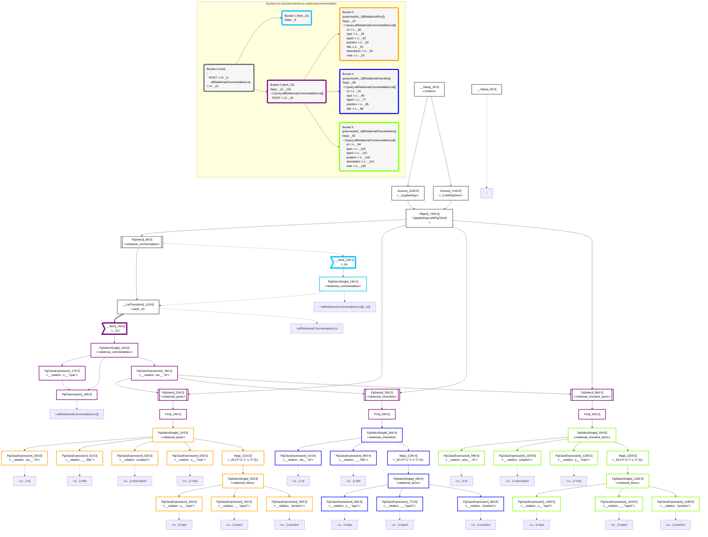

```mermaid
graph TD
    classDef path fill:#eee,stroke:#000,color:#000
    classDef plan fill:#fff,stroke-width:3px,color:#000
    classDef itemplan fill:#fff,stroke-width:6px,color:#000
    classDef sideeffectplan fill:#f00,stroke-width:6px,color:#000
    classDef bucket fill:#f6f6f6,color:#000,stroke-width:6px,text-align:left


    %% define plans
    __Value_0["__Value[_0∈0]"]:::plan
    __Value_3["__Value[_3∈0]<br />ᐸcontextᐳ"]:::plan
    PgSelect_8[["PgSelect[_8∈0]<br />ᐸrelational_commentablesᐳ"]]:::plan
    __ListTransform_12["__ListTransform[_12∈0]<br />ᐸeach:_8ᐳ"]:::plan
    __Item_13>"__Item[_13∈1]<br />ᐸ_8ᐳ"]:::itemplan
    PgSelectSingle_14["PgSelectSingle[_14∈1]<br />ᐸrelational_commentablesᐳ"]:::plan
    __Item_15>"__Item[_15∈2]<br />ᐸ_12ᐳ"]:::itemplan
    PgSelectSingle_16["PgSelectSingle[_16∈2]<br />ᐸrelational_commentablesᐳ"]:::plan
    PgClassExpression_17["PgClassExpression[_17∈2]<br />ᐸ__relation...s__.”type”ᐳ"]:::plan
    PgPolymorphic_18["PgPolymorphic[_18∈2]"]:::plan
    PgClassExpression_19["PgClassExpression[_19∈2]<br />ᐸ__relation...les__.”id”ᐳ"]:::plan
    PgSelect_20[["PgSelect[_20∈2]<br />ᐸrelational_postsᐳ"]]:::plan
    First_24["First[_24∈2]"]:::plan
    PgSelectSingle_25["PgSelectSingle[_25∈3]<br />ᐸrelational_postsᐳ"]:::plan
    PgClassExpression_26["PgClassExpression[_26∈3]<br />ᐸ__relation...sts__.”id”ᐳ"]:::plan
    PgSelectSingle_33["PgSelectSingle[_33∈3]<br />ᐸrelational_itemsᐳ"]:::plan
    PgClassExpression_34["PgClassExpression[_34∈3]<br />ᐸ__relation...s__.”type”ᐳ"]:::plan
    PgClassExpression_42["PgClassExpression[_42∈3]<br />ᐸ__relation...__.”type2”ᐳ"]:::plan
    PgClassExpression_50["PgClassExpression[_50∈3]<br />ᐸ__relation...”position”ᐳ"]:::plan
    PgClassExpression_51["PgClassExpression[_51∈3]<br />ᐸ__relation...__.”title”ᐳ"]:::plan
    PgClassExpression_52["PgClassExpression[_52∈3]<br />ᐸ__relation...scription”ᐳ"]:::plan
    PgClassExpression_53["PgClassExpression[_53∈3]<br />ᐸ__relation...s__.”note”ᐳ"]:::plan
    PgSelect_55[["PgSelect[_55∈2]<br />ᐸrelational_checklistsᐳ"]]:::plan
    First_59["First[_59∈2]"]:::plan
    PgSelectSingle_60["PgSelectSingle[_60∈4]<br />ᐸrelational_checklistsᐳ"]:::plan
    PgClassExpression_61["PgClassExpression[_61∈4]<br />ᐸ__relation...sts__.”id”ᐳ"]:::plan
    PgSelectSingle_68["PgSelectSingle[_68∈4]<br />ᐸrelational_itemsᐳ"]:::plan
    PgClassExpression_69["PgClassExpression[_69∈4]<br />ᐸ__relation...s__.”type”ᐳ"]:::plan
    PgClassExpression_77["PgClassExpression[_77∈4]<br />ᐸ__relation...__.”type2”ᐳ"]:::plan
    PgClassExpression_85["PgClassExpression[_85∈4]<br />ᐸ__relation...”position”ᐳ"]:::plan
    PgClassExpression_86["PgClassExpression[_86∈4]<br />ᐸ__relation...__.”title”ᐳ"]:::plan
    PgSelect_88[["PgSelect[_88∈2]<br />ᐸrelational_checklist_itemsᐳ"]]:::plan
    First_92["First[_92∈2]"]:::plan
    PgSelectSingle_93["PgSelectSingle[_93∈5]<br />ᐸrelational_checklist_itemsᐳ"]:::plan
    PgClassExpression_94["PgClassExpression[_94∈5]<br />ᐸ__relation...ems__.”id”ᐳ"]:::plan
    PgSelectSingle_101["PgSelectSingle[_101∈5]<br />ᐸrelational_itemsᐳ"]:::plan
    PgClassExpression_102["PgClassExpression[_102∈5]<br />ᐸ__relation...s__.”type”ᐳ"]:::plan
    PgClassExpression_110["PgClassExpression[_110∈5]<br />ᐸ__relation...__.”type2”ᐳ"]:::plan
    Access_113["Access[_113∈0]<br />ᐸ_3.pgSettingsᐳ"]:::plan
    Access_114["Access[_114∈0]<br />ᐸ_3.withPgClientᐳ"]:::plan
    Object_115["Object[_115∈0]<br />ᐸ{pgSettings,withPgClient}ᐳ"]:::plan
    PgClassExpression_118["PgClassExpression[_118∈5]<br />ᐸ__relation...”position”ᐳ"]:::plan
    PgClassExpression_119["PgClassExpression[_119∈5]<br />ᐸ__relation...scription”ᐳ"]:::plan
    PgClassExpression_120["PgClassExpression[_120∈5]<br />ᐸ__relation...s__.”note”ᐳ"]:::plan
    Map_121["Map[_121∈3]<br />ᐸ_25:{”0”:0,”1”:1,”2”:2}ᐳ"]:::plan
    Map_123["Map[_123∈4]<br />ᐸ_60:{”0”:0,”1”:1,”2”:2}ᐳ"]:::plan
    Map_125["Map[_125∈5]<br />ᐸ_93:{”0”:0,”1”:1,”2”:2}ᐳ"]:::plan

    %% plan dependencies
    Object_115 --> PgSelect_8
    PgSelect_8 --> __ListTransform_12
    PgSelectSingle_14 -.-> __ListTransform_12
    PgSelect_8 -.-> __Item_13
    __Item_13 --> PgSelectSingle_14
    __ListTransform_12 ==> __Item_15
    __Item_15 --> PgSelectSingle_16
    PgSelectSingle_16 --> PgClassExpression_17
    PgSelectSingle_16 --> PgPolymorphic_18
    PgClassExpression_17 --> PgPolymorphic_18
    PgSelectSingle_16 --> PgClassExpression_19
    Object_115 --> PgSelect_20
    PgClassExpression_19 --> PgSelect_20
    PgSelect_20 --> First_24
    First_24 --> PgSelectSingle_25
    PgSelectSingle_25 --> PgClassExpression_26
    Map_121 --> PgSelectSingle_33
    PgSelectSingle_33 --> PgClassExpression_34
    PgSelectSingle_33 --> PgClassExpression_42
    PgSelectSingle_33 --> PgClassExpression_50
    PgSelectSingle_25 --> PgClassExpression_51
    PgSelectSingle_25 --> PgClassExpression_52
    PgSelectSingle_25 --> PgClassExpression_53
    Object_115 --> PgSelect_55
    PgClassExpression_19 --> PgSelect_55
    PgSelect_55 --> First_59
    First_59 --> PgSelectSingle_60
    PgSelectSingle_60 --> PgClassExpression_61
    Map_123 --> PgSelectSingle_68
    PgSelectSingle_68 --> PgClassExpression_69
    PgSelectSingle_68 --> PgClassExpression_77
    PgSelectSingle_68 --> PgClassExpression_85
    PgSelectSingle_60 --> PgClassExpression_86
    Object_115 --> PgSelect_88
    PgClassExpression_19 --> PgSelect_88
    PgSelect_88 --> First_92
    First_92 --> PgSelectSingle_93
    PgSelectSingle_93 --> PgClassExpression_94
    Map_125 --> PgSelectSingle_101
    PgSelectSingle_101 --> PgClassExpression_102
    PgSelectSingle_101 --> PgClassExpression_110
    __Value_3 --> Access_113
    __Value_3 --> Access_114
    Access_113 --> Object_115
    Access_114 --> Object_115
    PgSelectSingle_101 --> PgClassExpression_118
    PgSelectSingle_93 --> PgClassExpression_119
    PgSelectSingle_93 --> PgClassExpression_120
    PgSelectSingle_25 --> Map_121
    PgSelectSingle_60 --> Map_123
    PgSelectSingle_93 --> Map_125

    %% plan-to-path relationships
    P_0["~"]
    __Value_0 -.-> P_0
    P_12["ᐳallRelationalCommentablesList"]
    __ListTransform_12 -.-> P_12
    P_14["ᐳallRelationalCommentablesList@_12[]"]
    PgSelectSingle_14 -.-> P_14
    P_18["ᐳallRelationalCommentablesList[]"]
    PgPolymorphic_18 -.-> P_18
    P_26["ᐳa…]ᐳid"]
    PgClassExpression_26 -.-> P_26
    P_34["ᐳa…]ᐳtype"]
    PgClassExpression_34 -.-> P_34
    P_42["ᐳa…]ᐳtype2"]
    PgClassExpression_42 -.-> P_42
    P_50["ᐳa…]ᐳposition"]
    PgClassExpression_50 -.-> P_50
    P_51["ᐳa…]ᐳtitle"]
    PgClassExpression_51 -.-> P_51
    P_52["ᐳa…]ᐳdescription"]
    PgClassExpression_52 -.-> P_52
    P_53["ᐳa…]ᐳnote"]
    PgClassExpression_53 -.-> P_53
    P_61["ᐳa…]ᐳid"]
    PgClassExpression_61 -.-> P_61
    P_69["ᐳa…]ᐳtype"]
    PgClassExpression_69 -.-> P_69
    P_77["ᐳa…]ᐳtype2"]
    PgClassExpression_77 -.-> P_77
    P_85["ᐳa…]ᐳposition"]
    PgClassExpression_85 -.-> P_85
    P_86["ᐳa…]ᐳtitle"]
    PgClassExpression_86 -.-> P_86
    P_94["ᐳa…]ᐳid"]
    PgClassExpression_94 -.-> P_94
    P_102["ᐳa…]ᐳtype"]
    PgClassExpression_102 -.-> P_102
    P_110["ᐳa…]ᐳtype2"]
    PgClassExpression_110 -.-> P_110
    P_118["ᐳa…]ᐳposition"]
    PgClassExpression_118 -.-> P_118
    P_119["ᐳa…]ᐳdescription"]
    PgClassExpression_119 -.-> P_119
    P_120["ᐳa…]ᐳnote"]
    PgClassExpression_120 -.-> P_120

    %% allocate buckets
    classDef bucket0 stroke:#696969
    class __Value_0,__Value_3,PgSelect_8,__ListTransform_12,Access_113,Access_114,Object_115 bucket0
    classDef bucket1 stroke:#00bfff
    class __Item_13,PgSelectSingle_14 bucket1
    classDef bucket2 stroke:#7f007f
    class __Item_15,PgSelectSingle_16,PgClassExpression_17,PgPolymorphic_18,PgClassExpression_19,PgSelect_20,First_24,PgSelect_55,First_59,PgSelect_88,First_92 bucket2
    classDef bucket3 stroke:#ffa500
    class PgSelectSingle_25,PgClassExpression_26,PgSelectSingle_33,PgClassExpression_34,PgClassExpression_42,PgClassExpression_50,PgClassExpression_51,PgClassExpression_52,PgClassExpression_53,Map_121 bucket3
    classDef bucket4 stroke:#0000ff
    class PgSelectSingle_60,PgClassExpression_61,PgSelectSingle_68,PgClassExpression_69,PgClassExpression_77,PgClassExpression_85,PgClassExpression_86,Map_123 bucket4
    classDef bucket5 stroke:#7fff00
    class PgSelectSingle_93,PgClassExpression_94,PgSelectSingle_101,PgClassExpression_102,PgClassExpression_110,PgClassExpression_118,PgClassExpression_119,PgClassExpression_120,Map_125 bucket5

    subgraph "Buckets for queries/interfaces-relational/commentables"
    Bucket0("Bucket 0 (root)<br />~<br />⠀ROOT ᐸ-O- _0<br />⠀⠀allRelationalCommentablesList ᐸ-A- _12"):::bucket
    style Bucket0 stroke:#696969
    Bucket1("Bucket 1 (item_13)<br />Deps: _8"):::bucket
    style Bucket1 stroke:#00bfff
    Bucket0 --> Bucket1
    Bucket2("Bucket 2 (item_15)<br />Deps: _12, _115<br />~ᐳQuery.allRelationalCommentablesList[]<br />⠀ROOT ᐸ-O- _18"):::bucket
    style Bucket2 stroke:#7f007f
    Bucket0 --> Bucket2
    Bucket3("Bucket 3 (polymorphic_18[RelationalPost])<br />Deps: _24<br />~ᐳQuery.allRelationalCommentablesList[]<br />⠀⠀id ᐸ-L- _26<br />⠀⠀type ᐸ-L- _34<br />⠀⠀type2 ᐸ-L- _42<br />⠀⠀position ᐸ-L- _50<br />⠀⠀title ᐸ-L- _51<br />⠀⠀description ᐸ-L- _52<br />⠀⠀note ᐸ-L- _53"):::bucket
    style Bucket3 stroke:#ffa500
    Bucket2 --> Bucket3
    Bucket4("Bucket 4 (polymorphic_18[RelationalChecklist])<br />Deps: _59<br />~ᐳQuery.allRelationalCommentablesList[]<br />⠀⠀id ᐸ-L- _61<br />⠀⠀type ᐸ-L- _69<br />⠀⠀type2 ᐸ-L- _77<br />⠀⠀position ᐸ-L- _85<br />⠀⠀title ᐸ-L- _86"):::bucket
    style Bucket4 stroke:#0000ff
    Bucket2 --> Bucket4
    Bucket5("Bucket 5 (polymorphic_18[RelationalChecklistItem])<br />Deps: _92<br />~ᐳQuery.allRelationalCommentablesList[]<br />⠀⠀id ᐸ-L- _94<br />⠀⠀type ᐸ-L- _102<br />⠀⠀type2 ᐸ-L- _110<br />⠀⠀position ᐸ-L- _118<br />⠀⠀description ᐸ-L- _119<br />⠀⠀note ᐸ-L- _120"):::bucket
    style Bucket5 stroke:#7fff00
    Bucket2 --> Bucket5
    end
```
