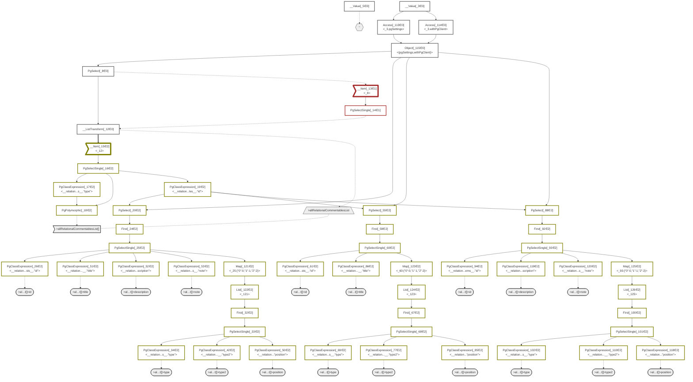

```mermaid
graph TD
    classDef path fill:#eee,stroke:#000
    classDef plan fill:#fff,stroke-width:3px
    classDef itemplan fill:#fff,stroke-width:6px
    classDef sideeffectplan fill:#f00,stroke-width:6px

    %% subgraph fields
    P1{{"~"}}:::path
    P2[/">allRelationalCommentablesList"\]:::path
    P3>">allRelationalCommentablesList[]"]:::path
    P2 -.- P3
    P4([">al…t[]>id"]):::path
    %% P3 -.-> P4
    P5([">al…t[]>type"]):::path
    %% P3 -.-> P5
    P6([">al…t[]>type2"]):::path
    %% P3 -.-> P6
    P7([">al…t[]>position"]):::path
    %% P3 -.-> P7
    P8([">al…t[]>title"]):::path
    %% P3 -.-> P8
    P9([">al…t[]>description"]):::path
    %% P3 -.-> P9
    P10([">al…t[]>note"]):::path
    %% P3 -.-> P10
    P11([">al…t[]>id"]):::path
    %% P3 -.-> P11
    P12([">al…t[]>type"]):::path
    %% P3 -.-> P12
    P13([">al…t[]>type2"]):::path
    %% P3 -.-> P13
    P14([">al…t[]>position"]):::path
    %% P3 -.-> P14
    P15([">al…t[]>title"]):::path
    %% P3 -.-> P15
    P16([">al…t[]>id"]):::path
    %% P3 -.-> P16
    P17([">al…t[]>type"]):::path
    %% P3 -.-> P17
    P18([">al…t[]>type2"]):::path
    %% P3 -.-> P18
    P19([">al…t[]>position"]):::path
    %% P3 -.-> P19
    P20([">al…t[]>description"]):::path
    %% P3 -.-> P20
    P21([">al…t[]>note"]):::path
    %% P3 -.-> P21
    %% P1 -.-> P2
    %% end

    %% define plans
    __Value_3["__Value[_3∈0]<br /><context>"]:::plan
    __Value_5["__Value[_5∈0]<br /><rootValue>"]:::plan
    PgSelect_8["PgSelect[_8∈0]<br /><relational_commentables>"]:::plan
    __ListTransform_12["__ListTransform[_12∈0]<br /><each:_8>"]:::plan
    __Item_13>"__Item[_13∈1]<br /><_8>"]:::itemplan
    PgSelectSingle_14["PgSelectSingle[_14∈1]<br /><relational_commentables>"]:::plan
    __Item_15>"__Item[_15∈2]<br /><_12>"]:::itemplan
    PgSelectSingle_16["PgSelectSingle[_16∈2]<br /><relational_commentables>"]:::plan
    PgClassExpression_17["PgClassExpression[_17∈2]<br /><__relation...s__.#quot;type#quot;>"]:::plan
    PgPolymorphic_18["PgPolymorphic[_18∈2]"]:::plan
    PgClassExpression_19["PgClassExpression[_19∈2]<br /><__relation...les__.#quot;id#quot;>"]:::plan
    PgSelect_20["PgSelect[_20∈2]<br /><relational_posts>"]:::plan
    First_24["First[_24∈2]"]:::plan
    PgSelectSingle_25["PgSelectSingle[_25∈2]<br /><relational_posts>"]:::plan
    PgClassExpression_26["PgClassExpression[_26∈2]<br /><__relation...sts__.#quot;id#quot;>"]:::plan
    First_32["First[_32∈2]"]:::plan
    PgSelectSingle_33["PgSelectSingle[_33∈2]<br /><relational_items>"]:::plan
    PgClassExpression_34["PgClassExpression[_34∈2]<br /><__relation...s__.#quot;type#quot;>"]:::plan
    PgClassExpression_42["PgClassExpression[_42∈2]<br /><__relation...__.#quot;type2#quot;>"]:::plan
    PgClassExpression_50["PgClassExpression[_50∈2]<br /><__relation...#quot;position#quot;>"]:::plan
    PgClassExpression_51["PgClassExpression[_51∈2]<br /><__relation...__.#quot;title#quot;>"]:::plan
    PgClassExpression_52["PgClassExpression[_52∈2]<br /><__relation...scription#quot;>"]:::plan
    PgClassExpression_53["PgClassExpression[_53∈2]<br /><__relation...s__.#quot;note#quot;>"]:::plan
    PgSelect_55["PgSelect[_55∈2]<br /><relational_checklists>"]:::plan
    First_59["First[_59∈2]"]:::plan
    PgSelectSingle_60["PgSelectSingle[_60∈2]<br /><relational_checklists>"]:::plan
    PgClassExpression_61["PgClassExpression[_61∈2]<br /><__relation...sts__.#quot;id#quot;>"]:::plan
    First_67["First[_67∈2]"]:::plan
    PgSelectSingle_68["PgSelectSingle[_68∈2]<br /><relational_items>"]:::plan
    PgClassExpression_69["PgClassExpression[_69∈2]<br /><__relation...s__.#quot;type#quot;>"]:::plan
    PgClassExpression_77["PgClassExpression[_77∈2]<br /><__relation...__.#quot;type2#quot;>"]:::plan
    PgClassExpression_85["PgClassExpression[_85∈2]<br /><__relation...#quot;position#quot;>"]:::plan
    PgClassExpression_86["PgClassExpression[_86∈2]<br /><__relation...__.#quot;title#quot;>"]:::plan
    PgSelect_88["PgSelect[_88∈2]<br /><relational_checklist_items>"]:::plan
    First_92["First[_92∈2]"]:::plan
    PgSelectSingle_93["PgSelectSingle[_93∈2]<br /><relational_checklist_items>"]:::plan
    PgClassExpression_94["PgClassExpression[_94∈2]<br /><__relation...ems__.#quot;id#quot;>"]:::plan
    First_100["First[_100∈2]"]:::plan
    PgSelectSingle_101["PgSelectSingle[_101∈2]<br /><relational_items>"]:::plan
    PgClassExpression_102["PgClassExpression[_102∈2]<br /><__relation...s__.#quot;type#quot;>"]:::plan
    PgClassExpression_110["PgClassExpression[_110∈2]<br /><__relation...__.#quot;type2#quot;>"]:::plan
    Access_113["Access[_113∈0]<br /><_3.pgSettings>"]:::plan
    Access_114["Access[_114∈0]<br /><_3.withPgClient>"]:::plan
    Object_115["Object[_115∈0]<br /><{pgSettings,withPgClient}>"]:::plan
    PgClassExpression_118["PgClassExpression[_118∈2]<br /><__relation...#quot;position#quot;>"]:::plan
    PgClassExpression_119["PgClassExpression[_119∈2]<br /><__relation...scription#quot;>"]:::plan
    PgClassExpression_120["PgClassExpression[_120∈2]<br /><__relation...s__.#quot;note#quot;>"]:::plan
    Map_121["Map[_121∈2]<br /><_25:{#quot;0#quot;:0,#quot;1#quot;:1,#quot;2#quot;:2}>"]:::plan
    List_122["List[_122∈2]<br /><_121>"]:::plan
    Map_123["Map[_123∈2]<br /><_60:{#quot;0#quot;:0,#quot;1#quot;:1,#quot;2#quot;:2}>"]:::plan
    List_124["List[_124∈2]<br /><_123>"]:::plan
    Map_125["Map[_125∈2]<br /><_93:{#quot;0#quot;:0,#quot;1#quot;:1,#quot;2#quot;:2}>"]:::plan
    List_126["List[_126∈2]<br /><_125>"]:::plan

    %% plan dependencies
    Object_115 --> PgSelect_8
    PgSelect_8 --> __ListTransform_12
    PgSelectSingle_14 -.-> __ListTransform_12
    PgSelect_8 -.-> __Item_13
    __Item_13 --> PgSelectSingle_14
    __ListTransform_12 ==> __Item_15
    __Item_15 --> PgSelectSingle_16
    PgSelectSingle_16 --> PgClassExpression_17
    PgSelectSingle_16 --> PgPolymorphic_18
    PgClassExpression_17 --> PgPolymorphic_18
    PgSelectSingle_16 --> PgClassExpression_19
    Object_115 --> PgSelect_20
    PgClassExpression_19 --> PgSelect_20
    PgSelect_20 --> First_24
    First_24 --> PgSelectSingle_25
    PgSelectSingle_25 --> PgClassExpression_26
    List_122 --> First_32
    First_32 --> PgSelectSingle_33
    PgSelectSingle_33 --> PgClassExpression_34
    PgSelectSingle_33 --> PgClassExpression_42
    PgSelectSingle_33 --> PgClassExpression_50
    PgSelectSingle_25 --> PgClassExpression_51
    PgSelectSingle_25 --> PgClassExpression_52
    PgSelectSingle_25 --> PgClassExpression_53
    Object_115 --> PgSelect_55
    PgClassExpression_19 --> PgSelect_55
    PgSelect_55 --> First_59
    First_59 --> PgSelectSingle_60
    PgSelectSingle_60 --> PgClassExpression_61
    List_124 --> First_67
    First_67 --> PgSelectSingle_68
    PgSelectSingle_68 --> PgClassExpression_69
    PgSelectSingle_68 --> PgClassExpression_77
    PgSelectSingle_68 --> PgClassExpression_85
    PgSelectSingle_60 --> PgClassExpression_86
    Object_115 --> PgSelect_88
    PgClassExpression_19 --> PgSelect_88
    PgSelect_88 --> First_92
    First_92 --> PgSelectSingle_93
    PgSelectSingle_93 --> PgClassExpression_94
    List_126 --> First_100
    First_100 --> PgSelectSingle_101
    PgSelectSingle_101 --> PgClassExpression_102
    PgSelectSingle_101 --> PgClassExpression_110
    __Value_3 --> Access_113
    __Value_3 --> Access_114
    Access_113 --> Object_115
    Access_114 --> Object_115
    PgSelectSingle_101 --> PgClassExpression_118
    PgSelectSingle_93 --> PgClassExpression_119
    PgSelectSingle_93 --> PgClassExpression_120
    PgSelectSingle_25 --> Map_121
    Map_121 --> List_122
    PgSelectSingle_60 --> Map_123
    Map_123 --> List_124
    PgSelectSingle_93 --> Map_125
    Map_125 --> List_126

    %% plan-to-path relationships
    __Value_5 -.-> P1
    __ListTransform_12 -.-> P2
    PgPolymorphic_18 -.-> P3
    PgClassExpression_26 -.-> P4
    PgClassExpression_34 -.-> P5
    PgClassExpression_42 -.-> P6
    PgClassExpression_50 -.-> P7
    PgClassExpression_51 -.-> P8
    PgClassExpression_52 -.-> P9
    PgClassExpression_53 -.-> P10
    PgClassExpression_61 -.-> P11
    PgClassExpression_69 -.-> P12
    PgClassExpression_77 -.-> P13
    PgClassExpression_85 -.-> P14
    PgClassExpression_86 -.-> P15
    PgClassExpression_94 -.-> P16
    PgClassExpression_102 -.-> P17
    PgClassExpression_110 -.-> P18
    PgClassExpression_118 -.-> P19
    PgClassExpression_119 -.-> P20
    PgClassExpression_120 -.-> P21

    %% allocate buckets
    classDef bucket0 stroke:#696969
    class __Value_3,__Value_5,PgSelect_8,__ListTransform_12,Access_113,Access_114,Object_115 bucket0
    classDef bucket1 stroke:#a52a2a
    class __Item_13,PgSelectSingle_14 bucket1
    classDef bucket2 stroke:#808000
    class __Item_15,PgSelectSingle_16,PgClassExpression_17,PgPolymorphic_18,PgClassExpression_19,PgSelect_20,First_24,PgSelectSingle_25,PgClassExpression_26,First_32,PgSelectSingle_33,PgClassExpression_34,PgClassExpression_42,PgClassExpression_50,PgClassExpression_51,PgClassExpression_52,PgClassExpression_53,PgSelect_55,First_59,PgSelectSingle_60,PgClassExpression_61,First_67,PgSelectSingle_68,PgClassExpression_69,PgClassExpression_77,PgClassExpression_85,PgClassExpression_86,PgSelect_88,First_92,PgSelectSingle_93,PgClassExpression_94,First_100,PgSelectSingle_101,PgClassExpression_102,PgClassExpression_110,PgClassExpression_118,PgClassExpression_119,PgClassExpression_120,Map_121,List_122,Map_123,List_124,Map_125,List_126 bucket2
```
