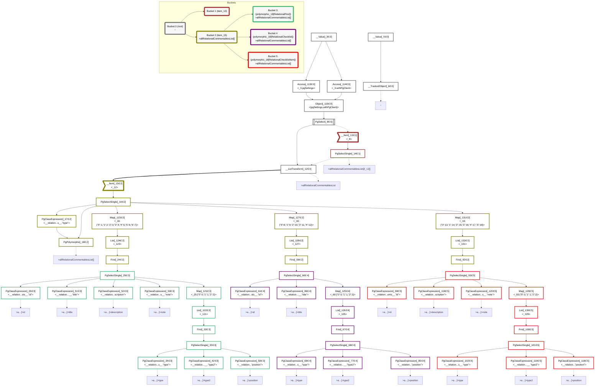

```mermaid
graph TD
    classDef path fill:#eee,stroke:#000,color:#000
    classDef plan fill:#fff,stroke-width:3px,color:#000
    classDef itemplan fill:#fff,stroke-width:6px,color:#000
    classDef sideeffectplan fill:#f00,stroke-width:6px,color:#000
    classDef bucket fill:#f6f6f6,color:#000,stroke-width:6px


    %% define plans
    __Value_3["__Value[_3∈0]<br /><context>"]:::plan
    __Value_5["__Value[_5∈0]<br /><rootValue>"]:::plan
    __TrackedObject_6["__TrackedObject[_6∈0]"]:::plan
    PgSelect_8[["PgSelect[_8∈0]<br /><relational_commentables>"]]:::plan
    __ListTransform_12["__ListTransform[_12∈0]<br /><each:_8>"]:::plan
    __Item_13>"__Item[_13∈1]<br /><_8>"]:::itemplan
    PgSelectSingle_14["PgSelectSingle[_14∈1]<br /><relational_commentables>"]:::plan
    __Item_15>"__Item[_15∈2]<br /><_12>"]:::itemplan
    PgSelectSingle_16["PgSelectSingle[_16∈2]<br /><relational_commentables>"]:::plan
    PgClassExpression_17["PgClassExpression[_17∈2]<br /><__relation...s__.”type”>"]:::plan
    PgPolymorphic_18["PgPolymorphic[_18∈2]"]:::plan
    First_24["First[_24∈2]"]:::plan
    PgSelectSingle_25["PgSelectSingle[_25∈3]<br /><relational_posts>"]:::plan
    PgClassExpression_26["PgClassExpression[_26∈3]<br /><__relation...sts__.”id”>"]:::plan
    First_32["First[_32∈3]"]:::plan
    PgSelectSingle_33["PgSelectSingle[_33∈3]<br /><relational_items>"]:::plan
    PgClassExpression_34["PgClassExpression[_34∈3]<br /><__relation...s__.”type”>"]:::plan
    PgClassExpression_42["PgClassExpression[_42∈3]<br /><__relation...__.”type2”>"]:::plan
    PgClassExpression_50["PgClassExpression[_50∈3]<br /><__relation...”position”>"]:::plan
    PgClassExpression_51["PgClassExpression[_51∈3]<br /><__relation...__.”title”>"]:::plan
    PgClassExpression_52["PgClassExpression[_52∈3]<br /><__relation...scription”>"]:::plan
    PgClassExpression_53["PgClassExpression[_53∈3]<br /><__relation...s__.”note”>"]:::plan
    First_59["First[_59∈2]"]:::plan
    PgSelectSingle_60["PgSelectSingle[_60∈4]<br /><relational_checklists>"]:::plan
    PgClassExpression_61["PgClassExpression[_61∈4]<br /><__relation...sts__.”id”>"]:::plan
    First_67["First[_67∈4]"]:::plan
    PgSelectSingle_68["PgSelectSingle[_68∈4]<br /><relational_items>"]:::plan
    PgClassExpression_69["PgClassExpression[_69∈4]<br /><__relation...s__.”type”>"]:::plan
    PgClassExpression_77["PgClassExpression[_77∈4]<br /><__relation...__.”type2”>"]:::plan
    PgClassExpression_85["PgClassExpression[_85∈4]<br /><__relation...”position”>"]:::plan
    PgClassExpression_86["PgClassExpression[_86∈4]<br /><__relation...__.”title”>"]:::plan
    First_92["First[_92∈2]"]:::plan
    PgSelectSingle_93["PgSelectSingle[_93∈5]<br /><relational_checklist_items>"]:::plan
    PgClassExpression_94["PgClassExpression[_94∈5]<br /><__relation...ems__.”id”>"]:::plan
    First_100["First[_100∈5]"]:::plan
    PgSelectSingle_101["PgSelectSingle[_101∈5]<br /><relational_items>"]:::plan
    PgClassExpression_102["PgClassExpression[_102∈5]<br /><__relation...s__.”type”>"]:::plan
    PgClassExpression_110["PgClassExpression[_110∈5]<br /><__relation...__.”type2”>"]:::plan
    Access_113["Access[_113∈0]<br /><_3.pgSettings>"]:::plan
    Access_114["Access[_114∈0]<br /><_3.withPgClient>"]:::plan
    Object_115["Object[_115∈0]<br /><{pgSettings,withPgClient}>"]:::plan
    PgClassExpression_118["PgClassExpression[_118∈5]<br /><__relation...”position”>"]:::plan
    PgClassExpression_119["PgClassExpression[_119∈5]<br /><__relation...scription”>"]:::plan
    PgClassExpression_120["PgClassExpression[_120∈5]<br /><__relation...s__.”note”>"]:::plan
    Map_121["Map[_121∈3]<br /><_25:{”0”:0,”1”:1,”2”:2}>"]:::plan
    List_122["List[_122∈3]<br /><_121>"]:::plan
    Map_123["Map[_123∈2]<br /><_16:{”0”:1,”1”:2,”2”:3,”3”:4,”4”:5,”5”:6,”6”:7}>"]:::plan
    List_124["List[_124∈2]<br /><_123>"]:::plan
    Map_125["Map[_125∈4]<br /><_60:{”0”:0,”1”:1,”2”:2}>"]:::plan
    List_126["List[_126∈4]<br /><_125>"]:::plan
    Map_127["Map[_127∈2]<br /><_16:{”0”:8,”1”:9,”2”:10,”3”:11,”4”:12}>"]:::plan
    List_128["List[_128∈2]<br /><_127>"]:::plan
    Map_129["Map[_129∈5]<br /><_93:{”0”:0,”1”:1,”2”:2}>"]:::plan
    List_130["List[_130∈5]<br /><_129>"]:::plan
    Map_131["Map[_131∈2]<br /><_16:{”0”:13,”1”:14,”2”:15,”3”:16,”4”:17,”5”:18}>"]:::plan
    List_132["List[_132∈2]<br /><_131>"]:::plan

    %% plan dependencies
    __Value_5 --> __TrackedObject_6
    Object_115 --> PgSelect_8
    PgSelect_8 --> __ListTransform_12
    PgSelectSingle_14 -.-> __ListTransform_12
    PgSelect_8 -.-> __Item_13
    __Item_13 --> PgSelectSingle_14
    __ListTransform_12 ==> __Item_15
    __Item_15 --> PgSelectSingle_16
    PgSelectSingle_16 --> PgClassExpression_17
    PgSelectSingle_16 --> PgPolymorphic_18
    PgClassExpression_17 --> PgPolymorphic_18
    List_124 --> First_24
    First_24 --> PgSelectSingle_25
    PgSelectSingle_25 --> PgClassExpression_26
    List_122 --> First_32
    First_32 --> PgSelectSingle_33
    PgSelectSingle_33 --> PgClassExpression_34
    PgSelectSingle_33 --> PgClassExpression_42
    PgSelectSingle_33 --> PgClassExpression_50
    PgSelectSingle_25 --> PgClassExpression_51
    PgSelectSingle_25 --> PgClassExpression_52
    PgSelectSingle_25 --> PgClassExpression_53
    List_128 --> First_59
    First_59 --> PgSelectSingle_60
    PgSelectSingle_60 --> PgClassExpression_61
    List_126 --> First_67
    First_67 --> PgSelectSingle_68
    PgSelectSingle_68 --> PgClassExpression_69
    PgSelectSingle_68 --> PgClassExpression_77
    PgSelectSingle_68 --> PgClassExpression_85
    PgSelectSingle_60 --> PgClassExpression_86
    List_132 --> First_92
    First_92 --> PgSelectSingle_93
    PgSelectSingle_93 --> PgClassExpression_94
    List_130 --> First_100
    First_100 --> PgSelectSingle_101
    PgSelectSingle_101 --> PgClassExpression_102
    PgSelectSingle_101 --> PgClassExpression_110
    __Value_3 --> Access_113
    __Value_3 --> Access_114
    Access_113 --> Object_115
    Access_114 --> Object_115
    PgSelectSingle_101 --> PgClassExpression_118
    PgSelectSingle_93 --> PgClassExpression_119
    PgSelectSingle_93 --> PgClassExpression_120
    PgSelectSingle_25 --> Map_121
    Map_121 --> List_122
    PgSelectSingle_16 --> Map_123
    Map_123 --> List_124
    PgSelectSingle_60 --> Map_125
    Map_125 --> List_126
    PgSelectSingle_16 --> Map_127
    Map_127 --> List_128
    PgSelectSingle_93 --> Map_129
    Map_129 --> List_130
    PgSelectSingle_16 --> Map_131
    Map_131 --> List_132

    %% plan-to-path relationships
    P1["~"]
    __TrackedObject_6 -.-> P1
    P2[">allRelationalCommentablesList@_12[]"]
    PgSelectSingle_14 -.-> P2
    P3[">allRelationalCommentablesList"]
    __ListTransform_12 -.-> P3
    P4[">allRelationalCommentablesList[]"]
    PgPolymorphic_18 -.-> P4
    P5[">a…]>id"]
    PgClassExpression_26 -.-> P5
    P6[">a…]>type"]
    PgClassExpression_34 -.-> P6
    P7[">a…]>type2"]
    PgClassExpression_42 -.-> P7
    P8[">a…]>position"]
    PgClassExpression_50 -.-> P8
    P9[">a…]>title"]
    PgClassExpression_51 -.-> P9
    P10[">a…]>description"]
    PgClassExpression_52 -.-> P10
    P11[">a…]>note"]
    PgClassExpression_53 -.-> P11
    P12[">a…]>id"]
    PgClassExpression_61 -.-> P12
    P13[">a…]>type"]
    PgClassExpression_69 -.-> P13
    P14[">a…]>type2"]
    PgClassExpression_77 -.-> P14
    P15[">a…]>position"]
    PgClassExpression_85 -.-> P15
    P16[">a…]>title"]
    PgClassExpression_86 -.-> P16
    P17[">a…]>id"]
    PgClassExpression_94 -.-> P17
    P18[">a…]>type"]
    PgClassExpression_102 -.-> P18
    P19[">a…]>type2"]
    PgClassExpression_110 -.-> P19
    P20[">a…]>position"]
    PgClassExpression_118 -.-> P20
    P21[">a…]>description"]
    PgClassExpression_119 -.-> P21
    P22[">a…]>note"]
    PgClassExpression_120 -.-> P22

    %% allocate buckets
    classDef bucket0 stroke:#696969
    class __Value_3,__Value_5,__TrackedObject_6,PgSelect_8,__ListTransform_12,Access_113,Access_114,Object_115 bucket0
    classDef bucket1 stroke:#a52a2a
    class __Item_13,PgSelectSingle_14 bucket1
    classDef bucket2 stroke:#808000
    class __Item_15,PgSelectSingle_16,PgClassExpression_17,PgPolymorphic_18,First_24,First_59,First_92,Map_123,List_124,Map_127,List_128,Map_131,List_132 bucket2
    classDef bucket3 stroke:#3cb371
    class PgSelectSingle_25,PgClassExpression_26,First_32,PgSelectSingle_33,PgClassExpression_34,PgClassExpression_42,PgClassExpression_50,PgClassExpression_51,PgClassExpression_52,PgClassExpression_53,Map_121,List_122 bucket3
    classDef bucket4 stroke:#7f007f
    class PgSelectSingle_60,PgClassExpression_61,First_67,PgSelectSingle_68,PgClassExpression_69,PgClassExpression_77,PgClassExpression_85,PgClassExpression_86,Map_125,List_126 bucket4
    classDef bucket5 stroke:#ff0000
    class PgSelectSingle_93,PgClassExpression_94,First_100,PgSelectSingle_101,PgClassExpression_102,PgClassExpression_110,PgClassExpression_118,PgClassExpression_119,PgClassExpression_120,Map_129,List_130 bucket5

    subgraph Buckets
    Bucket0("Bucket 0 (root)<br />~"):::bucket
    style Bucket0 stroke:#696969
    Bucket1("Bucket 1 (item_13)"):::bucket
    style Bucket1 stroke:#a52a2a
    Bucket0 --> Bucket1
    Bucket2("Bucket 2 (item_15)<br />>allRelationalCommentablesList[]"):::bucket
    style Bucket2 stroke:#808000
    Bucket0 --> Bucket2
    Bucket3("Bucket 3 (polymorphic_18[RelationalPost])<br />>allRelationalCommentablesList[]"):::bucket
    style Bucket3 stroke:#3cb371
    Bucket2 --> Bucket3
    Bucket4("Bucket 4 (polymorphic_18[RelationalChecklist])<br />>allRelationalCommentablesList[]"):::bucket
    style Bucket4 stroke:#7f007f
    Bucket2 --> Bucket4
    Bucket5("Bucket 5 (polymorphic_18[RelationalChecklistItem])<br />>allRelationalCommentablesList[]"):::bucket
    style Bucket5 stroke:#ff0000
    Bucket2 --> Bucket5
    end
```
