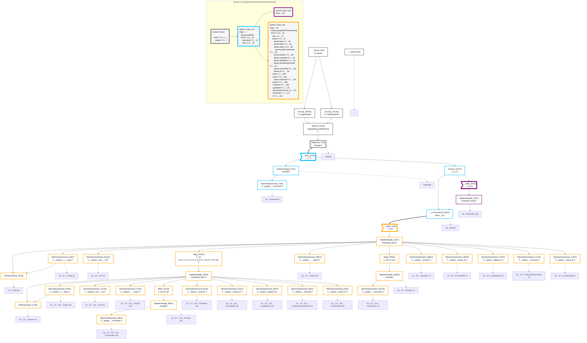

```mermaid
graph TD
    classDef path fill:#eee,stroke:#000,color:#000
    classDef plan fill:#fff,stroke-width:3px,color:#000
    classDef itemplan fill:#fff,stroke-width:6px,color:#000
    classDef sideeffectplan fill:#f00,stroke-width:6px,color:#000
    classDef bucket fill:#f6f6f6,color:#000,stroke-width:6px,text-align:left


    %% define plans
    __Value_0["__Value[_0∈0]"]:::plan
    PgClassExpression_13["PgClassExpression[_13∈1]<br />ᐸ__people__.”username”ᐳ"]:::plan
    PgSelectSingle_12["PgSelectSingle[_12∈1]<br />ᐸpeopleᐳ"]:::plan
    PgPolymorphic_25["PgPolymorphic[_25∈3]"]:::plan
    PgClassExpression_24["PgClassExpression[_24∈3]<br />ᐸ__relation...s__.”type”ᐳ"]:::plan
    PgClassExpression_614["PgClassExpression[_614∈3]<br />ᐸ__relation...ems__.”id”ᐳ"]:::plan
    PgPolymorphic_41["PgPolymorphic[_41∈3]"]:::plan
    PgClassExpression_40["PgClassExpression[_40∈3]<br />ᐸ__relation...s__.”type”ᐳ"]:::plan
    PgClassExpression_722["PgClassExpression[_722∈3]<br />ᐸ__relation...ems__.”id”ᐳ"]:::plan
    PgClassExpression_51["PgClassExpression[_51∈3]<br />ᐸ__relation...__.”type2”ᐳ"]:::plan
    PgClassExpression_59["PgClassExpression[_59∈3]<br />ᐸ__people__.”username”ᐳ"]:::plan
    PgSelectSingle_58["PgSelectSingle[_58∈3]<br />ᐸpeopleᐳ"]:::plan
    Map_761["Map[_761∈3]<br />ᐸ_39:{”0”:3}ᐳ"]:::plan
    PgClassExpression_60["PgClassExpression[_60∈3]<br />ᐸ__relation...”position”ᐳ"]:::plan
    PgClassExpression_61["PgClassExpression[_61∈3]<br />ᐸ__relation...reated_at”ᐳ"]:::plan
    PgClassExpression_62["PgClassExpression[_62∈3]<br />ᐸ__relation...pdated_at”ᐳ"]:::plan
    PgClassExpression_63["PgClassExpression[_63∈3]<br />ᐸ__relation..._archived”ᐳ"]:::plan
    PgClassExpression_64["PgClassExpression[_64∈3]<br />ᐸ__relation...chived_at”ᐳ"]:::plan
    PgSelectSingle_39["PgSelectSingle[_39∈3]<br />ᐸrelational_itemsᐳ"]:::plan
    Map_763["Map[_763∈3]<br />ᐸ_23:{”0”:2,”1”:3,”2”:4,”3”:5,”4”:6,”5”:7,”6”:8,”7”:9,”8”:10}ᐳ"]:::plan
    PgClassExpression_159["PgClassExpression[_159∈3]<br />ᐸ__relation...__.”type2”ᐳ"]:::plan
    PgClassExpression_167["PgClassExpression[_167∈3]<br />ᐸ__people__.”username”ᐳ"]:::plan
    PgSelectSingle_166["PgSelectSingle[_166∈3]<br />ᐸpeopleᐳ"]:::plan
    Map_765["Map[_765∈3]<br />ᐸ_23:{”0”:12}ᐳ"]:::plan
    PgClassExpression_168["PgClassExpression[_168∈3]<br />ᐸ__relation...”position”ᐳ"]:::plan
    PgClassExpression_169["PgClassExpression[_169∈3]<br />ᐸ__relation...reated_at”ᐳ"]:::plan
    PgClassExpression_170["PgClassExpression[_170∈3]<br />ᐸ__relation...pdated_at”ᐳ"]:::plan
    PgClassExpression_171["PgClassExpression[_171∈3]<br />ᐸ__relation..._archived”ᐳ"]:::plan
    PgClassExpression_172["PgClassExpression[_172∈3]<br />ᐸ__relation...chived_at”ᐳ"]:::plan
    PgSelectSingle_23["PgSelectSingle[_23∈3]<br />ᐸrelational_itemsᐳ"]:::plan
    __Item_22>"__Item[_22∈3]<br />ᐸ_19ᐳ"]:::itemplan
    __ListTransform_19["__ListTransform[_19∈1]<br />ᐸeach:_15ᐳ"]:::plan
    PgSelectSingle_21["PgSelectSingle[_21∈2]<br />ᐸrelational_itemsᐳ"]:::plan
    __Item_20>"__Item[_20∈2]<br />ᐸ_767ᐳ"]:::itemplan
    Access_767["Access[_767∈1]<br />ᐸ_11.1ᐳ"]:::plan
    __Item_11>"__Item[_11∈1]<br />ᐸ_7ᐳ"]:::itemplan
    PgSelect_7[["PgSelect[_7∈0]<br />ᐸpeopleᐳ"]]:::plan
    Object_752["Object[_752∈0]<br />ᐸ{pgSettings,withPgClient}ᐳ"]:::plan
    Access_750["Access[_750∈0]<br />ᐸ_3.pgSettingsᐳ"]:::plan
    Access_751["Access[_751∈0]<br />ᐸ_3.withPgClientᐳ"]:::plan
    __Value_3["__Value[_3∈0]<br />ᐸcontextᐳ"]:::plan

    %% plan dependencies
    PgSelectSingle_12 --> PgClassExpression_13
    __Item_11 --> PgSelectSingle_12
    PgSelectSingle_23 & PgClassExpression_24 --> PgPolymorphic_25
    PgSelectSingle_23 --> PgClassExpression_24
    PgSelectSingle_23 --> PgClassExpression_614
    PgSelectSingle_39 & PgClassExpression_40 --> PgPolymorphic_41
    PgSelectSingle_39 --> PgClassExpression_40
    PgSelectSingle_39 --> PgClassExpression_722
    PgSelectSingle_39 --> PgClassExpression_51
    PgSelectSingle_58 --> PgClassExpression_59
    Map_761 --> PgSelectSingle_58
    PgSelectSingle_39 --> Map_761
    PgSelectSingle_39 --> PgClassExpression_60
    PgSelectSingle_39 --> PgClassExpression_61
    PgSelectSingle_39 --> PgClassExpression_62
    PgSelectSingle_39 --> PgClassExpression_63
    PgSelectSingle_39 --> PgClassExpression_64
    Map_763 --> PgSelectSingle_39
    PgSelectSingle_23 --> Map_763
    PgSelectSingle_23 --> PgClassExpression_159
    PgSelectSingle_166 --> PgClassExpression_167
    Map_765 --> PgSelectSingle_166
    PgSelectSingle_23 --> Map_765
    PgSelectSingle_23 --> PgClassExpression_168
    PgSelectSingle_23 --> PgClassExpression_169
    PgSelectSingle_23 --> PgClassExpression_170
    PgSelectSingle_23 --> PgClassExpression_171
    PgSelectSingle_23 --> PgClassExpression_172
    __Item_22 --> PgSelectSingle_23
    __ListTransform_19 ==> __Item_22
    Access_767 --> __ListTransform_19
    PgSelectSingle_21 -.-> __ListTransform_19
    __Item_20 --> PgSelectSingle_21
    Access_767 -.-> __Item_20
    __Item_11 --> Access_767
    PgSelect_7 ==> __Item_11
    Object_752 --> PgSelect_7
    Access_750 & Access_751 --> Object_752
    __Value_3 --> Access_750
    __Value_3 --> Access_751

    %% plan-to-path relationships
    P_0["~"]
    __Value_0 -.-> P_0
    P_7["ᐳpeople"]
    PgSelect_7 -.-> P_7
    P_12["ᐳpeople[]"]
    PgSelectSingle_12 -.-> P_12
    P_13["ᐳp…]ᐳusername"]
    PgClassExpression_13 -.-> P_13
    P_19["ᐳp…]ᐳitems"]
    __ListTransform_19 -.-> P_19
    P_21["ᐳp…]ᐳitems@_19[]"]
    PgSelectSingle_21 -.-> P_21
    P_24["ᐳp…]ᐳi…]ᐳtype x5"]
    PgClassExpression_24 -.-> P_24
    P_25["ᐳp…]ᐳitems[]"]
    PgPolymorphic_25 -.-> P_25
    P_40["ᐳp…]ᐳi…]ᐳp…tᐳtype x25"]
    PgClassExpression_40 -.-> P_40
    P_41["ᐳp…]ᐳi…]ᐳparent x5"]
    PgPolymorphic_41 -.-> P_41
    P_51["ᐳp…]ᐳi…]ᐳp…tᐳtype2 x25"]
    PgClassExpression_51 -.-> P_51
    P_58["ᐳp…]ᐳi…]ᐳp…tᐳauthor x25"]
    PgSelectSingle_58 -.-> P_58
    P_59["ᐳp…]ᐳi…]ᐳp…tᐳa…rᐳusername x25"]
    PgClassExpression_59 -.-> P_59
    P_60["ᐳp…]ᐳi…]ᐳp…tᐳposition x25"]
    PgClassExpression_60 -.-> P_60
    P_61["ᐳp…]ᐳi…]ᐳp…tᐳcreatedAt x25"]
    PgClassExpression_61 -.-> P_61
    P_62["ᐳp…]ᐳi…]ᐳp…tᐳupdatedAt x25"]
    PgClassExpression_62 -.-> P_62
    P_63["ᐳp…]ᐳi…]ᐳp…tᐳisExplicitlyArchived x25"]
    PgClassExpression_63 -.-> P_63
    P_64["ᐳp…]ᐳi…]ᐳp…tᐳarchivedAt x25"]
    PgClassExpression_64 -.-> P_64
    P_159["ᐳp…]ᐳi…]ᐳtype2 x5"]
    PgClassExpression_159 -.-> P_159
    P_166["ᐳp…]ᐳi…]ᐳauthor x5"]
    PgSelectSingle_166 -.-> P_166
    P_167["ᐳp…]ᐳi…]ᐳa…rᐳusername x5"]
    PgClassExpression_167 -.-> P_167
    P_168["ᐳp…]ᐳi…]ᐳposition x5"]
    PgClassExpression_168 -.-> P_168
    P_169["ᐳp…]ᐳi…]ᐳcreatedAt x5"]
    PgClassExpression_169 -.-> P_169
    P_170["ᐳp…]ᐳi…]ᐳupdatedAt x5"]
    PgClassExpression_170 -.-> P_170
    P_171["ᐳp…]ᐳi…]ᐳisExplicitlyArchived x5"]
    PgClassExpression_171 -.-> P_171
    P_172["ᐳp…]ᐳi…]ᐳarchivedAt x5"]
    PgClassExpression_172 -.-> P_172
    P_614["ᐳp…]ᐳi…]ᐳid x5"]
    PgClassExpression_614 -.-> P_614
    P_722["ᐳp…]ᐳi…]ᐳp…tᐳid x25"]
    PgClassExpression_722 -.-> P_722

    subgraph "Buckets for queries/interfaces-relational/nested-more"
    Bucket0("Bucket 0 (root)<br />~<br />⠀ROOT ᐸ-O- _0<br />⠀⠀people ᐸ-A- _7"):::bucket
    classDef bucket0 stroke:#696969
    class Bucket0,__Value_0,__Value_3,PgSelect_7,Access_750,Access_751,Object_752 bucket0
    Bucket1("Bucket 1 (item_11)<br />Deps: _7<br />~ᐳQuery.people[]<br />⠀ROOT ᐸ-O- _12<br />⠀⠀username ᐸ-L- _13<br />⠀⠀items ᐸ-A- _19"):::bucket
    classDef bucket1 stroke:#00bfff
    class Bucket1,__Item_11,PgSelectSingle_12,PgClassExpression_13,__ListTransform_19,Access_767 bucket1
    Bucket2("Bucket 2 (item_20)<br />Deps: _767"):::bucket
    classDef bucket2 stroke:#7f007f
    class Bucket2,__Item_20,PgSelectSingle_21 bucket2
    Bucket3("Bucket 3 (item_22)<br />Deps: _19<br />~ᐳQuery.people[]ᐳPerson.items[]<br />⠀ROOT ᐸ-O- _25<br />⠀⠀type ᐸ-L- _24<br />⠀⠀parent ᐸ-O- _41<br />⠀⠀⠀parent.type ᐸ-L- _40<br />⠀⠀⠀parent.type2 ᐸ-L- _51<br />⠀⠀⠀parent.author ᐸ-O- _58<br />⠀⠀⠀⠀parent.author.username ᐸ-L- _59<br />⠀⠀⠀parent.position ᐸ-L- _60<br />⠀⠀⠀parent.createdAt ᐸ-L- _61<br />⠀⠀⠀parent.updatedAt ᐸ-L- _62<br />⠀⠀⠀parent.isExplicitlyArchived ᐸ-L- _63<br />⠀⠀⠀parent.archivedAt ᐸ-L- _64<br />⠀⠀⠀parent.id ᐸ-L- _722<br />⠀⠀type2 ᐸ-L- _159<br />⠀⠀author ᐸ-O- _166<br />⠀⠀⠀author.username ᐸ-L- _167<br />⠀⠀position ᐸ-L- _168<br />⠀⠀createdAt ᐸ-L- _169<br />⠀⠀updatedAt ᐸ-L- _170<br />⠀⠀isExplicitlyArchived ᐸ-L- _171<br />⠀⠀archivedAt ᐸ-L- _172<br />⠀⠀id ᐸ-L- _614"):::bucket
    classDef bucket3 stroke:#ffa500
    class Bucket3,__Item_22,PgSelectSingle_23,PgClassExpression_24,PgPolymorphic_25,PgSelectSingle_39,PgClassExpression_40,PgPolymorphic_41,PgClassExpression_51,PgSelectSingle_58,PgClassExpression_59,PgClassExpression_60,PgClassExpression_61,PgClassExpression_62,PgClassExpression_63,PgClassExpression_64,PgClassExpression_159,PgSelectSingle_166,PgClassExpression_167,PgClassExpression_168,PgClassExpression_169,PgClassExpression_170,PgClassExpression_171,PgClassExpression_172,PgClassExpression_614,PgClassExpression_722,Map_761,Map_763,Map_765 bucket3
    Bucket0 --> Bucket1
    Bucket1 --> Bucket2 & Bucket3
    end
```
