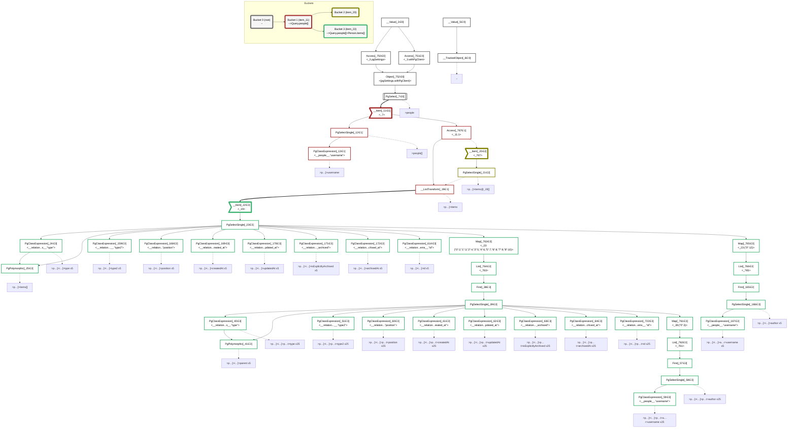

```mermaid
graph TD
    classDef path fill:#eee,stroke:#000,color:#000
    classDef plan fill:#fff,stroke-width:3px,color:#000
    classDef itemplan fill:#fff,stroke-width:6px,color:#000
    classDef sideeffectplan fill:#f00,stroke-width:6px,color:#000
    classDef bucket fill:#f6f6f6,color:#000,stroke-width:6px


    %% define plans
    __Value_3["__Value[_3∈0]<br /><context>"]:::plan
    __Value_5["__Value[_5∈0]<br /><rootValue>"]:::plan
    __TrackedObject_6["__TrackedObject[_6∈0]"]:::plan
    PgSelect_7[["PgSelect[_7∈0]<br /><people>"]]:::plan
    __Item_11>"__Item[_11∈1]<br /><_7>"]:::itemplan
    PgSelectSingle_12["PgSelectSingle[_12∈1]<br /><people>"]:::plan
    PgClassExpression_13["PgClassExpression[_13∈1]<br /><__people__.”username”>"]:::plan
    __ListTransform_19["__ListTransform[_19∈1]<br /><each:_15>"]:::plan
    __Item_20>"__Item[_20∈2]<br /><_767>"]:::itemplan
    PgSelectSingle_21["PgSelectSingle[_21∈2]<br /><relational_items>"]:::plan
    __Item_22>"__Item[_22∈3]<br /><_19>"]:::itemplan
    PgSelectSingle_23["PgSelectSingle[_23∈3]<br /><relational_items>"]:::plan
    PgClassExpression_24["PgClassExpression[_24∈3]<br /><__relation...s__.”type”>"]:::plan
    PgPolymorphic_25["PgPolymorphic[_25∈3]"]:::plan
    First_38["First[_38∈3]"]:::plan
    PgSelectSingle_39["PgSelectSingle[_39∈3]<br /><relational_items>"]:::plan
    PgClassExpression_40["PgClassExpression[_40∈3]<br /><__relation...s__.”type”>"]:::plan
    PgPolymorphic_41["PgPolymorphic[_41∈3]"]:::plan
    PgClassExpression_51["PgClassExpression[_51∈3]<br /><__relation...__.”type2”>"]:::plan
    First_57["First[_57∈3]"]:::plan
    PgSelectSingle_58["PgSelectSingle[_58∈3]<br /><people>"]:::plan
    PgClassExpression_59["PgClassExpression[_59∈3]<br /><__people__.”username”>"]:::plan
    PgClassExpression_60["PgClassExpression[_60∈3]<br /><__relation...”position”>"]:::plan
    PgClassExpression_61["PgClassExpression[_61∈3]<br /><__relation...reated_at”>"]:::plan
    PgClassExpression_62["PgClassExpression[_62∈3]<br /><__relation...pdated_at”>"]:::plan
    PgClassExpression_63["PgClassExpression[_63∈3]<br /><__relation..._archived”>"]:::plan
    PgClassExpression_64["PgClassExpression[_64∈3]<br /><__relation...chived_at”>"]:::plan
    PgClassExpression_159["PgClassExpression[_159∈3]<br /><__relation...__.”type2”>"]:::plan
    First_165["First[_165∈3]"]:::plan
    PgSelectSingle_166["PgSelectSingle[_166∈3]<br /><people>"]:::plan
    PgClassExpression_167["PgClassExpression[_167∈3]<br /><__people__.”username”>"]:::plan
    PgClassExpression_168["PgClassExpression[_168∈3]<br /><__relation...”position”>"]:::plan
    PgClassExpression_169["PgClassExpression[_169∈3]<br /><__relation...reated_at”>"]:::plan
    PgClassExpression_170["PgClassExpression[_170∈3]<br /><__relation...pdated_at”>"]:::plan
    PgClassExpression_171["PgClassExpression[_171∈3]<br /><__relation..._archived”>"]:::plan
    PgClassExpression_172["PgClassExpression[_172∈3]<br /><__relation...chived_at”>"]:::plan
    PgClassExpression_614["PgClassExpression[_614∈3]<br /><__relation...ems__.”id”>"]:::plan
    PgClassExpression_722["PgClassExpression[_722∈3]<br /><__relation...ems__.”id”>"]:::plan
    Access_750["Access[_750∈0]<br /><_3.pgSettings>"]:::plan
    Access_751["Access[_751∈0]<br /><_3.withPgClient>"]:::plan
    Object_752["Object[_752∈0]<br /><{pgSettings,withPgClient}>"]:::plan
    Map_761["Map[_761∈3]<br /><_39:{”0”:3}>"]:::plan
    List_762["List[_762∈3]<br /><_761>"]:::plan
    Map_763["Map[_763∈3]<br /><_23:{”0”:2,”1”:3,”2”:4,”3”:5,”4”:6,”5”:7,”6”:8,”7”:9,”8”:10}>"]:::plan
    List_764["List[_764∈3]<br /><_763>"]:::plan
    Map_765["Map[_765∈3]<br /><_23:{”0”:12}>"]:::plan
    List_766["List[_766∈3]<br /><_765>"]:::plan
    Access_767["Access[_767∈1]<br /><_11.1>"]:::plan

    %% plan dependencies
    __Value_5 --> __TrackedObject_6
    Object_752 --> PgSelect_7
    PgSelect_7 ==> __Item_11
    __Item_11 --> PgSelectSingle_12
    PgSelectSingle_12 --> PgClassExpression_13
    Access_767 --> __ListTransform_19
    PgSelectSingle_21 -.-> __ListTransform_19
    Access_767 -.-> __Item_20
    __Item_20 --> PgSelectSingle_21
    __ListTransform_19 ==> __Item_22
    __Item_22 --> PgSelectSingle_23
    PgSelectSingle_23 --> PgClassExpression_24
    PgSelectSingle_23 --> PgPolymorphic_25
    PgClassExpression_24 --> PgPolymorphic_25
    List_764 --> First_38
    First_38 --> PgSelectSingle_39
    PgSelectSingle_39 --> PgClassExpression_40
    PgSelectSingle_39 --> PgPolymorphic_41
    PgClassExpression_40 --> PgPolymorphic_41
    PgSelectSingle_39 --> PgClassExpression_51
    List_762 --> First_57
    First_57 --> PgSelectSingle_58
    PgSelectSingle_58 --> PgClassExpression_59
    PgSelectSingle_39 --> PgClassExpression_60
    PgSelectSingle_39 --> PgClassExpression_61
    PgSelectSingle_39 --> PgClassExpression_62
    PgSelectSingle_39 --> PgClassExpression_63
    PgSelectSingle_39 --> PgClassExpression_64
    PgSelectSingle_23 --> PgClassExpression_159
    List_766 --> First_165
    First_165 --> PgSelectSingle_166
    PgSelectSingle_166 --> PgClassExpression_167
    PgSelectSingle_23 --> PgClassExpression_168
    PgSelectSingle_23 --> PgClassExpression_169
    PgSelectSingle_23 --> PgClassExpression_170
    PgSelectSingle_23 --> PgClassExpression_171
    PgSelectSingle_23 --> PgClassExpression_172
    PgSelectSingle_23 --> PgClassExpression_614
    PgSelectSingle_39 --> PgClassExpression_722
    __Value_3 --> Access_750
    __Value_3 --> Access_751
    Access_750 --> Object_752
    Access_751 --> Object_752
    PgSelectSingle_39 --> Map_761
    Map_761 --> List_762
    PgSelectSingle_23 --> Map_763
    Map_763 --> List_764
    PgSelectSingle_23 --> Map_765
    Map_765 --> List_766
    __Item_11 --> Access_767

    %% plan-to-path relationships
    P1["~"]
    __TrackedObject_6 -.-> P1
    P2[">people"]
    PgSelect_7 -.-> P2
    P3[">people[]"]
    PgSelectSingle_12 -.-> P3
    P4[">p…]>username"]
    PgClassExpression_13 -.-> P4
    P5[">p…]>items@_19[]"]
    PgSelectSingle_21 -.-> P5
    P6[">p…]>items"]
    __ListTransform_19 -.-> P6
    P7[">p…]>items[]"]
    PgPolymorphic_25 -.-> P7
    P8[">p…]>i…]>parent x5"]
    PgPolymorphic_41 -.-> P8
    P9[">p…]>i…]>p…t>id x25"]
    PgClassExpression_722 -.-> P9
    P10[">p…]>i…]>p…t>type x25"]
    PgClassExpression_40 -.-> P10
    P11[">p…]>i…]>p…t>type2 x25"]
    PgClassExpression_51 -.-> P11
    P12[">p…]>i…]>p…t>author x25"]
    PgSelectSingle_58 -.-> P12
    P13[">p…]>i…]>p…t>a…r>username x25"]
    PgClassExpression_59 -.-> P13
    P14[">p…]>i…]>p…t>position x25"]
    PgClassExpression_60 -.-> P14
    P15[">p…]>i…]>p…t>createdAt x25"]
    PgClassExpression_61 -.-> P15
    P16[">p…]>i…]>p…t>updatedAt x25"]
    PgClassExpression_62 -.-> P16
    P17[">p…]>i…]>p…t>isExplicitlyArchived x25"]
    PgClassExpression_63 -.-> P17
    P18[">p…]>i…]>p…t>archivedAt x25"]
    PgClassExpression_64 -.-> P18
    P19[">p…]>i…]>id x5"]
    PgClassExpression_614 -.-> P19
    P20[">p…]>i…]>type x5"]
    PgClassExpression_24 -.-> P20
    P21[">p…]>i…]>type2 x5"]
    PgClassExpression_159 -.-> P21
    P22[">p…]>i…]>author x5"]
    PgSelectSingle_166 -.-> P22
    P23[">p…]>i…]>a…r>username x5"]
    PgClassExpression_167 -.-> P23
    P24[">p…]>i…]>position x5"]
    PgClassExpression_168 -.-> P24
    P25[">p…]>i…]>createdAt x5"]
    PgClassExpression_169 -.-> P25
    P26[">p…]>i…]>updatedAt x5"]
    PgClassExpression_170 -.-> P26
    P27[">p…]>i…]>isExplicitlyArchived x5"]
    PgClassExpression_171 -.-> P27
    P28[">p…]>i…]>archivedAt x5"]
    PgClassExpression_172 -.-> P28

    %% allocate buckets
    classDef bucket0 stroke:#696969
    class __Value_3,__Value_5,__TrackedObject_6,PgSelect_7,Access_750,Access_751,Object_752 bucket0
    classDef bucket1 stroke:#a52a2a
    class __Item_11,PgSelectSingle_12,PgClassExpression_13,__ListTransform_19,Access_767 bucket1
    classDef bucket2 stroke:#808000
    class __Item_20,PgSelectSingle_21 bucket2
    classDef bucket3 stroke:#3cb371
    class __Item_22,PgSelectSingle_23,PgClassExpression_24,PgPolymorphic_25,First_38,PgSelectSingle_39,PgClassExpression_40,PgPolymorphic_41,PgClassExpression_51,First_57,PgSelectSingle_58,PgClassExpression_59,PgClassExpression_60,PgClassExpression_61,PgClassExpression_62,PgClassExpression_63,PgClassExpression_64,PgClassExpression_159,First_165,PgSelectSingle_166,PgClassExpression_167,PgClassExpression_168,PgClassExpression_169,PgClassExpression_170,PgClassExpression_171,PgClassExpression_172,PgClassExpression_614,PgClassExpression_722,Map_761,List_762,Map_763,List_764,Map_765,List_766 bucket3

    subgraph Buckets
    Bucket0("Bucket 0 (root)<br />~"):::bucket
    style Bucket0 stroke:#696969
    Bucket1("Bucket 1 (item_11)<br />~>Query.people[]"):::bucket
    style Bucket1 stroke:#a52a2a
    Bucket0 --> Bucket1
    Bucket2("Bucket 2 (item_20)"):::bucket
    style Bucket2 stroke:#808000
    Bucket1 --> Bucket2
    Bucket3("Bucket 3 (item_22)<br />~>Query.people[]>Person.items[]"):::bucket
    style Bucket3 stroke:#3cb371
    Bucket1 --> Bucket3
    end
```
