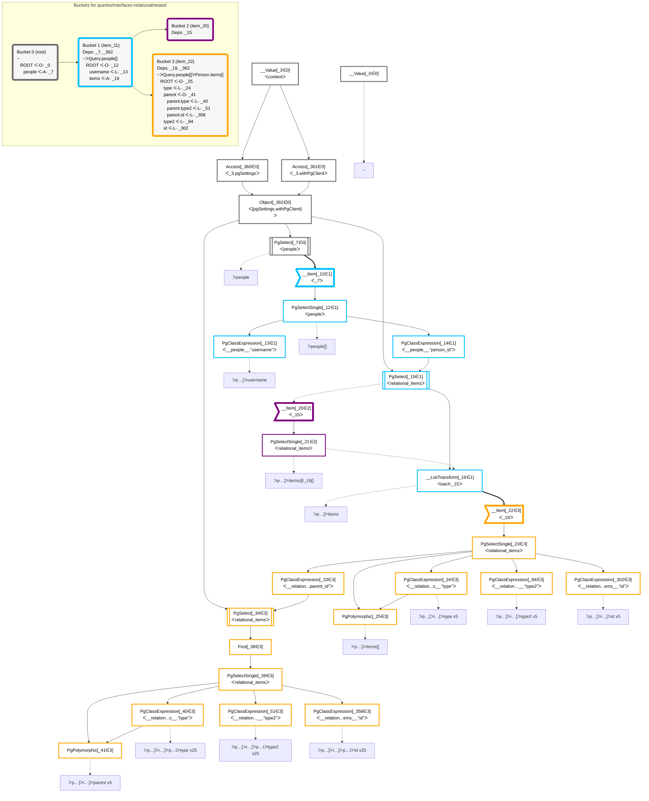

```mermaid
graph TD
    classDef path fill:#eee,stroke:#000,color:#000
    classDef plan fill:#fff,stroke-width:3px,color:#000
    classDef itemplan fill:#fff,stroke-width:6px,color:#000
    classDef sideeffectplan fill:#f00,stroke-width:6px,color:#000
    classDef bucket fill:#f6f6f6,color:#000,stroke-width:6px,text-align:left


    %% define plans
    __Value_0["__Value[_0∈0]"]:::plan
    PgClassExpression_13["PgClassExpression[_13∈1]<br />ᐸ__people__.”username”ᐳ"]:::plan
    PgPolymorphic_25["PgPolymorphic[_25∈3]"]:::plan
    PgClassExpression_24["PgClassExpression[_24∈3]<br />ᐸ__relation...s__.”type”ᐳ"]:::plan
    PgClassExpression_302["PgClassExpression[_302∈3]<br />ᐸ__relation...ems__.”id”ᐳ"]:::plan
    PgPolymorphic_41["PgPolymorphic[_41∈3]"]:::plan
    PgClassExpression_40["PgClassExpression[_40∈3]<br />ᐸ__relation...s__.”type”ᐳ"]:::plan
    PgClassExpression_358["PgClassExpression[_358∈3]<br />ᐸ__relation...ems__.”id”ᐳ"]:::plan
    PgClassExpression_51["PgClassExpression[_51∈3]<br />ᐸ__relation...__.”type2”ᐳ"]:::plan
    PgSelectSingle_39["PgSelectSingle[_39∈3]<br />ᐸrelational_itemsᐳ"]:::plan
    First_38["First[_38∈3]"]:::plan
    PgSelect_34[["PgSelect[_34∈3]<br />ᐸrelational_itemsᐳ"]]:::plan
    PgClassExpression_33["PgClassExpression[_33∈3]<br />ᐸ__relation...parent_id”ᐳ"]:::plan
    PgClassExpression_94["PgClassExpression[_94∈3]<br />ᐸ__relation...__.”type2”ᐳ"]:::plan
    PgSelectSingle_23["PgSelectSingle[_23∈3]<br />ᐸrelational_itemsᐳ"]:::plan
    __Item_22>"__Item[_22∈3]<br />ᐸ_19ᐳ"]:::itemplan
    __ListTransform_19["__ListTransform[_19∈1]<br />ᐸeach:_15ᐳ"]:::plan
    PgSelectSingle_21["PgSelectSingle[_21∈2]<br />ᐸrelational_itemsᐳ"]:::plan
    __Item_20>"__Item[_20∈2]<br />ᐸ_15ᐳ"]:::itemplan
    PgSelect_15[["PgSelect[_15∈1]<br />ᐸrelational_itemsᐳ"]]:::plan
    PgClassExpression_14["PgClassExpression[_14∈1]<br />ᐸ__people__.”person_id”ᐳ"]:::plan
    PgSelectSingle_12["PgSelectSingle[_12∈1]<br />ᐸpeopleᐳ"]:::plan
    __Item_11>"__Item[_11∈1]<br />ᐸ_7ᐳ"]:::itemplan
    PgSelect_7[["PgSelect[_7∈0]<br />ᐸpeopleᐳ"]]:::plan
    Object_362["Object[_362∈0]<br />ᐸ{pgSettings,withPgClient}ᐳ"]:::plan
    Access_360["Access[_360∈0]<br />ᐸ_3.pgSettingsᐳ"]:::plan
    Access_361["Access[_361∈0]<br />ᐸ_3.withPgClientᐳ"]:::plan
    __Value_3["__Value[_3∈0]<br />ᐸcontextᐳ"]:::plan

    %% plan dependencies
    PgSelectSingle_12 --> PgClassExpression_13
    PgSelectSingle_23 & PgClassExpression_24 --> PgPolymorphic_25
    PgSelectSingle_23 --> PgClassExpression_24
    PgSelectSingle_23 --> PgClassExpression_302
    PgSelectSingle_39 & PgClassExpression_40 --> PgPolymorphic_41
    PgSelectSingle_39 --> PgClassExpression_40
    PgSelectSingle_39 --> PgClassExpression_358
    PgSelectSingle_39 --> PgClassExpression_51
    First_38 --> PgSelectSingle_39
    PgSelect_34 --> First_38
    Object_362 & PgClassExpression_33 --> PgSelect_34
    PgSelectSingle_23 --> PgClassExpression_33
    PgSelectSingle_23 --> PgClassExpression_94
    __Item_22 --> PgSelectSingle_23
    __ListTransform_19 ==> __Item_22
    PgSelect_15 --> __ListTransform_19
    PgSelectSingle_21 -.-> __ListTransform_19
    __Item_20 --> PgSelectSingle_21
    PgSelect_15 -.-> __Item_20
    Object_362 & PgClassExpression_14 --> PgSelect_15
    PgSelectSingle_12 --> PgClassExpression_14
    __Item_11 --> PgSelectSingle_12
    PgSelect_7 ==> __Item_11
    Object_362 --> PgSelect_7
    Access_360 & Access_361 --> Object_362
    __Value_3 --> Access_360
    __Value_3 --> Access_361

    %% plan-to-path relationships
    P_0["~"]
    __Value_0 -.-> P_0
    P_7["ᐳpeople"]
    PgSelect_7 -.-> P_7
    P_12["ᐳpeople[]"]
    PgSelectSingle_12 -.-> P_12
    P_13["ᐳp…]ᐳusername"]
    PgClassExpression_13 -.-> P_13
    P_19["ᐳp…]ᐳitems"]
    __ListTransform_19 -.-> P_19
    P_21["ᐳp…]ᐳitems@_19[]"]
    PgSelectSingle_21 -.-> P_21
    P_24["ᐳp…]ᐳi…]ᐳtype x5"]
    PgClassExpression_24 -.-> P_24
    P_25["ᐳp…]ᐳitems[]"]
    PgPolymorphic_25 -.-> P_25
    P_40["ᐳp…]ᐳi…]ᐳp…tᐳtype x25"]
    PgClassExpression_40 -.-> P_40
    P_41["ᐳp…]ᐳi…]ᐳparent x5"]
    PgPolymorphic_41 -.-> P_41
    P_51["ᐳp…]ᐳi…]ᐳp…tᐳtype2 x25"]
    PgClassExpression_51 -.-> P_51
    P_94["ᐳp…]ᐳi…]ᐳtype2 x5"]
    PgClassExpression_94 -.-> P_94
    P_302["ᐳp…]ᐳi…]ᐳid x5"]
    PgClassExpression_302 -.-> P_302
    P_358["ᐳp…]ᐳi…]ᐳp…tᐳid x25"]
    PgClassExpression_358 -.-> P_358

    subgraph "Buckets for queries/interfaces-relational/nested"
    Bucket0("Bucket 0 (root)<br />~<br />⠀ROOT ᐸ-O- _0<br />⠀⠀people ᐸ-A- _7"):::bucket
    classDef bucket0 stroke:#696969
    class Bucket0,__Value_0,__Value_3,PgSelect_7,Access_360,Access_361,Object_362 bucket0
    Bucket1("Bucket 1 (item_11)<br />Deps: _7, _362<br />~ᐳQuery.people[]<br />⠀ROOT ᐸ-O- _12<br />⠀⠀username ᐸ-L- _13<br />⠀⠀items ᐸ-A- _19"):::bucket
    classDef bucket1 stroke:#00bfff
    class Bucket1,__Item_11,PgSelectSingle_12,PgClassExpression_13,PgClassExpression_14,PgSelect_15,__ListTransform_19 bucket1
    Bucket2("Bucket 2 (item_20)<br />Deps: _15"):::bucket
    classDef bucket2 stroke:#7f007f
    class Bucket2,__Item_20,PgSelectSingle_21 bucket2
    Bucket3("Bucket 3 (item_22)<br />Deps: _19, _362<br />~ᐳQuery.people[]ᐳPerson.items[]<br />⠀ROOT ᐸ-O- _25<br />⠀⠀type ᐸ-L- _24<br />⠀⠀parent ᐸ-O- _41<br />⠀⠀⠀parent.type ᐸ-L- _40<br />⠀⠀⠀parent.type2 ᐸ-L- _51<br />⠀⠀⠀parent.id ᐸ-L- _358<br />⠀⠀type2 ᐸ-L- _94<br />⠀⠀id ᐸ-L- _302"):::bucket
    classDef bucket3 stroke:#ffa500
    class Bucket3,__Item_22,PgSelectSingle_23,PgClassExpression_24,PgPolymorphic_25,PgClassExpression_33,PgSelect_34,First_38,PgSelectSingle_39,PgClassExpression_40,PgPolymorphic_41,PgClassExpression_51,PgClassExpression_94,PgClassExpression_302,PgClassExpression_358 bucket3
    Bucket0 --> Bucket1
    Bucket1 --> Bucket2 & Bucket3
    end
```
