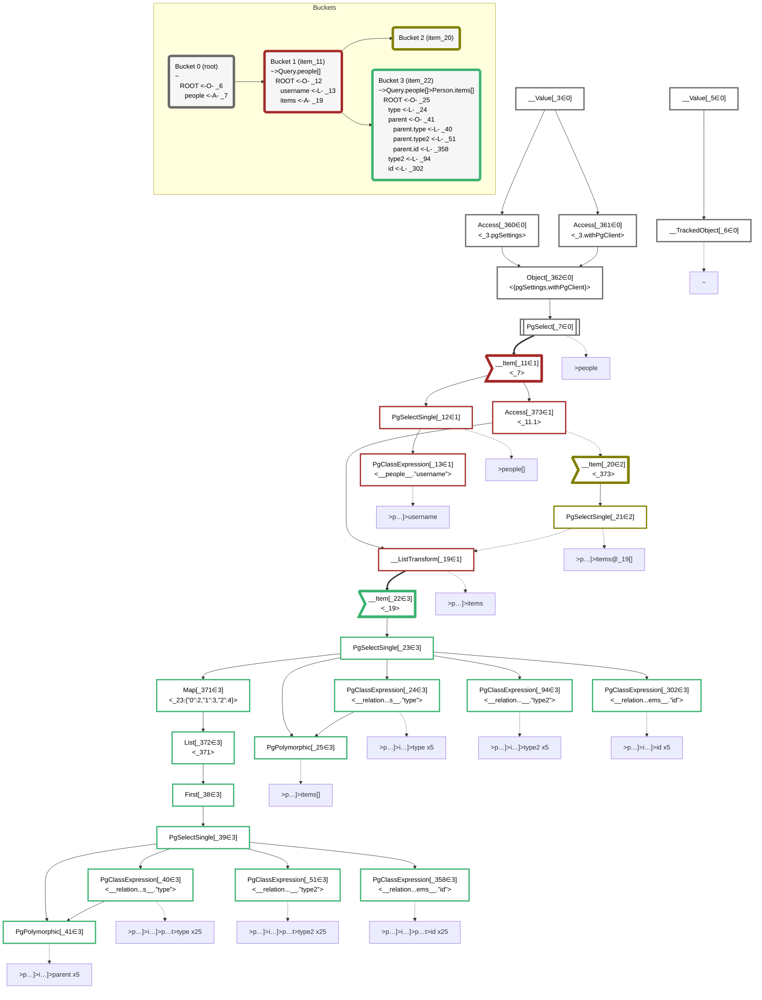

```mermaid
graph TD
    classDef path fill:#eee,stroke:#000,color:#000
    classDef plan fill:#fff,stroke-width:3px,color:#000
    classDef itemplan fill:#fff,stroke-width:6px,color:#000
    classDef sideeffectplan fill:#f00,stroke-width:6px,color:#000
    classDef bucket fill:#f6f6f6,color:#000,stroke-width:6px,text-align:left


    %% define plans
    __Value_3["__Value[_3∈0]<br /><context>"]:::plan
    __Value_5["__Value[_5∈0]<br /><rootValue>"]:::plan
    __TrackedObject_6["__TrackedObject[_6∈0]"]:::plan
    PgSelect_7[["PgSelect[_7∈0]<br /><people>"]]:::plan
    __Item_11>"__Item[_11∈1]<br /><_7>"]:::itemplan
    PgSelectSingle_12["PgSelectSingle[_12∈1]<br /><people>"]:::plan
    PgClassExpression_13["PgClassExpression[_13∈1]<br /><__people__.”username”>"]:::plan
    __ListTransform_19["__ListTransform[_19∈1]<br /><each:_15>"]:::plan
    __Item_20>"__Item[_20∈2]<br /><_373>"]:::itemplan
    PgSelectSingle_21["PgSelectSingle[_21∈2]<br /><relational_items>"]:::plan
    __Item_22>"__Item[_22∈3]<br /><_19>"]:::itemplan
    PgSelectSingle_23["PgSelectSingle[_23∈3]<br /><relational_items>"]:::plan
    PgClassExpression_24["PgClassExpression[_24∈3]<br /><__relation...s__.”type”>"]:::plan
    PgPolymorphic_25["PgPolymorphic[_25∈3]"]:::plan
    First_38["First[_38∈3]"]:::plan
    PgSelectSingle_39["PgSelectSingle[_39∈3]<br /><relational_items>"]:::plan
    PgClassExpression_40["PgClassExpression[_40∈3]<br /><__relation...s__.”type”>"]:::plan
    PgPolymorphic_41["PgPolymorphic[_41∈3]"]:::plan
    PgClassExpression_51["PgClassExpression[_51∈3]<br /><__relation...__.”type2”>"]:::plan
    PgClassExpression_94["PgClassExpression[_94∈3]<br /><__relation...__.”type2”>"]:::plan
    PgClassExpression_302["PgClassExpression[_302∈3]<br /><__relation...ems__.”id”>"]:::plan
    PgClassExpression_358["PgClassExpression[_358∈3]<br /><__relation...ems__.”id”>"]:::plan
    Access_360["Access[_360∈0]<br /><_3.pgSettings>"]:::plan
    Access_361["Access[_361∈0]<br /><_3.withPgClient>"]:::plan
    Object_362["Object[_362∈0]<br /><{pgSettings,withPgClient}>"]:::plan
    Map_371["Map[_371∈3]<br /><_23:{”0”:2,”1”:3,”2”:4}>"]:::plan
    List_372["List[_372∈3]<br /><_371>"]:::plan
    Access_373["Access[_373∈1]<br /><_11.1>"]:::plan

    %% plan dependencies
    __Value_5 --> __TrackedObject_6
    Object_362 --> PgSelect_7
    PgSelect_7 ==> __Item_11
    __Item_11 --> PgSelectSingle_12
    PgSelectSingle_12 --> PgClassExpression_13
    Access_373 --> __ListTransform_19
    PgSelectSingle_21 -.-> __ListTransform_19
    Access_373 -.-> __Item_20
    __Item_20 --> PgSelectSingle_21
    __ListTransform_19 ==> __Item_22
    __Item_22 --> PgSelectSingle_23
    PgSelectSingle_23 --> PgClassExpression_24
    PgSelectSingle_23 --> PgPolymorphic_25
    PgClassExpression_24 --> PgPolymorphic_25
    List_372 --> First_38
    First_38 --> PgSelectSingle_39
    PgSelectSingle_39 --> PgClassExpression_40
    PgSelectSingle_39 --> PgPolymorphic_41
    PgClassExpression_40 --> PgPolymorphic_41
    PgSelectSingle_39 --> PgClassExpression_51
    PgSelectSingle_23 --> PgClassExpression_94
    PgSelectSingle_23 --> PgClassExpression_302
    PgSelectSingle_39 --> PgClassExpression_358
    __Value_3 --> Access_360
    __Value_3 --> Access_361
    Access_360 --> Object_362
    Access_361 --> Object_362
    PgSelectSingle_23 --> Map_371
    Map_371 --> List_372
    __Item_11 --> Access_373

    %% plan-to-path relationships
    P_6["~"]
    __TrackedObject_6 -.-> P_6
    P_7[">people"]
    PgSelect_7 -.-> P_7
    P_12[">people[]"]
    PgSelectSingle_12 -.-> P_12
    P_13[">p…]>username"]
    PgClassExpression_13 -.-> P_13
    P_19[">p…]>items"]
    __ListTransform_19 -.-> P_19
    P_21[">p…]>items@_19[]"]
    PgSelectSingle_21 -.-> P_21
    P_24[">p…]>i…]>type x5"]
    PgClassExpression_24 -.-> P_24
    P_25[">p…]>items[]"]
    PgPolymorphic_25 -.-> P_25
    P_40[">p…]>i…]>p…t>type x25"]
    PgClassExpression_40 -.-> P_40
    P_41[">p…]>i…]>parent x5"]
    PgPolymorphic_41 -.-> P_41
    P_51[">p…]>i…]>p…t>type2 x25"]
    PgClassExpression_51 -.-> P_51
    P_94[">p…]>i…]>type2 x5"]
    PgClassExpression_94 -.-> P_94
    P_302[">p…]>i…]>id x5"]
    PgClassExpression_302 -.-> P_302
    P_358[">p…]>i…]>p…t>id x25"]
    PgClassExpression_358 -.-> P_358

    %% allocate buckets
    classDef bucket0 stroke:#696969
    class __Value_3,__Value_5,__TrackedObject_6,PgSelect_7,Access_360,Access_361,Object_362 bucket0
    classDef bucket1 stroke:#a52a2a
    class __Item_11,PgSelectSingle_12,PgClassExpression_13,__ListTransform_19,Access_373 bucket1
    classDef bucket2 stroke:#808000
    class __Item_20,PgSelectSingle_21 bucket2
    classDef bucket3 stroke:#3cb371
    class __Item_22,PgSelectSingle_23,PgClassExpression_24,PgPolymorphic_25,First_38,PgSelectSingle_39,PgClassExpression_40,PgPolymorphic_41,PgClassExpression_51,PgClassExpression_94,PgClassExpression_302,PgClassExpression_358,Map_371,List_372 bucket3

    subgraph Buckets
    Bucket0("Bucket 0 (root)<br />~<br />⠀ROOT <-O- _6<br />⠀⠀people <-A- _7"):::bucket
    style Bucket0 stroke:#696969
    Bucket1("Bucket 1 (item_11)<br />~>Query.people[]<br />⠀ROOT <-O- _12<br />⠀⠀username <-L- _13<br />⠀⠀items <-A- _19"):::bucket
    style Bucket1 stroke:#a52a2a
    Bucket0 --> Bucket1
    Bucket2("Bucket 2 (item_20)"):::bucket
    style Bucket2 stroke:#808000
    Bucket1 --> Bucket2
    Bucket3("Bucket 3 (item_22)<br />~>Query.people[]>Person.items[]<br />⠀ROOT <-O- _25<br />⠀⠀type <-L- _24<br />⠀⠀parent <-O- _41<br />⠀⠀⠀parent.type <-L- _40<br />⠀⠀⠀parent.type2 <-L- _51<br />⠀⠀⠀parent.id <-L- _358<br />⠀⠀type2 <-L- _94<br />⠀⠀id <-L- _302"):::bucket
    style Bucket3 stroke:#3cb371
    Bucket1 --> Bucket3
    end
```
