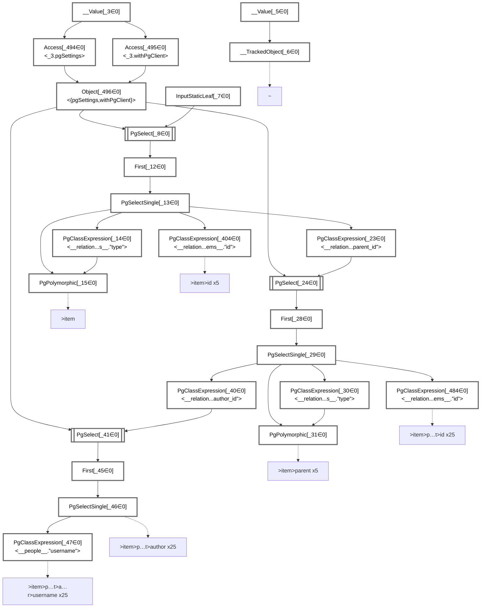

```mermaid
graph TD
    classDef path fill:#eee,stroke:#000,color:#000
    classDef plan fill:#fff,stroke-width:3px,color:#000
    classDef itemplan fill:#fff,stroke-width:6px,color:#000
    classDef sideeffectplan fill:#f00,stroke-width:6px,color:#000
    classDef bucket fill:#f6f6f6,color:#000,stroke-width:6px


    %% define plans
    __Value_3["__Value[_3∈0]<br /><context>"]:::plan
    __Value_5["__Value[_5∈0]<br /><rootValue>"]:::plan
    __TrackedObject_6["__TrackedObject[_6∈0]"]:::plan
    InputStaticLeaf_7["InputStaticLeaf[_7∈0]"]:::plan
    PgSelect_8[["PgSelect[_8∈0]<br /><relational_items>"]]:::plan
    First_12["First[_12∈0]"]:::plan
    PgSelectSingle_13["PgSelectSingle[_13∈0]<br /><relational_items>"]:::plan
    PgClassExpression_14["PgClassExpression[_14∈0]<br /><__relation...s__.”type”>"]:::plan
    PgPolymorphic_15["PgPolymorphic[_15∈0]"]:::plan
    PgClassExpression_23["PgClassExpression[_23∈0]<br /><__relation...parent_id”>"]:::plan
    PgSelect_24[["PgSelect[_24∈0]<br /><relational_items>"]]:::plan
    First_28["First[_28∈0]"]:::plan
    PgSelectSingle_29["PgSelectSingle[_29∈0]<br /><relational_items>"]:::plan
    PgClassExpression_30["PgClassExpression[_30∈0]<br /><__relation...s__.”type”>"]:::plan
    PgPolymorphic_31["PgPolymorphic[_31∈0]"]:::plan
    PgClassExpression_40["PgClassExpression[_40∈0]<br /><__relation...author_id”>"]:::plan
    PgSelect_41[["PgSelect[_41∈0]<br /><people>"]]:::plan
    First_45["First[_45∈0]"]:::plan
    PgSelectSingle_46["PgSelectSingle[_46∈0]<br /><people>"]:::plan
    PgClassExpression_47["PgClassExpression[_47∈0]<br /><__people__.”username”>"]:::plan
    PgClassExpression_404["PgClassExpression[_404∈0]<br /><__relation...ems__.”id”>"]:::plan
    PgClassExpression_484["PgClassExpression[_484∈0]<br /><__relation...ems__.”id”>"]:::plan
    Access_494["Access[_494∈0]<br /><_3.pgSettings>"]:::plan
    Access_495["Access[_495∈0]<br /><_3.withPgClient>"]:::plan
    Object_496["Object[_496∈0]<br /><{pgSettings,withPgClient}>"]:::plan

    %% plan dependencies
    __Value_5 --> __TrackedObject_6
    Object_496 --> PgSelect_8
    InputStaticLeaf_7 --> PgSelect_8
    PgSelect_8 --> First_12
    First_12 --> PgSelectSingle_13
    PgSelectSingle_13 --> PgClassExpression_14
    PgSelectSingle_13 --> PgPolymorphic_15
    PgClassExpression_14 --> PgPolymorphic_15
    PgSelectSingle_13 --> PgClassExpression_23
    Object_496 --> PgSelect_24
    PgClassExpression_23 --> PgSelect_24
    PgSelect_24 --> First_28
    First_28 --> PgSelectSingle_29
    PgSelectSingle_29 --> PgClassExpression_30
    PgSelectSingle_29 --> PgPolymorphic_31
    PgClassExpression_30 --> PgPolymorphic_31
    PgSelectSingle_29 --> PgClassExpression_40
    Object_496 --> PgSelect_41
    PgClassExpression_40 --> PgSelect_41
    PgSelect_41 --> First_45
    First_45 --> PgSelectSingle_46
    PgSelectSingle_46 --> PgClassExpression_47
    PgSelectSingle_13 --> PgClassExpression_404
    PgSelectSingle_29 --> PgClassExpression_484
    __Value_3 --> Access_494
    __Value_3 --> Access_495
    Access_494 --> Object_496
    Access_495 --> Object_496

    %% plan-to-path relationships
    P_6["~"]
    __TrackedObject_6 -.-> P_6
    P_15[">item"]
    PgPolymorphic_15 -.-> P_15
    P_31[">item>parent x5"]
    PgPolymorphic_31 -.-> P_31
    P_46[">item>p…t>author x25"]
    PgSelectSingle_46 -.-> P_46
    P_47[">item>p…t>a…r>username x25"]
    PgClassExpression_47 -.-> P_47
    P_404[">item>id x5"]
    PgClassExpression_404 -.-> P_404
    P_484[">item>p…t>id x25"]
    PgClassExpression_484 -.-> P_484

    %% allocate buckets
    classDef bucket0 stroke:#696969
    class __Value_3,__Value_5,__TrackedObject_6,InputStaticLeaf_7,PgSelect_8,First_12,PgSelectSingle_13,PgClassExpression_14,PgPolymorphic_15,PgClassExpression_23,PgSelect_24,First_28,PgSelectSingle_29,PgClassExpression_30,PgPolymorphic_31,PgClassExpression_40,PgSelect_41,First_45,PgSelectSingle_46,PgClassExpression_47,PgClassExpression_404,PgClassExpression_484,Access_494,Access_495,Object_496 bucket0
```
