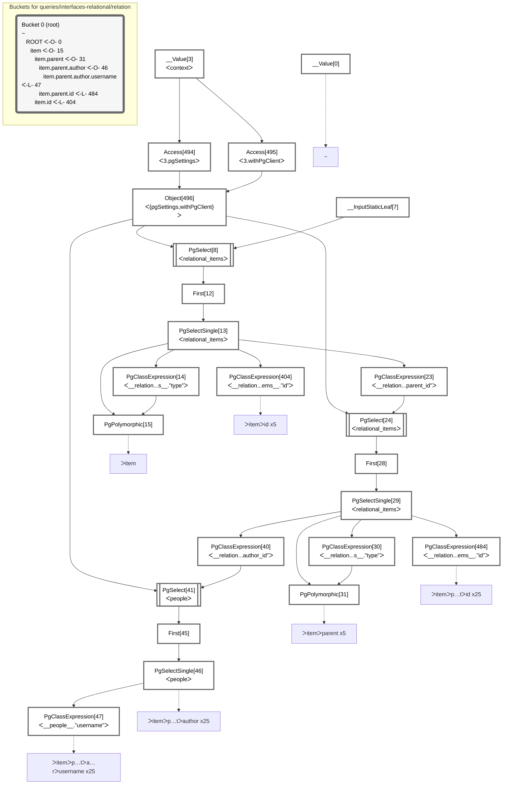

```mermaid
graph TD
    classDef path fill:#eee,stroke:#000,color:#000
    classDef plan fill:#fff,stroke-width:3px,color:#000
    classDef itemplan fill:#fff,stroke-width:6px,color:#000
    classDef sideeffectplan fill:#f00,stroke-width:6px,color:#000
    classDef bucket fill:#f6f6f6,color:#000,stroke-width:6px,text-align:left


    %% define plans
    __Value0["__Value[0]"]:::plan
    PgPolymorphic15["PgPolymorphic[15]"]:::plan
    PgClassExpression14["PgClassExpression[14]<br />ᐸ__relation...s__.”type”ᐳ"]:::plan
    PgClassExpression404["PgClassExpression[404]<br />ᐸ__relation...ems__.”id”ᐳ"]:::plan
    PgPolymorphic31["PgPolymorphic[31]"]:::plan
    PgClassExpression30["PgClassExpression[30]<br />ᐸ__relation...s__.”type”ᐳ"]:::plan
    PgClassExpression484["PgClassExpression[484]<br />ᐸ__relation...ems__.”id”ᐳ"]:::plan
    PgClassExpression47["PgClassExpression[47]<br />ᐸ__people__.”username”ᐳ"]:::plan
    PgSelectSingle46["PgSelectSingle[46]<br />ᐸpeopleᐳ"]:::plan
    First45["First[45]"]:::plan
    PgSelect41[["PgSelect[41]<br />ᐸpeopleᐳ"]]:::plan
    PgClassExpression40["PgClassExpression[40]<br />ᐸ__relation...author_id”ᐳ"]:::plan
    PgSelectSingle29["PgSelectSingle[29]<br />ᐸrelational_itemsᐳ"]:::plan
    First28["First[28]"]:::plan
    PgSelect24[["PgSelect[24]<br />ᐸrelational_itemsᐳ"]]:::plan
    PgClassExpression23["PgClassExpression[23]<br />ᐸ__relation...parent_id”ᐳ"]:::plan
    PgSelectSingle13["PgSelectSingle[13]<br />ᐸrelational_itemsᐳ"]:::plan
    First12["First[12]"]:::plan
    PgSelect8[["PgSelect[8]<br />ᐸrelational_itemsᐳ"]]:::plan
    Object496["Object[496]<br />ᐸ{pgSettings,withPgClient}ᐳ"]:::plan
    Access494["Access[494]<br />ᐸ3.pgSettingsᐳ"]:::plan
    Access495["Access[495]<br />ᐸ3.withPgClientᐳ"]:::plan
    __Value3["__Value[3]<br />ᐸcontextᐳ"]:::plan
    __InputStaticLeaf7["__InputStaticLeaf[7]"]:::plan

    %% plan dependencies
    PgSelectSingle13 & PgClassExpression14 --> PgPolymorphic15
    PgSelectSingle13 --> PgClassExpression14
    PgSelectSingle13 --> PgClassExpression404
    PgSelectSingle29 & PgClassExpression30 --> PgPolymorphic31
    PgSelectSingle29 --> PgClassExpression30
    PgSelectSingle29 --> PgClassExpression484
    PgSelectSingle46 --> PgClassExpression47
    First45 --> PgSelectSingle46
    PgSelect41 --> First45
    Object496 & PgClassExpression40 --> PgSelect41
    PgSelectSingle29 --> PgClassExpression40
    First28 --> PgSelectSingle29
    PgSelect24 --> First28
    Object496 & PgClassExpression23 --> PgSelect24
    PgSelectSingle13 --> PgClassExpression23
    First12 --> PgSelectSingle13
    PgSelect8 --> First12
    Object496 & __InputStaticLeaf7 --> PgSelect8
    Access494 & Access495 --> Object496
    __Value3 --> Access494
    __Value3 --> Access495

    %% plan-to-path relationships
    P0["~"]
    __Value0 -.-> P0
    P15["ᐳitem"]
    PgPolymorphic15 -.-> P15
    P31["ᐳitemᐳparent x5"]
    PgPolymorphic31 -.-> P31
    P46["ᐳitemᐳp…tᐳauthor x25"]
    PgSelectSingle46 -.-> P46
    P47["ᐳitemᐳp…tᐳa…rᐳusername x25"]
    PgClassExpression47 -.-> P47
    P404["ᐳitemᐳid x5"]
    PgClassExpression404 -.-> P404
    P484["ᐳitemᐳp…tᐳid x25"]
    PgClassExpression484 -.-> P484

    subgraph "Buckets for queries/interfaces-relational/relation"
    Bucket0("Bucket 0 (root)<br />~<br />⠀ROOT ᐸ-O- 0<br />⠀⠀item ᐸ-O- 15<br />⠀⠀⠀item.parent ᐸ-O- 31<br />⠀⠀⠀⠀item.parent.author ᐸ-O- 46<br />⠀⠀⠀⠀⠀item.parent.author.username ᐸ-L- 47<br />⠀⠀⠀⠀item.parent.id ᐸ-L- 484<br />⠀⠀⠀item.id ᐸ-L- 404"):::bucket
    classDef bucket0 stroke:#696969
    class Bucket0,__Value0,__Value3,__InputStaticLeaf7,PgSelect8,First12,PgSelectSingle13,PgClassExpression14,PgPolymorphic15,PgClassExpression23,PgSelect24,First28,PgSelectSingle29,PgClassExpression30,PgPolymorphic31,PgClassExpression40,PgSelect41,First45,PgSelectSingle46,PgClassExpression47,PgClassExpression404,PgClassExpression484,Access494,Access495,Object496 bucket0
    end
```
