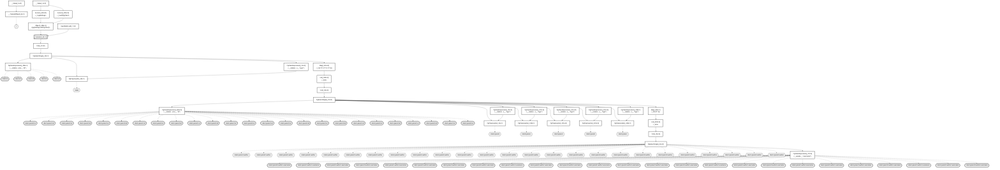

```mermaid
graph TD
    classDef path fill:#eee,stroke:#000,color:#000
    classDef plan fill:#fff,stroke-width:3px,color:#000
    classDef itemplan fill:#fff,stroke-width:6px,color:#000
    classDef sideeffectplan fill:#f00,stroke-width:6px,color:#000
    classDef bucket fill:#f6f6f6,color:#000,stroke-width:6px

    %% subgraph fields
    P1{{"~"}}:::path
    P2{{">item"}}:::path
    P3{{">item>parent"}}:::path
    P4([">item>parent>id"]):::path
    %% P3 -.-> P4
    P5{{">item>parent>author"}}:::path
    P6([">item>parent>author>username"]):::path
    %% P5 -.-> P6
    %% P3 -.-> P5
    P7([">item>parent>id"]):::path
    %% P3 -.-> P7
    P8{{">item>parent>author"}}:::path
    P9([">item>parent>author>username"]):::path
    %% P8 -.-> P9
    %% P3 -.-> P8
    P10([">item>parent>id"]):::path
    %% P3 -.-> P10
    P11{{">item>parent>author"}}:::path
    P12([">item>parent>author>username"]):::path
    %% P11 -.-> P12
    %% P3 -.-> P11
    P13([">item>parent>id"]):::path
    %% P3 -.-> P13
    P14{{">item>parent>author"}}:::path
    P15([">item>parent>author>username"]):::path
    %% P14 -.-> P15
    %% P3 -.-> P14
    P16([">item>parent>id"]):::path
    %% P3 -.-> P16
    P17{{">item>parent>author"}}:::path
    P18([">item>parent>author>username"]):::path
    %% P17 -.-> P18
    %% P3 -.-> P17
    %% P2 -.-> P3
    P19([">item>id"]):::path
    %% P2 -.-> P19
    P20{{">item>parent"}}:::path
    P21([">item>parent>id"]):::path
    %% P20 -.-> P21
    P22{{">item>parent>author"}}:::path
    P23([">item>parent>author>username"]):::path
    %% P22 -.-> P23
    %% P20 -.-> P22
    P24([">item>parent>id"]):::path
    %% P20 -.-> P24
    P25{{">item>parent>author"}}:::path
    P26([">item>parent>author>username"]):::path
    %% P25 -.-> P26
    %% P20 -.-> P25
    P27([">item>parent>id"]):::path
    %% P20 -.-> P27
    P28{{">item>parent>author"}}:::path
    P29([">item>parent>author>username"]):::path
    %% P28 -.-> P29
    %% P20 -.-> P28
    P30([">item>parent>id"]):::path
    %% P20 -.-> P30
    P31{{">item>parent>author"}}:::path
    P32([">item>parent>author>username"]):::path
    %% P31 -.-> P32
    %% P20 -.-> P31
    P33([">item>parent>id"]):::path
    %% P20 -.-> P33
    P34{{">item>parent>author"}}:::path
    P35([">item>parent>author>username"]):::path
    %% P34 -.-> P35
    %% P20 -.-> P34
    %% P2 -.-> P20
    P36([">item>id"]):::path
    %% P2 -.-> P36
    P37{{">item>parent"}}:::path
    P38([">item>parent>id"]):::path
    %% P37 -.-> P38
    P39{{">item>parent>author"}}:::path
    P40([">item>parent>author>username"]):::path
    %% P39 -.-> P40
    %% P37 -.-> P39
    P41([">item>parent>id"]):::path
    %% P37 -.-> P41
    P42{{">item>parent>author"}}:::path
    P43([">item>parent>author>username"]):::path
    %% P42 -.-> P43
    %% P37 -.-> P42
    P44([">item>parent>id"]):::path
    %% P37 -.-> P44
    P45{{">item>parent>author"}}:::path
    P46([">item>parent>author>username"]):::path
    %% P45 -.-> P46
    %% P37 -.-> P45
    P47([">item>parent>id"]):::path
    %% P37 -.-> P47
    P48{{">item>parent>author"}}:::path
    P49([">item>parent>author>username"]):::path
    %% P48 -.-> P49
    %% P37 -.-> P48
    P50([">item>parent>id"]):::path
    %% P37 -.-> P50
    P51{{">item>parent>author"}}:::path
    P52([">item>parent>author>username"]):::path
    %% P51 -.-> P52
    %% P37 -.-> P51
    %% P2 -.-> P37
    P53([">item>id"]):::path
    %% P2 -.-> P53
    P54{{">item>parent"}}:::path
    P55([">item>parent>id"]):::path
    %% P54 -.-> P55
    P56{{">item>parent>author"}}:::path
    P57([">item>parent>author>username"]):::path
    %% P56 -.-> P57
    %% P54 -.-> P56
    P58([">item>parent>id"]):::path
    %% P54 -.-> P58
    P59{{">item>parent>author"}}:::path
    P60([">item>parent>author>username"]):::path
    %% P59 -.-> P60
    %% P54 -.-> P59
    P61([">item>parent>id"]):::path
    %% P54 -.-> P61
    P62{{">item>parent>author"}}:::path
    P63([">item>parent>author>username"]):::path
    %% P62 -.-> P63
    %% P54 -.-> P62
    P64([">item>parent>id"]):::path
    %% P54 -.-> P64
    P65{{">item>parent>author"}}:::path
    P66([">item>parent>author>username"]):::path
    %% P65 -.-> P66
    %% P54 -.-> P65
    P67([">item>parent>id"]):::path
    %% P54 -.-> P67
    P68{{">item>parent>author"}}:::path
    P69([">item>parent>author>username"]):::path
    %% P68 -.-> P69
    %% P54 -.-> P68
    %% P2 -.-> P54
    P70([">item>id"]):::path
    %% P2 -.-> P70
    P71{{">item>parent"}}:::path
    P72([">item>parent>id"]):::path
    %% P71 -.-> P72
    P73{{">item>parent>author"}}:::path
    P74([">item>parent>author>username"]):::path
    %% P73 -.-> P74
    %% P71 -.-> P73
    P75([">item>parent>id"]):::path
    %% P71 -.-> P75
    P76{{">item>parent>author"}}:::path
    P77([">item>parent>author>username"]):::path
    %% P76 -.-> P77
    %% P71 -.-> P76
    P78([">item>parent>id"]):::path
    %% P71 -.-> P78
    P79{{">item>parent>author"}}:::path
    P80([">item>parent>author>username"]):::path
    %% P79 -.-> P80
    %% P71 -.-> P79
    P81([">item>parent>id"]):::path
    %% P71 -.-> P81
    P82{{">item>parent>author"}}:::path
    P83([">item>parent>author>username"]):::path
    %% P82 -.-> P83
    %% P71 -.-> P82
    P84([">item>parent>id"]):::path
    %% P71 -.-> P84
    P85{{">item>parent>author"}}:::path
    P86([">item>parent>author>username"]):::path
    %% P85 -.-> P86
    %% P71 -.-> P85
    %% P2 -.-> P71
    P87([">item>id"]):::path
    %% P2 -.-> P87
    %% P1 -.-> P2
    %% end

    %% define plans
    __Value_3["__Value[_3∈0]<br /><context>"]:::plan
    __Value_5["__Value[_5∈0]<br /><rootValue>"]:::plan
    __TrackedObject_6["__TrackedObject[_6∈0]"]:::plan
    InputStaticLeaf_7["InputStaticLeaf[_7∈0]"]:::plan
    PgSelect_8[["PgSelect[_8∈0]<br /><relational_items>"]]:::plan
    First_12["First[_12∈0]"]:::plan
    PgSelectSingle_13["PgSelectSingle[_13∈0]<br /><relational_items>"]:::plan
    PgClassExpression_14["PgClassExpression[_14∈0]<br /><__relation...s__.#quot;type#quot;>"]:::plan
    PgPolymorphic_15["PgPolymorphic[_15∈0]"]:::plan
    First_28["First[_28∈0]"]:::plan
    PgSelectSingle_29["PgSelectSingle[_29∈0]<br /><relational_items>"]:::plan
    PgClassExpression_30["PgClassExpression[_30∈0]<br /><__relation...s__.#quot;type#quot;>"]:::plan
    PgPolymorphic_31["PgPolymorphic[_31∈0]"]:::plan
    First_45["First[_45∈0]"]:::plan
    PgSelectSingle_46["PgSelectSingle[_46∈0]<br /><people>"]:::plan
    PgClassExpression_47["PgClassExpression[_47∈0]<br /><__people__.#quot;username#quot;>"]:::plan
    PgClassExpression_127["PgClassExpression[_127∈0]<br /><__relation...s__.#quot;type#quot;>"]:::plan
    PgPolymorphic_128["PgPolymorphic[_128∈0]"]:::plan
    PgClassExpression_224["PgClassExpression[_224∈0]<br /><__relation...s__.#quot;type#quot;>"]:::plan
    PgPolymorphic_225["PgPolymorphic[_225∈0]"]:::plan
    PgClassExpression_321["PgClassExpression[_321∈0]<br /><__relation...s__.#quot;type#quot;>"]:::plan
    PgPolymorphic_322["PgPolymorphic[_322∈0]"]:::plan
    PgClassExpression_404["PgClassExpression[_404∈0]<br /><__relation...ems__.#quot;id#quot;>"]:::plan
    PgClassExpression_418["PgClassExpression[_418∈0]<br /><__relation...s__.#quot;type#quot;>"]:::plan
    PgPolymorphic_419["PgPolymorphic[_419∈0]"]:::plan
    PgClassExpression_484["PgClassExpression[_484∈0]<br /><__relation...ems__.#quot;id#quot;>"]:::plan
    Access_494["Access[_494∈0]<br /><_3.pgSettings>"]:::plan
    Access_495["Access[_495∈0]<br /><_3.withPgClient>"]:::plan
    Object_496["Object[_496∈0]<br /><{pgSettings,withPgClient}>"]:::plan
    Map_501["Map[_501∈0]<br /><_29:{#quot;0#quot;:2}>"]:::plan
    List_502["List[_502∈0]<br /><_501>"]:::plan
    Map_503["Map[_503∈0]<br /><_13:{#quot;0#quot;:2,#quot;1#quot;:3,#quot;2#quot;:4}>"]:::plan
    List_504["List[_504∈0]<br /><_503>"]:::plan

    %% plan dependencies
    __Value_5 --> __TrackedObject_6
    Object_496 --> PgSelect_8
    InputStaticLeaf_7 --> PgSelect_8
    PgSelect_8 --> First_12
    First_12 --> PgSelectSingle_13
    PgSelectSingle_13 --> PgClassExpression_14
    PgSelectSingle_13 --> PgPolymorphic_15
    PgClassExpression_14 --> PgPolymorphic_15
    List_504 --> First_28
    First_28 --> PgSelectSingle_29
    PgSelectSingle_29 --> PgClassExpression_30
    PgSelectSingle_29 --> PgPolymorphic_31
    PgClassExpression_30 --> PgPolymorphic_31
    List_502 --> First_45
    First_45 --> PgSelectSingle_46
    PgSelectSingle_46 --> PgClassExpression_47
    PgSelectSingle_29 --> PgClassExpression_127
    PgSelectSingle_29 --> PgPolymorphic_128
    PgClassExpression_127 --> PgPolymorphic_128
    PgSelectSingle_29 --> PgClassExpression_224
    PgSelectSingle_29 --> PgPolymorphic_225
    PgClassExpression_224 --> PgPolymorphic_225
    PgSelectSingle_29 --> PgClassExpression_321
    PgSelectSingle_29 --> PgPolymorphic_322
    PgClassExpression_321 --> PgPolymorphic_322
    PgSelectSingle_13 --> PgClassExpression_404
    PgSelectSingle_29 --> PgClassExpression_418
    PgSelectSingle_29 --> PgPolymorphic_419
    PgClassExpression_418 --> PgPolymorphic_419
    PgSelectSingle_29 --> PgClassExpression_484
    __Value_3 --> Access_494
    __Value_3 --> Access_495
    Access_494 --> Object_496
    Access_495 --> Object_496
    PgSelectSingle_29 --> Map_501
    Map_501 --> List_502
    PgSelectSingle_13 --> Map_503
    Map_503 --> List_504

    %% plan-to-path relationships
    __TrackedObject_6 -.-> P1
    PgPolymorphic_15 -.-> P2
    PgPolymorphic_31 -.-> P3
    PgClassExpression_484 -.-> P4
    PgSelectSingle_46 -.-> P5
    PgClassExpression_47 -.-> P6
    PgClassExpression_484 -.-> P7
    PgSelectSingle_46 -.-> P8
    PgClassExpression_47 -.-> P9
    PgClassExpression_484 -.-> P10
    PgSelectSingle_46 -.-> P11
    PgClassExpression_47 -.-> P12
    PgClassExpression_484 -.-> P13
    PgSelectSingle_46 -.-> P14
    PgClassExpression_47 -.-> P15
    PgClassExpression_484 -.-> P16
    PgSelectSingle_46 -.-> P17
    PgClassExpression_47 -.-> P18
    PgClassExpression_404 -.-> P19
    PgPolymorphic_128 -.-> P20
    PgClassExpression_484 -.-> P21
    PgSelectSingle_46 -.-> P22
    PgClassExpression_47 -.-> P23
    PgClassExpression_484 -.-> P24
    PgSelectSingle_46 -.-> P25
    PgClassExpression_47 -.-> P26
    PgClassExpression_484 -.-> P27
    PgSelectSingle_46 -.-> P28
    PgClassExpression_47 -.-> P29
    PgClassExpression_484 -.-> P30
    PgSelectSingle_46 -.-> P31
    PgClassExpression_47 -.-> P32
    PgClassExpression_484 -.-> P33
    PgSelectSingle_46 -.-> P34
    PgClassExpression_47 -.-> P35
    PgClassExpression_404 -.-> P36
    PgPolymorphic_225 -.-> P37
    PgClassExpression_484 -.-> P38
    PgSelectSingle_46 -.-> P39
    PgClassExpression_47 -.-> P40
    PgClassExpression_484 -.-> P41
    PgSelectSingle_46 -.-> P42
    PgClassExpression_47 -.-> P43
    PgClassExpression_484 -.-> P44
    PgSelectSingle_46 -.-> P45
    PgClassExpression_47 -.-> P46
    PgClassExpression_484 -.-> P47
    PgSelectSingle_46 -.-> P48
    PgClassExpression_47 -.-> P49
    PgClassExpression_484 -.-> P50
    PgSelectSingle_46 -.-> P51
    PgClassExpression_47 -.-> P52
    PgClassExpression_404 -.-> P53
    PgPolymorphic_322 -.-> P54
    PgClassExpression_484 -.-> P55
    PgSelectSingle_46 -.-> P56
    PgClassExpression_47 -.-> P57
    PgClassExpression_484 -.-> P58
    PgSelectSingle_46 -.-> P59
    PgClassExpression_47 -.-> P60
    PgClassExpression_484 -.-> P61
    PgSelectSingle_46 -.-> P62
    PgClassExpression_47 -.-> P63
    PgClassExpression_484 -.-> P64
    PgSelectSingle_46 -.-> P65
    PgClassExpression_47 -.-> P66
    PgClassExpression_484 -.-> P67
    PgSelectSingle_46 -.-> P68
    PgClassExpression_47 -.-> P69
    PgClassExpression_404 -.-> P70
    PgPolymorphic_419 -.-> P71
    PgClassExpression_484 -.-> P72
    PgSelectSingle_46 -.-> P73
    PgClassExpression_47 -.-> P74
    PgClassExpression_484 -.-> P75
    PgSelectSingle_46 -.-> P76
    PgClassExpression_47 -.-> P77
    PgClassExpression_484 -.-> P78
    PgSelectSingle_46 -.-> P79
    PgClassExpression_47 -.-> P80
    PgClassExpression_484 -.-> P81
    PgSelectSingle_46 -.-> P82
    PgClassExpression_47 -.-> P83
    PgClassExpression_484 -.-> P84
    PgSelectSingle_46 -.-> P85
    PgClassExpression_47 -.-> P86
    PgClassExpression_404 -.-> P87

    %% allocate buckets
    classDef bucket0 stroke:#696969
    class __Value_3,__Value_5,__TrackedObject_6,InputStaticLeaf_7,PgSelect_8,First_12,PgSelectSingle_13,PgClassExpression_14,PgPolymorphic_15,First_28,PgSelectSingle_29,PgClassExpression_30,PgPolymorphic_31,First_45,PgSelectSingle_46,PgClassExpression_47,PgClassExpression_127,PgPolymorphic_128,PgClassExpression_224,PgPolymorphic_225,PgClassExpression_321,PgPolymorphic_322,PgClassExpression_404,PgClassExpression_418,PgPolymorphic_419,PgClassExpression_484,Access_494,Access_495,Object_496,Map_501,List_502,Map_503,List_504 bucket0
```
