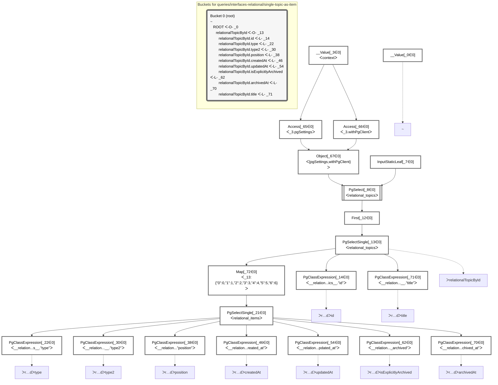

```mermaid
graph TD
    classDef path fill:#eee,stroke:#000,color:#000
    classDef plan fill:#fff,stroke-width:3px,color:#000
    classDef itemplan fill:#fff,stroke-width:6px,color:#000
    classDef sideeffectplan fill:#f00,stroke-width:6px,color:#000
    classDef bucket fill:#f6f6f6,color:#000,stroke-width:6px,text-align:left


    %% define plans
    __Value_0["__Value[_0∈0]"]:::plan
    PgClassExpression_14["PgClassExpression[_14∈0]<br />ᐸ__relation...ics__.”id”ᐳ"]:::plan
    PgClassExpression_22["PgClassExpression[_22∈0]<br />ᐸ__relation...s__.”type”ᐳ"]:::plan
    PgClassExpression_30["PgClassExpression[_30∈0]<br />ᐸ__relation...__.”type2”ᐳ"]:::plan
    PgClassExpression_38["PgClassExpression[_38∈0]<br />ᐸ__relation...”position”ᐳ"]:::plan
    PgClassExpression_46["PgClassExpression[_46∈0]<br />ᐸ__relation...reated_at”ᐳ"]:::plan
    PgClassExpression_54["PgClassExpression[_54∈0]<br />ᐸ__relation...pdated_at”ᐳ"]:::plan
    PgClassExpression_62["PgClassExpression[_62∈0]<br />ᐸ__relation..._archived”ᐳ"]:::plan
    PgClassExpression_70["PgClassExpression[_70∈0]<br />ᐸ__relation...chived_at”ᐳ"]:::plan
    PgSelectSingle_21["PgSelectSingle[_21∈0]<br />ᐸrelational_itemsᐳ"]:::plan
    Map_72["Map[_72∈0]<br />ᐸ_13:{”0”:0,”1”:1,”2”:2,”3”:3,”4”:4,”5”:5,”6”:6}ᐳ"]:::plan
    PgClassExpression_71["PgClassExpression[_71∈0]<br />ᐸ__relation...__.”title”ᐳ"]:::plan
    PgSelectSingle_13["PgSelectSingle[_13∈0]<br />ᐸrelational_topicsᐳ"]:::plan
    First_12["First[_12∈0]"]:::plan
    PgSelect_8[["PgSelect[_8∈0]<br />ᐸrelational_topicsᐳ"]]:::plan
    Object_67["Object[_67∈0]<br />ᐸ{pgSettings,withPgClient}ᐳ"]:::plan
    Access_65["Access[_65∈0]<br />ᐸ_3.pgSettingsᐳ"]:::plan
    Access_66["Access[_66∈0]<br />ᐸ_3.withPgClientᐳ"]:::plan
    __Value_3["__Value[_3∈0]<br />ᐸcontextᐳ"]:::plan
    InputStaticLeaf_7["InputStaticLeaf[_7∈0]"]:::plan

    %% plan dependencies
    PgSelectSingle_13 --> PgClassExpression_14
    PgSelectSingle_21 --> PgClassExpression_22
    PgSelectSingle_21 --> PgClassExpression_30
    PgSelectSingle_21 --> PgClassExpression_38
    PgSelectSingle_21 --> PgClassExpression_46
    PgSelectSingle_21 --> PgClassExpression_54
    PgSelectSingle_21 --> PgClassExpression_62
    PgSelectSingle_21 --> PgClassExpression_70
    Map_72 --> PgSelectSingle_21
    PgSelectSingle_13 --> Map_72
    PgSelectSingle_13 --> PgClassExpression_71
    First_12 --> PgSelectSingle_13
    PgSelect_8 --> First_12
    Object_67 & InputStaticLeaf_7 --> PgSelect_8
    Access_65 & Access_66 --> Object_67
    __Value_3 --> Access_65
    __Value_3 --> Access_66

    %% plan-to-path relationships
    P_0["~"]
    __Value_0 -.-> P_0
    P_13["ᐳrelationalTopicById"]
    PgSelectSingle_13 -.-> P_13
    P_14["ᐳr…dᐳid"]
    PgClassExpression_14 -.-> P_14
    P_22["ᐳr…dᐳtype"]
    PgClassExpression_22 -.-> P_22
    P_30["ᐳr…dᐳtype2"]
    PgClassExpression_30 -.-> P_30
    P_38["ᐳr…dᐳposition"]
    PgClassExpression_38 -.-> P_38
    P_46["ᐳr…dᐳcreatedAt"]
    PgClassExpression_46 -.-> P_46
    P_54["ᐳr…dᐳupdatedAt"]
    PgClassExpression_54 -.-> P_54
    P_62["ᐳr…dᐳisExplicitlyArchived"]
    PgClassExpression_62 -.-> P_62
    P_70["ᐳr…dᐳarchivedAt"]
    PgClassExpression_70 -.-> P_70
    P_71["ᐳr…dᐳtitle"]
    PgClassExpression_71 -.-> P_71

    subgraph "Buckets for queries/interfaces-relational/single-topic-as-item"
    Bucket0("Bucket 0 (root)<br />~<br />⠀ROOT ᐸ-O- _0<br />⠀⠀relationalTopicById ᐸ-O- _13<br />⠀⠀⠀relationalTopicById.id ᐸ-L- _14<br />⠀⠀⠀relationalTopicById.type ᐸ-L- _22<br />⠀⠀⠀relationalTopicById.type2 ᐸ-L- _30<br />⠀⠀⠀relationalTopicById.position ᐸ-L- _38<br />⠀⠀⠀relationalTopicById.createdAt ᐸ-L- _46<br />⠀⠀⠀relationalTopicById.updatedAt ᐸ-L- _54<br />⠀⠀⠀relationalTopicById.isExplicitlyArchived ᐸ-L- _62<br />⠀⠀⠀relationalTopicById.archivedAt ᐸ-L- _70<br />⠀⠀⠀relationalTopicById.title ᐸ-L- _71"):::bucket
    classDef bucket0 stroke:#696969
    class Bucket0,__Value_0,__Value_3,InputStaticLeaf_7,PgSelect_8,First_12,PgSelectSingle_13,PgClassExpression_14,PgSelectSingle_21,PgClassExpression_22,PgClassExpression_30,PgClassExpression_38,PgClassExpression_46,PgClassExpression_54,PgClassExpression_62,Access_65,Access_66,Object_67,PgClassExpression_70,PgClassExpression_71,Map_72 bucket0
    end
```
