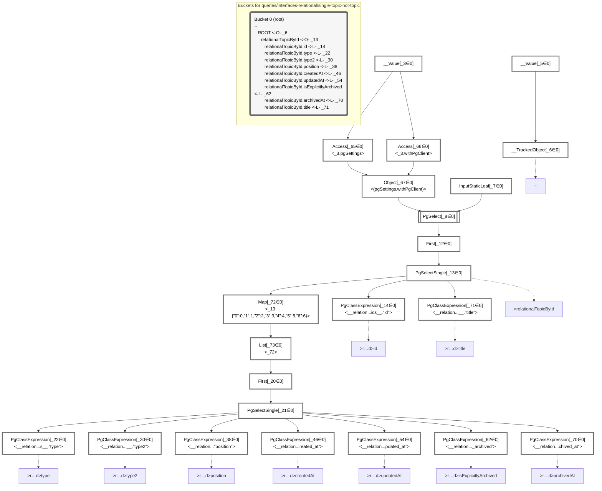

```mermaid
graph TD
    classDef path fill:#eee,stroke:#000,color:#000
    classDef plan fill:#fff,stroke-width:3px,color:#000
    classDef itemplan fill:#fff,stroke-width:6px,color:#000
    classDef sideeffectplan fill:#f00,stroke-width:6px,color:#000
    classDef bucket fill:#f6f6f6,color:#000,stroke-width:6px,text-align:left


    %% define plans
    __Value_3["__Value[_3∈0]<br /><context>"]:::plan
    __Value_5["__Value[_5∈0]<br /><rootValue>"]:::plan
    __TrackedObject_6["__TrackedObject[_6∈0]"]:::plan
    InputStaticLeaf_7["InputStaticLeaf[_7∈0]"]:::plan
    PgSelect_8[["PgSelect[_8∈0]<br /><relational_topics>"]]:::plan
    First_12["First[_12∈0]"]:::plan
    PgSelectSingle_13["PgSelectSingle[_13∈0]<br /><relational_topics>"]:::plan
    PgClassExpression_14["PgClassExpression[_14∈0]<br /><__relation...ics__.”id”>"]:::plan
    First_20["First[_20∈0]"]:::plan
    PgSelectSingle_21["PgSelectSingle[_21∈0]<br /><relational_items>"]:::plan
    PgClassExpression_22["PgClassExpression[_22∈0]<br /><__relation...s__.”type”>"]:::plan
    PgClassExpression_30["PgClassExpression[_30∈0]<br /><__relation...__.”type2”>"]:::plan
    PgClassExpression_38["PgClassExpression[_38∈0]<br /><__relation...”position”>"]:::plan
    PgClassExpression_46["PgClassExpression[_46∈0]<br /><__relation...reated_at”>"]:::plan
    PgClassExpression_54["PgClassExpression[_54∈0]<br /><__relation...pdated_at”>"]:::plan
    PgClassExpression_62["PgClassExpression[_62∈0]<br /><__relation..._archived”>"]:::plan
    Access_65["Access[_65∈0]<br /><_3.pgSettings>"]:::plan
    Access_66["Access[_66∈0]<br /><_3.withPgClient>"]:::plan
    Object_67["Object[_67∈0]<br /><{pgSettings,withPgClient}>"]:::plan
    PgClassExpression_70["PgClassExpression[_70∈0]<br /><__relation...chived_at”>"]:::plan
    PgClassExpression_71["PgClassExpression[_71∈0]<br /><__relation...__.”title”>"]:::plan
    Map_72["Map[_72∈0]<br /><_13:{”0”:0,”1”:1,”2”:2,”3”:3,”4”:4,”5”:5,”6”:6}>"]:::plan
    List_73["List[_73∈0]<br /><_72>"]:::plan

    %% plan dependencies
    __Value_5 --> __TrackedObject_6
    Object_67 --> PgSelect_8
    InputStaticLeaf_7 --> PgSelect_8
    PgSelect_8 --> First_12
    First_12 --> PgSelectSingle_13
    PgSelectSingle_13 --> PgClassExpression_14
    List_73 --> First_20
    First_20 --> PgSelectSingle_21
    PgSelectSingle_21 --> PgClassExpression_22
    PgSelectSingle_21 --> PgClassExpression_30
    PgSelectSingle_21 --> PgClassExpression_38
    PgSelectSingle_21 --> PgClassExpression_46
    PgSelectSingle_21 --> PgClassExpression_54
    PgSelectSingle_21 --> PgClassExpression_62
    __Value_3 --> Access_65
    __Value_3 --> Access_66
    Access_65 --> Object_67
    Access_66 --> Object_67
    PgSelectSingle_21 --> PgClassExpression_70
    PgSelectSingle_13 --> PgClassExpression_71
    PgSelectSingle_13 --> Map_72
    Map_72 --> List_73

    %% plan-to-path relationships
    P_6["~"]
    __TrackedObject_6 -.-> P_6
    P_13[">relationalTopicById"]
    PgSelectSingle_13 -.-> P_13
    P_14[">r…d>id"]
    PgClassExpression_14 -.-> P_14
    P_22[">r…d>type"]
    PgClassExpression_22 -.-> P_22
    P_30[">r…d>type2"]
    PgClassExpression_30 -.-> P_30
    P_38[">r…d>position"]
    PgClassExpression_38 -.-> P_38
    P_46[">r…d>createdAt"]
    PgClassExpression_46 -.-> P_46
    P_54[">r…d>updatedAt"]
    PgClassExpression_54 -.-> P_54
    P_62[">r…d>isExplicitlyArchived"]
    PgClassExpression_62 -.-> P_62
    P_70[">r…d>archivedAt"]
    PgClassExpression_70 -.-> P_70
    P_71[">r…d>title"]
    PgClassExpression_71 -.-> P_71

    %% allocate buckets
    classDef bucket0 stroke:#696969
    class __Value_3,__Value_5,__TrackedObject_6,InputStaticLeaf_7,PgSelect_8,First_12,PgSelectSingle_13,PgClassExpression_14,First_20,PgSelectSingle_21,PgClassExpression_22,PgClassExpression_30,PgClassExpression_38,PgClassExpression_46,PgClassExpression_54,PgClassExpression_62,Access_65,Access_66,Object_67,PgClassExpression_70,PgClassExpression_71,Map_72,List_73 bucket0

    subgraph "Buckets for queries/interfaces-relational/single-topic-not-topic"
    Bucket0("Bucket 0 (root)<br />~<br />⠀ROOT <-O- _6<br />⠀⠀relationalTopicById <-O- _13<br />⠀⠀⠀relationalTopicById.id <-L- _14<br />⠀⠀⠀relationalTopicById.type <-L- _22<br />⠀⠀⠀relationalTopicById.type2 <-L- _30<br />⠀⠀⠀relationalTopicById.position <-L- _38<br />⠀⠀⠀relationalTopicById.createdAt <-L- _46<br />⠀⠀⠀relationalTopicById.updatedAt <-L- _54<br />⠀⠀⠀relationalTopicById.isExplicitlyArchived <-L- _62<br />⠀⠀⠀relationalTopicById.archivedAt <-L- _70<br />⠀⠀⠀relationalTopicById.title <-L- _71"):::bucket
    style Bucket0 stroke:#696969
    end
```
