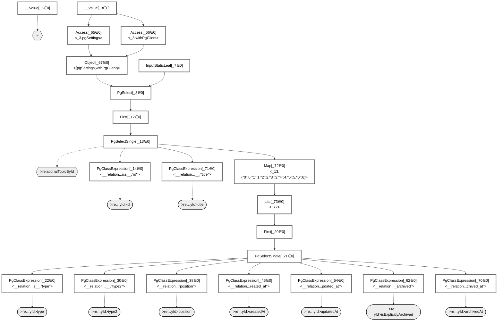

```mermaid
graph TD
    classDef path fill:#eee,stroke:#000,color:#000
    classDef plan fill:#fff,stroke-width:3px,color:#000
    classDef itemplan fill:#fff,stroke-width:6px,color:#000
    classDef sideeffectplan fill:#f00,stroke-width:6px,color:#000

    %% subgraph fields
    P1{{"~"}}:::path
    P2{{">relationalTopicById"}}:::path
    P3([">re…yId>id"]):::path
    %% P2 -.-> P3
    P4([">re…yId>type"]):::path
    %% P2 -.-> P4
    P5([">re…yId>type2"]):::path
    %% P2 -.-> P5
    P6([">re…yId>position"]):::path
    %% P2 -.-> P6
    P7([">re…yId>createdAt"]):::path
    %% P2 -.-> P7
    P8([">re…yId>updatedAt"]):::path
    %% P2 -.-> P8
    P9([">re…yId>isExplicitlyArchived"]):::path
    %% P2 -.-> P9
    P10([">re…yId>archivedAt"]):::path
    %% P2 -.-> P10
    P11([">re…yId>title"]):::path
    %% P2 -.-> P11
    %% P1 -.-> P2
    %% end

    %% define plans
    __Value_3["__Value[_3∈0]<br /><context>"]:::plan
    __Value_5["__Value[_5∈0]<br /><rootValue>"]:::plan
    InputStaticLeaf_7["InputStaticLeaf[_7∈0]"]:::plan
    PgSelect_8["PgSelect[_8∈0]<br /><relational_topics>"]:::plan
    First_12["First[_12∈0]"]:::plan
    PgSelectSingle_13["PgSelectSingle[_13∈0]<br /><relational_topics>"]:::plan
    PgClassExpression_14["PgClassExpression[_14∈0]<br /><__relation...ics__.#quot;id#quot;>"]:::plan
    First_20["First[_20∈0]"]:::plan
    PgSelectSingle_21["PgSelectSingle[_21∈0]<br /><relational_items>"]:::plan
    PgClassExpression_22["PgClassExpression[_22∈0]<br /><__relation...s__.#quot;type#quot;>"]:::plan
    PgClassExpression_30["PgClassExpression[_30∈0]<br /><__relation...__.#quot;type2#quot;>"]:::plan
    PgClassExpression_38["PgClassExpression[_38∈0]<br /><__relation...#quot;position#quot;>"]:::plan
    PgClassExpression_46["PgClassExpression[_46∈0]<br /><__relation...reated_at#quot;>"]:::plan
    PgClassExpression_54["PgClassExpression[_54∈0]<br /><__relation...pdated_at#quot;>"]:::plan
    PgClassExpression_62["PgClassExpression[_62∈0]<br /><__relation..._archived#quot;>"]:::plan
    Access_65["Access[_65∈0]<br /><_3.pgSettings>"]:::plan
    Access_66["Access[_66∈0]<br /><_3.withPgClient>"]:::plan
    Object_67["Object[_67∈0]<br /><{pgSettings,withPgClient}>"]:::plan
    PgClassExpression_70["PgClassExpression[_70∈0]<br /><__relation...chived_at#quot;>"]:::plan
    PgClassExpression_71["PgClassExpression[_71∈0]<br /><__relation...__.#quot;title#quot;>"]:::plan
    Map_72["Map[_72∈0]<br /><_13:{#quot;0#quot;:0,#quot;1#quot;:1,#quot;2#quot;:2,#quot;3#quot;:3,#quot;4#quot;:4,#quot;5#quot;:5,#quot;6#quot;:6}>"]:::plan
    List_73["List[_73∈0]<br /><_72>"]:::plan

    %% plan dependencies
    Object_67 --> PgSelect_8
    InputStaticLeaf_7 --> PgSelect_8
    PgSelect_8 --> First_12
    First_12 --> PgSelectSingle_13
    PgSelectSingle_13 --> PgClassExpression_14
    List_73 --> First_20
    First_20 --> PgSelectSingle_21
    PgSelectSingle_21 --> PgClassExpression_22
    PgSelectSingle_21 --> PgClassExpression_30
    PgSelectSingle_21 --> PgClassExpression_38
    PgSelectSingle_21 --> PgClassExpression_46
    PgSelectSingle_21 --> PgClassExpression_54
    PgSelectSingle_21 --> PgClassExpression_62
    __Value_3 --> Access_65
    __Value_3 --> Access_66
    Access_65 --> Object_67
    Access_66 --> Object_67
    PgSelectSingle_21 --> PgClassExpression_70
    PgSelectSingle_13 --> PgClassExpression_71
    PgSelectSingle_13 --> Map_72
    Map_72 --> List_73

    %% plan-to-path relationships
    __Value_5 -.-> P1
    PgSelectSingle_13 -.-> P2
    PgClassExpression_14 -.-> P3
    PgClassExpression_22 -.-> P4
    PgClassExpression_30 -.-> P5
    PgClassExpression_38 -.-> P6
    PgClassExpression_46 -.-> P7
    PgClassExpression_54 -.-> P8
    PgClassExpression_62 -.-> P9
    PgClassExpression_70 -.-> P10
    PgClassExpression_71 -.-> P11

    %% allocate buckets
    classDef bucket0 stroke:#696969
    class __Value_3,__Value_5,InputStaticLeaf_7,PgSelect_8,First_12,PgSelectSingle_13,PgClassExpression_14,First_20,PgSelectSingle_21,PgClassExpression_22,PgClassExpression_30,PgClassExpression_38,PgClassExpression_46,PgClassExpression_54,PgClassExpression_62,Access_65,Access_66,Object_67,PgClassExpression_70,PgClassExpression_71,Map_72,List_73 bucket0
```
