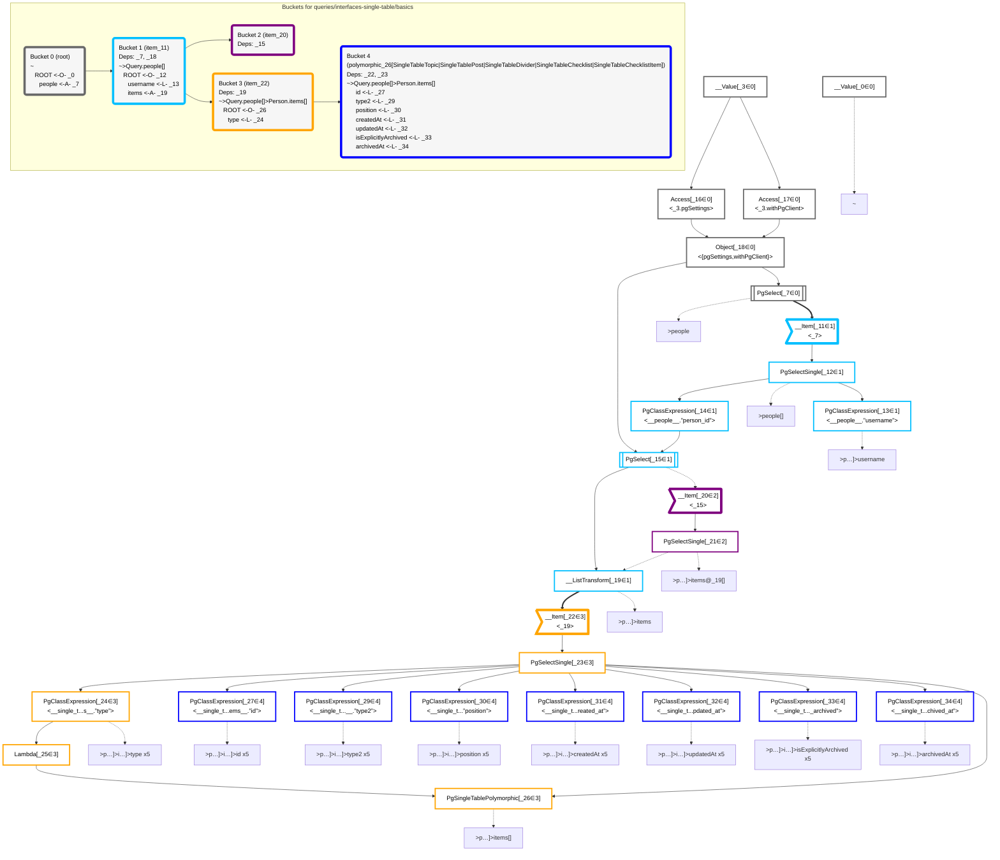

```mermaid
graph TD
    classDef path fill:#eee,stroke:#000,color:#000
    classDef plan fill:#fff,stroke-width:3px,color:#000
    classDef itemplan fill:#fff,stroke-width:6px,color:#000
    classDef sideeffectplan fill:#f00,stroke-width:6px,color:#000
    classDef bucket fill:#f6f6f6,color:#000,stroke-width:6px,text-align:left


    %% define plans
    __Value_0["__Value[_0∈0]"]:::plan
    __Value_3["__Value[_3∈0]<br /><context>"]:::plan
    PgSelect_7[["PgSelect[_7∈0]<br /><people>"]]:::plan
    __Item_11>"__Item[_11∈1]<br /><_7>"]:::itemplan
    PgSelectSingle_12["PgSelectSingle[_12∈1]<br /><people>"]:::plan
    PgClassExpression_13["PgClassExpression[_13∈1]<br /><__people__.”username”>"]:::plan
    PgClassExpression_14["PgClassExpression[_14∈1]<br /><__people__.”person_id”>"]:::plan
    PgSelect_15[["PgSelect[_15∈1]<br /><single_table_items>"]]:::plan
    Access_16["Access[_16∈0]<br /><_3.pgSettings>"]:::plan
    Access_17["Access[_17∈0]<br /><_3.withPgClient>"]:::plan
    Object_18["Object[_18∈0]<br /><{pgSettings,withPgClient}>"]:::plan
    __ListTransform_19["__ListTransform[_19∈1]<br /><each:_15>"]:::plan
    __Item_20>"__Item[_20∈2]<br /><_15>"]:::itemplan
    PgSelectSingle_21["PgSelectSingle[_21∈2]<br /><single_table_items>"]:::plan
    __Item_22>"__Item[_22∈3]<br /><_19>"]:::itemplan
    PgSelectSingle_23["PgSelectSingle[_23∈3]<br /><single_table_items>"]:::plan
    PgClassExpression_24["PgClassExpression[_24∈3]<br /><__single_t...s__.”type”>"]:::plan
    Lambda_25["Lambda[_25∈3]"]:::plan
    PgSingleTablePolymorphic_26["PgSingleTablePolymorphic[_26∈3]"]:::plan
    PgClassExpression_27["PgClassExpression[_27∈4]<br /><__single_t...ems__.”id”>"]:::plan
    PgClassExpression_29["PgClassExpression[_29∈4]<br /><__single_t...__.”type2”>"]:::plan
    PgClassExpression_30["PgClassExpression[_30∈4]<br /><__single_t...”position”>"]:::plan
    PgClassExpression_31["PgClassExpression[_31∈4]<br /><__single_t...reated_at”>"]:::plan
    PgClassExpression_32["PgClassExpression[_32∈4]<br /><__single_t...pdated_at”>"]:::plan
    PgClassExpression_33["PgClassExpression[_33∈4]<br /><__single_t..._archived”>"]:::plan
    PgClassExpression_34["PgClassExpression[_34∈4]<br /><__single_t...chived_at”>"]:::plan

    %% plan dependencies
    Object_18 --> PgSelect_7
    PgSelect_7 ==> __Item_11
    __Item_11 --> PgSelectSingle_12
    PgSelectSingle_12 --> PgClassExpression_13
    PgSelectSingle_12 --> PgClassExpression_14
    Object_18 --> PgSelect_15
    PgClassExpression_14 --> PgSelect_15
    __Value_3 --> Access_16
    __Value_3 --> Access_17
    Access_16 --> Object_18
    Access_17 --> Object_18
    PgSelect_15 --> __ListTransform_19
    PgSelectSingle_21 -.-> __ListTransform_19
    PgSelect_15 -.-> __Item_20
    __Item_20 --> PgSelectSingle_21
    __ListTransform_19 ==> __Item_22
    __Item_22 --> PgSelectSingle_23
    PgSelectSingle_23 --> PgClassExpression_24
    PgClassExpression_24 --> Lambda_25
    Lambda_25 --> PgSingleTablePolymorphic_26
    PgSelectSingle_23 --> PgSingleTablePolymorphic_26
    PgSelectSingle_23 --> PgClassExpression_27
    PgSelectSingle_23 --> PgClassExpression_29
    PgSelectSingle_23 --> PgClassExpression_30
    PgSelectSingle_23 --> PgClassExpression_31
    PgSelectSingle_23 --> PgClassExpression_32
    PgSelectSingle_23 --> PgClassExpression_33
    PgSelectSingle_23 --> PgClassExpression_34

    %% plan-to-path relationships
    P_0["~"]
    __Value_0 -.-> P_0
    P_7[">people"]
    PgSelect_7 -.-> P_7
    P_12[">people[]"]
    PgSelectSingle_12 -.-> P_12
    P_13[">p…]>username"]
    PgClassExpression_13 -.-> P_13
    P_19[">p…]>items"]
    __ListTransform_19 -.-> P_19
    P_21[">p…]>items@_19[]"]
    PgSelectSingle_21 -.-> P_21
    P_24[">p…]>i…]>type x5"]
    PgClassExpression_24 -.-> P_24
    P_26[">p…]>items[]"]
    PgSingleTablePolymorphic_26 -.-> P_26
    P_27[">p…]>i…]>id x5"]
    PgClassExpression_27 -.-> P_27
    P_29[">p…]>i…]>type2 x5"]
    PgClassExpression_29 -.-> P_29
    P_30[">p…]>i…]>position x5"]
    PgClassExpression_30 -.-> P_30
    P_31[">p…]>i…]>createdAt x5"]
    PgClassExpression_31 -.-> P_31
    P_32[">p…]>i…]>updatedAt x5"]
    PgClassExpression_32 -.-> P_32
    P_33[">p…]>i…]>isExplicitlyArchived x5"]
    PgClassExpression_33 -.-> P_33
    P_34[">p…]>i…]>archivedAt x5"]
    PgClassExpression_34 -.-> P_34

    %% allocate buckets
    classDef bucket0 stroke:#696969
    class __Value_0,__Value_3,PgSelect_7,Access_16,Access_17,Object_18 bucket0
    classDef bucket1 stroke:#00bfff
    class __Item_11,PgSelectSingle_12,PgClassExpression_13,PgClassExpression_14,PgSelect_15,__ListTransform_19 bucket1
    classDef bucket2 stroke:#7f007f
    class __Item_20,PgSelectSingle_21 bucket2
    classDef bucket3 stroke:#ffa500
    class __Item_22,PgSelectSingle_23,PgClassExpression_24,Lambda_25,PgSingleTablePolymorphic_26 bucket3
    classDef bucket4 stroke:#0000ff
    class PgClassExpression_27,PgClassExpression_29,PgClassExpression_30,PgClassExpression_31,PgClassExpression_32,PgClassExpression_33,PgClassExpression_34 bucket4

    subgraph "Buckets for queries/interfaces-single-table/basics"
    Bucket0("Bucket 0 (root)<br />~<br />⠀ROOT <-O- _0<br />⠀⠀people <-A- _7"):::bucket
    style Bucket0 stroke:#696969
    Bucket1("Bucket 1 (item_11)<br />Deps: _7, _18<br />~>Query.people[]<br />⠀ROOT <-O- _12<br />⠀⠀username <-L- _13<br />⠀⠀items <-A- _19"):::bucket
    style Bucket1 stroke:#00bfff
    Bucket0 --> Bucket1
    Bucket2("Bucket 2 (item_20)<br />Deps: _15"):::bucket
    style Bucket2 stroke:#7f007f
    Bucket1 --> Bucket2
    Bucket3("Bucket 3 (item_22)<br />Deps: _19<br />~>Query.people[]>Person.items[]<br />⠀ROOT <-O- _26<br />⠀⠀type <-L- _24"):::bucket
    style Bucket3 stroke:#ffa500
    Bucket1 --> Bucket3
    Bucket4("Bucket 4 (polymorphic_26[SingleTableTopic|SingleTablePost|SingleTableDivider|SingleTableChecklist|SingleTableChecklistItem])<br />Deps: _22, _23<br />~>Query.people[]>Person.items[]<br />⠀⠀id <-L- _27<br />⠀⠀type2 <-L- _29<br />⠀⠀position <-L- _30<br />⠀⠀createdAt <-L- _31<br />⠀⠀updatedAt <-L- _32<br />⠀⠀isExplicitlyArchived <-L- _33<br />⠀⠀archivedAt <-L- _34"):::bucket
    style Bucket4 stroke:#0000ff
    Bucket3 --> Bucket4
    end
```
