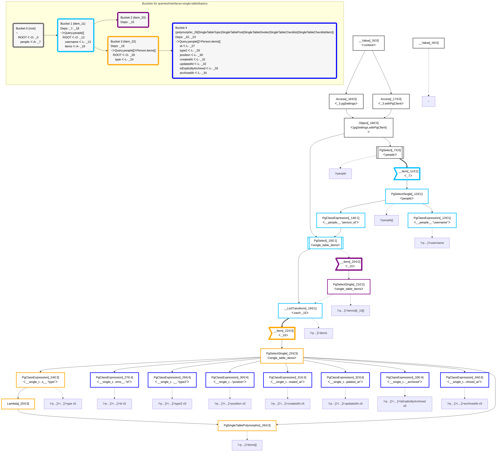

```mermaid
graph TD
    classDef path fill:#eee,stroke:#000,color:#000
    classDef plan fill:#fff,stroke-width:3px,color:#000
    classDef itemplan fill:#fff,stroke-width:6px,color:#000
    classDef sideeffectplan fill:#f00,stroke-width:6px,color:#000
    classDef bucket fill:#f6f6f6,color:#000,stroke-width:6px,text-align:left


    %% define plans
    __Value_0["__Value[_0∈0]"]:::plan
    PgClassExpression_13["PgClassExpression[_13∈1]<br />ᐸ__people__.”username”ᐳ"]:::plan
    PgSingleTablePolymorphic_26["PgSingleTablePolymorphic[_26∈3]"]:::plan
    Lambda_25["Lambda[_25∈3]"]:::plan
    PgClassExpression_24["PgClassExpression[_24∈3]<br />ᐸ__single_t...s__.”type”ᐳ"]:::plan
    PgClassExpression_27["PgClassExpression[_27∈4]<br />ᐸ__single_t...ems__.”id”ᐳ"]:::plan
    PgClassExpression_29["PgClassExpression[_29∈4]<br />ᐸ__single_t...__.”type2”ᐳ"]:::plan
    PgClassExpression_30["PgClassExpression[_30∈4]<br />ᐸ__single_t...”position”ᐳ"]:::plan
    PgClassExpression_31["PgClassExpression[_31∈4]<br />ᐸ__single_t...reated_at”ᐳ"]:::plan
    PgClassExpression_32["PgClassExpression[_32∈4]<br />ᐸ__single_t...pdated_at”ᐳ"]:::plan
    PgClassExpression_33["PgClassExpression[_33∈4]<br />ᐸ__single_t..._archived”ᐳ"]:::plan
    PgClassExpression_34["PgClassExpression[_34∈4]<br />ᐸ__single_t...chived_at”ᐳ"]:::plan
    PgSelectSingle_23["PgSelectSingle[_23∈3]<br />ᐸsingle_table_itemsᐳ"]:::plan
    __Item_22>"__Item[_22∈3]<br />ᐸ_19ᐳ"]:::itemplan
    __ListTransform_19["__ListTransform[_19∈1]<br />ᐸeach:_15ᐳ"]:::plan
    PgSelectSingle_21["PgSelectSingle[_21∈2]<br />ᐸsingle_table_itemsᐳ"]:::plan
    __Item_20>"__Item[_20∈2]<br />ᐸ_15ᐳ"]:::itemplan
    PgSelect_15[["PgSelect[_15∈1]<br />ᐸsingle_table_itemsᐳ"]]:::plan
    PgClassExpression_14["PgClassExpression[_14∈1]<br />ᐸ__people__.”person_id”ᐳ"]:::plan
    PgSelectSingle_12["PgSelectSingle[_12∈1]<br />ᐸpeopleᐳ"]:::plan
    __Item_11>"__Item[_11∈1]<br />ᐸ_7ᐳ"]:::itemplan
    PgSelect_7[["PgSelect[_7∈0]<br />ᐸpeopleᐳ"]]:::plan
    Object_18["Object[_18∈0]<br />ᐸ{pgSettings,withPgClient}ᐳ"]:::plan
    Access_16["Access[_16∈0]<br />ᐸ_3.pgSettingsᐳ"]:::plan
    Access_17["Access[_17∈0]<br />ᐸ_3.withPgClientᐳ"]:::plan
    __Value_3["__Value[_3∈0]<br />ᐸcontextᐳ"]:::plan

    %% plan dependencies
    PgSelectSingle_12 --> PgClassExpression_13
    Lambda_25 & PgSelectSingle_23 --> PgSingleTablePolymorphic_26
    PgClassExpression_24 --> Lambda_25
    PgSelectSingle_23 --> PgClassExpression_24
    PgSelectSingle_23 --> PgClassExpression_27
    PgSelectSingle_23 --> PgClassExpression_29
    PgSelectSingle_23 --> PgClassExpression_30
    PgSelectSingle_23 --> PgClassExpression_31
    PgSelectSingle_23 --> PgClassExpression_32
    PgSelectSingle_23 --> PgClassExpression_33
    PgSelectSingle_23 --> PgClassExpression_34
    __Item_22 --> PgSelectSingle_23
    __ListTransform_19 ==> __Item_22
    PgSelect_15 --> __ListTransform_19
    PgSelectSingle_21 -.-> __ListTransform_19
    __Item_20 --> PgSelectSingle_21
    PgSelect_15 -.-> __Item_20
    Object_18 & PgClassExpression_14 --> PgSelect_15
    PgSelectSingle_12 --> PgClassExpression_14
    __Item_11 --> PgSelectSingle_12
    PgSelect_7 ==> __Item_11
    Object_18 --> PgSelect_7
    Access_16 & Access_17 --> Object_18
    __Value_3 --> Access_16
    __Value_3 --> Access_17

    %% plan-to-path relationships
    P_0["~"]
    __Value_0 -.-> P_0
    P_7["ᐳpeople"]
    PgSelect_7 -.-> P_7
    P_12["ᐳpeople[]"]
    PgSelectSingle_12 -.-> P_12
    P_13["ᐳp…]ᐳusername"]
    PgClassExpression_13 -.-> P_13
    P_19["ᐳp…]ᐳitems"]
    __ListTransform_19 -.-> P_19
    P_21["ᐳp…]ᐳitems@_19[]"]
    PgSelectSingle_21 -.-> P_21
    P_24["ᐳp…]ᐳi…]ᐳtype x5"]
    PgClassExpression_24 -.-> P_24
    P_26["ᐳp…]ᐳitems[]"]
    PgSingleTablePolymorphic_26 -.-> P_26
    P_27["ᐳp…]ᐳi…]ᐳid x5"]
    PgClassExpression_27 -.-> P_27
    P_29["ᐳp…]ᐳi…]ᐳtype2 x5"]
    PgClassExpression_29 -.-> P_29
    P_30["ᐳp…]ᐳi…]ᐳposition x5"]
    PgClassExpression_30 -.-> P_30
    P_31["ᐳp…]ᐳi…]ᐳcreatedAt x5"]
    PgClassExpression_31 -.-> P_31
    P_32["ᐳp…]ᐳi…]ᐳupdatedAt x5"]
    PgClassExpression_32 -.-> P_32
    P_33["ᐳp…]ᐳi…]ᐳisExplicitlyArchived x5"]
    PgClassExpression_33 -.-> P_33
    P_34["ᐳp…]ᐳi…]ᐳarchivedAt x5"]
    PgClassExpression_34 -.-> P_34

    subgraph "Buckets for queries/interfaces-single-table/basics"
    Bucket0("Bucket 0 (root)<br />~<br />⠀ROOT ᐸ-O- _0<br />⠀⠀people ᐸ-A- _7"):::bucket
    classDef bucket0 stroke:#696969
    class Bucket0,__Value_0,__Value_3,PgSelect_7,Access_16,Access_17,Object_18 bucket0
    Bucket1("Bucket 1 (item_11)<br />Deps: _7, _18<br />~ᐳQuery.people[]<br />⠀ROOT ᐸ-O- _12<br />⠀⠀username ᐸ-L- _13<br />⠀⠀items ᐸ-A- _19"):::bucket
    classDef bucket1 stroke:#00bfff
    class Bucket1,__Item_11,PgSelectSingle_12,PgClassExpression_13,PgClassExpression_14,PgSelect_15,__ListTransform_19 bucket1
    Bucket2("Bucket 2 (item_20)<br />Deps: _15"):::bucket
    classDef bucket2 stroke:#7f007f
    class Bucket2,__Item_20,PgSelectSingle_21 bucket2
    Bucket3("Bucket 3 (item_22)<br />Deps: _19<br />~ᐳQuery.people[]ᐳPerson.items[]<br />⠀ROOT ᐸ-O- _26<br />⠀⠀type ᐸ-L- _24"):::bucket
    classDef bucket3 stroke:#ffa500
    class Bucket3,__Item_22,PgSelectSingle_23,PgClassExpression_24,Lambda_25,PgSingleTablePolymorphic_26 bucket3
    Bucket4("Bucket 4 (polymorphic_26[SingleTableTopic|SingleTablePost|SingleTableDivider|SingleTableChecklist|SingleTableChecklistItem])<br />Deps: _22, _23<br />~ᐳQuery.people[]ᐳPerson.items[]<br />⠀⠀id ᐸ-L- _27<br />⠀⠀type2 ᐸ-L- _29<br />⠀⠀position ᐸ-L- _30<br />⠀⠀createdAt ᐸ-L- _31<br />⠀⠀updatedAt ᐸ-L- _32<br />⠀⠀isExplicitlyArchived ᐸ-L- _33<br />⠀⠀archivedAt ᐸ-L- _34"):::bucket
    classDef bucket4 stroke:#0000ff
    class Bucket4,PgClassExpression_27,PgClassExpression_29,PgClassExpression_30,PgClassExpression_31,PgClassExpression_32,PgClassExpression_33,PgClassExpression_34 bucket4
    Bucket0 --> Bucket1
    Bucket1 --> Bucket2 & Bucket3
    Bucket3 --> Bucket4
    end
```
