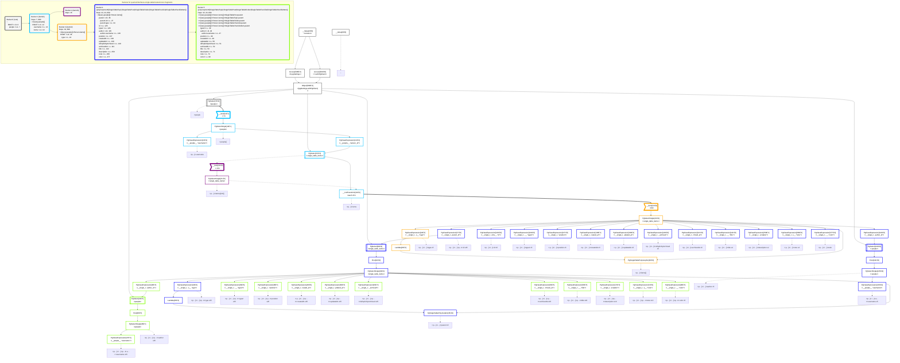

```mermaid
graph TD
    classDef path fill:#eee,stroke:#000,color:#000
    classDef plan fill:#fff,stroke-width:3px,color:#000
    classDef itemplan fill:#fff,stroke-width:6px,color:#000
    classDef sideeffectplan fill:#f00,stroke-width:6px,color:#000
    classDef bucket fill:#f6f6f6,color:#000,stroke-width:6px,text-align:left


    %% define plans
    __Value0["__Value[0∈0]"]:::plan
    PgClassExpression13["PgClassExpression[13∈1]<br />ᐸ__people__.”username”ᐳ"]:::plan
    PgSingleTablePolymorphic26["PgSingleTablePolymorphic[26∈3]"]:::plan
    Lambda25["Lambda[25∈3]"]:::plan
    PgClassExpression24["PgClassExpression[24∈3]<br />ᐸ__single_t...s__.”type”ᐳ"]:::plan
    PgSingleTablePolymorphic36["PgSingleTablePolymorphic[36∈4]"]:::plan
    Lambda35["Lambda[35∈4]"]:::plan
    PgClassExpression34["PgClassExpression[34∈4]<br />ᐸ__single_t...s__.”type”ᐳ"]:::plan
    PgClassExpression39["PgClassExpression[39∈5]<br />ᐸ__single_t...__.”type2”ᐳ"]:::plan
    PgClassExpression47["PgClassExpression[47∈5]<br />ᐸ__people__.”username”ᐳ"]:::plan
    PgSelectSingle46["PgSelectSingle[46∈5]<br />ᐸpeopleᐳ"]:::plan
    First45["First[45∈5]"]:::plan
    PgSelect41[["PgSelect[41∈5]<br />ᐸpeopleᐳ"]]:::plan
    PgClassExpression40["PgClassExpression[40∈5]<br />ᐸ__single_t...author_id”ᐳ"]:::plan
    PgClassExpression48["PgClassExpression[48∈5]<br />ᐸ__single_t...”position”ᐳ"]:::plan
    PgClassExpression49["PgClassExpression[49∈5]<br />ᐸ__single_t...reated_at”ᐳ"]:::plan
    PgClassExpression50["PgClassExpression[50∈5]<br />ᐸ__single_t...pdated_at”ᐳ"]:::plan
    PgClassExpression51["PgClassExpression[51∈5]<br />ᐸ__single_t..._archived”ᐳ"]:::plan
    PgClassExpression52["PgClassExpression[52∈5]<br />ᐸ__single_t...chived_at”ᐳ"]:::plan
    PgClassExpression53["PgClassExpression[53∈5]<br />ᐸ__single_t...__.”title”ᐳ"]:::plan
    PgClassExpression71["PgClassExpression[71∈5]<br />ᐸ__single_t...scription”ᐳ"]:::plan
    PgClassExpression72["PgClassExpression[72∈5]<br />ᐸ__single_t...s__.”note”ᐳ"]:::plan
    PgClassExpression90["PgClassExpression[90∈5]<br />ᐸ__single_t...__.”color”ᐳ"]:::plan
    PgSelectSingle33["PgSelectSingle[33∈4]<br />ᐸsingle_table_itemsᐳ"]:::plan
    First32["First[32∈4]"]:::plan
    PgSelect28[["PgSelect[28∈4]<br />ᐸsingle_table_itemsᐳ"]]:::plan
    PgClassExpression27["PgClassExpression[27∈4]<br />ᐸ__single_t...parent_id”ᐳ"]:::plan
    PgClassExpression126["PgClassExpression[126∈4]<br />ᐸ__single_t...ems__.”id”ᐳ"]:::plan
    PgClassExpression128["PgClassExpression[128∈4]<br />ᐸ__single_t...__.”type2”ᐳ"]:::plan
    PgClassExpression136["PgClassExpression[136∈4]<br />ᐸ__people__.”username”ᐳ"]:::plan
    PgSelectSingle135["PgSelectSingle[135∈4]<br />ᐸpeopleᐳ"]:::plan
    First134["First[134∈4]"]:::plan
    PgSelect130[["PgSelect[130∈4]<br />ᐸpeopleᐳ"]]:::plan
    PgClassExpression129["PgClassExpression[129∈4]<br />ᐸ__single_t...author_id”ᐳ"]:::plan
    PgClassExpression137["PgClassExpression[137∈4]<br />ᐸ__single_t...”position”ᐳ"]:::plan
    PgClassExpression138["PgClassExpression[138∈4]<br />ᐸ__single_t...reated_at”ᐳ"]:::plan
    PgClassExpression139["PgClassExpression[139∈4]<br />ᐸ__single_t...pdated_at”ᐳ"]:::plan
    PgClassExpression140["PgClassExpression[140∈4]<br />ᐸ__single_t..._archived”ᐳ"]:::plan
    PgClassExpression141["PgClassExpression[141∈4]<br />ᐸ__single_t...chived_at”ᐳ"]:::plan
    PgClassExpression142["PgClassExpression[142∈4]<br />ᐸ__single_t...__.”title”ᐳ"]:::plan
    PgClassExpression259["PgClassExpression[259∈4]<br />ᐸ__single_t...scription”ᐳ"]:::plan
    PgClassExpression260["PgClassExpression[260∈4]<br />ᐸ__single_t...s__.”note”ᐳ"]:::plan
    PgClassExpression377["PgClassExpression[377∈4]<br />ᐸ__single_t...__.”color”ᐳ"]:::plan
    PgSelectSingle23["PgSelectSingle[23∈3]<br />ᐸsingle_table_itemsᐳ"]:::plan
    __Item22>"__Item[22∈3]<br />ᐸ19ᐳ"]:::itemplan
    __ListTransform19["__ListTransform[19∈1]<br />ᐸeach:15ᐳ"]:::plan
    PgSelectSingle21["PgSelectSingle[21∈2]<br />ᐸsingle_table_itemsᐳ"]:::plan
    __Item20>"__Item[20∈2]<br />ᐸ15ᐳ"]:::itemplan
    PgSelect15[["PgSelect[15∈1]<br />ᐸsingle_table_itemsᐳ"]]:::plan
    PgClassExpression14["PgClassExpression[14∈1]<br />ᐸ__people__.”person_id”ᐳ"]:::plan
    PgSelectSingle12["PgSelectSingle[12∈1]<br />ᐸpeopleᐳ"]:::plan
    __Item11>"__Item[11∈1]<br />ᐸ7ᐳ"]:::itemplan
    PgSelect7[["PgSelect[7∈0]<br />ᐸpeopleᐳ"]]:::plan
    Object600["Object[600∈0]<br />ᐸ{pgSettings,withPgClient}ᐳ"]:::plan
    Access598["Access[598∈0]<br />ᐸ3.pgSettingsᐳ"]:::plan
    Access599["Access[599∈0]<br />ᐸ3.withPgClientᐳ"]:::plan
    __Value3["__Value[3∈0]<br />ᐸcontextᐳ"]:::plan

    %% plan dependencies
    PgSelectSingle12 --> PgClassExpression13
    Lambda25 & PgSelectSingle23 --> PgSingleTablePolymorphic26
    PgClassExpression24 --> Lambda25
    PgSelectSingle23 --> PgClassExpression24
    Lambda35 & PgSelectSingle33 --> PgSingleTablePolymorphic36
    PgClassExpression34 --> Lambda35
    PgSelectSingle33 --> PgClassExpression34
    PgSelectSingle33 --> PgClassExpression39
    PgSelectSingle46 --> PgClassExpression47
    First45 --> PgSelectSingle46
    PgSelect41 --> First45
    Object600 & PgClassExpression40 --> PgSelect41
    PgSelectSingle33 --> PgClassExpression40
    PgSelectSingle33 --> PgClassExpression48
    PgSelectSingle33 --> PgClassExpression49
    PgSelectSingle33 --> PgClassExpression50
    PgSelectSingle33 --> PgClassExpression51
    PgSelectSingle33 --> PgClassExpression52
    PgSelectSingle33 --> PgClassExpression53
    PgSelectSingle33 --> PgClassExpression71
    PgSelectSingle33 --> PgClassExpression72
    PgSelectSingle33 --> PgClassExpression90
    First32 --> PgSelectSingle33
    PgSelect28 --> First32
    Object600 & PgClassExpression27 --> PgSelect28
    PgSelectSingle23 --> PgClassExpression27
    PgSelectSingle23 --> PgClassExpression126
    PgSelectSingle23 --> PgClassExpression128
    PgSelectSingle135 --> PgClassExpression136
    First134 --> PgSelectSingle135
    PgSelect130 --> First134
    Object600 & PgClassExpression129 --> PgSelect130
    PgSelectSingle23 --> PgClassExpression129
    PgSelectSingle23 --> PgClassExpression137
    PgSelectSingle23 --> PgClassExpression138
    PgSelectSingle23 --> PgClassExpression139
    PgSelectSingle23 --> PgClassExpression140
    PgSelectSingle23 --> PgClassExpression141
    PgSelectSingle23 --> PgClassExpression142
    PgSelectSingle23 --> PgClassExpression259
    PgSelectSingle23 --> PgClassExpression260
    PgSelectSingle23 --> PgClassExpression377
    __Item22 --> PgSelectSingle23
    __ListTransform19 ==> __Item22
    PgSelect15 --> __ListTransform19
    PgSelectSingle21 -.-> __ListTransform19
    __Item20 --> PgSelectSingle21
    PgSelect15 -.-> __Item20
    Object600 & PgClassExpression14 --> PgSelect15
    PgSelectSingle12 --> PgClassExpression14
    __Item11 --> PgSelectSingle12
    PgSelect7 ==> __Item11
    Object600 --> PgSelect7
    Access598 & Access599 --> Object600
    __Value3 --> Access598
    __Value3 --> Access599

    %% plan-to-path relationships
    P0["~"]
    __Value0 -.-> P0
    P7["ᐳpeople"]
    PgSelect7 -.-> P7
    P12["ᐳpeople[]"]
    PgSelectSingle12 -.-> P12
    P13["ᐳp…]ᐳusername"]
    PgClassExpression13 -.-> P13
    P19["ᐳp…]ᐳitems"]
    __ListTransform19 -.-> P19
    P21["ᐳp…]ᐳitems@19[]"]
    PgSelectSingle21 -.-> P21
    P24["ᐳp…]ᐳi…]ᐳtype x5"]
    PgClassExpression24 -.-> P24
    P26["ᐳp…]ᐳitems[]"]
    PgSingleTablePolymorphic26 -.-> P26
    P27["ᐳp…]ᐳi…]ᐳp…tᐳid x25"]
    PgClassExpression27 -.-> P27
    P34["ᐳp…]ᐳi…]ᐳp…tᐳtype x25"]
    PgClassExpression34 -.-> P34
    P36["ᐳp…]ᐳi…]ᐳparent x5"]
    PgSingleTablePolymorphic36 -.-> P36
    P39["ᐳp…]ᐳi…]ᐳp…tᐳtype2 x25"]
    PgClassExpression39 -.-> P39
    P46["ᐳp…]ᐳi…]ᐳp…tᐳauthor x25"]
    PgSelectSingle46 -.-> P46
    P47["ᐳp…]ᐳi…]ᐳp…tᐳa…rᐳusername x25"]
    PgClassExpression47 -.-> P47
    P48["ᐳp…]ᐳi…]ᐳp…tᐳposition x25"]
    PgClassExpression48 -.-> P48
    P49["ᐳp…]ᐳi…]ᐳp…tᐳcreatedAt x25"]
    PgClassExpression49 -.-> P49
    P50["ᐳp…]ᐳi…]ᐳp…tᐳupdatedAt x25"]
    PgClassExpression50 -.-> P50
    P51["ᐳp…]ᐳi…]ᐳp…tᐳisExplicitlyArchived x25"]
    PgClassExpression51 -.-> P51
    P52["ᐳp…]ᐳi…]ᐳp…tᐳarchivedAt x25"]
    PgClassExpression52 -.-> P52
    P53["ᐳp…]ᐳi…]ᐳp…tᐳtitle x20"]
    PgClassExpression53 -.-> P53
    P71["ᐳp…]ᐳi…]ᐳp…tᐳdescription x10"]
    PgClassExpression71 -.-> P71
    P72["ᐳp…]ᐳi…]ᐳp…tᐳnote x10"]
    PgClassExpression72 -.-> P72
    P90["ᐳp…]ᐳi…]ᐳp…tᐳcolor x5"]
    PgClassExpression90 -.-> P90
    P126["ᐳp…]ᐳi…]ᐳid x5"]
    PgClassExpression126 -.-> P126
    P128["ᐳp…]ᐳi…]ᐳtype2 x5"]
    PgClassExpression128 -.-> P128
    P135["ᐳp…]ᐳi…]ᐳauthor x5"]
    PgSelectSingle135 -.-> P135
    P136["ᐳp…]ᐳi…]ᐳa…rᐳusername x5"]
    PgClassExpression136 -.-> P136
    P137["ᐳp…]ᐳi…]ᐳposition x5"]
    PgClassExpression137 -.-> P137
    P138["ᐳp…]ᐳi…]ᐳcreatedAt x5"]
    PgClassExpression138 -.-> P138
    P139["ᐳp…]ᐳi…]ᐳupdatedAt x5"]
    PgClassExpression139 -.-> P139
    P140["ᐳp…]ᐳi…]ᐳisExplicitlyArchived x5"]
    PgClassExpression140 -.-> P140
    P141["ᐳp…]ᐳi…]ᐳarchivedAt x5"]
    PgClassExpression141 -.-> P141
    P142["ᐳp…]ᐳi…]ᐳtitle x4"]
    PgClassExpression142 -.-> P142
    P259["ᐳp…]ᐳi…]ᐳdescription x2"]
    PgClassExpression259 -.-> P259
    P260["ᐳp…]ᐳi…]ᐳnote x2"]
    PgClassExpression260 -.-> P260
    P377["ᐳp…]ᐳi…]ᐳcolor"]
    PgClassExpression377 -.-> P377

    subgraph "Buckets for queries/interfaces-single-table/nested-more-fragments"
    Bucket0("Bucket 0 (root)<br />~<br />⠀ROOT ᐸ-O- 0<br />⠀⠀people ᐸ-A- 7"):::bucket
    classDef bucket0 stroke:#696969
    class Bucket0,__Value0,__Value3,PgSelect7,Access598,Access599,Object600 bucket0
    Bucket1("Bucket 1 (item11)<br />Deps: 7, 600<br />~ᐳQuery.people[]<br />⠀ROOT ᐸ-O- 12<br />⠀⠀username ᐸ-L- 13<br />⠀⠀items ᐸ-A- 19"):::bucket
    classDef bucket1 stroke:#00bfff
    class Bucket1,__Item11,PgSelectSingle12,PgClassExpression13,PgClassExpression14,PgSelect15,__ListTransform19 bucket1
    Bucket2("Bucket 2 (item20)<br />Deps: 15"):::bucket
    classDef bucket2 stroke:#7f007f
    class Bucket2,__Item20,PgSelectSingle21 bucket2
    Bucket3("Bucket 3 (item22)<br />Deps: 19, 600<br />~ᐳQuery.people[]ᐳPerson.items[]<br />⠀ROOT ᐸ-O- 26<br />⠀⠀type ᐸ-L- 24"):::bucket
    classDef bucket3 stroke:#ffa500
    class Bucket3,__Item22,PgSelectSingle23,PgClassExpression24,Lambda25,PgSingleTablePolymorphic26 bucket3
    Bucket4("Bucket 4 (polymorphic26[SingleTableTopic|SingleTablePost|SingleTableDivider|SingleTableChecklist|SingleTableChecklistItem])<br />Deps: 22, 23, 600<br />~ᐳQuery.people[]ᐳPerson.items[]<br />⠀⠀parent ᐸ-O- 36<br />⠀⠀⠀parent.id ᐸ-L- 27<br />⠀⠀⠀parent.type ᐸ-L- 34<br />⠀⠀id ᐸ-L- 126<br />⠀⠀type2 ᐸ-L- 128<br />⠀⠀author ᐸ-O- 135<br />⠀⠀⠀author.username ᐸ-L- 136<br />⠀⠀position ᐸ-L- 137<br />⠀⠀createdAt ᐸ-L- 138<br />⠀⠀updatedAt ᐸ-L- 139<br />⠀⠀isExplicitlyArchived ᐸ-L- 140<br />⠀⠀archivedAt ᐸ-L- 141<br />⠀⠀title ᐸ-L- 142<br />⠀⠀description ᐸ-L- 259<br />⠀⠀note ᐸ-L- 260<br />⠀⠀color ᐸ-L- 377"):::bucket
    classDef bucket4 stroke:#0000ff
    class Bucket4,PgClassExpression27,PgSelect28,First32,PgSelectSingle33,PgClassExpression34,Lambda35,PgSingleTablePolymorphic36,PgClassExpression126,PgClassExpression128,PgClassExpression129,PgSelect130,First134,PgSelectSingle135,PgClassExpression136,PgClassExpression137,PgClassExpression138,PgClassExpression139,PgClassExpression140,PgClassExpression141,PgClassExpression142,PgClassExpression259,PgClassExpression260,PgClassExpression377 bucket4
    Bucket5("Bucket 5 (polymorphic36[SingleTableTopic|SingleTablePost|SingleTableDivider|SingleTableChecklist|SingleTableChecklistItem])<br />Deps: 32, 33, 600<br />~ᐳQuery.people[]ᐳPerson.items[]ᐳSingleTablePost.parent<br />~ᐳQuery.people[]ᐳPerson.items[]ᐳSingleTableTopic.parent<br />~ᐳQuery.people[]ᐳPerson.items[]ᐳSingleTableDivider.parent<br />~ᐳQuery.people[]ᐳPerson.items[]ᐳSingleTableChecklist.parent<br />~ᐳQuery.people[]ᐳPerson.items[]ᐳSingleTableChecklistItem.parent<br />⠀⠀type2 ᐸ-L- 39<br />⠀⠀author ᐸ-O- 46<br />⠀⠀⠀author.username ᐸ-L- 47<br />⠀⠀position ᐸ-L- 48<br />⠀⠀createdAt ᐸ-L- 49<br />⠀⠀updatedAt ᐸ-L- 50<br />⠀⠀isExplicitlyArchived ᐸ-L- 51<br />⠀⠀archivedAt ᐸ-L- 52<br />⠀⠀title ᐸ-L- 53<br />⠀⠀description ᐸ-L- 71<br />⠀⠀note ᐸ-L- 72<br />⠀⠀color ᐸ-L- 90"):::bucket
    classDef bucket5 stroke:#7fff00
    class Bucket5,PgClassExpression39,PgClassExpression40,PgSelect41,First45,PgSelectSingle46,PgClassExpression47,PgClassExpression48,PgClassExpression49,PgClassExpression50,PgClassExpression51,PgClassExpression52,PgClassExpression53,PgClassExpression71,PgClassExpression72,PgClassExpression90 bucket5
    Bucket0 --> Bucket1
    Bucket1 --> Bucket2 & Bucket3
    Bucket3 --> Bucket4
    Bucket4 --> Bucket5
    end
```
