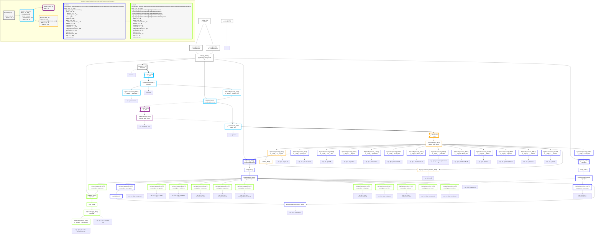

```mermaid
graph TD
    classDef path fill:#eee,stroke:#000,color:#000
    classDef plan fill:#fff,stroke-width:3px,color:#000
    classDef itemplan fill:#fff,stroke-width:6px,color:#000
    classDef sideeffectplan fill:#f00,stroke-width:6px,color:#000
    classDef bucket fill:#f6f6f6,color:#000,stroke-width:6px,text-align:left


    %% define plans
    __Value_0["__Value[_0∈0]"]:::plan
    __Value_3["__Value[_3∈0]<br />ᐸcontextᐳ"]:::plan
    PgSelect_7[["PgSelect[_7∈0]<br />ᐸpeopleᐳ"]]:::plan
    __Item_11>"__Item[_11∈1]<br />ᐸ_7ᐳ"]:::itemplan
    PgSelectSingle_12["PgSelectSingle[_12∈1]<br />ᐸpeopleᐳ"]:::plan
    PgClassExpression_13["PgClassExpression[_13∈1]<br />ᐸ__people__.”username”ᐳ"]:::plan
    PgClassExpression_14["PgClassExpression[_14∈1]<br />ᐸ__people__.”person_id”ᐳ"]:::plan
    PgSelect_15[["PgSelect[_15∈1]<br />ᐸsingle_table_itemsᐳ"]]:::plan
    __ListTransform_19["__ListTransform[_19∈1]<br />ᐸeach:_15ᐳ"]:::plan
    __Item_20>"__Item[_20∈2]<br />ᐸ_15ᐳ"]:::itemplan
    PgSelectSingle_21["PgSelectSingle[_21∈2]<br />ᐸsingle_table_itemsᐳ"]:::plan
    __Item_22>"__Item[_22∈3]<br />ᐸ_19ᐳ"]:::itemplan
    PgSelectSingle_23["PgSelectSingle[_23∈3]<br />ᐸsingle_table_itemsᐳ"]:::plan
    PgClassExpression_24["PgClassExpression[_24∈3]<br />ᐸ__single_t...s__.”type”ᐳ"]:::plan
    Lambda_25["Lambda[_25∈3]"]:::plan
    PgSingleTablePolymorphic_26["PgSingleTablePolymorphic[_26∈3]"]:::plan
    PgClassExpression_27["PgClassExpression[_27∈4]<br />ᐸ__single_t...parent_id”ᐳ"]:::plan
    PgSelect_28[["PgSelect[_28∈4]<br />ᐸsingle_table_itemsᐳ"]]:::plan
    First_32["First[_32∈4]"]:::plan
    PgSelectSingle_33["PgSelectSingle[_33∈4]<br />ᐸsingle_table_itemsᐳ"]:::plan
    PgClassExpression_34["PgClassExpression[_34∈4]<br />ᐸ__single_t...s__.”type”ᐳ"]:::plan
    Lambda_35["Lambda[_35∈4]"]:::plan
    PgSingleTablePolymorphic_36["PgSingleTablePolymorphic[_36∈4]"]:::plan
    PgClassExpression_39["PgClassExpression[_39∈5]<br />ᐸ__single_t...__.”type2”ᐳ"]:::plan
    PgClassExpression_40["PgClassExpression[_40∈5]<br />ᐸ__single_t...author_id”ᐳ"]:::plan
    PgSelect_41[["PgSelect[_41∈5]<br />ᐸpeopleᐳ"]]:::plan
    First_45["First[_45∈5]"]:::plan
    PgSelectSingle_46["PgSelectSingle[_46∈5]<br />ᐸpeopleᐳ"]:::plan
    PgClassExpression_47["PgClassExpression[_47∈5]<br />ᐸ__people__.”username”ᐳ"]:::plan
    PgClassExpression_48["PgClassExpression[_48∈5]<br />ᐸ__single_t...”position”ᐳ"]:::plan
    PgClassExpression_49["PgClassExpression[_49∈5]<br />ᐸ__single_t...reated_at”ᐳ"]:::plan
    PgClassExpression_50["PgClassExpression[_50∈5]<br />ᐸ__single_t...pdated_at”ᐳ"]:::plan
    PgClassExpression_51["PgClassExpression[_51∈5]<br />ᐸ__single_t..._archived”ᐳ"]:::plan
    PgClassExpression_52["PgClassExpression[_52∈5]<br />ᐸ__single_t...chived_at”ᐳ"]:::plan
    PgClassExpression_53["PgClassExpression[_53∈5]<br />ᐸ__single_t...__.”title”ᐳ"]:::plan
    PgClassExpression_71["PgClassExpression[_71∈5]<br />ᐸ__single_t...scription”ᐳ"]:::plan
    PgClassExpression_72["PgClassExpression[_72∈5]<br />ᐸ__single_t...s__.”note”ᐳ"]:::plan
    PgClassExpression_90["PgClassExpression[_90∈5]<br />ᐸ__single_t...__.”color”ᐳ"]:::plan
    PgClassExpression_126["PgClassExpression[_126∈4]<br />ᐸ__single_t...ems__.”id”ᐳ"]:::plan
    PgClassExpression_128["PgClassExpression[_128∈4]<br />ᐸ__single_t...__.”type2”ᐳ"]:::plan
    PgClassExpression_129["PgClassExpression[_129∈4]<br />ᐸ__single_t...author_id”ᐳ"]:::plan
    PgSelect_130[["PgSelect[_130∈4]<br />ᐸpeopleᐳ"]]:::plan
    First_134["First[_134∈4]"]:::plan
    PgSelectSingle_135["PgSelectSingle[_135∈4]<br />ᐸpeopleᐳ"]:::plan
    PgClassExpression_136["PgClassExpression[_136∈4]<br />ᐸ__people__.”username”ᐳ"]:::plan
    PgClassExpression_137["PgClassExpression[_137∈4]<br />ᐸ__single_t...”position”ᐳ"]:::plan
    PgClassExpression_138["PgClassExpression[_138∈4]<br />ᐸ__single_t...reated_at”ᐳ"]:::plan
    PgClassExpression_139["PgClassExpression[_139∈4]<br />ᐸ__single_t...pdated_at”ᐳ"]:::plan
    PgClassExpression_140["PgClassExpression[_140∈4]<br />ᐸ__single_t..._archived”ᐳ"]:::plan
    PgClassExpression_141["PgClassExpression[_141∈4]<br />ᐸ__single_t...chived_at”ᐳ"]:::plan
    PgClassExpression_142["PgClassExpression[_142∈4]<br />ᐸ__single_t...__.”title”ᐳ"]:::plan
    PgClassExpression_259["PgClassExpression[_259∈4]<br />ᐸ__single_t...scription”ᐳ"]:::plan
    PgClassExpression_260["PgClassExpression[_260∈4]<br />ᐸ__single_t...s__.”note”ᐳ"]:::plan
    PgClassExpression_377["PgClassExpression[_377∈4]<br />ᐸ__single_t...__.”color”ᐳ"]:::plan
    Access_598["Access[_598∈0]<br />ᐸ_3.pgSettingsᐳ"]:::plan
    Access_599["Access[_599∈0]<br />ᐸ_3.withPgClientᐳ"]:::plan
    Object_600["Object[_600∈0]<br />ᐸ{pgSettings,withPgClient}ᐳ"]:::plan

    %% plan dependencies
    Object_600 --> PgSelect_7
    PgSelect_7 ==> __Item_11
    __Item_11 --> PgSelectSingle_12
    PgSelectSingle_12 --> PgClassExpression_13
    PgSelectSingle_12 --> PgClassExpression_14
    Object_600 & PgClassExpression_14 --> PgSelect_15
    PgSelect_15 --> __ListTransform_19
    PgSelectSingle_21 -.-> __ListTransform_19
    PgSelect_15 -.-> __Item_20
    __Item_20 --> PgSelectSingle_21
    __ListTransform_19 ==> __Item_22
    __Item_22 --> PgSelectSingle_23
    PgSelectSingle_23 --> PgClassExpression_24
    PgClassExpression_24 --> Lambda_25
    Lambda_25 & PgSelectSingle_23 --> PgSingleTablePolymorphic_26
    PgSelectSingle_23 --> PgClassExpression_27
    Object_600 & PgClassExpression_27 --> PgSelect_28
    PgSelect_28 --> First_32
    First_32 --> PgSelectSingle_33
    PgSelectSingle_33 --> PgClassExpression_34
    PgClassExpression_34 --> Lambda_35
    Lambda_35 & PgSelectSingle_33 --> PgSingleTablePolymorphic_36
    PgSelectSingle_33 --> PgClassExpression_39
    PgSelectSingle_33 --> PgClassExpression_40
    Object_600 & PgClassExpression_40 --> PgSelect_41
    PgSelect_41 --> First_45
    First_45 --> PgSelectSingle_46
    PgSelectSingle_46 --> PgClassExpression_47
    PgSelectSingle_33 --> PgClassExpression_48
    PgSelectSingle_33 --> PgClassExpression_49
    PgSelectSingle_33 --> PgClassExpression_50
    PgSelectSingle_33 --> PgClassExpression_51
    PgSelectSingle_33 --> PgClassExpression_52
    PgSelectSingle_33 --> PgClassExpression_53
    PgSelectSingle_33 --> PgClassExpression_71
    PgSelectSingle_33 --> PgClassExpression_72
    PgSelectSingle_33 --> PgClassExpression_90
    PgSelectSingle_23 --> PgClassExpression_126
    PgSelectSingle_23 --> PgClassExpression_128
    PgSelectSingle_23 --> PgClassExpression_129
    Object_600 & PgClassExpression_129 --> PgSelect_130
    PgSelect_130 --> First_134
    First_134 --> PgSelectSingle_135
    PgSelectSingle_135 --> PgClassExpression_136
    PgSelectSingle_23 --> PgClassExpression_137
    PgSelectSingle_23 --> PgClassExpression_138
    PgSelectSingle_23 --> PgClassExpression_139
    PgSelectSingle_23 --> PgClassExpression_140
    PgSelectSingle_23 --> PgClassExpression_141
    PgSelectSingle_23 --> PgClassExpression_142
    PgSelectSingle_23 --> PgClassExpression_259
    PgSelectSingle_23 --> PgClassExpression_260
    PgSelectSingle_23 --> PgClassExpression_377
    __Value_3 --> Access_598
    __Value_3 --> Access_599
    Access_598 & Access_599 --> Object_600

    %% plan-to-path relationships
    P_0["~"]
    __Value_0 -.-> P_0
    P_7["ᐳpeople"]
    PgSelect_7 -.-> P_7
    P_12["ᐳpeople[]"]
    PgSelectSingle_12 -.-> P_12
    P_13["ᐳp…]ᐳusername"]
    PgClassExpression_13 -.-> P_13
    P_19["ᐳp…]ᐳitems"]
    __ListTransform_19 -.-> P_19
    P_21["ᐳp…]ᐳitems@_19[]"]
    PgSelectSingle_21 -.-> P_21
    P_24["ᐳp…]ᐳi…]ᐳtype x5"]
    PgClassExpression_24 -.-> P_24
    P_26["ᐳp…]ᐳitems[]"]
    PgSingleTablePolymorphic_26 -.-> P_26
    P_27["ᐳp…]ᐳi…]ᐳp…tᐳid x25"]
    PgClassExpression_27 -.-> P_27
    P_34["ᐳp…]ᐳi…]ᐳp…tᐳtype x25"]
    PgClassExpression_34 -.-> P_34
    P_36["ᐳp…]ᐳi…]ᐳparent x5"]
    PgSingleTablePolymorphic_36 -.-> P_36
    P_39["ᐳp…]ᐳi…]ᐳp…tᐳtype2 x25"]
    PgClassExpression_39 -.-> P_39
    P_46["ᐳp…]ᐳi…]ᐳp…tᐳauthor x25"]
    PgSelectSingle_46 -.-> P_46
    P_47["ᐳp…]ᐳi…]ᐳp…tᐳa…rᐳusername x25"]
    PgClassExpression_47 -.-> P_47
    P_48["ᐳp…]ᐳi…]ᐳp…tᐳposition x25"]
    PgClassExpression_48 -.-> P_48
    P_49["ᐳp…]ᐳi…]ᐳp…tᐳcreatedAt x25"]
    PgClassExpression_49 -.-> P_49
    P_50["ᐳp…]ᐳi…]ᐳp…tᐳupdatedAt x25"]
    PgClassExpression_50 -.-> P_50
    P_51["ᐳp…]ᐳi…]ᐳp…tᐳisExplicitlyArchived x25"]
    PgClassExpression_51 -.-> P_51
    P_52["ᐳp…]ᐳi…]ᐳp…tᐳarchivedAt x25"]
    PgClassExpression_52 -.-> P_52
    P_53["ᐳp…]ᐳi…]ᐳp…tᐳtitle x20"]
    PgClassExpression_53 -.-> P_53
    P_71["ᐳp…]ᐳi…]ᐳp…tᐳdescription x10"]
    PgClassExpression_71 -.-> P_71
    P_72["ᐳp…]ᐳi…]ᐳp…tᐳnote x10"]
    PgClassExpression_72 -.-> P_72
    P_90["ᐳp…]ᐳi…]ᐳp…tᐳcolor x5"]
    PgClassExpression_90 -.-> P_90
    P_126["ᐳp…]ᐳi…]ᐳid x5"]
    PgClassExpression_126 -.-> P_126
    P_128["ᐳp…]ᐳi…]ᐳtype2 x5"]
    PgClassExpression_128 -.-> P_128
    P_135["ᐳp…]ᐳi…]ᐳauthor x5"]
    PgSelectSingle_135 -.-> P_135
    P_136["ᐳp…]ᐳi…]ᐳa…rᐳusername x5"]
    PgClassExpression_136 -.-> P_136
    P_137["ᐳp…]ᐳi…]ᐳposition x5"]
    PgClassExpression_137 -.-> P_137
    P_138["ᐳp…]ᐳi…]ᐳcreatedAt x5"]
    PgClassExpression_138 -.-> P_138
    P_139["ᐳp…]ᐳi…]ᐳupdatedAt x5"]
    PgClassExpression_139 -.-> P_139
    P_140["ᐳp…]ᐳi…]ᐳisExplicitlyArchived x5"]
    PgClassExpression_140 -.-> P_140
    P_141["ᐳp…]ᐳi…]ᐳarchivedAt x5"]
    PgClassExpression_141 -.-> P_141
    P_142["ᐳp…]ᐳi…]ᐳtitle x4"]
    PgClassExpression_142 -.-> P_142
    P_259["ᐳp…]ᐳi…]ᐳdescription x2"]
    PgClassExpression_259 -.-> P_259
    P_260["ᐳp…]ᐳi…]ᐳnote x2"]
    PgClassExpression_260 -.-> P_260
    P_377["ᐳp…]ᐳi…]ᐳcolor"]
    PgClassExpression_377 -.-> P_377

    subgraph "Buckets for queries/interfaces-single-table/nested-more-fragments"
    Bucket0("Bucket 0 (root)<br />~<br />⠀ROOT ᐸ-O- _0<br />⠀⠀people ᐸ-A- _7"):::bucket
    classDef bucket0 stroke:#696969
    class Bucket0,__Value_0,__Value_3,PgSelect_7,Access_598,Access_599,Object_600 bucket0
    Bucket1("Bucket 1 (item_11)<br />Deps: _7, _600<br />~ᐳQuery.people[]<br />⠀ROOT ᐸ-O- _12<br />⠀⠀username ᐸ-L- _13<br />⠀⠀items ᐸ-A- _19"):::bucket
    classDef bucket1 stroke:#00bfff
    class Bucket1,__Item_11,PgSelectSingle_12,PgClassExpression_13,PgClassExpression_14,PgSelect_15,__ListTransform_19 bucket1
    Bucket2("Bucket 2 (item_20)<br />Deps: _15"):::bucket
    classDef bucket2 stroke:#7f007f
    class Bucket2,__Item_20,PgSelectSingle_21 bucket2
    Bucket3("Bucket 3 (item_22)<br />Deps: _19, _600<br />~ᐳQuery.people[]ᐳPerson.items[]<br />⠀ROOT ᐸ-O- _26<br />⠀⠀type ᐸ-L- _24"):::bucket
    classDef bucket3 stroke:#ffa500
    class Bucket3,__Item_22,PgSelectSingle_23,PgClassExpression_24,Lambda_25,PgSingleTablePolymorphic_26 bucket3
    Bucket4("Bucket 4 (polymorphic_26[SingleTableTopic|SingleTablePost|SingleTableDivider|SingleTableChecklist|SingleTableChecklistItem])<br />Deps: _22, _23, _600<br />~ᐳQuery.people[]ᐳPerson.items[]<br />⠀⠀parent ᐸ-O- _36<br />⠀⠀⠀parent.id ᐸ-L- _27<br />⠀⠀⠀parent.type ᐸ-L- _34<br />⠀⠀id ᐸ-L- _126<br />⠀⠀type2 ᐸ-L- _128<br />⠀⠀author ᐸ-O- _135<br />⠀⠀⠀author.username ᐸ-L- _136<br />⠀⠀position ᐸ-L- _137<br />⠀⠀createdAt ᐸ-L- _138<br />⠀⠀updatedAt ᐸ-L- _139<br />⠀⠀isExplicitlyArchived ᐸ-L- _140<br />⠀⠀archivedAt ᐸ-L- _141<br />⠀⠀title ᐸ-L- _142<br />⠀⠀description ᐸ-L- _259<br />⠀⠀note ᐸ-L- _260<br />⠀⠀color ᐸ-L- _377"):::bucket
    classDef bucket4 stroke:#0000ff
    class Bucket4,PgClassExpression_27,PgSelect_28,First_32,PgSelectSingle_33,PgClassExpression_34,Lambda_35,PgSingleTablePolymorphic_36,PgClassExpression_126,PgClassExpression_128,PgClassExpression_129,PgSelect_130,First_134,PgSelectSingle_135,PgClassExpression_136,PgClassExpression_137,PgClassExpression_138,PgClassExpression_139,PgClassExpression_140,PgClassExpression_141,PgClassExpression_142,PgClassExpression_259,PgClassExpression_260,PgClassExpression_377 bucket4
    Bucket5("Bucket 5 (polymorphic_36[SingleTableTopic|SingleTablePost|SingleTableDivider|SingleTableChecklist|SingleTableChecklistItem])<br />Deps: _32, _33, _600<br />~ᐳQuery.people[]ᐳPerson.items[]ᐳSingleTablePost.parent<br />~ᐳQuery.people[]ᐳPerson.items[]ᐳSingleTableTopic.parent<br />~ᐳQuery.people[]ᐳPerson.items[]ᐳSingleTableDivider.parent<br />~ᐳQuery.people[]ᐳPerson.items[]ᐳSingleTableChecklist.parent<br />~ᐳQuery.people[]ᐳPerson.items[]ᐳSingleTableChecklistItem.parent<br />⠀⠀type2 ᐸ-L- _39<br />⠀⠀author ᐸ-O- _46<br />⠀⠀⠀author.username ᐸ-L- _47<br />⠀⠀position ᐸ-L- _48<br />⠀⠀createdAt ᐸ-L- _49<br />⠀⠀updatedAt ᐸ-L- _50<br />⠀⠀isExplicitlyArchived ᐸ-L- _51<br />⠀⠀archivedAt ᐸ-L- _52<br />⠀⠀title ᐸ-L- _53<br />⠀⠀description ᐸ-L- _71<br />⠀⠀note ᐸ-L- _72<br />⠀⠀color ᐸ-L- _90"):::bucket
    classDef bucket5 stroke:#7fff00
    class Bucket5,PgClassExpression_39,PgClassExpression_40,PgSelect_41,First_45,PgSelectSingle_46,PgClassExpression_47,PgClassExpression_48,PgClassExpression_49,PgClassExpression_50,PgClassExpression_51,PgClassExpression_52,PgClassExpression_53,PgClassExpression_71,PgClassExpression_72,PgClassExpression_90 bucket5
    Bucket0 --> Bucket1
    Bucket1 --> Bucket2 & Bucket3
    Bucket3 --> Bucket4
    Bucket4 --> Bucket5
    end
```
