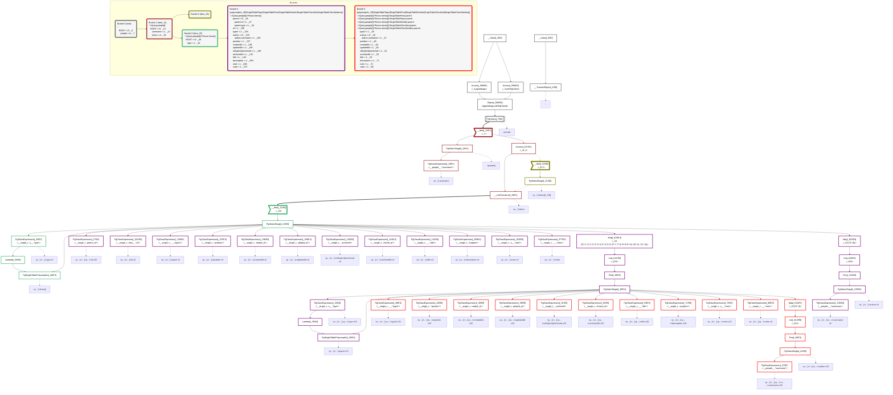

```mermaid
graph TD
    classDef path fill:#eee,stroke:#000,color:#000
    classDef plan fill:#fff,stroke-width:3px,color:#000
    classDef itemplan fill:#fff,stroke-width:6px,color:#000
    classDef sideeffectplan fill:#f00,stroke-width:6px,color:#000
    classDef bucket fill:#f6f6f6,color:#000,stroke-width:6px,text-align:left


    %% define plans
    __Value_3["__Value[_3∈0]<br /><context>"]:::plan
    __Value_5["__Value[_5∈0]<br /><rootValue>"]:::plan
    __TrackedObject_6["__TrackedObject[_6∈0]"]:::plan
    PgSelect_7[["PgSelect[_7∈0]<br /><people>"]]:::plan
    __Item_11>"__Item[_11∈1]<br /><_7>"]:::itemplan
    PgSelectSingle_12["PgSelectSingle[_12∈1]<br /><people>"]:::plan
    PgClassExpression_13["PgClassExpression[_13∈1]<br /><__people__.”username”>"]:::plan
    __ListTransform_19["__ListTransform[_19∈1]<br /><each:_15>"]:::plan
    __Item_20>"__Item[_20∈2]<br /><_617>"]:::itemplan
    PgSelectSingle_21["PgSelectSingle[_21∈2]<br /><single_table_items>"]:::plan
    __Item_22>"__Item[_22∈3]<br /><_19>"]:::itemplan
    PgSelectSingle_23["PgSelectSingle[_23∈3]<br /><single_table_items>"]:::plan
    PgClassExpression_24["PgClassExpression[_24∈3]<br /><__single_t...s__.”type”>"]:::plan
    Lambda_25["Lambda[_25∈3]"]:::plan
    PgSingleTablePolymorphic_26["PgSingleTablePolymorphic[_26∈3]"]:::plan
    PgClassExpression_27["PgClassExpression[_27∈4]<br /><__single_t...parent_id”>"]:::plan
    First_32["First[_32∈4]"]:::plan
    PgSelectSingle_33["PgSelectSingle[_33∈4]<br /><single_table_items>"]:::plan
    PgClassExpression_34["PgClassExpression[_34∈4]<br /><__single_t...s__.”type”>"]:::plan
    Lambda_35["Lambda[_35∈4]"]:::plan
    PgSingleTablePolymorphic_36["PgSingleTablePolymorphic[_36∈4]"]:::plan
    PgClassExpression_39["PgClassExpression[_39∈5]<br /><__single_t...__.”type2”>"]:::plan
    First_45["First[_45∈5]"]:::plan
    PgSelectSingle_46["PgSelectSingle[_46∈5]<br /><people>"]:::plan
    PgClassExpression_47["PgClassExpression[_47∈5]<br /><__people__.”username”>"]:::plan
    PgClassExpression_48["PgClassExpression[_48∈5]<br /><__single_t...”position”>"]:::plan
    PgClassExpression_49["PgClassExpression[_49∈5]<br /><__single_t...reated_at”>"]:::plan
    PgClassExpression_50["PgClassExpression[_50∈5]<br /><__single_t...pdated_at”>"]:::plan
    PgClassExpression_51["PgClassExpression[_51∈5]<br /><__single_t..._archived”>"]:::plan
    PgClassExpression_52["PgClassExpression[_52∈5]<br /><__single_t...chived_at”>"]:::plan
    PgClassExpression_53["PgClassExpression[_53∈5]<br /><__single_t...__.”title”>"]:::plan
    PgClassExpression_71["PgClassExpression[_71∈5]<br /><__single_t...scription”>"]:::plan
    PgClassExpression_72["PgClassExpression[_72∈5]<br /><__single_t...s__.”note”>"]:::plan
    PgClassExpression_90["PgClassExpression[_90∈5]<br /><__single_t...__.”color”>"]:::plan
    PgClassExpression_126["PgClassExpression[_126∈4]<br /><__single_t...ems__.”id”>"]:::plan
    PgClassExpression_128["PgClassExpression[_128∈4]<br /><__single_t...__.”type2”>"]:::plan
    First_134["First[_134∈4]"]:::plan
    PgSelectSingle_135["PgSelectSingle[_135∈4]<br /><people>"]:::plan
    PgClassExpression_136["PgClassExpression[_136∈4]<br /><__people__.”username”>"]:::plan
    PgClassExpression_137["PgClassExpression[_137∈4]<br /><__single_t...”position”>"]:::plan
    PgClassExpression_138["PgClassExpression[_138∈4]<br /><__single_t...reated_at”>"]:::plan
    PgClassExpression_139["PgClassExpression[_139∈4]<br /><__single_t...pdated_at”>"]:::plan
    PgClassExpression_140["PgClassExpression[_140∈4]<br /><__single_t..._archived”>"]:::plan
    PgClassExpression_141["PgClassExpression[_141∈4]<br /><__single_t...chived_at”>"]:::plan
    PgClassExpression_142["PgClassExpression[_142∈4]<br /><__single_t...__.”title”>"]:::plan
    PgClassExpression_259["PgClassExpression[_259∈4]<br /><__single_t...scription”>"]:::plan
    PgClassExpression_260["PgClassExpression[_260∈4]<br /><__single_t...s__.”note”>"]:::plan
    PgClassExpression_377["PgClassExpression[_377∈4]<br /><__single_t...__.”color”>"]:::plan
    Access_598["Access[_598∈0]<br /><_3.pgSettings>"]:::plan
    Access_599["Access[_599∈0]<br /><_3.withPgClient>"]:::plan
    Object_600["Object[_600∈0]<br /><{pgSettings,withPgClient}>"]:::plan
    Map_611["Map[_611∈5]<br /><_33:{”0”:2}>"]:::plan
    List_612["List[_612∈5]<br /><_611>"]:::plan
    Map_613["Map[_613∈4]<br /><_23:{”0”:1,”1”:2,”2”:3,”3”:4,”4”:5,”5”:6,”6”:7,”7”:8,”8”:9,”9”:10,”10”:11,”11”:12}>"]:::plan
    List_614["List[_614∈4]<br /><_613>"]:::plan
    Map_615["Map[_615∈4]<br /><_23:{”0”:16}>"]:::plan
    List_616["List[_616∈4]<br /><_615>"]:::plan
    Access_617["Access[_617∈1]<br /><_11.1>"]:::plan

    %% plan dependencies
    __Value_5 --> __TrackedObject_6
    Object_600 --> PgSelect_7
    PgSelect_7 ==> __Item_11
    __Item_11 --> PgSelectSingle_12
    PgSelectSingle_12 --> PgClassExpression_13
    Access_617 --> __ListTransform_19
    PgSelectSingle_21 -.-> __ListTransform_19
    Access_617 -.-> __Item_20
    __Item_20 --> PgSelectSingle_21
    __ListTransform_19 ==> __Item_22
    __Item_22 --> PgSelectSingle_23
    PgSelectSingle_23 --> PgClassExpression_24
    PgClassExpression_24 --> Lambda_25
    Lambda_25 --> PgSingleTablePolymorphic_26
    PgSelectSingle_23 --> PgSingleTablePolymorphic_26
    PgSelectSingle_23 --> PgClassExpression_27
    List_614 --> First_32
    First_32 --> PgSelectSingle_33
    PgSelectSingle_33 --> PgClassExpression_34
    PgClassExpression_34 --> Lambda_35
    Lambda_35 --> PgSingleTablePolymorphic_36
    PgSelectSingle_33 --> PgSingleTablePolymorphic_36
    PgSelectSingle_33 --> PgClassExpression_39
    List_612 --> First_45
    First_45 --> PgSelectSingle_46
    PgSelectSingle_46 --> PgClassExpression_47
    PgSelectSingle_33 --> PgClassExpression_48
    PgSelectSingle_33 --> PgClassExpression_49
    PgSelectSingle_33 --> PgClassExpression_50
    PgSelectSingle_33 --> PgClassExpression_51
    PgSelectSingle_33 --> PgClassExpression_52
    PgSelectSingle_33 --> PgClassExpression_53
    PgSelectSingle_33 --> PgClassExpression_71
    PgSelectSingle_33 --> PgClassExpression_72
    PgSelectSingle_33 --> PgClassExpression_90
    PgSelectSingle_23 --> PgClassExpression_126
    PgSelectSingle_23 --> PgClassExpression_128
    List_616 --> First_134
    First_134 --> PgSelectSingle_135
    PgSelectSingle_135 --> PgClassExpression_136
    PgSelectSingle_23 --> PgClassExpression_137
    PgSelectSingle_23 --> PgClassExpression_138
    PgSelectSingle_23 --> PgClassExpression_139
    PgSelectSingle_23 --> PgClassExpression_140
    PgSelectSingle_23 --> PgClassExpression_141
    PgSelectSingle_23 --> PgClassExpression_142
    PgSelectSingle_23 --> PgClassExpression_259
    PgSelectSingle_23 --> PgClassExpression_260
    PgSelectSingle_23 --> PgClassExpression_377
    __Value_3 --> Access_598
    __Value_3 --> Access_599
    Access_598 --> Object_600
    Access_599 --> Object_600
    PgSelectSingle_33 --> Map_611
    Map_611 --> List_612
    PgSelectSingle_23 --> Map_613
    Map_613 --> List_614
    PgSelectSingle_23 --> Map_615
    Map_615 --> List_616
    __Item_11 --> Access_617

    %% plan-to-path relationships
    P_6["~"]
    __TrackedObject_6 -.-> P_6
    P_7[">people"]
    PgSelect_7 -.-> P_7
    P_12[">people[]"]
    PgSelectSingle_12 -.-> P_12
    P_13[">p…]>username"]
    PgClassExpression_13 -.-> P_13
    P_19[">p…]>items"]
    __ListTransform_19 -.-> P_19
    P_21[">p…]>items@_19[]"]
    PgSelectSingle_21 -.-> P_21
    P_24[">p…]>i…]>type x5"]
    PgClassExpression_24 -.-> P_24
    P_26[">p…]>items[]"]
    PgSingleTablePolymorphic_26 -.-> P_26
    P_27[">p…]>i…]>p…t>id x25"]
    PgClassExpression_27 -.-> P_27
    P_34[">p…]>i…]>p…t>type x25"]
    PgClassExpression_34 -.-> P_34
    P_36[">p…]>i…]>parent x5"]
    PgSingleTablePolymorphic_36 -.-> P_36
    P_39[">p…]>i…]>p…t>type2 x25"]
    PgClassExpression_39 -.-> P_39
    P_46[">p…]>i…]>p…t>author x25"]
    PgSelectSingle_46 -.-> P_46
    P_47[">p…]>i…]>p…t>a…r>username x25"]
    PgClassExpression_47 -.-> P_47
    P_48[">p…]>i…]>p…t>position x25"]
    PgClassExpression_48 -.-> P_48
    P_49[">p…]>i…]>p…t>createdAt x25"]
    PgClassExpression_49 -.-> P_49
    P_50[">p…]>i…]>p…t>updatedAt x25"]
    PgClassExpression_50 -.-> P_50
    P_51[">p…]>i…]>p…t>isExplicitlyArchived x25"]
    PgClassExpression_51 -.-> P_51
    P_52[">p…]>i…]>p…t>archivedAt x25"]
    PgClassExpression_52 -.-> P_52
    P_53[">p…]>i…]>p…t>title x20"]
    PgClassExpression_53 -.-> P_53
    P_71[">p…]>i…]>p…t>description x10"]
    PgClassExpression_71 -.-> P_71
    P_72[">p…]>i…]>p…t>note x10"]
    PgClassExpression_72 -.-> P_72
    P_90[">p…]>i…]>p…t>color x5"]
    PgClassExpression_90 -.-> P_90
    P_126[">p…]>i…]>id x5"]
    PgClassExpression_126 -.-> P_126
    P_128[">p…]>i…]>type2 x5"]
    PgClassExpression_128 -.-> P_128
    P_135[">p…]>i…]>author x5"]
    PgSelectSingle_135 -.-> P_135
    P_136[">p…]>i…]>a…r>username x5"]
    PgClassExpression_136 -.-> P_136
    P_137[">p…]>i…]>position x5"]
    PgClassExpression_137 -.-> P_137
    P_138[">p…]>i…]>createdAt x5"]
    PgClassExpression_138 -.-> P_138
    P_139[">p…]>i…]>updatedAt x5"]
    PgClassExpression_139 -.-> P_139
    P_140[">p…]>i…]>isExplicitlyArchived x5"]
    PgClassExpression_140 -.-> P_140
    P_141[">p…]>i…]>archivedAt x5"]
    PgClassExpression_141 -.-> P_141
    P_142[">p…]>i…]>title x4"]
    PgClassExpression_142 -.-> P_142
    P_259[">p…]>i…]>description x2"]
    PgClassExpression_259 -.-> P_259
    P_260[">p…]>i…]>note x2"]
    PgClassExpression_260 -.-> P_260
    P_377[">p…]>i…]>color"]
    PgClassExpression_377 -.-> P_377

    %% allocate buckets
    classDef bucket0 stroke:#696969
    class __Value_3,__Value_5,__TrackedObject_6,PgSelect_7,Access_598,Access_599,Object_600 bucket0
    classDef bucket1 stroke:#a52a2a
    class __Item_11,PgSelectSingle_12,PgClassExpression_13,__ListTransform_19,Access_617 bucket1
    classDef bucket2 stroke:#808000
    class __Item_20,PgSelectSingle_21 bucket2
    classDef bucket3 stroke:#3cb371
    class __Item_22,PgSelectSingle_23,PgClassExpression_24,Lambda_25,PgSingleTablePolymorphic_26 bucket3
    classDef bucket4 stroke:#7f007f
    class PgClassExpression_27,First_32,PgSelectSingle_33,PgClassExpression_34,Lambda_35,PgSingleTablePolymorphic_36,PgClassExpression_126,PgClassExpression_128,First_134,PgSelectSingle_135,PgClassExpression_136,PgClassExpression_137,PgClassExpression_138,PgClassExpression_139,PgClassExpression_140,PgClassExpression_141,PgClassExpression_142,PgClassExpression_259,PgClassExpression_260,PgClassExpression_377,Map_613,List_614,Map_615,List_616 bucket4
    classDef bucket5 stroke:#ff0000
    class PgClassExpression_39,First_45,PgSelectSingle_46,PgClassExpression_47,PgClassExpression_48,PgClassExpression_49,PgClassExpression_50,PgClassExpression_51,PgClassExpression_52,PgClassExpression_53,PgClassExpression_71,PgClassExpression_72,PgClassExpression_90,Map_611,List_612 bucket5

    subgraph Buckets
    Bucket0("Bucket 0 (root)<br />~<br />⠀ROOT <-O- _6<br />⠀⠀people <-A- _7"):::bucket
    style Bucket0 stroke:#696969
    Bucket1("Bucket 1 (item_11)<br />~>Query.people[]<br />⠀ROOT <-O- _12<br />⠀⠀username <-L- _13<br />⠀⠀items <-A- _19"):::bucket
    style Bucket1 stroke:#a52a2a
    Bucket0 --> Bucket1
    Bucket2("Bucket 2 (item_20)"):::bucket
    style Bucket2 stroke:#808000
    Bucket1 --> Bucket2
    Bucket3("Bucket 3 (item_22)<br />~>Query.people[]>Person.items[]<br />⠀ROOT <-O- _26<br />⠀⠀type <-L- _24"):::bucket
    style Bucket3 stroke:#3cb371
    Bucket1 --> Bucket3
    Bucket4("Bucket 4 (polymorphic_26[SingleTableTopic|SingleTablePost|SingleTableDivider|SingleTableChecklist|SingleTableChecklistItem])<br />~>Query.people[]>Person.items[]<br />⠀⠀parent <-O- _36<br />⠀⠀⠀parent.id <-L- _27<br />⠀⠀⠀parent.type <-L- _34<br />⠀⠀id <-L- _126<br />⠀⠀type2 <-L- _128<br />⠀⠀author <-O- _135<br />⠀⠀⠀author.username <-L- _136<br />⠀⠀position <-L- _137<br />⠀⠀createdAt <-L- _138<br />⠀⠀updatedAt <-L- _139<br />⠀⠀isExplicitlyArchived <-L- _140<br />⠀⠀archivedAt <-L- _141<br />⠀⠀title <-L- _142<br />⠀⠀description <-L- _259<br />⠀⠀note <-L- _260<br />⠀⠀color <-L- _377"):::bucket
    style Bucket4 stroke:#7f007f
    Bucket3 --> Bucket4
    Bucket5("Bucket 5 (polymorphic_36[SingleTableTopic|SingleTablePost|SingleTableDivider|SingleTableChecklist|SingleTableChecklistItem])<br />~>Query.people[]>Person.items[]>SingleTablePost.parent<br />~>Query.people[]>Person.items[]>SingleTableTopic.parent<br />~>Query.people[]>Person.items[]>SingleTableDivider.parent<br />~>Query.people[]>Person.items[]>SingleTableChecklist.parent<br />~>Query.people[]>Person.items[]>SingleTableChecklistItem.parent<br />⠀⠀type2 <-L- _39<br />⠀⠀author <-O- _46<br />⠀⠀⠀author.username <-L- _47<br />⠀⠀position <-L- _48<br />⠀⠀createdAt <-L- _49<br />⠀⠀updatedAt <-L- _50<br />⠀⠀isExplicitlyArchived <-L- _51<br />⠀⠀archivedAt <-L- _52<br />⠀⠀title <-L- _53<br />⠀⠀description <-L- _71<br />⠀⠀note <-L- _72<br />⠀⠀color <-L- _90"):::bucket
    style Bucket5 stroke:#ff0000
    Bucket4 --> Bucket5
    end
```
