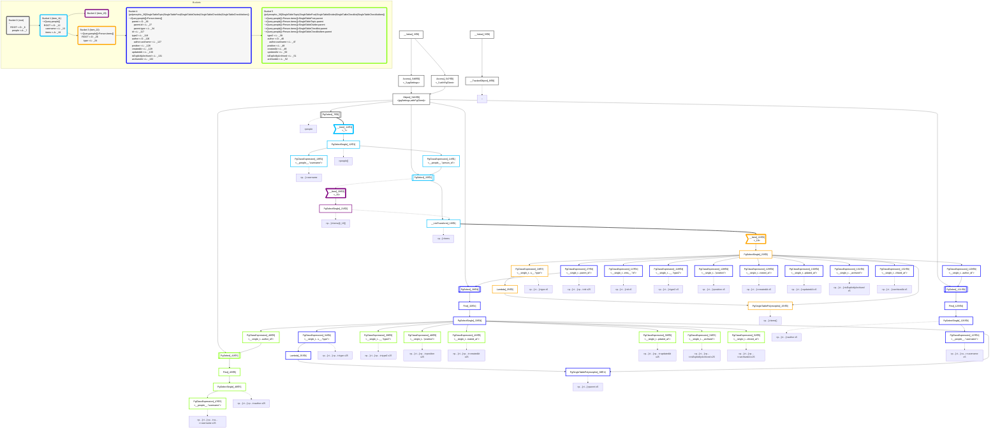

```mermaid
graph TD
    classDef path fill:#eee,stroke:#000,color:#000
    classDef plan fill:#fff,stroke-width:3px,color:#000
    classDef itemplan fill:#fff,stroke-width:6px,color:#000
    classDef sideeffectplan fill:#f00,stroke-width:6px,color:#000
    classDef bucket fill:#f6f6f6,color:#000,stroke-width:6px,text-align:left


    %% define plans
    __Value_3["__Value[_3∈0]<br /><context>"]:::plan
    __Value_5["__Value[_5∈0]<br /><rootValue>"]:::plan
    __TrackedObject_6["__TrackedObject[_6∈0]"]:::plan
    PgSelect_7[["PgSelect[_7∈0]<br /><people>"]]:::plan
    __Item_11>"__Item[_11∈1]<br /><_7>"]:::itemplan
    PgSelectSingle_12["PgSelectSingle[_12∈1]<br /><people>"]:::plan
    PgClassExpression_13["PgClassExpression[_13∈1]<br /><__people__.”username”>"]:::plan
    PgClassExpression_14["PgClassExpression[_14∈1]<br /><__people__.”person_id”>"]:::plan
    PgSelect_15[["PgSelect[_15∈1]<br /><single_table_items>"]]:::plan
    __ListTransform_19["__ListTransform[_19∈1]<br /><each:_15>"]:::plan
    __Item_20>"__Item[_20∈2]<br /><_15>"]:::itemplan
    PgSelectSingle_21["PgSelectSingle[_21∈2]<br /><single_table_items>"]:::plan
    __Item_22>"__Item[_22∈3]<br /><_19>"]:::itemplan
    PgSelectSingle_23["PgSelectSingle[_23∈3]<br /><single_table_items>"]:::plan
    PgClassExpression_24["PgClassExpression[_24∈3]<br /><__single_t...s__.”type”>"]:::plan
    Lambda_25["Lambda[_25∈3]"]:::plan
    PgSingleTablePolymorphic_26["PgSingleTablePolymorphic[_26∈3]"]:::plan
    PgClassExpression_27["PgClassExpression[_27∈4]<br /><__single_t...parent_id”>"]:::plan
    PgSelect_28[["PgSelect[_28∈4]<br /><single_table_items>"]]:::plan
    First_32["First[_32∈4]"]:::plan
    PgSelectSingle_33["PgSelectSingle[_33∈4]<br /><single_table_items>"]:::plan
    PgClassExpression_34["PgClassExpression[_34∈4]<br /><__single_t...s__.”type”>"]:::plan
    Lambda_35["Lambda[_35∈4]"]:::plan
    PgSingleTablePolymorphic_36["PgSingleTablePolymorphic[_36∈4]"]:::plan
    PgClassExpression_39["PgClassExpression[_39∈5]<br /><__single_t...__.”type2”>"]:::plan
    PgClassExpression_40["PgClassExpression[_40∈5]<br /><__single_t...author_id”>"]:::plan
    PgSelect_41[["PgSelect[_41∈5]<br /><people>"]]:::plan
    First_45["First[_45∈5]"]:::plan
    PgSelectSingle_46["PgSelectSingle[_46∈5]<br /><people>"]:::plan
    PgClassExpression_47["PgClassExpression[_47∈5]<br /><__people__.”username”>"]:::plan
    PgClassExpression_48["PgClassExpression[_48∈5]<br /><__single_t...”position”>"]:::plan
    PgClassExpression_49["PgClassExpression[_49∈5]<br /><__single_t...reated_at”>"]:::plan
    PgClassExpression_50["PgClassExpression[_50∈5]<br /><__single_t...pdated_at”>"]:::plan
    PgClassExpression_51["PgClassExpression[_51∈5]<br /><__single_t..._archived”>"]:::plan
    PgClassExpression_52["PgClassExpression[_52∈5]<br /><__single_t...chived_at”>"]:::plan
    PgClassExpression_117["PgClassExpression[_117∈4]<br /><__single_t...ems__.”id”>"]:::plan
    PgClassExpression_119["PgClassExpression[_119∈4]<br /><__single_t...__.”type2”>"]:::plan
    PgClassExpression_120["PgClassExpression[_120∈4]<br /><__single_t...author_id”>"]:::plan
    PgSelect_121[["PgSelect[_121∈4]<br /><people>"]]:::plan
    First_125["First[_125∈4]"]:::plan
    PgSelectSingle_126["PgSelectSingle[_126∈4]<br /><people>"]:::plan
    PgClassExpression_127["PgClassExpression[_127∈4]<br /><__people__.”username”>"]:::plan
    PgClassExpression_128["PgClassExpression[_128∈4]<br /><__single_t...”position”>"]:::plan
    PgClassExpression_129["PgClassExpression[_129∈4]<br /><__single_t...reated_at”>"]:::plan
    PgClassExpression_130["PgClassExpression[_130∈4]<br /><__single_t...pdated_at”>"]:::plan
    PgClassExpression_131["PgClassExpression[_131∈4]<br /><__single_t..._archived”>"]:::plan
    PgClassExpression_132["PgClassExpression[_132∈4]<br /><__single_t...chived_at”>"]:::plan
    Access_546["Access[_546∈0]<br /><_3.pgSettings>"]:::plan
    Access_547["Access[_547∈0]<br /><_3.withPgClient>"]:::plan
    Object_548["Object[_548∈0]<br /><{pgSettings,withPgClient}>"]:::plan

    %% plan dependencies
    __Value_5 --> __TrackedObject_6
    Object_548 --> PgSelect_7
    PgSelect_7 ==> __Item_11
    __Item_11 --> PgSelectSingle_12
    PgSelectSingle_12 --> PgClassExpression_13
    PgSelectSingle_12 --> PgClassExpression_14
    Object_548 --> PgSelect_15
    PgClassExpression_14 --> PgSelect_15
    PgSelect_15 --> __ListTransform_19
    PgSelectSingle_21 -.-> __ListTransform_19
    PgSelect_15 -.-> __Item_20
    __Item_20 --> PgSelectSingle_21
    __ListTransform_19 ==> __Item_22
    __Item_22 --> PgSelectSingle_23
    PgSelectSingle_23 --> PgClassExpression_24
    PgClassExpression_24 --> Lambda_25
    Lambda_25 --> PgSingleTablePolymorphic_26
    PgSelectSingle_23 --> PgSingleTablePolymorphic_26
    PgSelectSingle_23 --> PgClassExpression_27
    Object_548 --> PgSelect_28
    PgClassExpression_27 --> PgSelect_28
    PgSelect_28 --> First_32
    First_32 --> PgSelectSingle_33
    PgSelectSingle_33 --> PgClassExpression_34
    PgClassExpression_34 --> Lambda_35
    Lambda_35 --> PgSingleTablePolymorphic_36
    PgSelectSingle_33 --> PgSingleTablePolymorphic_36
    PgSelectSingle_33 --> PgClassExpression_39
    PgSelectSingle_33 --> PgClassExpression_40
    Object_548 --> PgSelect_41
    PgClassExpression_40 --> PgSelect_41
    PgSelect_41 --> First_45
    First_45 --> PgSelectSingle_46
    PgSelectSingle_46 --> PgClassExpression_47
    PgSelectSingle_33 --> PgClassExpression_48
    PgSelectSingle_33 --> PgClassExpression_49
    PgSelectSingle_33 --> PgClassExpression_50
    PgSelectSingle_33 --> PgClassExpression_51
    PgSelectSingle_33 --> PgClassExpression_52
    PgSelectSingle_23 --> PgClassExpression_117
    PgSelectSingle_23 --> PgClassExpression_119
    PgSelectSingle_23 --> PgClassExpression_120
    Object_548 --> PgSelect_121
    PgClassExpression_120 --> PgSelect_121
    PgSelect_121 --> First_125
    First_125 --> PgSelectSingle_126
    PgSelectSingle_126 --> PgClassExpression_127
    PgSelectSingle_23 --> PgClassExpression_128
    PgSelectSingle_23 --> PgClassExpression_129
    PgSelectSingle_23 --> PgClassExpression_130
    PgSelectSingle_23 --> PgClassExpression_131
    PgSelectSingle_23 --> PgClassExpression_132
    __Value_3 --> Access_546
    __Value_3 --> Access_547
    Access_546 --> Object_548
    Access_547 --> Object_548

    %% plan-to-path relationships
    P_6["~"]
    __TrackedObject_6 -.-> P_6
    P_7[">people"]
    PgSelect_7 -.-> P_7
    P_12[">people[]"]
    PgSelectSingle_12 -.-> P_12
    P_13[">p…]>username"]
    PgClassExpression_13 -.-> P_13
    P_19[">p…]>items"]
    __ListTransform_19 -.-> P_19
    P_21[">p…]>items@_19[]"]
    PgSelectSingle_21 -.-> P_21
    P_24[">p…]>i…]>type x5"]
    PgClassExpression_24 -.-> P_24
    P_26[">p…]>items[]"]
    PgSingleTablePolymorphic_26 -.-> P_26
    P_27[">p…]>i…]>p…t>id x25"]
    PgClassExpression_27 -.-> P_27
    P_34[">p…]>i…]>p…t>type x25"]
    PgClassExpression_34 -.-> P_34
    P_36[">p…]>i…]>parent x5"]
    PgSingleTablePolymorphic_36 -.-> P_36
    P_39[">p…]>i…]>p…t>type2 x25"]
    PgClassExpression_39 -.-> P_39
    P_46[">p…]>i…]>p…t>author x25"]
    PgSelectSingle_46 -.-> P_46
    P_47[">p…]>i…]>p…t>a…r>username x25"]
    PgClassExpression_47 -.-> P_47
    P_48[">p…]>i…]>p…t>position x25"]
    PgClassExpression_48 -.-> P_48
    P_49[">p…]>i…]>p…t>createdAt x25"]
    PgClassExpression_49 -.-> P_49
    P_50[">p…]>i…]>p…t>updatedAt x25"]
    PgClassExpression_50 -.-> P_50
    P_51[">p…]>i…]>p…t>isExplicitlyArchived x25"]
    PgClassExpression_51 -.-> P_51
    P_52[">p…]>i…]>p…t>archivedAt x25"]
    PgClassExpression_52 -.-> P_52
    P_117[">p…]>i…]>id x5"]
    PgClassExpression_117 -.-> P_117
    P_119[">p…]>i…]>type2 x5"]
    PgClassExpression_119 -.-> P_119
    P_126[">p…]>i…]>author x5"]
    PgSelectSingle_126 -.-> P_126
    P_127[">p…]>i…]>a…r>username x5"]
    PgClassExpression_127 -.-> P_127
    P_128[">p…]>i…]>position x5"]
    PgClassExpression_128 -.-> P_128
    P_129[">p…]>i…]>createdAt x5"]
    PgClassExpression_129 -.-> P_129
    P_130[">p…]>i…]>updatedAt x5"]
    PgClassExpression_130 -.-> P_130
    P_131[">p…]>i…]>isExplicitlyArchived x5"]
    PgClassExpression_131 -.-> P_131
    P_132[">p…]>i…]>archivedAt x5"]
    PgClassExpression_132 -.-> P_132

    %% allocate buckets
    classDef bucket0 stroke:#696969
    class __Value_3,__Value_5,__TrackedObject_6,PgSelect_7,Access_546,Access_547,Object_548 bucket0
    classDef bucket1 stroke:#00bfff
    class __Item_11,PgSelectSingle_12,PgClassExpression_13,PgClassExpression_14,PgSelect_15,__ListTransform_19 bucket1
    classDef bucket2 stroke:#7f007f
    class __Item_20,PgSelectSingle_21 bucket2
    classDef bucket3 stroke:#ffa500
    class __Item_22,PgSelectSingle_23,PgClassExpression_24,Lambda_25,PgSingleTablePolymorphic_26 bucket3
    classDef bucket4 stroke:#0000ff
    class PgClassExpression_27,PgSelect_28,First_32,PgSelectSingle_33,PgClassExpression_34,Lambda_35,PgSingleTablePolymorphic_36,PgClassExpression_117,PgClassExpression_119,PgClassExpression_120,PgSelect_121,First_125,PgSelectSingle_126,PgClassExpression_127,PgClassExpression_128,PgClassExpression_129,PgClassExpression_130,PgClassExpression_131,PgClassExpression_132 bucket4
    classDef bucket5 stroke:#7fff00
    class PgClassExpression_39,PgClassExpression_40,PgSelect_41,First_45,PgSelectSingle_46,PgClassExpression_47,PgClassExpression_48,PgClassExpression_49,PgClassExpression_50,PgClassExpression_51,PgClassExpression_52 bucket5

    subgraph Buckets
    Bucket0("Bucket 0 (root)<br />~<br />⠀ROOT <-O- _6<br />⠀⠀people <-A- _7"):::bucket
    style Bucket0 stroke:#696969
    Bucket1("Bucket 1 (item_11)<br />~>Query.people[]<br />⠀ROOT <-O- _12<br />⠀⠀username <-L- _13<br />⠀⠀items <-A- _19"):::bucket
    style Bucket1 stroke:#00bfff
    Bucket0 --> Bucket1
    Bucket2("Bucket 2 (item_20)"):::bucket
    style Bucket2 stroke:#7f007f
    Bucket1 --> Bucket2
    Bucket3("Bucket 3 (item_22)<br />~>Query.people[]>Person.items[]<br />⠀ROOT <-O- _26<br />⠀⠀type <-L- _24"):::bucket
    style Bucket3 stroke:#ffa500
    Bucket1 --> Bucket3
    Bucket4("Bucket 4 (polymorphic_26[SingleTableTopic|SingleTablePost|SingleTableDivider|SingleTableChecklist|SingleTableChecklistItem])<br />~>Query.people[]>Person.items[]<br />⠀⠀parent <-O- _36<br />⠀⠀⠀parent.id <-L- _27<br />⠀⠀⠀parent.type <-L- _34<br />⠀⠀id <-L- _117<br />⠀⠀type2 <-L- _119<br />⠀⠀author <-O- _126<br />⠀⠀⠀author.username <-L- _127<br />⠀⠀position <-L- _128<br />⠀⠀createdAt <-L- _129<br />⠀⠀updatedAt <-L- _130<br />⠀⠀isExplicitlyArchived <-L- _131<br />⠀⠀archivedAt <-L- _132"):::bucket
    style Bucket4 stroke:#0000ff
    Bucket3 --> Bucket4
    Bucket5("Bucket 5 (polymorphic_36[SingleTableTopic|SingleTablePost|SingleTableDivider|SingleTableChecklist|SingleTableChecklistItem])<br />~>Query.people[]>Person.items[]>SingleTablePost.parent<br />~>Query.people[]>Person.items[]>SingleTableTopic.parent<br />~>Query.people[]>Person.items[]>SingleTableDivider.parent<br />~>Query.people[]>Person.items[]>SingleTableChecklist.parent<br />~>Query.people[]>Person.items[]>SingleTableChecklistItem.parent<br />⠀⠀type2 <-L- _39<br />⠀⠀author <-O- _46<br />⠀⠀⠀author.username <-L- _47<br />⠀⠀position <-L- _48<br />⠀⠀createdAt <-L- _49<br />⠀⠀updatedAt <-L- _50<br />⠀⠀isExplicitlyArchived <-L- _51<br />⠀⠀archivedAt <-L- _52"):::bucket
    style Bucket5 stroke:#7fff00
    Bucket4 --> Bucket5
    end
```
