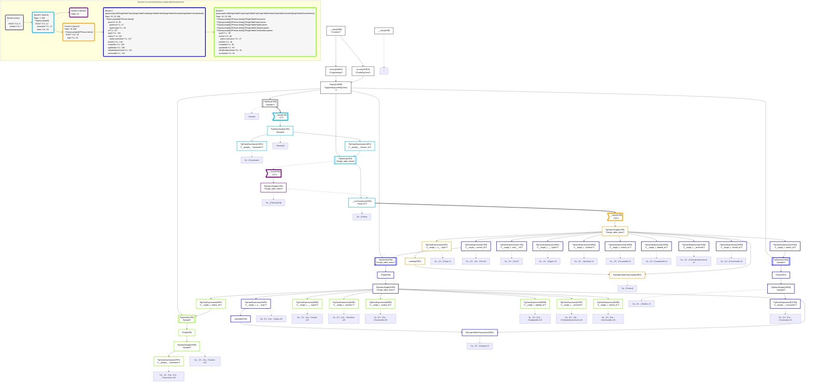

```mermaid
graph TD
    classDef path fill:#eee,stroke:#000,color:#000
    classDef plan fill:#fff,stroke-width:3px,color:#000
    classDef itemplan fill:#fff,stroke-width:6px,color:#000
    classDef sideeffectplan fill:#f00,stroke-width:6px,color:#000
    classDef bucket fill:#f6f6f6,color:#000,stroke-width:6px,text-align:left


    %% define plans
    __Value0["__Value[0∈0]"]:::plan
    PgClassExpression13["PgClassExpression[13∈1]<br />ᐸ__people__.”username”ᐳ"]:::plan
    PgSingleTablePolymorphic26["PgSingleTablePolymorphic[26∈3]"]:::plan
    Lambda25["Lambda[25∈3]"]:::plan
    PgClassExpression24["PgClassExpression[24∈3]<br />ᐸ__single_t...s__.”type”ᐳ"]:::plan
    PgSingleTablePolymorphic36["PgSingleTablePolymorphic[36∈4]"]:::plan
    Lambda35["Lambda[35∈4]"]:::plan
    PgClassExpression34["PgClassExpression[34∈4]<br />ᐸ__single_t...s__.”type”ᐳ"]:::plan
    PgClassExpression39["PgClassExpression[39∈5]<br />ᐸ__single_t...__.”type2”ᐳ"]:::plan
    PgClassExpression47["PgClassExpression[47∈5]<br />ᐸ__people__.”username”ᐳ"]:::plan
    PgSelectSingle46["PgSelectSingle[46∈5]<br />ᐸpeopleᐳ"]:::plan
    First45["First[45∈5]"]:::plan
    PgSelect41[["PgSelect[41∈5]<br />ᐸpeopleᐳ"]]:::plan
    PgClassExpression40["PgClassExpression[40∈5]<br />ᐸ__single_t...author_id”ᐳ"]:::plan
    PgClassExpression48["PgClassExpression[48∈5]<br />ᐸ__single_t...”position”ᐳ"]:::plan
    PgClassExpression49["PgClassExpression[49∈5]<br />ᐸ__single_t...reated_at”ᐳ"]:::plan
    PgClassExpression50["PgClassExpression[50∈5]<br />ᐸ__single_t...pdated_at”ᐳ"]:::plan
    PgClassExpression51["PgClassExpression[51∈5]<br />ᐸ__single_t..._archived”ᐳ"]:::plan
    PgClassExpression52["PgClassExpression[52∈5]<br />ᐸ__single_t...chived_at”ᐳ"]:::plan
    PgSelectSingle33["PgSelectSingle[33∈4]<br />ᐸsingle_table_itemsᐳ"]:::plan
    First32["First[32∈4]"]:::plan
    PgSelect28[["PgSelect[28∈4]<br />ᐸsingle_table_itemsᐳ"]]:::plan
    PgClassExpression27["PgClassExpression[27∈4]<br />ᐸ__single_t...parent_id”ᐳ"]:::plan
    PgClassExpression117["PgClassExpression[117∈4]<br />ᐸ__single_t...ems__.”id”ᐳ"]:::plan
    PgClassExpression119["PgClassExpression[119∈4]<br />ᐸ__single_t...__.”type2”ᐳ"]:::plan
    PgClassExpression127["PgClassExpression[127∈4]<br />ᐸ__people__.”username”ᐳ"]:::plan
    PgSelectSingle126["PgSelectSingle[126∈4]<br />ᐸpeopleᐳ"]:::plan
    First125["First[125∈4]"]:::plan
    PgSelect121[["PgSelect[121∈4]<br />ᐸpeopleᐳ"]]:::plan
    PgClassExpression120["PgClassExpression[120∈4]<br />ᐸ__single_t...author_id”ᐳ"]:::plan
    PgClassExpression128["PgClassExpression[128∈4]<br />ᐸ__single_t...”position”ᐳ"]:::plan
    PgClassExpression129["PgClassExpression[129∈4]<br />ᐸ__single_t...reated_at”ᐳ"]:::plan
    PgClassExpression130["PgClassExpression[130∈4]<br />ᐸ__single_t...pdated_at”ᐳ"]:::plan
    PgClassExpression131["PgClassExpression[131∈4]<br />ᐸ__single_t..._archived”ᐳ"]:::plan
    PgClassExpression132["PgClassExpression[132∈4]<br />ᐸ__single_t...chived_at”ᐳ"]:::plan
    PgSelectSingle23["PgSelectSingle[23∈3]<br />ᐸsingle_table_itemsᐳ"]:::plan
    __Item22>"__Item[22∈3]<br />ᐸ19ᐳ"]:::itemplan
    __ListTransform19["__ListTransform[19∈1]<br />ᐸeach:15ᐳ"]:::plan
    PgSelectSingle21["PgSelectSingle[21∈2]<br />ᐸsingle_table_itemsᐳ"]:::plan
    __Item20>"__Item[20∈2]<br />ᐸ15ᐳ"]:::itemplan
    PgSelect15[["PgSelect[15∈1]<br />ᐸsingle_table_itemsᐳ"]]:::plan
    PgClassExpression14["PgClassExpression[14∈1]<br />ᐸ__people__.”person_id”ᐳ"]:::plan
    PgSelectSingle12["PgSelectSingle[12∈1]<br />ᐸpeopleᐳ"]:::plan
    __Item11>"__Item[11∈1]<br />ᐸ7ᐳ"]:::itemplan
    PgSelect7[["PgSelect[7∈0]<br />ᐸpeopleᐳ"]]:::plan
    Object548["Object[548∈0]<br />ᐸ{pgSettings,withPgClient}ᐳ"]:::plan
    Access546["Access[546∈0]<br />ᐸ3.pgSettingsᐳ"]:::plan
    Access547["Access[547∈0]<br />ᐸ3.withPgClientᐳ"]:::plan
    __Value3["__Value[3∈0]<br />ᐸcontextᐳ"]:::plan

    %% plan dependencies
    PgSelectSingle12 --> PgClassExpression13
    Lambda25 & PgSelectSingle23 --> PgSingleTablePolymorphic26
    PgClassExpression24 --> Lambda25
    PgSelectSingle23 --> PgClassExpression24
    Lambda35 & PgSelectSingle33 --> PgSingleTablePolymorphic36
    PgClassExpression34 --> Lambda35
    PgSelectSingle33 --> PgClassExpression34
    PgSelectSingle33 --> PgClassExpression39
    PgSelectSingle46 --> PgClassExpression47
    First45 --> PgSelectSingle46
    PgSelect41 --> First45
    Object548 & PgClassExpression40 --> PgSelect41
    PgSelectSingle33 --> PgClassExpression40
    PgSelectSingle33 --> PgClassExpression48
    PgSelectSingle33 --> PgClassExpression49
    PgSelectSingle33 --> PgClassExpression50
    PgSelectSingle33 --> PgClassExpression51
    PgSelectSingle33 --> PgClassExpression52
    First32 --> PgSelectSingle33
    PgSelect28 --> First32
    Object548 & PgClassExpression27 --> PgSelect28
    PgSelectSingle23 --> PgClassExpression27
    PgSelectSingle23 --> PgClassExpression117
    PgSelectSingle23 --> PgClassExpression119
    PgSelectSingle126 --> PgClassExpression127
    First125 --> PgSelectSingle126
    PgSelect121 --> First125
    Object548 & PgClassExpression120 --> PgSelect121
    PgSelectSingle23 --> PgClassExpression120
    PgSelectSingle23 --> PgClassExpression128
    PgSelectSingle23 --> PgClassExpression129
    PgSelectSingle23 --> PgClassExpression130
    PgSelectSingle23 --> PgClassExpression131
    PgSelectSingle23 --> PgClassExpression132
    __Item22 --> PgSelectSingle23
    __ListTransform19 ==> __Item22
    PgSelect15 --> __ListTransform19
    PgSelectSingle21 -.-> __ListTransform19
    __Item20 --> PgSelectSingle21
    PgSelect15 -.-> __Item20
    Object548 & PgClassExpression14 --> PgSelect15
    PgSelectSingle12 --> PgClassExpression14
    __Item11 --> PgSelectSingle12
    PgSelect7 ==> __Item11
    Object548 --> PgSelect7
    Access546 & Access547 --> Object548
    __Value3 --> Access546
    __Value3 --> Access547

    %% plan-to-path relationships
    P0["~"]
    __Value0 -.-> P0
    P7["ᐳpeople"]
    PgSelect7 -.-> P7
    P12["ᐳpeople[]"]
    PgSelectSingle12 -.-> P12
    P13["ᐳp…]ᐳusername"]
    PgClassExpression13 -.-> P13
    P19["ᐳp…]ᐳitems"]
    __ListTransform19 -.-> P19
    P21["ᐳp…]ᐳitems@19[]"]
    PgSelectSingle21 -.-> P21
    P24["ᐳp…]ᐳi…]ᐳtype x5"]
    PgClassExpression24 -.-> P24
    P26["ᐳp…]ᐳitems[]"]
    PgSingleTablePolymorphic26 -.-> P26
    P27["ᐳp…]ᐳi…]ᐳp…tᐳid x25"]
    PgClassExpression27 -.-> P27
    P34["ᐳp…]ᐳi…]ᐳp…tᐳtype x25"]
    PgClassExpression34 -.-> P34
    P36["ᐳp…]ᐳi…]ᐳparent x5"]
    PgSingleTablePolymorphic36 -.-> P36
    P39["ᐳp…]ᐳi…]ᐳp…tᐳtype2 x25"]
    PgClassExpression39 -.-> P39
    P46["ᐳp…]ᐳi…]ᐳp…tᐳauthor x25"]
    PgSelectSingle46 -.-> P46
    P47["ᐳp…]ᐳi…]ᐳp…tᐳa…rᐳusername x25"]
    PgClassExpression47 -.-> P47
    P48["ᐳp…]ᐳi…]ᐳp…tᐳposition x25"]
    PgClassExpression48 -.-> P48
    P49["ᐳp…]ᐳi…]ᐳp…tᐳcreatedAt x25"]
    PgClassExpression49 -.-> P49
    P50["ᐳp…]ᐳi…]ᐳp…tᐳupdatedAt x25"]
    PgClassExpression50 -.-> P50
    P51["ᐳp…]ᐳi…]ᐳp…tᐳisExplicitlyArchived x25"]
    PgClassExpression51 -.-> P51
    P52["ᐳp…]ᐳi…]ᐳp…tᐳarchivedAt x25"]
    PgClassExpression52 -.-> P52
    P117["ᐳp…]ᐳi…]ᐳid x5"]
    PgClassExpression117 -.-> P117
    P119["ᐳp…]ᐳi…]ᐳtype2 x5"]
    PgClassExpression119 -.-> P119
    P126["ᐳp…]ᐳi…]ᐳauthor x5"]
    PgSelectSingle126 -.-> P126
    P127["ᐳp…]ᐳi…]ᐳa…rᐳusername x5"]
    PgClassExpression127 -.-> P127
    P128["ᐳp…]ᐳi…]ᐳposition x5"]
    PgClassExpression128 -.-> P128
    P129["ᐳp…]ᐳi…]ᐳcreatedAt x5"]
    PgClassExpression129 -.-> P129
    P130["ᐳp…]ᐳi…]ᐳupdatedAt x5"]
    PgClassExpression130 -.-> P130
    P131["ᐳp…]ᐳi…]ᐳisExplicitlyArchived x5"]
    PgClassExpression131 -.-> P131
    P132["ᐳp…]ᐳi…]ᐳarchivedAt x5"]
    PgClassExpression132 -.-> P132

    subgraph "Buckets for queries/interfaces-single-table/nested-more"
    Bucket0("Bucket 0 (root)<br />~<br />⠀ROOT ᐸ-O- 0<br />⠀⠀people ᐸ-A- 7"):::bucket
    classDef bucket0 stroke:#696969
    class Bucket0,__Value0,__Value3,PgSelect7,Access546,Access547,Object548 bucket0
    Bucket1("Bucket 1 (item11)<br />Deps: 7, 548<br />~ᐳQuery.people[]<br />⠀ROOT ᐸ-O- 12<br />⠀⠀username ᐸ-L- 13<br />⠀⠀items ᐸ-A- 19"):::bucket
    classDef bucket1 stroke:#00bfff
    class Bucket1,__Item11,PgSelectSingle12,PgClassExpression13,PgClassExpression14,PgSelect15,__ListTransform19 bucket1
    Bucket2("Bucket 2 (item20)<br />Deps: 15"):::bucket
    classDef bucket2 stroke:#7f007f
    class Bucket2,__Item20,PgSelectSingle21 bucket2
    Bucket3("Bucket 3 (item22)<br />Deps: 19, 548<br />~ᐳQuery.people[]ᐳPerson.items[]<br />⠀ROOT ᐸ-O- 26<br />⠀⠀type ᐸ-L- 24"):::bucket
    classDef bucket3 stroke:#ffa500
    class Bucket3,__Item22,PgSelectSingle23,PgClassExpression24,Lambda25,PgSingleTablePolymorphic26 bucket3
    Bucket4("Bucket 4 (polymorphic26[SingleTableTopic|SingleTablePost|SingleTableDivider|SingleTableChecklist|SingleTableChecklistItem])<br />Deps: 22, 23, 548<br />~ᐳQuery.people[]ᐳPerson.items[]<br />⠀⠀parent ᐸ-O- 36<br />⠀⠀⠀parent.id ᐸ-L- 27<br />⠀⠀⠀parent.type ᐸ-L- 34<br />⠀⠀id ᐸ-L- 117<br />⠀⠀type2 ᐸ-L- 119<br />⠀⠀author ᐸ-O- 126<br />⠀⠀⠀author.username ᐸ-L- 127<br />⠀⠀position ᐸ-L- 128<br />⠀⠀createdAt ᐸ-L- 129<br />⠀⠀updatedAt ᐸ-L- 130<br />⠀⠀isExplicitlyArchived ᐸ-L- 131<br />⠀⠀archivedAt ᐸ-L- 132"):::bucket
    classDef bucket4 stroke:#0000ff
    class Bucket4,PgClassExpression27,PgSelect28,First32,PgSelectSingle33,PgClassExpression34,Lambda35,PgSingleTablePolymorphic36,PgClassExpression117,PgClassExpression119,PgClassExpression120,PgSelect121,First125,PgSelectSingle126,PgClassExpression127,PgClassExpression128,PgClassExpression129,PgClassExpression130,PgClassExpression131,PgClassExpression132 bucket4
    Bucket5("Bucket 5 (polymorphic36[SingleTableTopic|SingleTablePost|SingleTableDivider|SingleTableChecklist|SingleTableChecklistItem])<br />Deps: 32, 33, 548<br />~ᐳQuery.people[]ᐳPerson.items[]ᐳSingleTablePost.parent<br />~ᐳQuery.people[]ᐳPerson.items[]ᐳSingleTableTopic.parent<br />~ᐳQuery.people[]ᐳPerson.items[]ᐳSingleTableDivider.parent<br />~ᐳQuery.people[]ᐳPerson.items[]ᐳSingleTableChecklist.parent<br />~ᐳQuery.people[]ᐳPerson.items[]ᐳSingleTableChecklistItem.parent<br />⠀⠀type2 ᐸ-L- 39<br />⠀⠀author ᐸ-O- 46<br />⠀⠀⠀author.username ᐸ-L- 47<br />⠀⠀position ᐸ-L- 48<br />⠀⠀createdAt ᐸ-L- 49<br />⠀⠀updatedAt ᐸ-L- 50<br />⠀⠀isExplicitlyArchived ᐸ-L- 51<br />⠀⠀archivedAt ᐸ-L- 52"):::bucket
    classDef bucket5 stroke:#7fff00
    class Bucket5,PgClassExpression39,PgClassExpression40,PgSelect41,First45,PgSelectSingle46,PgClassExpression47,PgClassExpression48,PgClassExpression49,PgClassExpression50,PgClassExpression51,PgClassExpression52 bucket5
    Bucket0 --> Bucket1
    Bucket1 --> Bucket2 & Bucket3
    Bucket3 --> Bucket4
    Bucket4 --> Bucket5
    end
```
