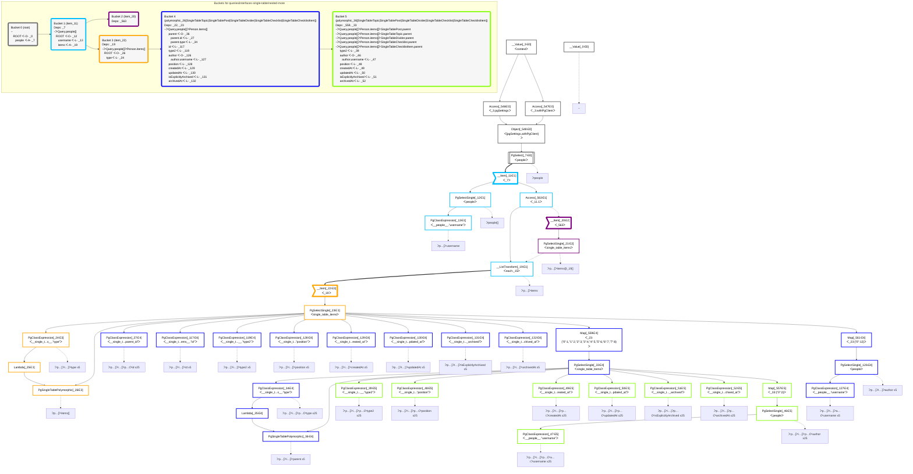

```mermaid
graph TD
    classDef path fill:#eee,stroke:#000,color:#000
    classDef plan fill:#fff,stroke-width:3px,color:#000
    classDef itemplan fill:#fff,stroke-width:6px,color:#000
    classDef sideeffectplan fill:#f00,stroke-width:6px,color:#000
    classDef bucket fill:#f6f6f6,color:#000,stroke-width:6px,text-align:left


    %% define plans
    __Value_0["__Value[_0∈0]"]:::plan
    __Value_3["__Value[_3∈0]<br />ᐸcontextᐳ"]:::plan
    PgSelect_7[["PgSelect[_7∈0]<br />ᐸpeopleᐳ"]]:::plan
    __Item_11>"__Item[_11∈1]<br />ᐸ_7ᐳ"]:::itemplan
    PgSelectSingle_12["PgSelectSingle[_12∈1]<br />ᐸpeopleᐳ"]:::plan
    PgClassExpression_13["PgClassExpression[_13∈1]<br />ᐸ__people__.”username”ᐳ"]:::plan
    __ListTransform_19["__ListTransform[_19∈1]<br />ᐸeach:_15ᐳ"]:::plan
    __Item_20>"__Item[_20∈2]<br />ᐸ_563ᐳ"]:::itemplan
    PgSelectSingle_21["PgSelectSingle[_21∈2]<br />ᐸsingle_table_itemsᐳ"]:::plan
    __Item_22>"__Item[_22∈3]<br />ᐸ_19ᐳ"]:::itemplan
    PgSelectSingle_23["PgSelectSingle[_23∈3]<br />ᐸsingle_table_itemsᐳ"]:::plan
    PgClassExpression_24["PgClassExpression[_24∈3]<br />ᐸ__single_t...s__.”type”ᐳ"]:::plan
    Lambda_25["Lambda[_25∈3]"]:::plan
    PgSingleTablePolymorphic_26["PgSingleTablePolymorphic[_26∈3]"]:::plan
    PgClassExpression_27["PgClassExpression[_27∈4]<br />ᐸ__single_t...parent_id”ᐳ"]:::plan
    PgSelectSingle_33["PgSelectSingle[_33∈4]<br />ᐸsingle_table_itemsᐳ"]:::plan
    PgClassExpression_34["PgClassExpression[_34∈4]<br />ᐸ__single_t...s__.”type”ᐳ"]:::plan
    Lambda_35["Lambda[_35∈4]"]:::plan
    PgSingleTablePolymorphic_36["PgSingleTablePolymorphic[_36∈4]"]:::plan
    PgClassExpression_39["PgClassExpression[_39∈5]<br />ᐸ__single_t...__.”type2”ᐳ"]:::plan
    PgSelectSingle_46["PgSelectSingle[_46∈5]<br />ᐸpeopleᐳ"]:::plan
    PgClassExpression_47["PgClassExpression[_47∈5]<br />ᐸ__people__.”username”ᐳ"]:::plan
    PgClassExpression_48["PgClassExpression[_48∈5]<br />ᐸ__single_t...”position”ᐳ"]:::plan
    PgClassExpression_49["PgClassExpression[_49∈5]<br />ᐸ__single_t...reated_at”ᐳ"]:::plan
    PgClassExpression_50["PgClassExpression[_50∈5]<br />ᐸ__single_t...pdated_at”ᐳ"]:::plan
    PgClassExpression_51["PgClassExpression[_51∈5]<br />ᐸ__single_t..._archived”ᐳ"]:::plan
    PgClassExpression_52["PgClassExpression[_52∈5]<br />ᐸ__single_t...chived_at”ᐳ"]:::plan
    PgClassExpression_117["PgClassExpression[_117∈4]<br />ᐸ__single_t...ems__.”id”ᐳ"]:::plan
    PgClassExpression_119["PgClassExpression[_119∈4]<br />ᐸ__single_t...__.”type2”ᐳ"]:::plan
    PgSelectSingle_126["PgSelectSingle[_126∈4]<br />ᐸpeopleᐳ"]:::plan
    PgClassExpression_127["PgClassExpression[_127∈4]<br />ᐸ__people__.”username”ᐳ"]:::plan
    PgClassExpression_128["PgClassExpression[_128∈4]<br />ᐸ__single_t...”position”ᐳ"]:::plan
    PgClassExpression_129["PgClassExpression[_129∈4]<br />ᐸ__single_t...reated_at”ᐳ"]:::plan
    PgClassExpression_130["PgClassExpression[_130∈4]<br />ᐸ__single_t...pdated_at”ᐳ"]:::plan
    PgClassExpression_131["PgClassExpression[_131∈4]<br />ᐸ__single_t..._archived”ᐳ"]:::plan
    PgClassExpression_132["PgClassExpression[_132∈4]<br />ᐸ__single_t...chived_at”ᐳ"]:::plan
    Access_546["Access[_546∈0]<br />ᐸ_3.pgSettingsᐳ"]:::plan
    Access_547["Access[_547∈0]<br />ᐸ_3.withPgClientᐳ"]:::plan
    Object_548["Object[_548∈0]<br />ᐸ{pgSettings,withPgClient}ᐳ"]:::plan
    Map_557["Map[_557∈5]<br />ᐸ_33:{”0”:2}ᐳ"]:::plan
    Map_559["Map[_559∈4]<br />ᐸ_23:{”0”:1,”1”:2,”2”:3,”3”:4,”4”:5,”5”:6,”6”:7,”7”:8}ᐳ"]:::plan
    Map_561["Map[_561∈4]<br />ᐸ_23:{”0”:12}ᐳ"]:::plan
    Access_563["Access[_563∈1]<br />ᐸ_11.1ᐳ"]:::plan

    %% plan dependencies
    Object_548 --> PgSelect_7
    PgSelect_7 ==> __Item_11
    __Item_11 --> PgSelectSingle_12
    PgSelectSingle_12 --> PgClassExpression_13
    Access_563 --> __ListTransform_19
    PgSelectSingle_21 -.-> __ListTransform_19
    Access_563 -.-> __Item_20
    __Item_20 --> PgSelectSingle_21
    __ListTransform_19 ==> __Item_22
    __Item_22 --> PgSelectSingle_23
    PgSelectSingle_23 --> PgClassExpression_24
    PgClassExpression_24 --> Lambda_25
    Lambda_25 --> PgSingleTablePolymorphic_26
    PgSelectSingle_23 --> PgSingleTablePolymorphic_26
    PgSelectSingle_23 --> PgClassExpression_27
    Map_559 --> PgSelectSingle_33
    PgSelectSingle_33 --> PgClassExpression_34
    PgClassExpression_34 --> Lambda_35
    Lambda_35 --> PgSingleTablePolymorphic_36
    PgSelectSingle_33 --> PgSingleTablePolymorphic_36
    PgSelectSingle_33 --> PgClassExpression_39
    Map_557 --> PgSelectSingle_46
    PgSelectSingle_46 --> PgClassExpression_47
    PgSelectSingle_33 --> PgClassExpression_48
    PgSelectSingle_33 --> PgClassExpression_49
    PgSelectSingle_33 --> PgClassExpression_50
    PgSelectSingle_33 --> PgClassExpression_51
    PgSelectSingle_33 --> PgClassExpression_52
    PgSelectSingle_23 --> PgClassExpression_117
    PgSelectSingle_23 --> PgClassExpression_119
    Map_561 --> PgSelectSingle_126
    PgSelectSingle_126 --> PgClassExpression_127
    PgSelectSingle_23 --> PgClassExpression_128
    PgSelectSingle_23 --> PgClassExpression_129
    PgSelectSingle_23 --> PgClassExpression_130
    PgSelectSingle_23 --> PgClassExpression_131
    PgSelectSingle_23 --> PgClassExpression_132
    __Value_3 --> Access_546
    __Value_3 --> Access_547
    Access_546 --> Object_548
    Access_547 --> Object_548
    PgSelectSingle_33 --> Map_557
    PgSelectSingle_23 --> Map_559
    PgSelectSingle_23 --> Map_561
    __Item_11 --> Access_563

    %% plan-to-path relationships
    P_0["~"]
    __Value_0 -.-> P_0
    P_7["ᐳpeople"]
    PgSelect_7 -.-> P_7
    P_12["ᐳpeople[]"]
    PgSelectSingle_12 -.-> P_12
    P_13["ᐳp…]ᐳusername"]
    PgClassExpression_13 -.-> P_13
    P_19["ᐳp…]ᐳitems"]
    __ListTransform_19 -.-> P_19
    P_21["ᐳp…]ᐳitems@_19[]"]
    PgSelectSingle_21 -.-> P_21
    P_24["ᐳp…]ᐳi…]ᐳtype x5"]
    PgClassExpression_24 -.-> P_24
    P_26["ᐳp…]ᐳitems[]"]
    PgSingleTablePolymorphic_26 -.-> P_26
    P_27["ᐳp…]ᐳi…]ᐳp…tᐳid x25"]
    PgClassExpression_27 -.-> P_27
    P_34["ᐳp…]ᐳi…]ᐳp…tᐳtype x25"]
    PgClassExpression_34 -.-> P_34
    P_36["ᐳp…]ᐳi…]ᐳparent x5"]
    PgSingleTablePolymorphic_36 -.-> P_36
    P_39["ᐳp…]ᐳi…]ᐳp…tᐳtype2 x25"]
    PgClassExpression_39 -.-> P_39
    P_46["ᐳp…]ᐳi…]ᐳp…tᐳauthor x25"]
    PgSelectSingle_46 -.-> P_46
    P_47["ᐳp…]ᐳi…]ᐳp…tᐳa…rᐳusername x25"]
    PgClassExpression_47 -.-> P_47
    P_48["ᐳp…]ᐳi…]ᐳp…tᐳposition x25"]
    PgClassExpression_48 -.-> P_48
    P_49["ᐳp…]ᐳi…]ᐳp…tᐳcreatedAt x25"]
    PgClassExpression_49 -.-> P_49
    P_50["ᐳp…]ᐳi…]ᐳp…tᐳupdatedAt x25"]
    PgClassExpression_50 -.-> P_50
    P_51["ᐳp…]ᐳi…]ᐳp…tᐳisExplicitlyArchived x25"]
    PgClassExpression_51 -.-> P_51
    P_52["ᐳp…]ᐳi…]ᐳp…tᐳarchivedAt x25"]
    PgClassExpression_52 -.-> P_52
    P_117["ᐳp…]ᐳi…]ᐳid x5"]
    PgClassExpression_117 -.-> P_117
    P_119["ᐳp…]ᐳi…]ᐳtype2 x5"]
    PgClassExpression_119 -.-> P_119
    P_126["ᐳp…]ᐳi…]ᐳauthor x5"]
    PgSelectSingle_126 -.-> P_126
    P_127["ᐳp…]ᐳi…]ᐳa…rᐳusername x5"]
    PgClassExpression_127 -.-> P_127
    P_128["ᐳp…]ᐳi…]ᐳposition x5"]
    PgClassExpression_128 -.-> P_128
    P_129["ᐳp…]ᐳi…]ᐳcreatedAt x5"]
    PgClassExpression_129 -.-> P_129
    P_130["ᐳp…]ᐳi…]ᐳupdatedAt x5"]
    PgClassExpression_130 -.-> P_130
    P_131["ᐳp…]ᐳi…]ᐳisExplicitlyArchived x5"]
    PgClassExpression_131 -.-> P_131
    P_132["ᐳp…]ᐳi…]ᐳarchivedAt x5"]
    PgClassExpression_132 -.-> P_132

    %% allocate buckets
    classDef bucket0 stroke:#696969
    class __Value_0,__Value_3,PgSelect_7,Access_546,Access_547,Object_548 bucket0
    classDef bucket1 stroke:#00bfff
    class __Item_11,PgSelectSingle_12,PgClassExpression_13,__ListTransform_19,Access_563 bucket1
    classDef bucket2 stroke:#7f007f
    class __Item_20,PgSelectSingle_21 bucket2
    classDef bucket3 stroke:#ffa500
    class __Item_22,PgSelectSingle_23,PgClassExpression_24,Lambda_25,PgSingleTablePolymorphic_26 bucket3
    classDef bucket4 stroke:#0000ff
    class PgClassExpression_27,PgSelectSingle_33,PgClassExpression_34,Lambda_35,PgSingleTablePolymorphic_36,PgClassExpression_117,PgClassExpression_119,PgSelectSingle_126,PgClassExpression_127,PgClassExpression_128,PgClassExpression_129,PgClassExpression_130,PgClassExpression_131,PgClassExpression_132,Map_559,Map_561 bucket4
    classDef bucket5 stroke:#7fff00
    class PgClassExpression_39,PgSelectSingle_46,PgClassExpression_47,PgClassExpression_48,PgClassExpression_49,PgClassExpression_50,PgClassExpression_51,PgClassExpression_52,Map_557 bucket5

    subgraph "Buckets for queries/interfaces-single-table/nested-more"
    Bucket0("Bucket 0 (root)<br />~<br />⠀ROOT ᐸ-O- _0<br />⠀⠀people ᐸ-A- _7"):::bucket
    style Bucket0 stroke:#696969
    Bucket1("Bucket 1 (item_11)<br />Deps: _7<br />~ᐳQuery.people[]<br />⠀ROOT ᐸ-O- _12<br />⠀⠀username ᐸ-L- _13<br />⠀⠀items ᐸ-A- _19"):::bucket
    style Bucket1 stroke:#00bfff
    Bucket0 --> Bucket1
    Bucket2("Bucket 2 (item_20)<br />Deps: _563"):::bucket
    style Bucket2 stroke:#7f007f
    Bucket1 --> Bucket2
    Bucket3("Bucket 3 (item_22)<br />Deps: _19<br />~ᐳQuery.people[]ᐳPerson.items[]<br />⠀ROOT ᐸ-O- _26<br />⠀⠀type ᐸ-L- _24"):::bucket
    style Bucket3 stroke:#ffa500
    Bucket1 --> Bucket3
    Bucket4("Bucket 4 (polymorphic_26[SingleTableTopic|SingleTablePost|SingleTableDivider|SingleTableChecklist|SingleTableChecklistItem])<br />Deps: _22, _23<br />~ᐳQuery.people[]ᐳPerson.items[]<br />⠀⠀parent ᐸ-O- _36<br />⠀⠀⠀parent.id ᐸ-L- _27<br />⠀⠀⠀parent.type ᐸ-L- _34<br />⠀⠀id ᐸ-L- _117<br />⠀⠀type2 ᐸ-L- _119<br />⠀⠀author ᐸ-O- _126<br />⠀⠀⠀author.username ᐸ-L- _127<br />⠀⠀position ᐸ-L- _128<br />⠀⠀createdAt ᐸ-L- _129<br />⠀⠀updatedAt ᐸ-L- _130<br />⠀⠀isExplicitlyArchived ᐸ-L- _131<br />⠀⠀archivedAt ᐸ-L- _132"):::bucket
    style Bucket4 stroke:#0000ff
    Bucket3 --> Bucket4
    Bucket5("Bucket 5 (polymorphic_36[SingleTableTopic|SingleTablePost|SingleTableDivider|SingleTableChecklist|SingleTableChecklistItem])<br />Deps: _559, _33<br />~ᐳQuery.people[]ᐳPerson.items[]ᐳSingleTablePost.parent<br />~ᐳQuery.people[]ᐳPerson.items[]ᐳSingleTableTopic.parent<br />~ᐳQuery.people[]ᐳPerson.items[]ᐳSingleTableDivider.parent<br />~ᐳQuery.people[]ᐳPerson.items[]ᐳSingleTableChecklist.parent<br />~ᐳQuery.people[]ᐳPerson.items[]ᐳSingleTableChecklistItem.parent<br />⠀⠀type2 ᐸ-L- _39<br />⠀⠀author ᐸ-O- _46<br />⠀⠀⠀author.username ᐸ-L- _47<br />⠀⠀position ᐸ-L- _48<br />⠀⠀createdAt ᐸ-L- _49<br />⠀⠀updatedAt ᐸ-L- _50<br />⠀⠀isExplicitlyArchived ᐸ-L- _51<br />⠀⠀archivedAt ᐸ-L- _52"):::bucket
    style Bucket5 stroke:#7fff00
    Bucket4 --> Bucket5
    end
```
