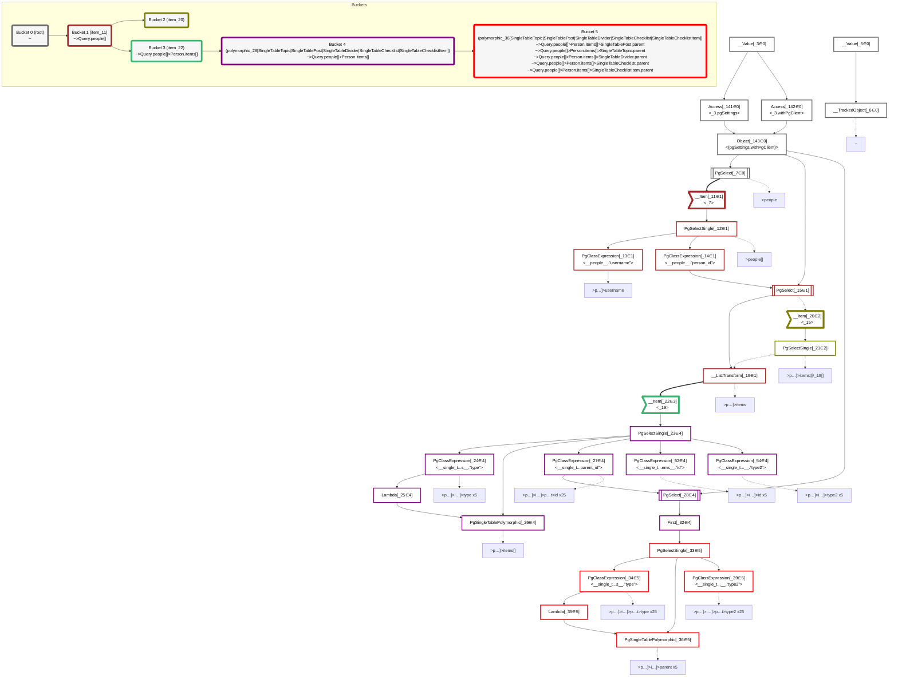

```mermaid
graph TD
    classDef path fill:#eee,stroke:#000,color:#000
    classDef plan fill:#fff,stroke-width:3px,color:#000
    classDef itemplan fill:#fff,stroke-width:6px,color:#000
    classDef sideeffectplan fill:#f00,stroke-width:6px,color:#000
    classDef bucket fill:#f6f6f6,color:#000,stroke-width:6px


    %% define plans
    __Value_3["__Value[_3∈0]<br /><context>"]:::plan
    __Value_5["__Value[_5∈0]<br /><rootValue>"]:::plan
    __TrackedObject_6["__TrackedObject[_6∈0]"]:::plan
    PgSelect_7[["PgSelect[_7∈0]<br /><people>"]]:::plan
    __Item_11>"__Item[_11∈1]<br /><_7>"]:::itemplan
    PgSelectSingle_12["PgSelectSingle[_12∈1]<br /><people>"]:::plan
    PgClassExpression_13["PgClassExpression[_13∈1]<br /><__people__.”username”>"]:::plan
    PgClassExpression_14["PgClassExpression[_14∈1]<br /><__people__.”person_id”>"]:::plan
    PgSelect_15[["PgSelect[_15∈1]<br /><single_table_items>"]]:::plan
    __ListTransform_19["__ListTransform[_19∈1]<br /><each:_15>"]:::plan
    __Item_20>"__Item[_20∈2]<br /><_15>"]:::itemplan
    PgSelectSingle_21["PgSelectSingle[_21∈2]<br /><single_table_items>"]:::plan
    __Item_22>"__Item[_22∈3]<br /><_19>"]:::itemplan
    PgSelectSingle_23["PgSelectSingle[_23∈4]<br /><single_table_items>"]:::plan
    PgClassExpression_24["PgClassExpression[_24∈4]<br /><__single_t...s__.”type”>"]:::plan
    Lambda_25["Lambda[_25∈4]"]:::plan
    PgSingleTablePolymorphic_26["PgSingleTablePolymorphic[_26∈4]"]:::plan
    PgClassExpression_27["PgClassExpression[_27∈4]<br /><__single_t...parent_id”>"]:::plan
    PgSelect_28[["PgSelect[_28∈4]<br /><single_table_items>"]]:::plan
    First_32["First[_32∈4]"]:::plan
    PgSelectSingle_33["PgSelectSingle[_33∈5]<br /><single_table_items>"]:::plan
    PgClassExpression_34["PgClassExpression[_34∈5]<br /><__single_t...s__.”type”>"]:::plan
    Lambda_35["Lambda[_35∈5]"]:::plan
    PgSingleTablePolymorphic_36["PgSingleTablePolymorphic[_36∈5]"]:::plan
    PgClassExpression_39["PgClassExpression[_39∈5]<br /><__single_t...__.”type2”>"]:::plan
    PgClassExpression_52["PgClassExpression[_52∈4]<br /><__single_t...ems__.”id”>"]:::plan
    PgClassExpression_54["PgClassExpression[_54∈4]<br /><__single_t...__.”type2”>"]:::plan
    Access_141["Access[_141∈0]<br /><_3.pgSettings>"]:::plan
    Access_142["Access[_142∈0]<br /><_3.withPgClient>"]:::plan
    Object_143["Object[_143∈0]<br /><{pgSettings,withPgClient}>"]:::plan

    %% plan dependencies
    __Value_5 --> __TrackedObject_6
    Object_143 --> PgSelect_7
    PgSelect_7 ==> __Item_11
    __Item_11 --> PgSelectSingle_12
    PgSelectSingle_12 --> PgClassExpression_13
    PgSelectSingle_12 --> PgClassExpression_14
    Object_143 --> PgSelect_15
    PgClassExpression_14 --> PgSelect_15
    PgSelect_15 --> __ListTransform_19
    PgSelectSingle_21 -.-> __ListTransform_19
    PgSelect_15 -.-> __Item_20
    __Item_20 --> PgSelectSingle_21
    __ListTransform_19 ==> __Item_22
    __Item_22 --> PgSelectSingle_23
    PgSelectSingle_23 --> PgClassExpression_24
    PgClassExpression_24 --> Lambda_25
    Lambda_25 --> PgSingleTablePolymorphic_26
    PgSelectSingle_23 --> PgSingleTablePolymorphic_26
    PgSelectSingle_23 --> PgClassExpression_27
    Object_143 --> PgSelect_28
    PgClassExpression_27 --> PgSelect_28
    PgSelect_28 --> First_32
    First_32 --> PgSelectSingle_33
    PgSelectSingle_33 --> PgClassExpression_34
    PgClassExpression_34 --> Lambda_35
    Lambda_35 --> PgSingleTablePolymorphic_36
    PgSelectSingle_33 --> PgSingleTablePolymorphic_36
    PgSelectSingle_33 --> PgClassExpression_39
    PgSelectSingle_23 --> PgClassExpression_52
    PgSelectSingle_23 --> PgClassExpression_54
    __Value_3 --> Access_141
    __Value_3 --> Access_142
    Access_141 --> Object_143
    Access_142 --> Object_143

    %% plan-to-path relationships
    P1["~"]
    __TrackedObject_6 -.-> P1
    P2[">people"]
    PgSelect_7 -.-> P2
    P3[">people[]"]
    PgSelectSingle_12 -.-> P3
    P4[">p…]>username"]
    PgClassExpression_13 -.-> P4
    P5[">p…]>items@_19[]"]
    PgSelectSingle_21 -.-> P5
    P6[">p…]>items"]
    __ListTransform_19 -.-> P6
    P7[">p…]>items[]"]
    PgSingleTablePolymorphic_26 -.-> P7
    P8[">p…]>i…]>parent x5"]
    PgSingleTablePolymorphic_36 -.-> P8
    P9[">p…]>i…]>p…t>id x25"]
    PgClassExpression_27 -.-> P9
    P10[">p…]>i…]>p…t>type x25"]
    PgClassExpression_34 -.-> P10
    P11[">p…]>i…]>p…t>type2 x25"]
    PgClassExpression_39 -.-> P11
    P12[">p…]>i…]>id x5"]
    PgClassExpression_52 -.-> P12
    P13[">p…]>i…]>type x5"]
    PgClassExpression_24 -.-> P13
    P14[">p…]>i…]>type2 x5"]
    PgClassExpression_54 -.-> P14

    %% allocate buckets
    classDef bucket0 stroke:#696969
    class __Value_3,__Value_5,__TrackedObject_6,PgSelect_7,Access_141,Access_142,Object_143 bucket0
    classDef bucket1 stroke:#a52a2a
    class __Item_11,PgSelectSingle_12,PgClassExpression_13,PgClassExpression_14,PgSelect_15,__ListTransform_19 bucket1
    classDef bucket2 stroke:#808000
    class __Item_20,PgSelectSingle_21 bucket2
    classDef bucket3 stroke:#3cb371
    class __Item_22 bucket3
    classDef bucket4 stroke:#7f007f
    class PgSelectSingle_23,PgClassExpression_24,Lambda_25,PgSingleTablePolymorphic_26,PgClassExpression_27,PgSelect_28,First_32,PgClassExpression_52,PgClassExpression_54 bucket4
    classDef bucket5 stroke:#ff0000
    class PgSelectSingle_33,PgClassExpression_34,Lambda_35,PgSingleTablePolymorphic_36,PgClassExpression_39 bucket5

    subgraph Buckets
    Bucket0("Bucket 0 (root)<br />~"):::bucket
    style Bucket0 stroke:#696969
    Bucket1("Bucket 1 (item_11)<br />~>Query.people[]"):::bucket
    style Bucket1 stroke:#a52a2a
    Bucket0 --> Bucket1
    Bucket2("Bucket 2 (item_20)"):::bucket
    style Bucket2 stroke:#808000
    Bucket1 --> Bucket2
    Bucket3("Bucket 3 (item_22)<br />~>Query.people[]>Person.items[]"):::bucket
    style Bucket3 stroke:#3cb371
    Bucket1 --> Bucket3
    Bucket4("Bucket 4 (polymorphic_26[SingleTableTopic|SingleTablePost|SingleTableDivider|SingleTableChecklist|SingleTableChecklistItem])<br />~>Query.people[]>Person.items[]"):::bucket
    style Bucket4 stroke:#7f007f
    Bucket3 --> Bucket4
    Bucket5("Bucket 5 (polymorphic_36[SingleTableTopic|SingleTablePost|SingleTableDivider|SingleTableChecklist|SingleTableChecklistItem])<br />~>Query.people[]>Person.items[]>SingleTablePost.parent<br />~>Query.people[]>Person.items[]>SingleTableTopic.parent<br />~>Query.people[]>Person.items[]>SingleTableDivider.parent<br />~>Query.people[]>Person.items[]>SingleTableChecklist.parent<br />~>Query.people[]>Person.items[]>SingleTableChecklistItem.parent"):::bucket
    style Bucket5 stroke:#ff0000
    Bucket4 --> Bucket5
    end
```
