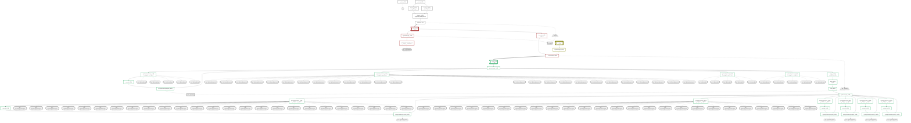

```mermaid
graph TD
    classDef path fill:#eee,stroke:#000
    classDef plan fill:#fff,stroke-width:3px
    classDef itemplan fill:#fff,stroke-width:6px
    classDef sideeffectplan fill:#f00,stroke-width:6px

    %% subgraph fields
    P1{{"~"}}:::path
    P2[/">people"\]:::path
    P3>">people[]"]:::path
    P2 -.- P3
    P4([">pe…e[]>username"]):::path
    %% P3 -.-> P4
    P5[/">pe…e[]>items"\]:::path
    P6>">pe…e[]>items[]"]:::path
    P5 -.- P6
    P7{{">pe…e[]>items[]>parent"}}:::path
    P8([">pe…e[]>items[]>parent>id"]):::path
    %% P7 -.-> P8
    P9([">pe…e[]>items[]>parent>type"]):::path
    %% P7 -.-> P9
    P10([">pe…e[]>items[]>parent>type2"]):::path
    %% P7 -.-> P10
    P11([">pe…e[]>items[]>parent>id"]):::path
    %% P7 -.-> P11
    P12([">pe…e[]>items[]>parent>type"]):::path
    %% P7 -.-> P12
    P13([">pe…e[]>items[]>parent>type2"]):::path
    %% P7 -.-> P13
    P14([">pe…e[]>items[]>parent>id"]):::path
    %% P7 -.-> P14
    P15([">pe…e[]>items[]>parent>type"]):::path
    %% P7 -.-> P15
    P16([">pe…e[]>items[]>parent>type2"]):::path
    %% P7 -.-> P16
    P17([">pe…e[]>items[]>parent>id"]):::path
    %% P7 -.-> P17
    P18([">pe…e[]>items[]>parent>type"]):::path
    %% P7 -.-> P18
    P19([">pe…e[]>items[]>parent>type2"]):::path
    %% P7 -.-> P19
    P20([">pe…e[]>items[]>parent>id"]):::path
    %% P7 -.-> P20
    P21([">pe…e[]>items[]>parent>type"]):::path
    %% P7 -.-> P21
    P22([">pe…e[]>items[]>parent>type2"]):::path
    %% P7 -.-> P22
    %% P6 -.-> P7
    P23([">pe…e[]>items[]>id"]):::path
    %% P6 -.-> P23
    P24([">pe…e[]>items[]>type"]):::path
    %% P6 -.-> P24
    P25([">pe…e[]>items[]>type2"]):::path
    %% P6 -.-> P25
    P26{{">pe…e[]>items[]>parent"}}:::path
    P27([">pe…e[]>items[]>parent>id"]):::path
    %% P26 -.-> P27
    P28([">pe…e[]>items[]>parent>type"]):::path
    %% P26 -.-> P28
    P29([">pe…e[]>items[]>parent>type2"]):::path
    %% P26 -.-> P29
    P30([">pe…e[]>items[]>parent>id"]):::path
    %% P26 -.-> P30
    P31([">pe…e[]>items[]>parent>type"]):::path
    %% P26 -.-> P31
    P32([">pe…e[]>items[]>parent>type2"]):::path
    %% P26 -.-> P32
    P33([">pe…e[]>items[]>parent>id"]):::path
    %% P26 -.-> P33
    P34([">pe…e[]>items[]>parent>type"]):::path
    %% P26 -.-> P34
    P35([">pe…e[]>items[]>parent>type2"]):::path
    %% P26 -.-> P35
    P36([">pe…e[]>items[]>parent>id"]):::path
    %% P26 -.-> P36
    P37([">pe…e[]>items[]>parent>type"]):::path
    %% P26 -.-> P37
    P38([">pe…e[]>items[]>parent>type2"]):::path
    %% P26 -.-> P38
    P39([">pe…e[]>items[]>parent>id"]):::path
    %% P26 -.-> P39
    P40([">pe…e[]>items[]>parent>type"]):::path
    %% P26 -.-> P40
    P41([">pe…e[]>items[]>parent>type2"]):::path
    %% P26 -.-> P41
    %% P6 -.-> P26
    P42([">pe…e[]>items[]>id"]):::path
    %% P6 -.-> P42
    P43([">pe…e[]>items[]>type"]):::path
    %% P6 -.-> P43
    P44([">pe…e[]>items[]>type2"]):::path
    %% P6 -.-> P44
    P45{{">pe…e[]>items[]>parent"}}:::path
    P46([">pe…e[]>items[]>parent>id"]):::path
    %% P45 -.-> P46
    P47([">pe…e[]>items[]>parent>type"]):::path
    %% P45 -.-> P47
    P48([">pe…e[]>items[]>parent>type2"]):::path
    %% P45 -.-> P48
    P49([">pe…e[]>items[]>parent>id"]):::path
    %% P45 -.-> P49
    P50([">pe…e[]>items[]>parent>type"]):::path
    %% P45 -.-> P50
    P51([">pe…e[]>items[]>parent>type2"]):::path
    %% P45 -.-> P51
    P52([">pe…e[]>items[]>parent>id"]):::path
    %% P45 -.-> P52
    P53([">pe…e[]>items[]>parent>type"]):::path
    %% P45 -.-> P53
    P54([">pe…e[]>items[]>parent>type2"]):::path
    %% P45 -.-> P54
    P55([">pe…e[]>items[]>parent>id"]):::path
    %% P45 -.-> P55
    P56([">pe…e[]>items[]>parent>type"]):::path
    %% P45 -.-> P56
    P57([">pe…e[]>items[]>parent>type2"]):::path
    %% P45 -.-> P57
    P58([">pe…e[]>items[]>parent>id"]):::path
    %% P45 -.-> P58
    P59([">pe…e[]>items[]>parent>type"]):::path
    %% P45 -.-> P59
    P60([">pe…e[]>items[]>parent>type2"]):::path
    %% P45 -.-> P60
    %% P6 -.-> P45
    P61([">pe…e[]>items[]>id"]):::path
    %% P6 -.-> P61
    P62([">pe…e[]>items[]>type"]):::path
    %% P6 -.-> P62
    P63([">pe…e[]>items[]>type2"]):::path
    %% P6 -.-> P63
    P64{{">pe…e[]>items[]>parent"}}:::path
    P65([">pe…e[]>items[]>parent>id"]):::path
    %% P64 -.-> P65
    P66([">pe…e[]>items[]>parent>type"]):::path
    %% P64 -.-> P66
    P67([">pe…e[]>items[]>parent>type2"]):::path
    %% P64 -.-> P67
    P68([">pe…e[]>items[]>parent>id"]):::path
    %% P64 -.-> P68
    P69([">pe…e[]>items[]>parent>type"]):::path
    %% P64 -.-> P69
    P70([">pe…e[]>items[]>parent>type2"]):::path
    %% P64 -.-> P70
    P71([">pe…e[]>items[]>parent>id"]):::path
    %% P64 -.-> P71
    P72([">pe…e[]>items[]>parent>type"]):::path
    %% P64 -.-> P72
    P73([">pe…e[]>items[]>parent>type2"]):::path
    %% P64 -.-> P73
    P74([">pe…e[]>items[]>parent>id"]):::path
    %% P64 -.-> P74
    P75([">pe…e[]>items[]>parent>type"]):::path
    %% P64 -.-> P75
    P76([">pe…e[]>items[]>parent>type2"]):::path
    %% P64 -.-> P76
    P77([">pe…e[]>items[]>parent>id"]):::path
    %% P64 -.-> P77
    P78([">pe…e[]>items[]>parent>type"]):::path
    %% P64 -.-> P78
    P79([">pe…e[]>items[]>parent>type2"]):::path
    %% P64 -.-> P79
    %% P6 -.-> P64
    P80([">pe…e[]>items[]>id"]):::path
    %% P6 -.-> P80
    P81([">pe…e[]>items[]>type"]):::path
    %% P6 -.-> P81
    P82([">pe…e[]>items[]>type2"]):::path
    %% P6 -.-> P82
    P83{{">pe…e[]>items[]>parent"}}:::path
    P84([">pe…e[]>items[]>parent>id"]):::path
    %% P83 -.-> P84
    P85([">pe…e[]>items[]>parent>type"]):::path
    %% P83 -.-> P85
    P86([">pe…e[]>items[]>parent>type2"]):::path
    %% P83 -.-> P86
    P87([">pe…e[]>items[]>parent>id"]):::path
    %% P83 -.-> P87
    P88([">pe…e[]>items[]>parent>type"]):::path
    %% P83 -.-> P88
    P89([">pe…e[]>items[]>parent>type2"]):::path
    %% P83 -.-> P89
    P90([">pe…e[]>items[]>parent>id"]):::path
    %% P83 -.-> P90
    P91([">pe…e[]>items[]>parent>type"]):::path
    %% P83 -.-> P91
    P92([">pe…e[]>items[]>parent>type2"]):::path
    %% P83 -.-> P92
    P93([">pe…e[]>items[]>parent>id"]):::path
    %% P83 -.-> P93
    P94([">pe…e[]>items[]>parent>type"]):::path
    %% P83 -.-> P94
    P95([">pe…e[]>items[]>parent>type2"]):::path
    %% P83 -.-> P95
    P96([">pe…e[]>items[]>parent>id"]):::path
    %% P83 -.-> P96
    P97([">pe…e[]>items[]>parent>type"]):::path
    %% P83 -.-> P97
    P98([">pe…e[]>items[]>parent>type2"]):::path
    %% P83 -.-> P98
    %% P6 -.-> P83
    P99([">pe…e[]>items[]>id"]):::path
    %% P6 -.-> P99
    P100([">pe…e[]>items[]>type"]):::path
    %% P6 -.-> P100
    P101([">pe…e[]>items[]>type2"]):::path
    %% P6 -.-> P101
    %% P3 -.-> P5
    %% P1 -.-> P2
    %% end

    %% define plans
    __Value_3["__Value[_3∈0]<br /><context>"]:::plan
    __Value_5["__Value[_5∈0]<br /><rootValue>"]:::plan
    PgSelect_7["PgSelect[_7∈0]<br /><people>"]:::plan
    __Item_11>"__Item[_11∈1]<br /><_7>"]:::itemplan
    PgSelectSingle_12["PgSelectSingle[_12∈1]<br /><people>"]:::plan
    PgClassExpression_13["PgClassExpression[_13∈1]<br /><__people__.#quot;username#quot;>"]:::plan
    __ListTransform_19["__ListTransform[_19∈1]<br /><each:_15>"]:::plan
    __Item_20>"__Item[_20∈2]<br /><_169>"]:::itemplan
    PgSelectSingle_21["PgSelectSingle[_21∈2]<br /><single_table_items>"]:::plan
    __Item_22>"__Item[_22∈3]<br /><_19>"]:::itemplan
    PgSelectSingle_23["PgSelectSingle[_23∈3]<br /><single_table_items>"]:::plan
    PgClassExpression_24["PgClassExpression[_24∈3]<br /><__single_t...s__.#quot;type#quot;>"]:::plan
    Lambda_25["Lambda[_25∈3]"]:::plan
    PgSingleTablePolymorphic_26["PgSingleTablePolymorphic[_26∈3]"]:::plan
    PgClassExpression_27["PgClassExpression[_27∈3]<br /><__single_t...parent_id#quot;>"]:::plan
    First_32["First[_32∈3]"]:::plan
    PgSelectSingle_33["PgSelectSingle[_33∈3]<br /><single_table_items>"]:::plan
    PgClassExpression_34["PgClassExpression[_34∈3]<br /><__single_t...s__.#quot;type#quot;>"]:::plan
    Lambda_35["Lambda[_35∈3]"]:::plan
    PgSingleTablePolymorphic_36["PgSingleTablePolymorphic[_36∈3]"]:::plan
    PgClassExpression_39["PgClassExpression[_39∈3]<br /><__single_t...__.#quot;type2#quot;>"]:::plan
    PgClassExpression_52["PgClassExpression[_52∈3]<br /><__single_t...ems__.#quot;id#quot;>"]:::plan
    PgClassExpression_54["PgClassExpression[_54∈3]<br /><__single_t...__.#quot;type2#quot;>"]:::plan
    PgClassExpression_62["PgClassExpression[_62∈3]<br /><__single_t...s__.#quot;type#quot;>"]:::plan
    Lambda_63["Lambda[_63∈3]"]:::plan
    PgSingleTablePolymorphic_64["PgSingleTablePolymorphic[_64∈3]"]:::plan
    PgClassExpression_90["PgClassExpression[_90∈3]<br /><__single_t...s__.#quot;type#quot;>"]:::plan
    Lambda_91["Lambda[_91∈3]"]:::plan
    PgSingleTablePolymorphic_92["PgSingleTablePolymorphic[_92∈3]"]:::plan
    PgClassExpression_118["PgClassExpression[_118∈3]<br /><__single_t...s__.#quot;type#quot;>"]:::plan
    Lambda_119["Lambda[_119∈3]"]:::plan
    PgSingleTablePolymorphic_120["PgSingleTablePolymorphic[_120∈3]"]:::plan
    Access_141["Access[_141∈0]<br /><_3.pgSettings>"]:::plan
    Access_142["Access[_142∈0]<br /><_3.withPgClient>"]:::plan
    Object_143["Object[_143∈0]<br /><{pgSettings,withPgClient}>"]:::plan
    PgClassExpression_146["PgClassExpression[_146∈3]<br /><__single_t...s__.#quot;type#quot;>"]:::plan
    Lambda_147["Lambda[_147∈3]"]:::plan
    PgSingleTablePolymorphic_148["PgSingleTablePolymorphic[_148∈3]"]:::plan
    Map_167["Map[_167∈3]<br /><_23:{#quot;0#quot;:1,#quot;1#quot;:2}>"]:::plan
    List_168["List[_168∈3]<br /><_167>"]:::plan
    Access_169["Access[_169∈1]<br /><_11.1>"]:::plan

    %% plan dependencies
    Object_143 --> PgSelect_7
    PgSelect_7 ==> __Item_11
    __Item_11 --> PgSelectSingle_12
    PgSelectSingle_12 --> PgClassExpression_13
    Access_169 --> __ListTransform_19
    PgSelectSingle_21 -.-> __ListTransform_19
    Access_169 -.-> __Item_20
    __Item_20 --> PgSelectSingle_21
    __ListTransform_19 ==> __Item_22
    __Item_22 --> PgSelectSingle_23
    PgSelectSingle_23 --> PgClassExpression_24
    PgClassExpression_24 --> Lambda_25
    Lambda_25 --> PgSingleTablePolymorphic_26
    PgSelectSingle_23 --> PgSingleTablePolymorphic_26
    PgSelectSingle_23 --> PgClassExpression_27
    List_168 --> First_32
    First_32 --> PgSelectSingle_33
    PgSelectSingle_33 --> PgClassExpression_34
    PgClassExpression_34 --> Lambda_35
    Lambda_35 --> PgSingleTablePolymorphic_36
    PgSelectSingle_33 --> PgSingleTablePolymorphic_36
    PgSelectSingle_33 --> PgClassExpression_39
    PgSelectSingle_23 --> PgClassExpression_52
    PgSelectSingle_23 --> PgClassExpression_54
    PgSelectSingle_33 --> PgClassExpression_62
    PgClassExpression_62 --> Lambda_63
    Lambda_63 --> PgSingleTablePolymorphic_64
    PgSelectSingle_33 --> PgSingleTablePolymorphic_64
    PgSelectSingle_33 --> PgClassExpression_90
    PgClassExpression_90 --> Lambda_91
    Lambda_91 --> PgSingleTablePolymorphic_92
    PgSelectSingle_33 --> PgSingleTablePolymorphic_92
    PgSelectSingle_33 --> PgClassExpression_118
    PgClassExpression_118 --> Lambda_119
    Lambda_119 --> PgSingleTablePolymorphic_120
    PgSelectSingle_33 --> PgSingleTablePolymorphic_120
    __Value_3 --> Access_141
    __Value_3 --> Access_142
    Access_141 --> Object_143
    Access_142 --> Object_143
    PgSelectSingle_33 --> PgClassExpression_146
    PgClassExpression_146 --> Lambda_147
    Lambda_147 --> PgSingleTablePolymorphic_148
    PgSelectSingle_33 --> PgSingleTablePolymorphic_148
    PgSelectSingle_23 --> Map_167
    Map_167 --> List_168
    __Item_11 --> Access_169

    %% plan-to-path relationships
    __Value_5 -.-> P1
    PgSelect_7 -.-> P2
    PgSelectSingle_12 -.-> P3
    PgClassExpression_13 -.-> P4
    __ListTransform_19 -.-> P5
    PgSingleTablePolymorphic_26 -.-> P6
    PgSingleTablePolymorphic_36 -.-> P7
    PgClassExpression_27 -.-> P8
    PgClassExpression_34 -.-> P9
    PgClassExpression_39 -.-> P10
    PgClassExpression_27 -.-> P11
    PgClassExpression_34 -.-> P12
    PgClassExpression_39 -.-> P13
    PgClassExpression_27 -.-> P14
    PgClassExpression_34 -.-> P15
    PgClassExpression_39 -.-> P16
    PgClassExpression_27 -.-> P17
    PgClassExpression_34 -.-> P18
    PgClassExpression_39 -.-> P19
    PgClassExpression_27 -.-> P20
    PgClassExpression_34 -.-> P21
    PgClassExpression_39 -.-> P22
    PgClassExpression_52 -.-> P23
    PgClassExpression_24 -.-> P24
    PgClassExpression_54 -.-> P25
    PgSingleTablePolymorphic_64 -.-> P26
    PgClassExpression_27 -.-> P27
    PgClassExpression_34 -.-> P28
    PgClassExpression_39 -.-> P29
    PgClassExpression_27 -.-> P30
    PgClassExpression_34 -.-> P31
    PgClassExpression_39 -.-> P32
    PgClassExpression_27 -.-> P33
    PgClassExpression_34 -.-> P34
    PgClassExpression_39 -.-> P35
    PgClassExpression_27 -.-> P36
    PgClassExpression_34 -.-> P37
    PgClassExpression_39 -.-> P38
    PgClassExpression_27 -.-> P39
    PgClassExpression_34 -.-> P40
    PgClassExpression_39 -.-> P41
    PgClassExpression_52 -.-> P42
    PgClassExpression_24 -.-> P43
    PgClassExpression_54 -.-> P44
    PgSingleTablePolymorphic_92 -.-> P45
    PgClassExpression_27 -.-> P46
    PgClassExpression_34 -.-> P47
    PgClassExpression_39 -.-> P48
    PgClassExpression_27 -.-> P49
    PgClassExpression_34 -.-> P50
    PgClassExpression_39 -.-> P51
    PgClassExpression_27 -.-> P52
    PgClassExpression_34 -.-> P53
    PgClassExpression_39 -.-> P54
    PgClassExpression_27 -.-> P55
    PgClassExpression_34 -.-> P56
    PgClassExpression_39 -.-> P57
    PgClassExpression_27 -.-> P58
    PgClassExpression_34 -.-> P59
    PgClassExpression_39 -.-> P60
    PgClassExpression_52 -.-> P61
    PgClassExpression_24 -.-> P62
    PgClassExpression_54 -.-> P63
    PgSingleTablePolymorphic_120 -.-> P64
    PgClassExpression_27 -.-> P65
    PgClassExpression_34 -.-> P66
    PgClassExpression_39 -.-> P67
    PgClassExpression_27 -.-> P68
    PgClassExpression_34 -.-> P69
    PgClassExpression_39 -.-> P70
    PgClassExpression_27 -.-> P71
    PgClassExpression_34 -.-> P72
    PgClassExpression_39 -.-> P73
    PgClassExpression_27 -.-> P74
    PgClassExpression_34 -.-> P75
    PgClassExpression_39 -.-> P76
    PgClassExpression_27 -.-> P77
    PgClassExpression_34 -.-> P78
    PgClassExpression_39 -.-> P79
    PgClassExpression_52 -.-> P80
    PgClassExpression_24 -.-> P81
    PgClassExpression_54 -.-> P82
    PgSingleTablePolymorphic_148 -.-> P83
    PgClassExpression_27 -.-> P84
    PgClassExpression_34 -.-> P85
    PgClassExpression_39 -.-> P86
    PgClassExpression_27 -.-> P87
    PgClassExpression_34 -.-> P88
    PgClassExpression_39 -.-> P89
    PgClassExpression_27 -.-> P90
    PgClassExpression_34 -.-> P91
    PgClassExpression_39 -.-> P92
    PgClassExpression_27 -.-> P93
    PgClassExpression_34 -.-> P94
    PgClassExpression_39 -.-> P95
    PgClassExpression_27 -.-> P96
    PgClassExpression_34 -.-> P97
    PgClassExpression_39 -.-> P98
    PgClassExpression_52 -.-> P99
    PgClassExpression_24 -.-> P100
    PgClassExpression_54 -.-> P101

    %% allocate buckets
    classDef bucket0 stroke:#696969
    class __Value_3,__Value_5,PgSelect_7,Access_141,Access_142,Object_143 bucket0
    classDef bucket1 stroke:#a52a2a
    class __Item_11,PgSelectSingle_12,PgClassExpression_13,__ListTransform_19,Access_169 bucket1
    classDef bucket2 stroke:#808000
    class __Item_20,PgSelectSingle_21 bucket2
    classDef bucket3 stroke:#3cb371
    class __Item_22,PgSelectSingle_23,PgClassExpression_24,Lambda_25,PgSingleTablePolymorphic_26,PgClassExpression_27,First_32,PgSelectSingle_33,PgClassExpression_34,Lambda_35,PgSingleTablePolymorphic_36,PgClassExpression_39,PgClassExpression_52,PgClassExpression_54,PgClassExpression_62,Lambda_63,PgSingleTablePolymorphic_64,PgClassExpression_90,Lambda_91,PgSingleTablePolymorphic_92,PgClassExpression_118,Lambda_119,PgSingleTablePolymorphic_120,PgClassExpression_146,Lambda_147,PgSingleTablePolymorphic_148,Map_167,List_168 bucket3
```
