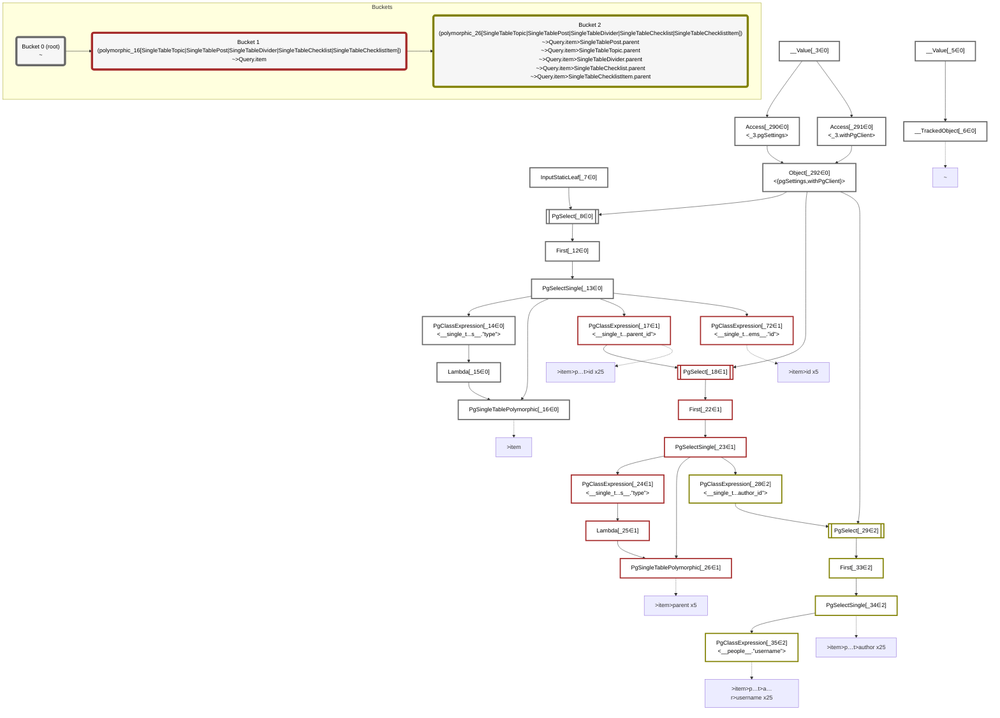

```mermaid
graph TD
    classDef path fill:#eee,stroke:#000,color:#000
    classDef plan fill:#fff,stroke-width:3px,color:#000
    classDef itemplan fill:#fff,stroke-width:6px,color:#000
    classDef sideeffectplan fill:#f00,stroke-width:6px,color:#000
    classDef bucket fill:#f6f6f6,color:#000,stroke-width:6px


    %% define plans
    __Value_3["__Value[_3∈0]<br /><context>"]:::plan
    __Value_5["__Value[_5∈0]<br /><rootValue>"]:::plan
    __TrackedObject_6["__TrackedObject[_6∈0]"]:::plan
    InputStaticLeaf_7["InputStaticLeaf[_7∈0]"]:::plan
    PgSelect_8[["PgSelect[_8∈0]<br /><single_table_items>"]]:::plan
    First_12["First[_12∈0]"]:::plan
    PgSelectSingle_13["PgSelectSingle[_13∈0]<br /><single_table_items>"]:::plan
    PgClassExpression_14["PgClassExpression[_14∈0]<br /><__single_t...s__.”type”>"]:::plan
    Lambda_15["Lambda[_15∈0]"]:::plan
    PgSingleTablePolymorphic_16["PgSingleTablePolymorphic[_16∈0]"]:::plan
    PgClassExpression_17["PgClassExpression[_17∈1]<br /><__single_t...parent_id”>"]:::plan
    PgSelect_18[["PgSelect[_18∈1]<br /><single_table_items>"]]:::plan
    First_22["First[_22∈1]"]:::plan
    PgSelectSingle_23["PgSelectSingle[_23∈1]<br /><single_table_items>"]:::plan
    PgClassExpression_24["PgClassExpression[_24∈1]<br /><__single_t...s__.”type”>"]:::plan
    Lambda_25["Lambda[_25∈1]"]:::plan
    PgSingleTablePolymorphic_26["PgSingleTablePolymorphic[_26∈1]"]:::plan
    PgClassExpression_28["PgClassExpression[_28∈2]<br /><__single_t...author_id”>"]:::plan
    PgSelect_29[["PgSelect[_29∈2]<br /><people>"]]:::plan
    First_33["First[_33∈2]"]:::plan
    PgSelectSingle_34["PgSelectSingle[_34∈2]<br /><people>"]:::plan
    PgClassExpression_35["PgClassExpression[_35∈2]<br /><__people__.”username”>"]:::plan
    PgClassExpression_72["PgClassExpression[_72∈1]<br /><__single_t...ems__.”id”>"]:::plan
    Access_290["Access[_290∈0]<br /><_3.pgSettings>"]:::plan
    Access_291["Access[_291∈0]<br /><_3.withPgClient>"]:::plan
    Object_292["Object[_292∈0]<br /><{pgSettings,withPgClient}>"]:::plan

    %% plan dependencies
    __Value_5 --> __TrackedObject_6
    Object_292 --> PgSelect_8
    InputStaticLeaf_7 --> PgSelect_8
    PgSelect_8 --> First_12
    First_12 --> PgSelectSingle_13
    PgSelectSingle_13 --> PgClassExpression_14
    PgClassExpression_14 --> Lambda_15
    Lambda_15 --> PgSingleTablePolymorphic_16
    PgSelectSingle_13 --> PgSingleTablePolymorphic_16
    PgSelectSingle_13 --> PgClassExpression_17
    Object_292 --> PgSelect_18
    PgClassExpression_17 --> PgSelect_18
    PgSelect_18 --> First_22
    First_22 --> PgSelectSingle_23
    PgSelectSingle_23 --> PgClassExpression_24
    PgClassExpression_24 --> Lambda_25
    Lambda_25 --> PgSingleTablePolymorphic_26
    PgSelectSingle_23 --> PgSingleTablePolymorphic_26
    PgSelectSingle_23 --> PgClassExpression_28
    Object_292 --> PgSelect_29
    PgClassExpression_28 --> PgSelect_29
    PgSelect_29 --> First_33
    First_33 --> PgSelectSingle_34
    PgSelectSingle_34 --> PgClassExpression_35
    PgSelectSingle_13 --> PgClassExpression_72
    __Value_3 --> Access_290
    __Value_3 --> Access_291
    Access_290 --> Object_292
    Access_291 --> Object_292

    %% plan-to-path relationships
    P1["~"]
    __TrackedObject_6 -.-> P1
    P2[">item"]
    PgSingleTablePolymorphic_16 -.-> P2
    P3[">item>parent x5"]
    PgSingleTablePolymorphic_26 -.-> P3
    P4[">item>p…t>id x25"]
    PgClassExpression_17 -.-> P4
    P5[">item>p…t>author x25"]
    PgSelectSingle_34 -.-> P5
    P6[">item>p…t>a…r>username x25"]
    PgClassExpression_35 -.-> P6
    P7[">item>id x5"]
    PgClassExpression_72 -.-> P7

    %% allocate buckets
    classDef bucket0 stroke:#696969
    class __Value_3,__Value_5,__TrackedObject_6,InputStaticLeaf_7,PgSelect_8,First_12,PgSelectSingle_13,PgClassExpression_14,Lambda_15,PgSingleTablePolymorphic_16,Access_290,Access_291,Object_292 bucket0
    classDef bucket1 stroke:#a52a2a
    class PgClassExpression_17,PgSelect_18,First_22,PgSelectSingle_23,PgClassExpression_24,Lambda_25,PgSingleTablePolymorphic_26,PgClassExpression_72 bucket1
    classDef bucket2 stroke:#808000
    class PgClassExpression_28,PgSelect_29,First_33,PgSelectSingle_34,PgClassExpression_35 bucket2

    subgraph Buckets
    Bucket0("Bucket 0 (root)<br />~"):::bucket
    style Bucket0 stroke:#696969
    Bucket1("Bucket 1 (polymorphic_16[SingleTableTopic|SingleTablePost|SingleTableDivider|SingleTableChecklist|SingleTableChecklistItem])<br />~>Query.item"):::bucket
    style Bucket1 stroke:#a52a2a
    Bucket0 --> Bucket1
    Bucket2("Bucket 2 (polymorphic_26[SingleTableTopic|SingleTablePost|SingleTableDivider|SingleTableChecklist|SingleTableChecklistItem])<br />~>Query.item>SingleTablePost.parent<br />~>Query.item>SingleTableTopic.parent<br />~>Query.item>SingleTableDivider.parent<br />~>Query.item>SingleTableChecklist.parent<br />~>Query.item>SingleTableChecklistItem.parent"):::bucket
    style Bucket2 stroke:#808000
    Bucket1 --> Bucket2
    end
```
