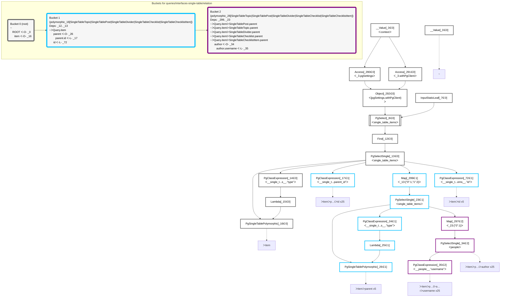

```mermaid
graph TD
    classDef path fill:#eee,stroke:#000,color:#000
    classDef plan fill:#fff,stroke-width:3px,color:#000
    classDef itemplan fill:#fff,stroke-width:6px,color:#000
    classDef sideeffectplan fill:#f00,stroke-width:6px,color:#000
    classDef bucket fill:#f6f6f6,color:#000,stroke-width:6px,text-align:left


    %% define plans
    __Value_0["__Value[_0∈0]"]:::plan
    PgSingleTablePolymorphic_16["PgSingleTablePolymorphic[_16∈0]"]:::plan
    Lambda_15["Lambda[_15∈0]"]:::plan
    PgClassExpression_14["PgClassExpression[_14∈0]<br />ᐸ__single_t...s__.”type”ᐳ"]:::plan
    PgClassExpression_17["PgClassExpression[_17∈1]<br />ᐸ__single_t...parent_id”ᐳ"]:::plan
    PgSingleTablePolymorphic_26["PgSingleTablePolymorphic[_26∈1]"]:::plan
    Lambda_25["Lambda[_25∈1]"]:::plan
    PgClassExpression_24["PgClassExpression[_24∈1]<br />ᐸ__single_t...s__.”type”ᐳ"]:::plan
    PgClassExpression_35["PgClassExpression[_35∈2]<br />ᐸ__people__.”username”ᐳ"]:::plan
    PgSelectSingle_34["PgSelectSingle[_34∈2]<br />ᐸpeopleᐳ"]:::plan
    Map_297["Map[_297∈2]<br />ᐸ_23:{”0”:1}ᐳ"]:::plan
    PgSelectSingle_23["PgSelectSingle[_23∈1]<br />ᐸsingle_table_itemsᐳ"]:::plan
    Map_299["Map[_299∈1]<br />ᐸ_13:{”0”:1,”1”:2}ᐳ"]:::plan
    PgClassExpression_72["PgClassExpression[_72∈1]<br />ᐸ__single_t...ems__.”id”ᐳ"]:::plan
    PgSelectSingle_13["PgSelectSingle[_13∈0]<br />ᐸsingle_table_itemsᐳ"]:::plan
    First_12["First[_12∈0]"]:::plan
    PgSelect_8[["PgSelect[_8∈0]<br />ᐸsingle_table_itemsᐳ"]]:::plan
    Object_292["Object[_292∈0]<br />ᐸ{pgSettings,withPgClient}ᐳ"]:::plan
    Access_290["Access[_290∈0]<br />ᐸ_3.pgSettingsᐳ"]:::plan
    Access_291["Access[_291∈0]<br />ᐸ_3.withPgClientᐳ"]:::plan
    __Value_3["__Value[_3∈0]<br />ᐸcontextᐳ"]:::plan
    InputStaticLeaf_7["InputStaticLeaf[_7∈0]"]:::plan

    %% plan dependencies
    Lambda_15 & PgSelectSingle_13 --> PgSingleTablePolymorphic_16
    PgClassExpression_14 --> Lambda_15
    PgSelectSingle_13 --> PgClassExpression_14
    PgSelectSingle_13 --> PgClassExpression_17
    Lambda_25 & PgSelectSingle_23 --> PgSingleTablePolymorphic_26
    PgClassExpression_24 --> Lambda_25
    PgSelectSingle_23 --> PgClassExpression_24
    PgSelectSingle_34 --> PgClassExpression_35
    Map_297 --> PgSelectSingle_34
    PgSelectSingle_23 --> Map_297
    Map_299 --> PgSelectSingle_23
    PgSelectSingle_13 --> Map_299
    PgSelectSingle_13 --> PgClassExpression_72
    First_12 --> PgSelectSingle_13
    PgSelect_8 --> First_12
    Object_292 & InputStaticLeaf_7 --> PgSelect_8
    Access_290 & Access_291 --> Object_292
    __Value_3 --> Access_290
    __Value_3 --> Access_291

    %% plan-to-path relationships
    P_0["~"]
    __Value_0 -.-> P_0
    P_16["ᐳitem"]
    PgSingleTablePolymorphic_16 -.-> P_16
    P_17["ᐳitemᐳp…tᐳid x25"]
    PgClassExpression_17 -.-> P_17
    P_26["ᐳitemᐳparent x5"]
    PgSingleTablePolymorphic_26 -.-> P_26
    P_34["ᐳitemᐳp…tᐳauthor x25"]
    PgSelectSingle_34 -.-> P_34
    P_35["ᐳitemᐳp…tᐳa…rᐳusername x25"]
    PgClassExpression_35 -.-> P_35
    P_72["ᐳitemᐳid x5"]
    PgClassExpression_72 -.-> P_72

    subgraph "Buckets for queries/interfaces-single-table/relation"
    Bucket0("Bucket 0 (root)<br />~<br />⠀ROOT ᐸ-O- _0<br />⠀⠀item ᐸ-O- _16"):::bucket
    classDef bucket0 stroke:#696969
    class Bucket0,__Value_0,__Value_3,InputStaticLeaf_7,PgSelect_8,First_12,PgSelectSingle_13,PgClassExpression_14,Lambda_15,PgSingleTablePolymorphic_16,Access_290,Access_291,Object_292 bucket0
    Bucket1("Bucket 1 (polymorphic_16[SingleTableTopic|SingleTablePost|SingleTableDivider|SingleTableChecklist|SingleTableChecklistItem])<br />Deps: _12, _13<br />~ᐳQuery.item<br />⠀⠀parent ᐸ-O- _26<br />⠀⠀⠀parent.id ᐸ-L- _17<br />⠀⠀id ᐸ-L- _72"):::bucket
    classDef bucket1 stroke:#00bfff
    class Bucket1,PgClassExpression_17,PgSelectSingle_23,PgClassExpression_24,Lambda_25,PgSingleTablePolymorphic_26,PgClassExpression_72,Map_299 bucket1
    Bucket2("Bucket 2 (polymorphic_26[SingleTableTopic|SingleTablePost|SingleTableDivider|SingleTableChecklist|SingleTableChecklistItem])<br />Deps: _299, _23<br />~ᐳQuery.itemᐳSingleTablePost.parent<br />~ᐳQuery.itemᐳSingleTableTopic.parent<br />~ᐳQuery.itemᐳSingleTableDivider.parent<br />~ᐳQuery.itemᐳSingleTableChecklist.parent<br />~ᐳQuery.itemᐳSingleTableChecklistItem.parent<br />⠀⠀author ᐸ-O- _34<br />⠀⠀⠀author.username ᐸ-L- _35"):::bucket
    classDef bucket2 stroke:#7f007f
    class Bucket2,PgSelectSingle_34,PgClassExpression_35,Map_297 bucket2
    Bucket0 --> Bucket1
    Bucket1 --> Bucket2
    end
```
