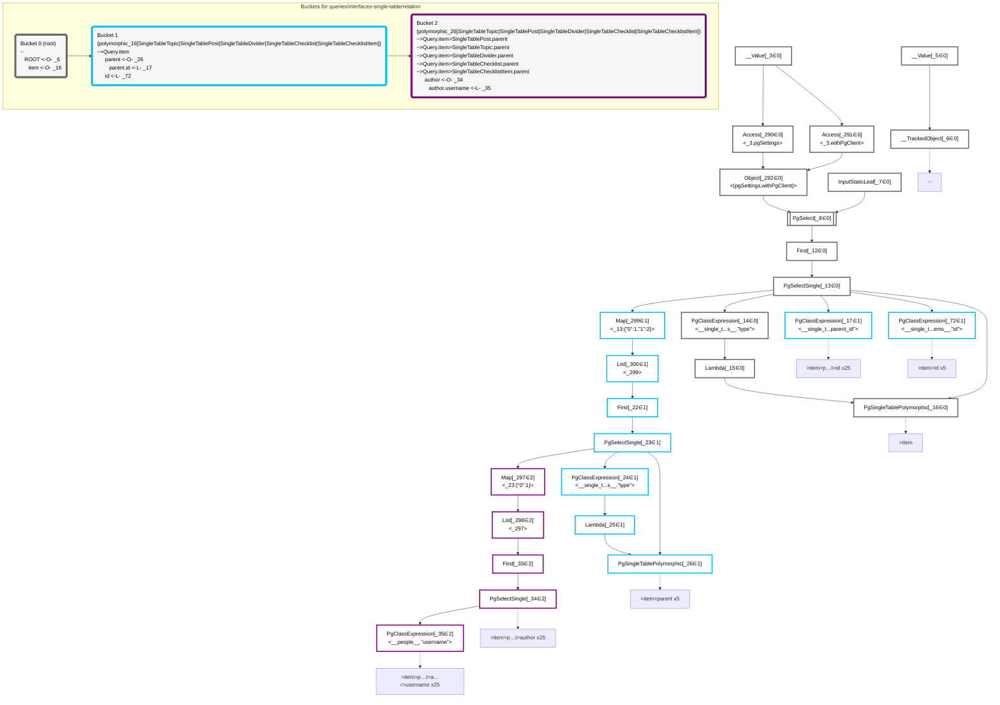

```mermaid
graph TD
    classDef path fill:#eee,stroke:#000,color:#000
    classDef plan fill:#fff,stroke-width:3px,color:#000
    classDef itemplan fill:#fff,stroke-width:6px,color:#000
    classDef sideeffectplan fill:#f00,stroke-width:6px,color:#000
    classDef bucket fill:#f6f6f6,color:#000,stroke-width:6px,text-align:left


    %% define plans
    __Value_3["__Value[_3∈0]<br /><context>"]:::plan
    __Value_5["__Value[_5∈0]<br /><rootValue>"]:::plan
    __TrackedObject_6["__TrackedObject[_6∈0]"]:::plan
    InputStaticLeaf_7["InputStaticLeaf[_7∈0]"]:::plan
    PgSelect_8[["PgSelect[_8∈0]<br /><single_table_items>"]]:::plan
    First_12["First[_12∈0]"]:::plan
    PgSelectSingle_13["PgSelectSingle[_13∈0]<br /><single_table_items>"]:::plan
    PgClassExpression_14["PgClassExpression[_14∈0]<br /><__single_t...s__.”type”>"]:::plan
    Lambda_15["Lambda[_15∈0]"]:::plan
    PgSingleTablePolymorphic_16["PgSingleTablePolymorphic[_16∈0]"]:::plan
    PgClassExpression_17["PgClassExpression[_17∈1]<br /><__single_t...parent_id”>"]:::plan
    First_22["First[_22∈1]"]:::plan
    PgSelectSingle_23["PgSelectSingle[_23∈1]<br /><single_table_items>"]:::plan
    PgClassExpression_24["PgClassExpression[_24∈1]<br /><__single_t...s__.”type”>"]:::plan
    Lambda_25["Lambda[_25∈1]"]:::plan
    PgSingleTablePolymorphic_26["PgSingleTablePolymorphic[_26∈1]"]:::plan
    First_33["First[_33∈2]"]:::plan
    PgSelectSingle_34["PgSelectSingle[_34∈2]<br /><people>"]:::plan
    PgClassExpression_35["PgClassExpression[_35∈2]<br /><__people__.”username”>"]:::plan
    PgClassExpression_72["PgClassExpression[_72∈1]<br /><__single_t...ems__.”id”>"]:::plan
    Access_290["Access[_290∈0]<br /><_3.pgSettings>"]:::plan
    Access_291["Access[_291∈0]<br /><_3.withPgClient>"]:::plan
    Object_292["Object[_292∈0]<br /><{pgSettings,withPgClient}>"]:::plan
    Map_297["Map[_297∈2]<br /><_23:{”0”:1}>"]:::plan
    List_298["List[_298∈2]<br /><_297>"]:::plan
    Map_299["Map[_299∈1]<br /><_13:{”0”:1,”1”:2}>"]:::plan
    List_300["List[_300∈1]<br /><_299>"]:::plan

    %% plan dependencies
    __Value_5 --> __TrackedObject_6
    Object_292 --> PgSelect_8
    InputStaticLeaf_7 --> PgSelect_8
    PgSelect_8 --> First_12
    First_12 --> PgSelectSingle_13
    PgSelectSingle_13 --> PgClassExpression_14
    PgClassExpression_14 --> Lambda_15
    Lambda_15 --> PgSingleTablePolymorphic_16
    PgSelectSingle_13 --> PgSingleTablePolymorphic_16
    PgSelectSingle_13 --> PgClassExpression_17
    List_300 --> First_22
    First_22 --> PgSelectSingle_23
    PgSelectSingle_23 --> PgClassExpression_24
    PgClassExpression_24 --> Lambda_25
    Lambda_25 --> PgSingleTablePolymorphic_26
    PgSelectSingle_23 --> PgSingleTablePolymorphic_26
    List_298 --> First_33
    First_33 --> PgSelectSingle_34
    PgSelectSingle_34 --> PgClassExpression_35
    PgSelectSingle_13 --> PgClassExpression_72
    __Value_3 --> Access_290
    __Value_3 --> Access_291
    Access_290 --> Object_292
    Access_291 --> Object_292
    PgSelectSingle_23 --> Map_297
    Map_297 --> List_298
    PgSelectSingle_13 --> Map_299
    Map_299 --> List_300

    %% plan-to-path relationships
    P_6["~"]
    __TrackedObject_6 -.-> P_6
    P_16[">item"]
    PgSingleTablePolymorphic_16 -.-> P_16
    P_17[">item>p…t>id x25"]
    PgClassExpression_17 -.-> P_17
    P_26[">item>parent x5"]
    PgSingleTablePolymorphic_26 -.-> P_26
    P_34[">item>p…t>author x25"]
    PgSelectSingle_34 -.-> P_34
    P_35[">item>p…t>a…r>username x25"]
    PgClassExpression_35 -.-> P_35
    P_72[">item>id x5"]
    PgClassExpression_72 -.-> P_72

    %% allocate buckets
    classDef bucket0 stroke:#696969
    class __Value_3,__Value_5,__TrackedObject_6,InputStaticLeaf_7,PgSelect_8,First_12,PgSelectSingle_13,PgClassExpression_14,Lambda_15,PgSingleTablePolymorphic_16,Access_290,Access_291,Object_292 bucket0
    classDef bucket1 stroke:#00bfff
    class PgClassExpression_17,First_22,PgSelectSingle_23,PgClassExpression_24,Lambda_25,PgSingleTablePolymorphic_26,PgClassExpression_72,Map_299,List_300 bucket1
    classDef bucket2 stroke:#7f007f
    class First_33,PgSelectSingle_34,PgClassExpression_35,Map_297,List_298 bucket2

    subgraph "Buckets for queries/interfaces-single-table/relation"
    Bucket0("Bucket 0 (root)<br />~<br />⠀ROOT <-O- _6<br />⠀⠀item <-O- _16"):::bucket
    style Bucket0 stroke:#696969
    Bucket1("Bucket 1 (polymorphic_16[SingleTableTopic|SingleTablePost|SingleTableDivider|SingleTableChecklist|SingleTableChecklistItem])<br />~>Query.item<br />⠀⠀parent <-O- _26<br />⠀⠀⠀parent.id <-L- _17<br />⠀⠀id <-L- _72"):::bucket
    style Bucket1 stroke:#00bfff
    Bucket0 --> Bucket1
    Bucket2("Bucket 2 (polymorphic_26[SingleTableTopic|SingleTablePost|SingleTableDivider|SingleTableChecklist|SingleTableChecklistItem])<br />~>Query.item>SingleTablePost.parent<br />~>Query.item>SingleTableTopic.parent<br />~>Query.item>SingleTableDivider.parent<br />~>Query.item>SingleTableChecklist.parent<br />~>Query.item>SingleTableChecklistItem.parent<br />⠀⠀author <-O- _34<br />⠀⠀⠀author.username <-L- _35"):::bucket
    style Bucket2 stroke:#7f007f
    Bucket1 --> Bucket2
    end
```
