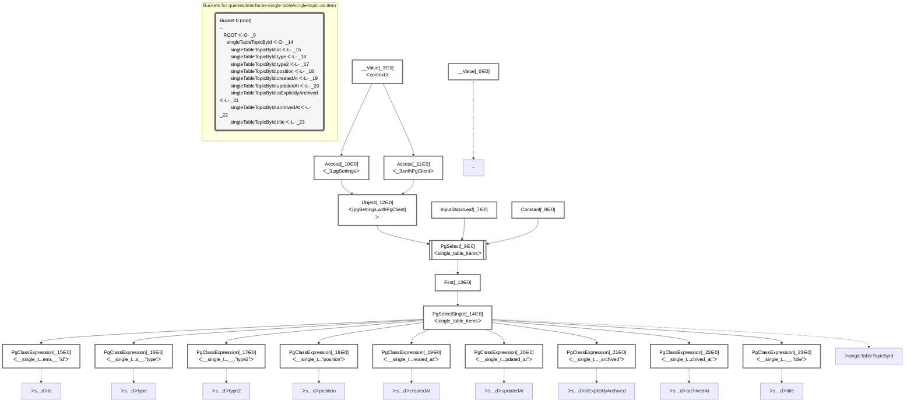

```mermaid
graph TD
    classDef path fill:#eee,stroke:#000,color:#000
    classDef plan fill:#fff,stroke-width:3px,color:#000
    classDef itemplan fill:#fff,stroke-width:6px,color:#000
    classDef sideeffectplan fill:#f00,stroke-width:6px,color:#000
    classDef bucket fill:#f6f6f6,color:#000,stroke-width:6px,text-align:left


    %% define plans
    __Value_0["__Value[_0∈0]"]:::plan
    __Value_3["__Value[_3∈0]<br />ᐸcontextᐳ"]:::plan
    InputStaticLeaf_7["InputStaticLeaf[_7∈0]"]:::plan
    Constant_8["Constant[_8∈0]"]:::plan
    PgSelect_9[["PgSelect[_9∈0]<br />ᐸsingle_table_itemsᐳ"]]:::plan
    Access_10["Access[_10∈0]<br />ᐸ_3.pgSettingsᐳ"]:::plan
    Access_11["Access[_11∈0]<br />ᐸ_3.withPgClientᐳ"]:::plan
    Object_12["Object[_12∈0]<br />ᐸ{pgSettings,withPgClient}ᐳ"]:::plan
    First_13["First[_13∈0]"]:::plan
    PgSelectSingle_14["PgSelectSingle[_14∈0]<br />ᐸsingle_table_itemsᐳ"]:::plan
    PgClassExpression_15["PgClassExpression[_15∈0]<br />ᐸ__single_t...ems__.”id”ᐳ"]:::plan
    PgClassExpression_16["PgClassExpression[_16∈0]<br />ᐸ__single_t...s__.”type”ᐳ"]:::plan
    PgClassExpression_17["PgClassExpression[_17∈0]<br />ᐸ__single_t...__.”type2”ᐳ"]:::plan
    PgClassExpression_18["PgClassExpression[_18∈0]<br />ᐸ__single_t...”position”ᐳ"]:::plan
    PgClassExpression_19["PgClassExpression[_19∈0]<br />ᐸ__single_t...reated_at”ᐳ"]:::plan
    PgClassExpression_20["PgClassExpression[_20∈0]<br />ᐸ__single_t...pdated_at”ᐳ"]:::plan
    PgClassExpression_21["PgClassExpression[_21∈0]<br />ᐸ__single_t..._archived”ᐳ"]:::plan
    PgClassExpression_22["PgClassExpression[_22∈0]<br />ᐸ__single_t...chived_at”ᐳ"]:::plan
    PgClassExpression_23["PgClassExpression[_23∈0]<br />ᐸ__single_t...__.”title”ᐳ"]:::plan

    %% plan dependencies
    Object_12 & InputStaticLeaf_7 & Constant_8 --> PgSelect_9
    __Value_3 --> Access_10
    __Value_3 --> Access_11
    Access_10 & Access_11 --> Object_12
    PgSelect_9 --> First_13
    First_13 --> PgSelectSingle_14
    PgSelectSingle_14 --> PgClassExpression_15
    PgSelectSingle_14 --> PgClassExpression_16
    PgSelectSingle_14 --> PgClassExpression_17
    PgSelectSingle_14 --> PgClassExpression_18
    PgSelectSingle_14 --> PgClassExpression_19
    PgSelectSingle_14 --> PgClassExpression_20
    PgSelectSingle_14 --> PgClassExpression_21
    PgSelectSingle_14 --> PgClassExpression_22
    PgSelectSingle_14 --> PgClassExpression_23

    %% plan-to-path relationships
    P_0["~"]
    __Value_0 -.-> P_0
    P_14["ᐳsingleTableTopicById"]
    PgSelectSingle_14 -.-> P_14
    P_15["ᐳs…dᐳid"]
    PgClassExpression_15 -.-> P_15
    P_16["ᐳs…dᐳtype"]
    PgClassExpression_16 -.-> P_16
    P_17["ᐳs…dᐳtype2"]
    PgClassExpression_17 -.-> P_17
    P_18["ᐳs…dᐳposition"]
    PgClassExpression_18 -.-> P_18
    P_19["ᐳs…dᐳcreatedAt"]
    PgClassExpression_19 -.-> P_19
    P_20["ᐳs…dᐳupdatedAt"]
    PgClassExpression_20 -.-> P_20
    P_21["ᐳs…dᐳisExplicitlyArchived"]
    PgClassExpression_21 -.-> P_21
    P_22["ᐳs…dᐳarchivedAt"]
    PgClassExpression_22 -.-> P_22
    P_23["ᐳs…dᐳtitle"]
    PgClassExpression_23 -.-> P_23

    subgraph "Buckets for queries/interfaces-single-table/single-topic-as-item"
    Bucket0("Bucket 0 (root)<br />~<br />⠀ROOT ᐸ-O- _0<br />⠀⠀singleTableTopicById ᐸ-O- _14<br />⠀⠀⠀singleTableTopicById.id ᐸ-L- _15<br />⠀⠀⠀singleTableTopicById.type ᐸ-L- _16<br />⠀⠀⠀singleTableTopicById.type2 ᐸ-L- _17<br />⠀⠀⠀singleTableTopicById.position ᐸ-L- _18<br />⠀⠀⠀singleTableTopicById.createdAt ᐸ-L- _19<br />⠀⠀⠀singleTableTopicById.updatedAt ᐸ-L- _20<br />⠀⠀⠀singleTableTopicById.isExplicitlyArchived ᐸ-L- _21<br />⠀⠀⠀singleTableTopicById.archivedAt ᐸ-L- _22<br />⠀⠀⠀singleTableTopicById.title ᐸ-L- _23"):::bucket
    classDef bucket0 stroke:#696969
    class Bucket0,__Value_0,__Value_3,InputStaticLeaf_7,Constant_8,PgSelect_9,Access_10,Access_11,Object_12,First_13,PgSelectSingle_14,PgClassExpression_15,PgClassExpression_16,PgClassExpression_17,PgClassExpression_18,PgClassExpression_19,PgClassExpression_20,PgClassExpression_21,PgClassExpression_22,PgClassExpression_23 bucket0
    end
```
