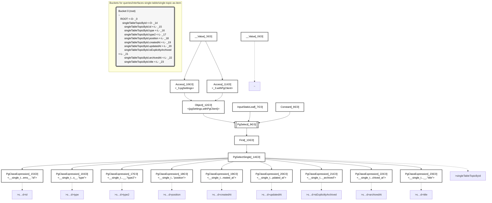

```mermaid
graph TD
    classDef path fill:#eee,stroke:#000,color:#000
    classDef plan fill:#fff,stroke-width:3px,color:#000
    classDef itemplan fill:#fff,stroke-width:6px,color:#000
    classDef sideeffectplan fill:#f00,stroke-width:6px,color:#000
    classDef bucket fill:#f6f6f6,color:#000,stroke-width:6px,text-align:left


    %% define plans
    __Value_0["__Value[_0∈0]"]:::plan
    __Value_3["__Value[_3∈0]<br /><context>"]:::plan
    InputStaticLeaf_7["InputStaticLeaf[_7∈0]"]:::plan
    Constant_8["Constant[_8∈0]"]:::plan
    PgSelect_9[["PgSelect[_9∈0]<br /><single_table_items>"]]:::plan
    Access_10["Access[_10∈0]<br /><_3.pgSettings>"]:::plan
    Access_11["Access[_11∈0]<br /><_3.withPgClient>"]:::plan
    Object_12["Object[_12∈0]<br /><{pgSettings,withPgClient}>"]:::plan
    First_13["First[_13∈0]"]:::plan
    PgSelectSingle_14["PgSelectSingle[_14∈0]<br /><single_table_items>"]:::plan
    PgClassExpression_15["PgClassExpression[_15∈0]<br /><__single_t...ems__.”id”>"]:::plan
    PgClassExpression_16["PgClassExpression[_16∈0]<br /><__single_t...s__.”type”>"]:::plan
    PgClassExpression_17["PgClassExpression[_17∈0]<br /><__single_t...__.”type2”>"]:::plan
    PgClassExpression_18["PgClassExpression[_18∈0]<br /><__single_t...”position”>"]:::plan
    PgClassExpression_19["PgClassExpression[_19∈0]<br /><__single_t...reated_at”>"]:::plan
    PgClassExpression_20["PgClassExpression[_20∈0]<br /><__single_t...pdated_at”>"]:::plan
    PgClassExpression_21["PgClassExpression[_21∈0]<br /><__single_t..._archived”>"]:::plan
    PgClassExpression_22["PgClassExpression[_22∈0]<br /><__single_t...chived_at”>"]:::plan
    PgClassExpression_23["PgClassExpression[_23∈0]<br /><__single_t...__.”title”>"]:::plan

    %% plan dependencies
    Object_12 --> PgSelect_9
    InputStaticLeaf_7 --> PgSelect_9
    Constant_8 --> PgSelect_9
    __Value_3 --> Access_10
    __Value_3 --> Access_11
    Access_10 --> Object_12
    Access_11 --> Object_12
    PgSelect_9 --> First_13
    First_13 --> PgSelectSingle_14
    PgSelectSingle_14 --> PgClassExpression_15
    PgSelectSingle_14 --> PgClassExpression_16
    PgSelectSingle_14 --> PgClassExpression_17
    PgSelectSingle_14 --> PgClassExpression_18
    PgSelectSingle_14 --> PgClassExpression_19
    PgSelectSingle_14 --> PgClassExpression_20
    PgSelectSingle_14 --> PgClassExpression_21
    PgSelectSingle_14 --> PgClassExpression_22
    PgSelectSingle_14 --> PgClassExpression_23

    %% plan-to-path relationships
    P_0["~"]
    __Value_0 -.-> P_0
    P_14[">singleTableTopicById"]
    PgSelectSingle_14 -.-> P_14
    P_15[">s…d>id"]
    PgClassExpression_15 -.-> P_15
    P_16[">s…d>type"]
    PgClassExpression_16 -.-> P_16
    P_17[">s…d>type2"]
    PgClassExpression_17 -.-> P_17
    P_18[">s…d>position"]
    PgClassExpression_18 -.-> P_18
    P_19[">s…d>createdAt"]
    PgClassExpression_19 -.-> P_19
    P_20[">s…d>updatedAt"]
    PgClassExpression_20 -.-> P_20
    P_21[">s…d>isExplicitlyArchived"]
    PgClassExpression_21 -.-> P_21
    P_22[">s…d>archivedAt"]
    PgClassExpression_22 -.-> P_22
    P_23[">s…d>title"]
    PgClassExpression_23 -.-> P_23

    %% allocate buckets
    classDef bucket0 stroke:#696969
    class __Value_0,__Value_3,InputStaticLeaf_7,Constant_8,PgSelect_9,Access_10,Access_11,Object_12,First_13,PgSelectSingle_14,PgClassExpression_15,PgClassExpression_16,PgClassExpression_17,PgClassExpression_18,PgClassExpression_19,PgClassExpression_20,PgClassExpression_21,PgClassExpression_22,PgClassExpression_23 bucket0

    subgraph "Buckets for queries/interfaces-single-table/single-topic-as-item"
    Bucket0("Bucket 0 (root)<br />~<br />⠀ROOT <-O- _0<br />⠀⠀singleTableTopicById <-O- _14<br />⠀⠀⠀singleTableTopicById.id <-L- _15<br />⠀⠀⠀singleTableTopicById.type <-L- _16<br />⠀⠀⠀singleTableTopicById.type2 <-L- _17<br />⠀⠀⠀singleTableTopicById.position <-L- _18<br />⠀⠀⠀singleTableTopicById.createdAt <-L- _19<br />⠀⠀⠀singleTableTopicById.updatedAt <-L- _20<br />⠀⠀⠀singleTableTopicById.isExplicitlyArchived <-L- _21<br />⠀⠀⠀singleTableTopicById.archivedAt <-L- _22<br />⠀⠀⠀singleTableTopicById.title <-L- _23"):::bucket
    style Bucket0 stroke:#696969
    end
```
