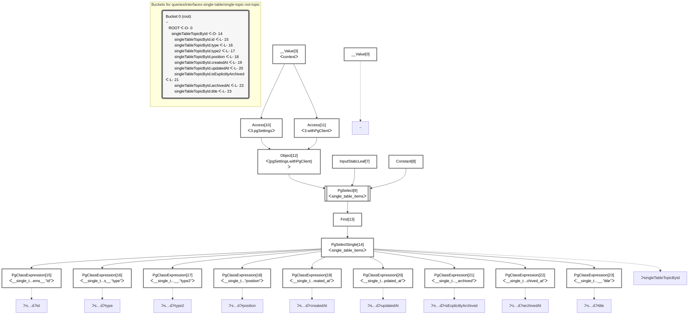

```mermaid
graph TD
    classDef path fill:#eee,stroke:#000,color:#000
    classDef plan fill:#fff,stroke-width:3px,color:#000
    classDef itemplan fill:#fff,stroke-width:6px,color:#000
    classDef sideeffectplan fill:#f00,stroke-width:6px,color:#000
    classDef bucket fill:#f6f6f6,color:#000,stroke-width:6px,text-align:left


    %% define plans
    __Value0["__Value[0]"]:::plan
    PgClassExpression15["PgClassExpression[15]<br />ᐸ__single_t...ems__.”id”ᐳ"]:::plan
    PgClassExpression16["PgClassExpression[16]<br />ᐸ__single_t...s__.”type”ᐳ"]:::plan
    PgClassExpression17["PgClassExpression[17]<br />ᐸ__single_t...__.”type2”ᐳ"]:::plan
    PgClassExpression18["PgClassExpression[18]<br />ᐸ__single_t...”position”ᐳ"]:::plan
    PgClassExpression19["PgClassExpression[19]<br />ᐸ__single_t...reated_at”ᐳ"]:::plan
    PgClassExpression20["PgClassExpression[20]<br />ᐸ__single_t...pdated_at”ᐳ"]:::plan
    PgClassExpression21["PgClassExpression[21]<br />ᐸ__single_t..._archived”ᐳ"]:::plan
    PgClassExpression22["PgClassExpression[22]<br />ᐸ__single_t...chived_at”ᐳ"]:::plan
    PgClassExpression23["PgClassExpression[23]<br />ᐸ__single_t...__.”title”ᐳ"]:::plan
    PgSelectSingle14["PgSelectSingle[14]<br />ᐸsingle_table_itemsᐳ"]:::plan
    First13["First[13]"]:::plan
    PgSelect9[["PgSelect[9]<br />ᐸsingle_table_itemsᐳ"]]:::plan
    Object12["Object[12]<br />ᐸ{pgSettings,withPgClient}ᐳ"]:::plan
    Access10["Access[10]<br />ᐸ3.pgSettingsᐳ"]:::plan
    Access11["Access[11]<br />ᐸ3.withPgClientᐳ"]:::plan
    __Value3["__Value[3]<br />ᐸcontextᐳ"]:::plan
    InputStaticLeaf7["InputStaticLeaf[7]"]:::plan
    Constant8["Constant[8]"]:::plan

    %% plan dependencies
    PgSelectSingle14 --> PgClassExpression15
    PgSelectSingle14 --> PgClassExpression16
    PgSelectSingle14 --> PgClassExpression17
    PgSelectSingle14 --> PgClassExpression18
    PgSelectSingle14 --> PgClassExpression19
    PgSelectSingle14 --> PgClassExpression20
    PgSelectSingle14 --> PgClassExpression21
    PgSelectSingle14 --> PgClassExpression22
    PgSelectSingle14 --> PgClassExpression23
    First13 --> PgSelectSingle14
    PgSelect9 --> First13
    Object12 & InputStaticLeaf7 & Constant8 --> PgSelect9
    Access10 & Access11 --> Object12
    __Value3 --> Access10
    __Value3 --> Access11

    %% plan-to-path relationships
    P0["~"]
    __Value0 -.-> P0
    P14["ᐳsingleTableTopicById"]
    PgSelectSingle14 -.-> P14
    P15["ᐳs…dᐳid"]
    PgClassExpression15 -.-> P15
    P16["ᐳs…dᐳtype"]
    PgClassExpression16 -.-> P16
    P17["ᐳs…dᐳtype2"]
    PgClassExpression17 -.-> P17
    P18["ᐳs…dᐳposition"]
    PgClassExpression18 -.-> P18
    P19["ᐳs…dᐳcreatedAt"]
    PgClassExpression19 -.-> P19
    P20["ᐳs…dᐳupdatedAt"]
    PgClassExpression20 -.-> P20
    P21["ᐳs…dᐳisExplicitlyArchived"]
    PgClassExpression21 -.-> P21
    P22["ᐳs…dᐳarchivedAt"]
    PgClassExpression22 -.-> P22
    P23["ᐳs…dᐳtitle"]
    PgClassExpression23 -.-> P23

    subgraph "Buckets for queries/interfaces-single-table/single-topic-not-topic"
    Bucket0("Bucket 0 (root)<br />~<br />⠀ROOT ᐸ-O- 0<br />⠀⠀singleTableTopicById ᐸ-O- 14<br />⠀⠀⠀singleTableTopicById.id ᐸ-L- 15<br />⠀⠀⠀singleTableTopicById.type ᐸ-L- 16<br />⠀⠀⠀singleTableTopicById.type2 ᐸ-L- 17<br />⠀⠀⠀singleTableTopicById.position ᐸ-L- 18<br />⠀⠀⠀singleTableTopicById.createdAt ᐸ-L- 19<br />⠀⠀⠀singleTableTopicById.updatedAt ᐸ-L- 20<br />⠀⠀⠀singleTableTopicById.isExplicitlyArchived ᐸ-L- 21<br />⠀⠀⠀singleTableTopicById.archivedAt ᐸ-L- 22<br />⠀⠀⠀singleTableTopicById.title ᐸ-L- 23"):::bucket
    classDef bucket0 stroke:#696969
    class Bucket0,__Value0,__Value3,InputStaticLeaf7,Constant8,PgSelect9,Access10,Access11,Object12,First13,PgSelectSingle14,PgClassExpression15,PgClassExpression16,PgClassExpression17,PgClassExpression18,PgClassExpression19,PgClassExpression20,PgClassExpression21,PgClassExpression22,PgClassExpression23 bucket0
    end
```
