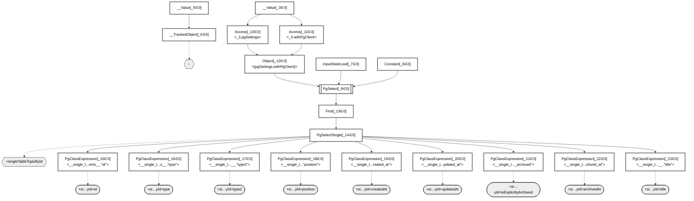

```mermaid
graph TD
    classDef path fill:#eee,stroke:#000,color:#000
    classDef plan fill:#fff,stroke-width:3px,color:#000
    classDef itemplan fill:#fff,stroke-width:6px,color:#000
    classDef sideeffectplan fill:#f00,stroke-width:6px,color:#000
    classDef bucket fill:#f6f6f6,color:#000,stroke-width:6px

    %% subgraph fields
    P1{{"~"}}:::path
    P2{{">singleTableTopicById"}}:::path
    P3([">si…yId>id"]):::path
    %% P2 -.-> P3
    P4([">si…yId>type"]):::path
    %% P2 -.-> P4
    P5([">si…yId>type2"]):::path
    %% P2 -.-> P5
    P6([">si…yId>position"]):::path
    %% P2 -.-> P6
    P7([">si…yId>createdAt"]):::path
    %% P2 -.-> P7
    P8([">si…yId>updatedAt"]):::path
    %% P2 -.-> P8
    P9([">si…yId>isExplicitlyArchived"]):::path
    %% P2 -.-> P9
    P10([">si…yId>archivedAt"]):::path
    %% P2 -.-> P10
    P11([">si…yId>title"]):::path
    %% P2 -.-> P11
    %% P1 -.-> P2
    %% end

    %% define plans
    __Value_3["__Value[_3∈0]<br /><context>"]:::plan
    __Value_5["__Value[_5∈0]<br /><rootValue>"]:::plan
    __TrackedObject_6["__TrackedObject[_6∈0]"]:::plan
    InputStaticLeaf_7["InputStaticLeaf[_7∈0]"]:::plan
    Constant_8["Constant[_8∈0]"]:::plan
    PgSelect_9[["PgSelect[_9∈0]<br /><single_table_items>"]]:::plan
    Access_10["Access[_10∈0]<br /><_3.pgSettings>"]:::plan
    Access_11["Access[_11∈0]<br /><_3.withPgClient>"]:::plan
    Object_12["Object[_12∈0]<br /><{pgSettings,withPgClient}>"]:::plan
    First_13["First[_13∈0]"]:::plan
    PgSelectSingle_14["PgSelectSingle[_14∈0]<br /><single_table_items>"]:::plan
    PgClassExpression_15["PgClassExpression[_15∈0]<br /><__single_t...ems__.#quot;id#quot;>"]:::plan
    PgClassExpression_16["PgClassExpression[_16∈0]<br /><__single_t...s__.#quot;type#quot;>"]:::plan
    PgClassExpression_17["PgClassExpression[_17∈0]<br /><__single_t...__.#quot;type2#quot;>"]:::plan
    PgClassExpression_18["PgClassExpression[_18∈0]<br /><__single_t...#quot;position#quot;>"]:::plan
    PgClassExpression_19["PgClassExpression[_19∈0]<br /><__single_t...reated_at#quot;>"]:::plan
    PgClassExpression_20["PgClassExpression[_20∈0]<br /><__single_t...pdated_at#quot;>"]:::plan
    PgClassExpression_21["PgClassExpression[_21∈0]<br /><__single_t..._archived#quot;>"]:::plan
    PgClassExpression_22["PgClassExpression[_22∈0]<br /><__single_t...chived_at#quot;>"]:::plan
    PgClassExpression_23["PgClassExpression[_23∈0]<br /><__single_t...__.#quot;title#quot;>"]:::plan

    %% plan dependencies
    __Value_5 --> __TrackedObject_6
    Object_12 --> PgSelect_9
    InputStaticLeaf_7 --> PgSelect_9
    Constant_8 --> PgSelect_9
    __Value_3 --> Access_10
    __Value_3 --> Access_11
    Access_10 --> Object_12
    Access_11 --> Object_12
    PgSelect_9 --> First_13
    First_13 --> PgSelectSingle_14
    PgSelectSingle_14 --> PgClassExpression_15
    PgSelectSingle_14 --> PgClassExpression_16
    PgSelectSingle_14 --> PgClassExpression_17
    PgSelectSingle_14 --> PgClassExpression_18
    PgSelectSingle_14 --> PgClassExpression_19
    PgSelectSingle_14 --> PgClassExpression_20
    PgSelectSingle_14 --> PgClassExpression_21
    PgSelectSingle_14 --> PgClassExpression_22
    PgSelectSingle_14 --> PgClassExpression_23

    %% plan-to-path relationships
    __TrackedObject_6 -.-> P1
    PgSelectSingle_14 -.-> P2
    PgClassExpression_15 -.-> P3
    PgClassExpression_16 -.-> P4
    PgClassExpression_17 -.-> P5
    PgClassExpression_18 -.-> P6
    PgClassExpression_19 -.-> P7
    PgClassExpression_20 -.-> P8
    PgClassExpression_21 -.-> P9
    PgClassExpression_22 -.-> P10
    PgClassExpression_23 -.-> P11

    %% allocate buckets
    classDef bucket0 stroke:#696969
    class __Value_3,__Value_5,__TrackedObject_6,InputStaticLeaf_7,Constant_8,PgSelect_9,Access_10,Access_11,Object_12,First_13,PgSelectSingle_14,PgClassExpression_15,PgClassExpression_16,PgClassExpression_17,PgClassExpression_18,PgClassExpression_19,PgClassExpression_20,PgClassExpression_21,PgClassExpression_22,PgClassExpression_23 bucket0
```
