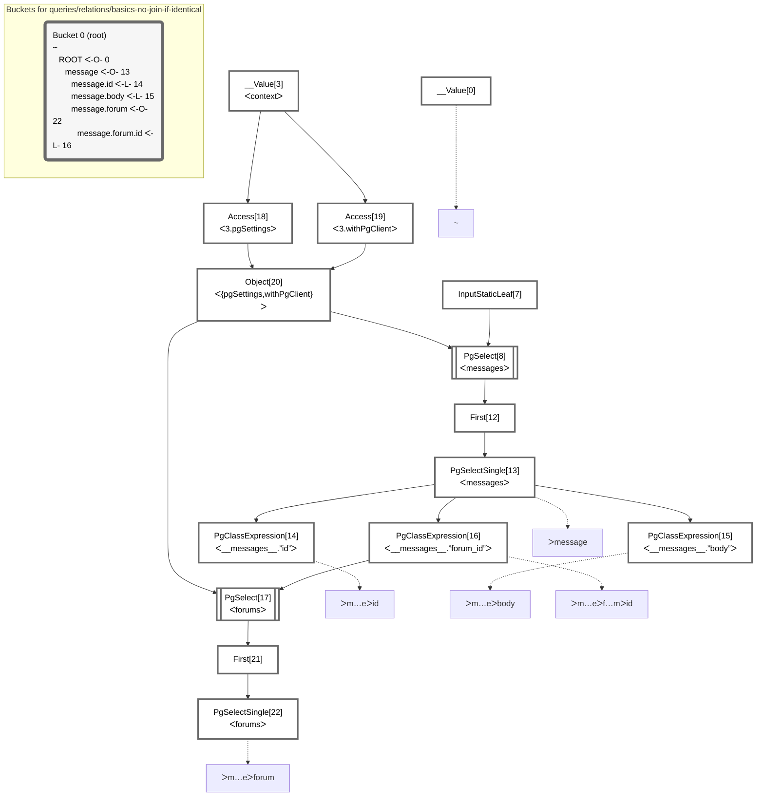

```mermaid
graph TD
    classDef path fill:#eee,stroke:#000,color:#000
    classDef plan fill:#fff,stroke-width:3px,color:#000
    classDef itemplan fill:#fff,stroke-width:6px,color:#000
    classDef sideeffectplan fill:#f00,stroke-width:6px,color:#000
    classDef bucket fill:#f6f6f6,color:#000,stroke-width:6px,text-align:left


    %% define plans
    __Value0["__Value[0]"]:::plan
    PgClassExpression14["PgClassExpression[14]<br />ᐸ__messages__.”id”ᐳ"]:::plan
    PgClassExpression15["PgClassExpression[15]<br />ᐸ__messages__.”body”ᐳ"]:::plan
    PgSelectSingle22["PgSelectSingle[22]<br />ᐸforumsᐳ"]:::plan
    First21["First[21]"]:::plan
    PgSelect17[["PgSelect[17]<br />ᐸforumsᐳ"]]:::plan
    PgClassExpression16["PgClassExpression[16]<br />ᐸ__messages__.”forum_id”ᐳ"]:::plan
    PgSelectSingle13["PgSelectSingle[13]<br />ᐸmessagesᐳ"]:::plan
    First12["First[12]"]:::plan
    PgSelect8[["PgSelect[8]<br />ᐸmessagesᐳ"]]:::plan
    Object20["Object[20]<br />ᐸ{pgSettings,withPgClient}ᐳ"]:::plan
    Access18["Access[18]<br />ᐸ3.pgSettingsᐳ"]:::plan
    Access19["Access[19]<br />ᐸ3.withPgClientᐳ"]:::plan
    __Value3["__Value[3]<br />ᐸcontextᐳ"]:::plan
    InputStaticLeaf7["InputStaticLeaf[7]"]:::plan

    %% plan dependencies
    PgSelectSingle13 --> PgClassExpression14
    PgSelectSingle13 --> PgClassExpression15
    First21 --> PgSelectSingle22
    PgSelect17 --> First21
    Object20 & PgClassExpression16 --> PgSelect17
    PgSelectSingle13 --> PgClassExpression16
    First12 --> PgSelectSingle13
    PgSelect8 --> First12
    Object20 & InputStaticLeaf7 --> PgSelect8
    Access18 & Access19 --> Object20
    __Value3 --> Access18
    __Value3 --> Access19

    %% plan-to-path relationships
    P0["~"]
    __Value0 -.-> P0
    P13["ᐳmessage"]
    PgSelectSingle13 -.-> P13
    P14["ᐳm…eᐳid"]
    PgClassExpression14 -.-> P14
    P15["ᐳm…eᐳbody"]
    PgClassExpression15 -.-> P15
    P16["ᐳm…eᐳf…mᐳid"]
    PgClassExpression16 -.-> P16
    P22["ᐳm…eᐳforum"]
    PgSelectSingle22 -.-> P22

    subgraph "Buckets for queries/relations/basics-no-join-if-identical"
    Bucket0("Bucket 0 (root)<br />~<br />⠀ROOT ᐸ-O- 0<br />⠀⠀message ᐸ-O- 13<br />⠀⠀⠀message.id ᐸ-L- 14<br />⠀⠀⠀message.body ᐸ-L- 15<br />⠀⠀⠀message.forum ᐸ-O- 22<br />⠀⠀⠀⠀message.forum.id ᐸ-L- 16"):::bucket
    classDef bucket0 stroke:#696969
    class Bucket0,__Value0,__Value3,InputStaticLeaf7,PgSelect8,First12,PgSelectSingle13,PgClassExpression14,PgClassExpression15,PgClassExpression16,PgSelect17,Access18,Access19,Object20,First21,PgSelectSingle22 bucket0
    end
```
