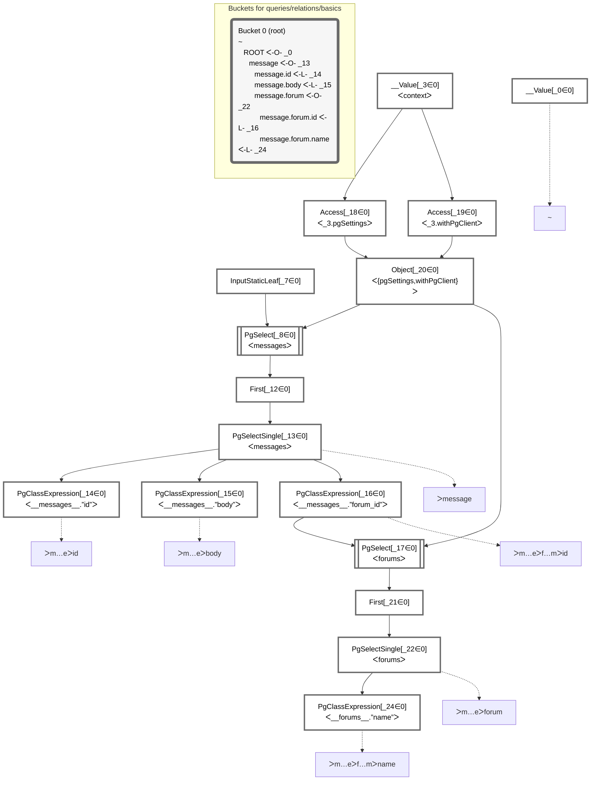

```mermaid
graph TD
    classDef path fill:#eee,stroke:#000,color:#000
    classDef plan fill:#fff,stroke-width:3px,color:#000
    classDef itemplan fill:#fff,stroke-width:6px,color:#000
    classDef sideeffectplan fill:#f00,stroke-width:6px,color:#000
    classDef bucket fill:#f6f6f6,color:#000,stroke-width:6px,text-align:left


    %% define plans
    __Value_0["__Value[_0∈0]"]:::plan
    __Value_3["__Value[_3∈0]<br />ᐸcontextᐳ"]:::plan
    InputStaticLeaf_7["InputStaticLeaf[_7∈0]"]:::plan
    PgSelect_8[["PgSelect[_8∈0]<br />ᐸmessagesᐳ"]]:::plan
    First_12["First[_12∈0]"]:::plan
    PgSelectSingle_13["PgSelectSingle[_13∈0]<br />ᐸmessagesᐳ"]:::plan
    PgClassExpression_14["PgClassExpression[_14∈0]<br />ᐸ__messages__.”id”ᐳ"]:::plan
    PgClassExpression_15["PgClassExpression[_15∈0]<br />ᐸ__messages__.”body”ᐳ"]:::plan
    PgClassExpression_16["PgClassExpression[_16∈0]<br />ᐸ__messages__.”forum_id”ᐳ"]:::plan
    PgSelect_17[["PgSelect[_17∈0]<br />ᐸforumsᐳ"]]:::plan
    Access_18["Access[_18∈0]<br />ᐸ_3.pgSettingsᐳ"]:::plan
    Access_19["Access[_19∈0]<br />ᐸ_3.withPgClientᐳ"]:::plan
    Object_20["Object[_20∈0]<br />ᐸ{pgSettings,withPgClient}ᐳ"]:::plan
    First_21["First[_21∈0]"]:::plan
    PgSelectSingle_22["PgSelectSingle[_22∈0]<br />ᐸforumsᐳ"]:::plan
    PgClassExpression_24["PgClassExpression[_24∈0]<br />ᐸ__forums__.”name”ᐳ"]:::plan

    %% plan dependencies
    Object_20 & InputStaticLeaf_7 --> PgSelect_8
    PgSelect_8 --> First_12
    First_12 --> PgSelectSingle_13
    PgSelectSingle_13 --> PgClassExpression_14
    PgSelectSingle_13 --> PgClassExpression_15
    PgSelectSingle_13 --> PgClassExpression_16
    Object_20 & PgClassExpression_16 --> PgSelect_17
    __Value_3 --> Access_18
    __Value_3 --> Access_19
    Access_18 & Access_19 --> Object_20
    PgSelect_17 --> First_21
    First_21 --> PgSelectSingle_22
    PgSelectSingle_22 --> PgClassExpression_24

    %% plan-to-path relationships
    P_0["~"]
    __Value_0 -.-> P_0
    P_13["ᐳmessage"]
    PgSelectSingle_13 -.-> P_13
    P_14["ᐳm…eᐳid"]
    PgClassExpression_14 -.-> P_14
    P_15["ᐳm…eᐳbody"]
    PgClassExpression_15 -.-> P_15
    P_16["ᐳm…eᐳf…mᐳid"]
    PgClassExpression_16 -.-> P_16
    P_22["ᐳm…eᐳforum"]
    PgSelectSingle_22 -.-> P_22
    P_24["ᐳm…eᐳf…mᐳname"]
    PgClassExpression_24 -.-> P_24

    subgraph "Buckets for queries/relations/basics"
    Bucket0("Bucket 0 (root)<br />~<br />⠀ROOT ᐸ-O- _0<br />⠀⠀message ᐸ-O- _13<br />⠀⠀⠀message.id ᐸ-L- _14<br />⠀⠀⠀message.body ᐸ-L- _15<br />⠀⠀⠀message.forum ᐸ-O- _22<br />⠀⠀⠀⠀message.forum.id ᐸ-L- _16<br />⠀⠀⠀⠀message.forum.name ᐸ-L- _24"):::bucket
    classDef bucket0 stroke:#696969
    class Bucket0,__Value_0,__Value_3,InputStaticLeaf_7,PgSelect_8,First_12,PgSelectSingle_13,PgClassExpression_14,PgClassExpression_15,PgClassExpression_16,PgSelect_17,Access_18,Access_19,Object_20,First_21,PgSelectSingle_22,PgClassExpression_24 bucket0
    end
```
