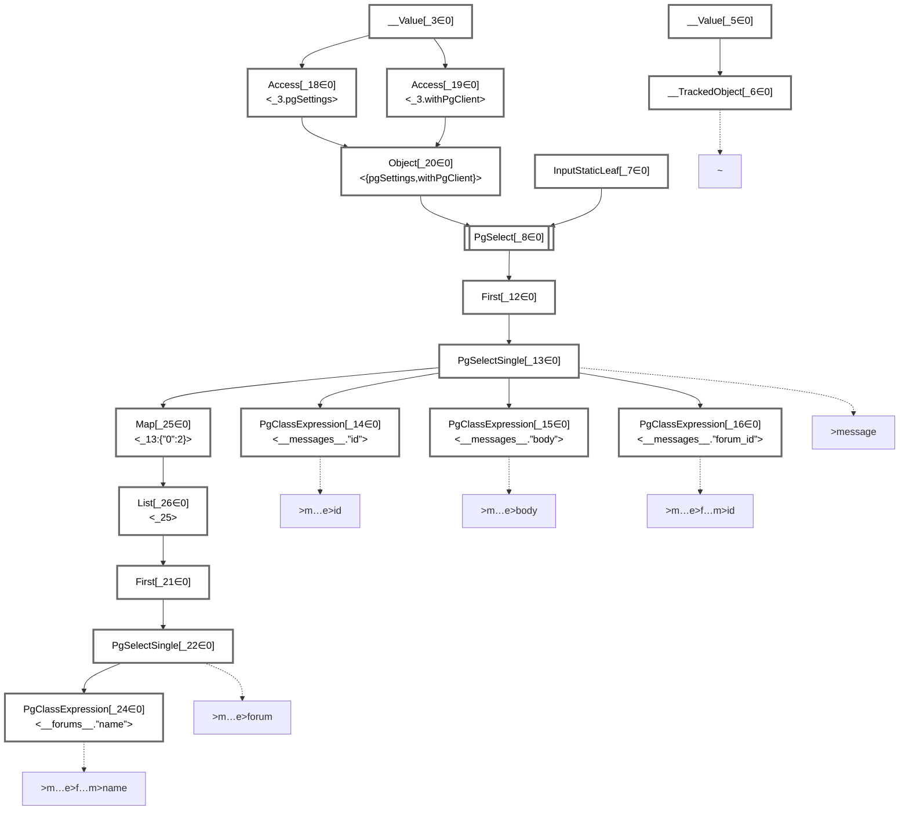

```mermaid
graph TD
    classDef path fill:#eee,stroke:#000,color:#000
    classDef plan fill:#fff,stroke-width:3px,color:#000
    classDef itemplan fill:#fff,stroke-width:6px,color:#000
    classDef sideeffectplan fill:#f00,stroke-width:6px,color:#000
    classDef bucket fill:#f6f6f6,color:#000,stroke-width:6px


    %% define plans
    __Value_3["__Value[_3∈0]<br /><context>"]:::plan
    __Value_5["__Value[_5∈0]<br /><rootValue>"]:::plan
    __TrackedObject_6["__TrackedObject[_6∈0]"]:::plan
    InputStaticLeaf_7["InputStaticLeaf[_7∈0]"]:::plan
    PgSelect_8[["PgSelect[_8∈0]<br /><messages>"]]:::plan
    First_12["First[_12∈0]"]:::plan
    PgSelectSingle_13["PgSelectSingle[_13∈0]<br /><messages>"]:::plan
    PgClassExpression_14["PgClassExpression[_14∈0]<br /><__messages__.”id”>"]:::plan
    PgClassExpression_15["PgClassExpression[_15∈0]<br /><__messages__.”body”>"]:::plan
    PgClassExpression_16["PgClassExpression[_16∈0]<br /><__messages__.”forum_id”>"]:::plan
    Access_18["Access[_18∈0]<br /><_3.pgSettings>"]:::plan
    Access_19["Access[_19∈0]<br /><_3.withPgClient>"]:::plan
    Object_20["Object[_20∈0]<br /><{pgSettings,withPgClient}>"]:::plan
    First_21["First[_21∈0]"]:::plan
    PgSelectSingle_22["PgSelectSingle[_22∈0]<br /><forums>"]:::plan
    PgClassExpression_24["PgClassExpression[_24∈0]<br /><__forums__.”name”>"]:::plan
    Map_25["Map[_25∈0]<br /><_13:{”0”:2}>"]:::plan
    List_26["List[_26∈0]<br /><_25>"]:::plan

    %% plan dependencies
    __Value_5 --> __TrackedObject_6
    Object_20 --> PgSelect_8
    InputStaticLeaf_7 --> PgSelect_8
    PgSelect_8 --> First_12
    First_12 --> PgSelectSingle_13
    PgSelectSingle_13 --> PgClassExpression_14
    PgSelectSingle_13 --> PgClassExpression_15
    PgSelectSingle_13 --> PgClassExpression_16
    __Value_3 --> Access_18
    __Value_3 --> Access_19
    Access_18 --> Object_20
    Access_19 --> Object_20
    List_26 --> First_21
    First_21 --> PgSelectSingle_22
    PgSelectSingle_22 --> PgClassExpression_24
    PgSelectSingle_13 --> Map_25
    Map_25 --> List_26

    %% plan-to-path relationships
    P_6["~"]
    __TrackedObject_6 -.-> P_6
    P_13[">message"]
    PgSelectSingle_13 -.-> P_13
    P_14[">m…e>id"]
    PgClassExpression_14 -.-> P_14
    P_15[">m…e>body"]
    PgClassExpression_15 -.-> P_15
    P_22[">m…e>forum"]
    PgSelectSingle_22 -.-> P_22
    P_16[">m…e>f…m>id"]
    PgClassExpression_16 -.-> P_16
    P_24[">m…e>f…m>name"]
    PgClassExpression_24 -.-> P_24

    %% allocate buckets
    classDef bucket0 stroke:#696969
    class __Value_3,__Value_5,__TrackedObject_6,InputStaticLeaf_7,PgSelect_8,First_12,PgSelectSingle_13,PgClassExpression_14,PgClassExpression_15,PgClassExpression_16,Access_18,Access_19,Object_20,First_21,PgSelectSingle_22,PgClassExpression_24,Map_25,List_26 bucket0
```
