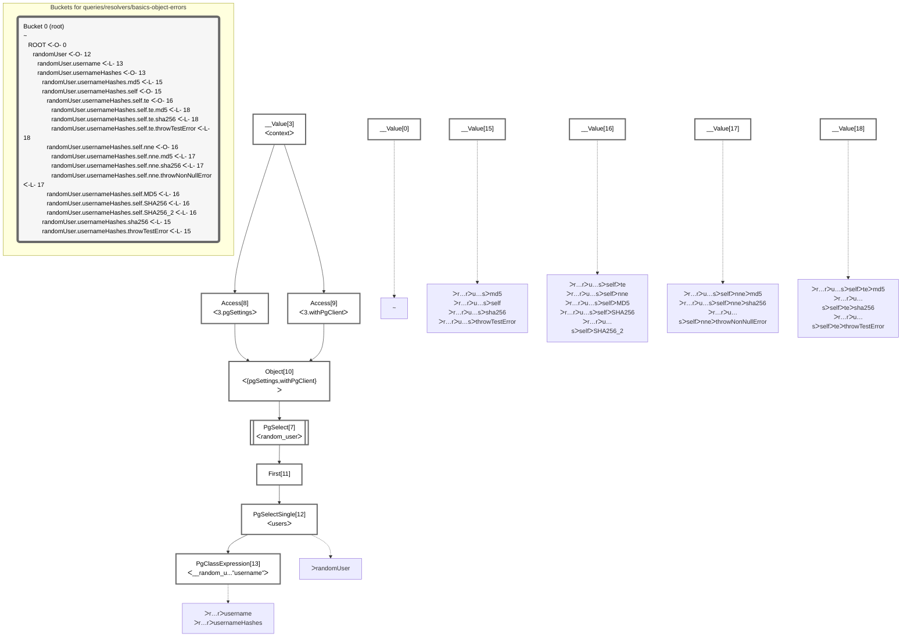

```mermaid
graph TD
    classDef path fill:#eee,stroke:#000,color:#000
    classDef plan fill:#fff,stroke-width:3px,color:#000
    classDef itemplan fill:#fff,stroke-width:6px,color:#000
    classDef sideeffectplan fill:#f00,stroke-width:6px,color:#000
    classDef bucket fill:#f6f6f6,color:#000,stroke-width:6px,text-align:left


    %% define plans
    __Value0["__Value[0]"]:::plan
    __Value3["__Value[3]<br />ᐸcontextᐳ"]:::plan
    Access8["Access[8]<br />ᐸ3.pgSettingsᐳ"]:::plan
    Access9["Access[9]<br />ᐸ3.withPgClientᐳ"]:::plan
    Object10["Object[10]<br />ᐸ{pgSettings,withPgClient}ᐳ"]:::plan
    PgSelect7[["PgSelect[7]<br />ᐸrandom_userᐳ"]]:::plan
    First11["First[11]"]:::plan
    PgSelectSingle12["PgSelectSingle[12]<br />ᐸusersᐳ"]:::plan
    PgClassExpression13["PgClassExpression[13]<br />ᐸ__random_u...”username”ᐳ"]:::plan
    __Value15["__Value[15]"]:::plan
    __Value16["__Value[16]"]:::plan
    __Value17["__Value[17]"]:::plan
    __Value18["__Value[18]"]:::plan

    %% plan dependencies
    __Value3 --> Access8
    __Value3 --> Access9
    Access8 & Access9 --> Object10
    Object10 --> PgSelect7
    PgSelect7 --> First11
    First11 --> PgSelectSingle12
    PgSelectSingle12 --> PgClassExpression13

    %% plan-to-path relationships
    P0["~"]
    __Value0 -.-> P0
    P12["ᐳrandomUser"]
    PgSelectSingle12 -.-> P12
    P13["ᐳr…rᐳusername<br />ᐳr…rᐳusernameHashes"]
    PgClassExpression13 -.-> P13
    P15["ᐳr…rᐳu…sᐳmd5<br />ᐳr…rᐳu…sᐳself<br />ᐳr…rᐳu…sᐳsha256<br />ᐳr…rᐳu…sᐳthrowTestError"]
    __Value15 -.-> P15
    P16["ᐳr…rᐳu…sᐳselfᐳte<br />ᐳr…rᐳu…sᐳselfᐳnne<br />ᐳr…rᐳu…sᐳselfᐳMD5<br />ᐳr…rᐳu…sᐳselfᐳSHA256<br />ᐳr…rᐳu…sᐳselfᐳSHA256_2"]
    __Value16 -.-> P16
    P17["ᐳr…rᐳu…sᐳselfᐳnneᐳmd5<br />ᐳr…rᐳu…sᐳselfᐳnneᐳsha256<br />ᐳr…rᐳu…sᐳselfᐳnneᐳthrowNonNullError"]
    __Value17 -.-> P17
    P18["ᐳr…rᐳu…sᐳselfᐳteᐳmd5<br />ᐳr…rᐳu…sᐳselfᐳteᐳsha256<br />ᐳr…rᐳu…sᐳselfᐳteᐳthrowTestError"]
    __Value18 -.-> P18

    subgraph "Buckets for queries/resolvers/basics-object-errors"
    Bucket0("Bucket 0 (root)<br />~<br />⠀ROOT ᐸ-O- 0<br />⠀⠀randomUser ᐸ-O- 12<br />⠀⠀⠀randomUser.username ᐸ-L- 13<br />⠀⠀⠀randomUser.usernameHashes ᐸ-O- 13<br />⠀⠀⠀⠀randomUser.usernameHashes.md5 ᐸ-L- 15<br />⠀⠀⠀⠀randomUser.usernameHashes.self ᐸ-O- 15<br />⠀⠀⠀⠀⠀randomUser.usernameHashes.self.te ᐸ-O- 16<br />⠀⠀⠀⠀⠀⠀randomUser.usernameHashes.self.te.md5 ᐸ-L- 18<br />⠀⠀⠀⠀⠀⠀randomUser.usernameHashes.self.te.sha256 ᐸ-L- 18<br />⠀⠀⠀⠀⠀⠀randomUser.usernameHashes.self.te.throwTestError ᐸ-L- 18<br />⠀⠀⠀⠀⠀randomUser.usernameHashes.self.nne ᐸ-O- 16<br />⠀⠀⠀⠀⠀⠀randomUser.usernameHashes.self.nne.md5 ᐸ-L- 17<br />⠀⠀⠀⠀⠀⠀randomUser.usernameHashes.self.nne.sha256 ᐸ-L- 17<br />⠀⠀⠀⠀⠀⠀randomUser.usernameHashes.self.nne.throwNonNullError ᐸ-L- 17<br />⠀⠀⠀⠀⠀randomUser.usernameHashes.self.MD5 ᐸ-L- 16<br />⠀⠀⠀⠀⠀randomUser.usernameHashes.self.SHA256 ᐸ-L- 16<br />⠀⠀⠀⠀⠀randomUser.usernameHashes.self.SHA256_2 ᐸ-L- 16<br />⠀⠀⠀⠀randomUser.usernameHashes.sha256 ᐸ-L- 15<br />⠀⠀⠀⠀randomUser.usernameHashes.throwTestError ᐸ-L- 15"):::bucket
    classDef bucket0 stroke:#696969
    class Bucket0,__Value0,__Value3,PgSelect7,Access8,Access9,Object10,First11,PgSelectSingle12,PgClassExpression13,__Value15,__Value16,__Value17,__Value18 bucket0
    end
```
