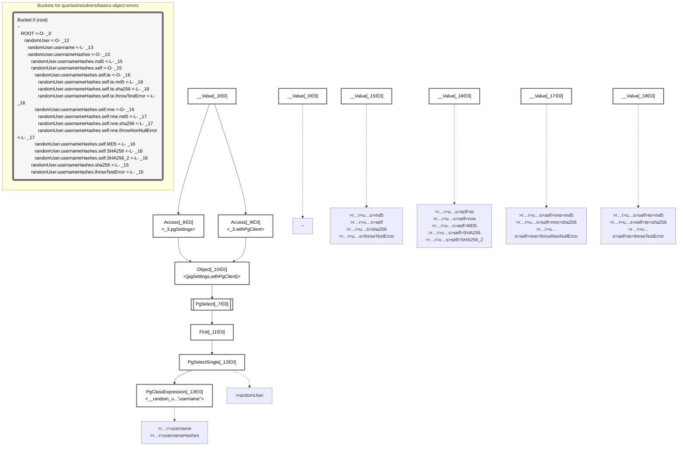

```mermaid
graph TD
    classDef path fill:#eee,stroke:#000,color:#000
    classDef plan fill:#fff,stroke-width:3px,color:#000
    classDef itemplan fill:#fff,stroke-width:6px,color:#000
    classDef sideeffectplan fill:#f00,stroke-width:6px,color:#000
    classDef bucket fill:#f6f6f6,color:#000,stroke-width:6px,text-align:left


    %% define plans
    __Value_0["__Value[_0∈0]"]:::plan
    __Value_3["__Value[_3∈0]<br /><context>"]:::plan
    PgSelect_7[["PgSelect[_7∈0]<br /><random_user>"]]:::plan
    Access_8["Access[_8∈0]<br /><_3.pgSettings>"]:::plan
    Access_9["Access[_9∈0]<br /><_3.withPgClient>"]:::plan
    Object_10["Object[_10∈0]<br /><{pgSettings,withPgClient}>"]:::plan
    First_11["First[_11∈0]"]:::plan
    PgSelectSingle_12["PgSelectSingle[_12∈0]<br /><users>"]:::plan
    PgClassExpression_13["PgClassExpression[_13∈0]<br /><__random_u...”username”>"]:::plan
    __Value_15["__Value[_15∈0]"]:::plan
    __Value_16["__Value[_16∈0]"]:::plan
    __Value_17["__Value[_17∈0]"]:::plan
    __Value_18["__Value[_18∈0]"]:::plan

    %% plan dependencies
    Object_10 --> PgSelect_7
    __Value_3 --> Access_8
    __Value_3 --> Access_9
    Access_8 --> Object_10
    Access_9 --> Object_10
    PgSelect_7 --> First_11
    First_11 --> PgSelectSingle_12
    PgSelectSingle_12 --> PgClassExpression_13

    %% plan-to-path relationships
    P_0["~"]
    __Value_0 -.-> P_0
    P_12[">randomUser"]
    PgSelectSingle_12 -.-> P_12
    P_13[">r…r>username<br />>r…r>usernameHashes"]
    PgClassExpression_13 -.-> P_13
    P_15[">r…r>u…s>md5<br />>r…r>u…s>self<br />>r…r>u…s>sha256<br />>r…r>u…s>throwTestError"]
    __Value_15 -.-> P_15
    P_16[">r…r>u…s>self>te<br />>r…r>u…s>self>nne<br />>r…r>u…s>self>MD5<br />>r…r>u…s>self>SHA256<br />>r…r>u…s>self>SHA256_2"]
    __Value_16 -.-> P_16
    P_17[">r…r>u…s>self>nne>md5<br />>r…r>u…s>self>nne>sha256<br />>r…r>u…s>self>nne>throwNonNullError"]
    __Value_17 -.-> P_17
    P_18[">r…r>u…s>self>te>md5<br />>r…r>u…s>self>te>sha256<br />>r…r>u…s>self>te>throwTestError"]
    __Value_18 -.-> P_18

    %% allocate buckets
    classDef bucket0 stroke:#696969
    class __Value_0,__Value_3,PgSelect_7,Access_8,Access_9,Object_10,First_11,PgSelectSingle_12,PgClassExpression_13,__Value_15,__Value_16,__Value_17,__Value_18 bucket0

    subgraph "Buckets for queries/resolvers/basics-object-errors"
    Bucket0("Bucket 0 (root)<br />~<br />⠀ROOT <-O- _0<br />⠀⠀randomUser <-O- _12<br />⠀⠀⠀randomUser.username <-L- _13<br />⠀⠀⠀randomUser.usernameHashes <-O- _13<br />⠀⠀⠀⠀randomUser.usernameHashes.md5 <-L- _15<br />⠀⠀⠀⠀randomUser.usernameHashes.self <-O- _15<br />⠀⠀⠀⠀⠀randomUser.usernameHashes.self.te <-O- _16<br />⠀⠀⠀⠀⠀⠀randomUser.usernameHashes.self.te.md5 <-L- _18<br />⠀⠀⠀⠀⠀⠀randomUser.usernameHashes.self.te.sha256 <-L- _18<br />⠀⠀⠀⠀⠀⠀randomUser.usernameHashes.self.te.throwTestError <-L- _18<br />⠀⠀⠀⠀⠀randomUser.usernameHashes.self.nne <-O- _16<br />⠀⠀⠀⠀⠀⠀randomUser.usernameHashes.self.nne.md5 <-L- _17<br />⠀⠀⠀⠀⠀⠀randomUser.usernameHashes.self.nne.sha256 <-L- _17<br />⠀⠀⠀⠀⠀⠀randomUser.usernameHashes.self.nne.throwNonNullError <-L- _17<br />⠀⠀⠀⠀⠀randomUser.usernameHashes.self.MD5 <-L- _16<br />⠀⠀⠀⠀⠀randomUser.usernameHashes.self.SHA256 <-L- _16<br />⠀⠀⠀⠀⠀randomUser.usernameHashes.self.SHA256_2 <-L- _16<br />⠀⠀⠀⠀randomUser.usernameHashes.sha256 <-L- _15<br />⠀⠀⠀⠀randomUser.usernameHashes.throwTestError <-L- _15"):::bucket
    style Bucket0 stroke:#696969
    end
```
