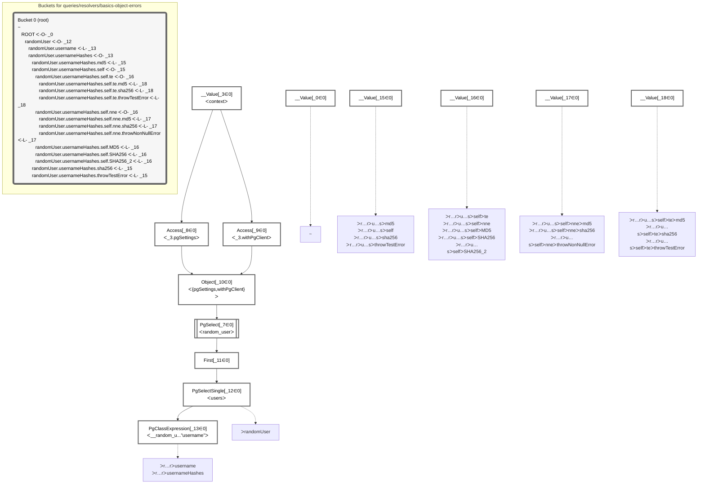

```mermaid
graph TD
    classDef path fill:#eee,stroke:#000,color:#000
    classDef plan fill:#fff,stroke-width:3px,color:#000
    classDef itemplan fill:#fff,stroke-width:6px,color:#000
    classDef sideeffectplan fill:#f00,stroke-width:6px,color:#000
    classDef bucket fill:#f6f6f6,color:#000,stroke-width:6px,text-align:left


    %% define plans
    __Value_0["__Value[_0∈0]"]:::plan
    __Value_3["__Value[_3∈0]<br />ᐸcontextᐳ"]:::plan
    PgSelect_7[["PgSelect[_7∈0]<br />ᐸrandom_userᐳ"]]:::plan
    Access_8["Access[_8∈0]<br />ᐸ_3.pgSettingsᐳ"]:::plan
    Access_9["Access[_9∈0]<br />ᐸ_3.withPgClientᐳ"]:::plan
    Object_10["Object[_10∈0]<br />ᐸ{pgSettings,withPgClient}ᐳ"]:::plan
    First_11["First[_11∈0]"]:::plan
    PgSelectSingle_12["PgSelectSingle[_12∈0]<br />ᐸusersᐳ"]:::plan
    PgClassExpression_13["PgClassExpression[_13∈0]<br />ᐸ__random_u...”username”ᐳ"]:::plan
    __Value_15["__Value[_15∈0]"]:::plan
    __Value_16["__Value[_16∈0]"]:::plan
    __Value_17["__Value[_17∈0]"]:::plan
    __Value_18["__Value[_18∈0]"]:::plan

    %% plan dependencies
    Object_10 --> PgSelect_7
    __Value_3 --> Access_8
    __Value_3 --> Access_9
    Access_8 --> Object_10
    Access_9 --> Object_10
    PgSelect_7 --> First_11
    First_11 --> PgSelectSingle_12
    PgSelectSingle_12 --> PgClassExpression_13

    %% plan-to-path relationships
    P_0["~"]
    __Value_0 -.-> P_0
    P_12["ᐳrandomUser"]
    PgSelectSingle_12 -.-> P_12
    P_13["ᐳr…rᐳusername<br />ᐳr…rᐳusernameHashes"]
    PgClassExpression_13 -.-> P_13
    P_15["ᐳr…rᐳu…sᐳmd5<br />ᐳr…rᐳu…sᐳself<br />ᐳr…rᐳu…sᐳsha256<br />ᐳr…rᐳu…sᐳthrowTestError"]
    __Value_15 -.-> P_15
    P_16["ᐳr…rᐳu…sᐳselfᐳte<br />ᐳr…rᐳu…sᐳselfᐳnne<br />ᐳr…rᐳu…sᐳselfᐳMD5<br />ᐳr…rᐳu…sᐳselfᐳSHA256<br />ᐳr…rᐳu…sᐳselfᐳSHA256_2"]
    __Value_16 -.-> P_16
    P_17["ᐳr…rᐳu…sᐳselfᐳnneᐳmd5<br />ᐳr…rᐳu…sᐳselfᐳnneᐳsha256<br />ᐳr…rᐳu…sᐳselfᐳnneᐳthrowNonNullError"]
    __Value_17 -.-> P_17
    P_18["ᐳr…rᐳu…sᐳselfᐳteᐳmd5<br />ᐳr…rᐳu…sᐳselfᐳteᐳsha256<br />ᐳr…rᐳu…sᐳselfᐳteᐳthrowTestError"]
    __Value_18 -.-> P_18

    %% allocate buckets
    classDef bucket0 stroke:#696969
    class __Value_0,__Value_3,PgSelect_7,Access_8,Access_9,Object_10,First_11,PgSelectSingle_12,PgClassExpression_13,__Value_15,__Value_16,__Value_17,__Value_18 bucket0

    subgraph "Buckets for queries/resolvers/basics-object-errors"
    Bucket0("Bucket 0 (root)<br />~<br />⠀ROOT ᐸ-O- _0<br />⠀⠀randomUser ᐸ-O- _12<br />⠀⠀⠀randomUser.username ᐸ-L- _13<br />⠀⠀⠀randomUser.usernameHashes ᐸ-O- _13<br />⠀⠀⠀⠀randomUser.usernameHashes.md5 ᐸ-L- _15<br />⠀⠀⠀⠀randomUser.usernameHashes.self ᐸ-O- _15<br />⠀⠀⠀⠀⠀randomUser.usernameHashes.self.te ᐸ-O- _16<br />⠀⠀⠀⠀⠀⠀randomUser.usernameHashes.self.te.md5 ᐸ-L- _18<br />⠀⠀⠀⠀⠀⠀randomUser.usernameHashes.self.te.sha256 ᐸ-L- _18<br />⠀⠀⠀⠀⠀⠀randomUser.usernameHashes.self.te.throwTestError ᐸ-L- _18<br />⠀⠀⠀⠀⠀randomUser.usernameHashes.self.nne ᐸ-O- _16<br />⠀⠀⠀⠀⠀⠀randomUser.usernameHashes.self.nne.md5 ᐸ-L- _17<br />⠀⠀⠀⠀⠀⠀randomUser.usernameHashes.self.nne.sha256 ᐸ-L- _17<br />⠀⠀⠀⠀⠀⠀randomUser.usernameHashes.self.nne.throwNonNullError ᐸ-L- _17<br />⠀⠀⠀⠀⠀randomUser.usernameHashes.self.MD5 ᐸ-L- _16<br />⠀⠀⠀⠀⠀randomUser.usernameHashes.self.SHA256 ᐸ-L- _16<br />⠀⠀⠀⠀⠀randomUser.usernameHashes.self.SHA256_2 ᐸ-L- _16<br />⠀⠀⠀⠀randomUser.usernameHashes.sha256 ᐸ-L- _15<br />⠀⠀⠀⠀randomUser.usernameHashes.throwTestError ᐸ-L- _15"):::bucket
    style Bucket0 stroke:#696969
    end
```
